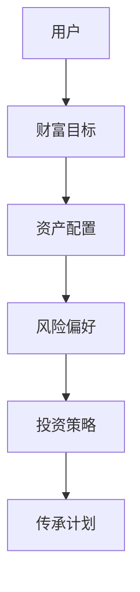
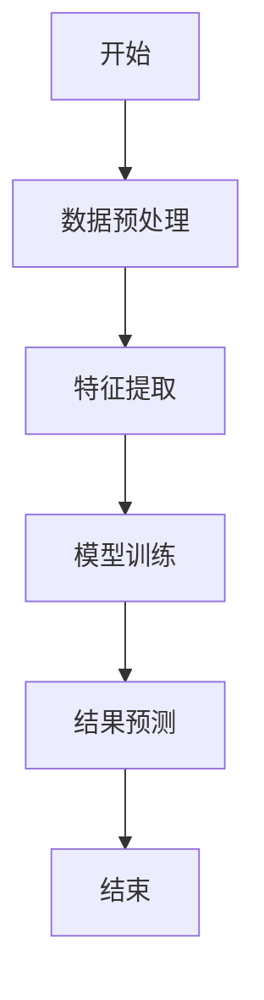
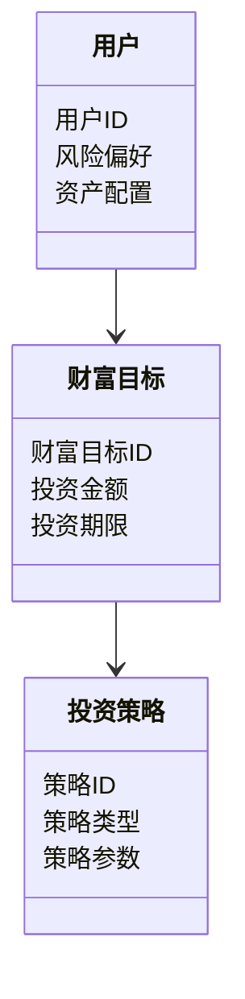
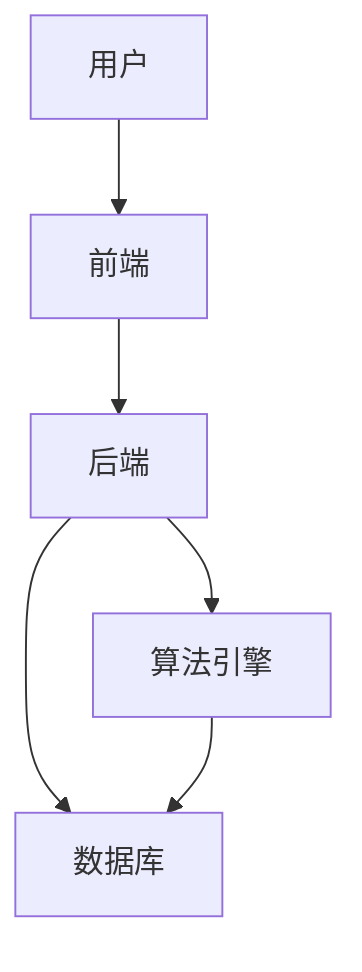
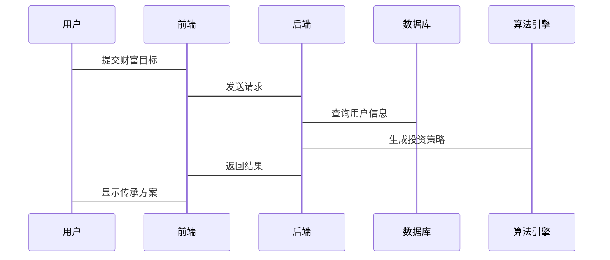

                 


---

# 智能财富传承规划工具

## 关键词：智能财富传承，财富规划，人工智能，风险管理，投资组合优化，系统架构设计

## 摘要：  
《智能财富传承规划工具》是一本结合人工智能与财富管理领域的专业技术书籍。本书深入探讨了智能财富传承规划工具的核心概念、算法原理、系统架构设计及实际应用场景。通过详细的技术分析和丰富的项目案例，帮助读者理解如何利用人工智能技术优化财富传承规划，实现资产的高效配置与风险管理。书中不仅提供了理论支持，还通过代码实现与实际案例分析，帮助读者掌握智能财富传承工具的实际应用技巧。

---

## 第1章：智能财富传承规划工具的背景与概念

### 1.1 智能财富传承的核心概念  
#### 1.1.1 财富传承的定义与背景  
财富传承是指通过法律、金融等手段将财富从一代人传递到下一代人或其他受益人。随着社会经济的快速发展，财富传承的复杂性不断提高，传统的财富管理方式已难以满足现代人的需求。  

#### 1.1.2 智能化在财富传承中的作用  
人工智能技术的引入，使得财富传承规划更加智能化、个性化。智能财富传承规划工具能够根据用户的需求、风险偏好和市场环境，自动优化资产配置和传承方案。  

#### 1.1.3 智能财富传承的边界与外延  
智能财富传承不仅关注资产的保值与增值，还涉及税务优化、法律合规、风险管理等多个方面。其外延涵盖了从个人到家庭、企业的全方位财富管理需求。  

### 1.2 智能财富传承规划工具的特点  
#### 1.2.1 工具的核心功能  
智能财富传承规划工具的核心功能包括：  
- 资产配置优化  
- 投资组合管理  
- 风险评估与预警  
- 传承方案设计  

#### 1.2.2 工具的智能化属性  
- 数据驱动：基于大数据分析，提供精准的财富管理建议。  
- 自适应性：根据市场变化和用户需求，动态调整传承方案。  
- 可视化：通过图表和报告，帮助用户直观理解财富管理策略。  

#### 1.2.3 工具的用户群体与应用场景  
- 用户群体：高净值个人、家族企业、财富管理机构。  
- 应用场景：资产配置、税务规划、遗产分配、风险管理等。  

---

## 第2章：智能财富传承规划工具的核心概念与联系

### 2.1 核心概念原理  
#### 2.1.1 人工智能在财富传承中的应用  
- 机器学习算法用于投资组合优化和风险评估。  
- 自然语言处理技术用于分析用户需求和市场信息。  

#### 2.1.2 数据驱动的财富规划模型  
- 数据来源：用户资产、市场数据、法律法规等。  
- 模型构建：基于机器学习的财富规划模型。  

#### 2.1.3 智能算法的实现机制  
- 算法选择：随机森林、支持向量机等。  
- 实现步骤：数据预处理、特征提取、模型训练、结果预测。  

### 2.2 核心概念属性对比  
#### 2.2.1 不同财富传承工具的对比分析  
| 工具类型 | 核心功能 | 优缺点 |  
|----------|----------|--------|  
| 传统工具 | 资产配置 | 低效、缺乏个性化 |  
| 智能工具 | 资产配置+风险管理 | 高效、个性化 |  

#### 2.2.2 智能化工具与传统工具的差异  
- 传统工具依赖人工经验，智能化工具基于数据和算法。  
- 传统工具功能单一，智能化工具集成多种功能。  

#### 2.2.3 用户需求与工具功能的匹配度  
- 用户需求：个性化财富管理。  
- 工具功能：智能化、数据驱动的解决方案。  

### 2.3 ER实体关系图  


---

## 第3章：智能财富传承规划工具的算法原理

### 3.1 算法原理概述  
#### 3.1.1 机器学习在财富规划中的应用  
- 线性回归模型用于预测市场趋势。  
- 支持向量机用于分类市场环境。  

#### 3.1.2 算法选择与优化  
- 算法选择：基于数据特征选择合适的算法。  
- 算法优化：参数调优、模型评估。  

#### 3.1.3 算法流程图  


### 3.2 数学模型与公式  
#### 3.2.1 投资组合优化模型  
$$ \text{目标函数：} \quad \min_{w} \quad w^T \Sigma w $$  
$$ \text{约束条件：} \quad \sum_{i=1}^n w_i = 1 $$  

#### 3.2.2 风险评估模型  
$$ \text{风险值} = \sqrt{ \sum_{i=1}^n (r_i - \mu)^2 \cdot w_i } $$  

### 3.3 算法实现与代码  
```python
import numpy as np
from sklearn.linear_model import LinearRegression

# 示例代码：简单投资组合优化
def portfolio_optimization(returns):
    n = len(returns.columns)
    cov_matrix = returns.cov()
    # 初始化权重
    weights = np.ones(n) / n
    # 计算投资组合的收益和风险
    portfolio_return = np.sum(returns.mean() * weights)
    portfolio_risk = np.sqrt(weights.T @ cov_matrix @ weights)
    return portfolio_return, portfolio_risk
```

---

## 第4章：智能财富传承规划工具的系统架构设计

### 4.1 问题场景介绍  
智能财富传承规划工具需要解决的主要问题包括：  
- 如何高效处理大量金融数据？  
- 如何确保系统的安全性和稳定性？  

### 4.2 项目介绍  
#### 4.2.1 项目目标  
- 提供智能化的财富传承规划服务。  
- 实现高效的资产配置与风险管理。  

#### 4.2.2 项目范围  
- 系统功能设计：资产配置、风险评估、传承方案设计。  
- 系统架构设计：模块划分、接口设计、交互流程。  

### 4.3 系统功能设计  
#### 4.3.1 领域模型  


#### 4.3.2 系统架构设计  


#### 4.3.3 系统接口设计  
- 用户接口：API接口。  
- 系统接口：数据库接口、算法引擎接口。  

#### 4.3.4 系统交互流程  


---

## 第5章：智能财富传承规划工具的项目实战

### 5.1 环境安装  
- 安装Python环境：Python 3.8以上版本。  
- 安装依赖库：numpy、pandas、scikit-learn。  

### 5.2 系统核心实现源代码  
```python
import numpy as np
from sklearn.linear_model import LinearRegression

# 示例代码：简单投资组合优化
def portfolio_optimization(returns):
    n = len(returns.columns)
    cov_matrix = returns.cov()
    # 初始化权重
    weights = np.ones(n) / n
    # 计算投资组合的收益和风险
    portfolio_return = np.sum(returns.mean() * weights)
    portfolio_risk = np.sqrt(weights.T @ cov_matrix @ weights)
    return portfolio_return, portfolio_risk
```

### 5.3 代码应用解读与分析  
- 代码功能：实现投资组合的优化。  
- 代码实现：基于机器学习算法，优化资产配置。  

### 5.4 实际案例分析  
- 案例背景：高净值客户的财富传承规划。  
- 案例分析：基于数据驱动的传承方案设计。  

### 5.5 项目小结  
- 项目总结：智能财富传承规划工具的核心功能与实现。  
- 项目经验：数据处理、算法优化、系统架构设计的关键点。  

---

## 第6章：智能财富传承规划工具的最佳实践

### 6.1 最佳实践 tips  
- 数据验证：确保数据的准确性和完整性。  
- 算法选择：根据需求选择合适的算法。  
- 系统优化：优化系统性能和用户体验。  

### 6.2 小结  
- 核心内容回顾：智能财富传承规划工具的核心概念与实现。  
- 未来展望：人工智能技术在财富管理中的进一步应用。  

### 6.3 注意事项  
- 系统安全性：确保用户数据的安全性。  
- 法律合规：遵守相关法律法规。  

### 6.4 拓展阅读  
- 推荐书籍：《算法导论》、《机器学习实战》。  
- 推荐课程：人工智能与财富管理在线课程。  

---

## 附录  
### 附录A：术语表  
- 智能财富传承：基于人工智能技术的财富管理工具。  
- 投资组合优化：通过算法优化资产配置。  

### 附录B：工具推荐  
- 数据处理工具：Python、R语言。  
- 算法实现工具：TensorFlow、Scikit-learn。  

---

## 作者：AI天才研究院/AI Genius Institute & 禅与计算机程序设计艺术/Zen And The Art of Computer Programming

