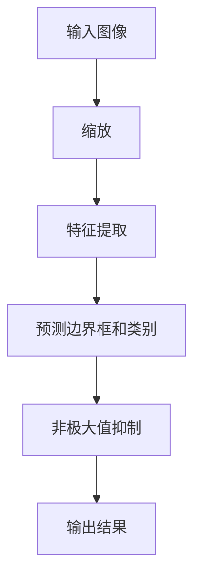
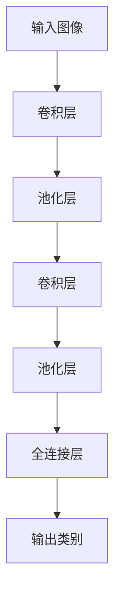
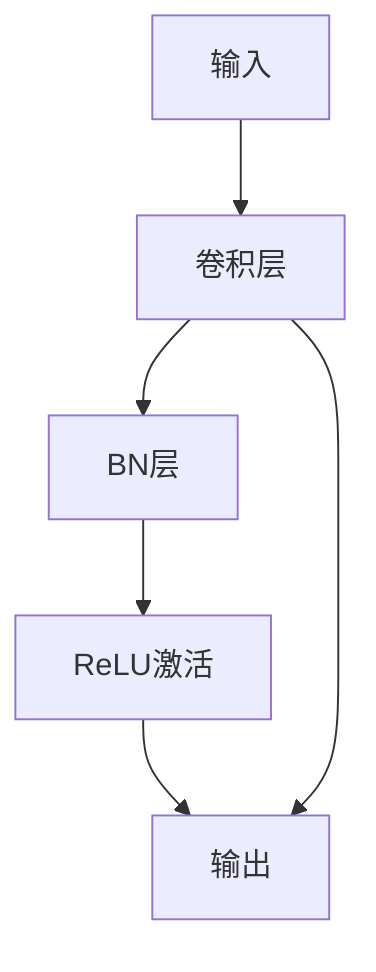
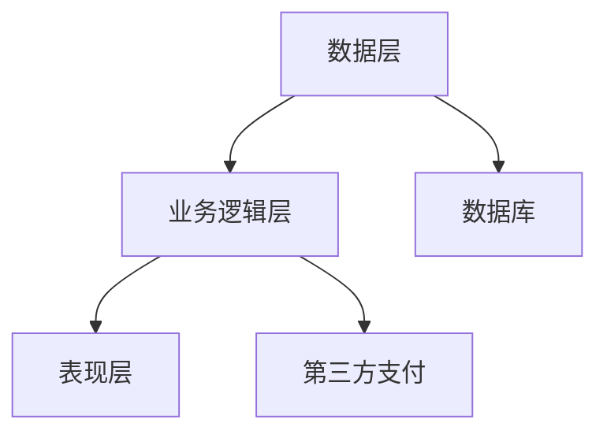

                 

# 智能购物车：AI Agent的商品识别与结算

> 关键词：智能购物车、AI Agent、商品识别、图像识别、目标检测、结算系统

> 摘要：本文探讨了AI Agent在智能购物车中的应用，重点分析了商品识别与结算的核心算法和系统架构设计。通过详细讲解目标检测和图像识别的数学模型，结合实际项目案例，展示了如何实现高效的智能购物车系统。

---

## 第三章: 商品识别与结算的算法原理

### 3.1 目标检测算法详解

#### 3.1.1 YOLO算法的工作流程
YOLO（You Only Look Once）是一种基于深度学习的目标检测算法，以其高效性和简洁性著称。YOLO通过将目标检测问题转化为回归问题，仅用一个神经网络来预测边界框和类别概率。

YOLO的工作流程可以分为以下步骤：
1. **输入图像**：将输入图像进行缩放，使其符合网络输入尺寸。
2. **特征提取**：通过Darknet网络提取图像的特征图。
3. **预测边界框和类别**：网络输出包含边界框坐标和置信度的预测结果。
4. **非极大值抑制（NMS）**：去除重叠的预测框，保留置信度最高的结果。

YOLO的流程可以用以下mermaid图表示：

YOLO的损失函数包括分类损失、定位损失和置信度损失：

$$ \text{总损失} = \lambda_{cls} \cdot \text{分类损失} + \lambda_{loc} \cdot \text{定位损失} + \lambda_{conf} \cdot \text{置信度损失} $$

#### 3.1.2 Faster R-CNN的优缺点
Faster R-CNN是一种基于区域建议网络（RPN）的目标检测算法，主要由以下几个部分组成：
1. **特征提取**：通过CNN提取图像的特征图。
2. **生成区域建议**：RPN网络生成锚框并预测边界框。
3. **RoI Pooling**：将区域建议池化到固定尺寸。
4. **分类与回归**：对每个区域进行分类和边界框回归。

Faster R-CNN的优点是精度高，缺点是速度较慢，不适合实时检测场景。

#### 3.1.3 模型训练的关键步骤
目标检测模型的训练过程可以分为以下几个步骤：
1. **数据预处理**：对数据进行归一化、扩展数据增强（如旋转、翻转、缩放）。
2. **选择优化算法**：常用Adam优化器，学习率设置为0.001。
3. **定义损失函数**：使用上述提到的损失函数。
4. **模型训练**：在GPU上进行训练，定期保存模型权重。
5. **验证与调整**：通过验证集调整超参数，防止过拟合。

目标检测的损失函数公式如下：

$$ L = L_{cls} + L_{loc} $$

其中，$L_{cls}$是分类损失，$L_{loc}$是定位损失。

---

### 3.2 图像识别算法详解

#### 3.2.1 CNN网络的基本结构
卷积神经网络（CNN）由卷积层、池化层和全连接层组成。卷积层用于提取图像特征，池化层用于降维和特征压缩，全连接层用于分类。

典型的CNN网络结构如LeNet-5：

#### 3.2.2 ResNet的残差学习机制
ResNet通过引入残差块（ResBlock）来缓解深层网络的梯度消失问题。残差块的结构如下：

ResNet的残差学习机制使得网络可以训练得更深，从而提取更复杂的特征。

#### 3.2.3 模型优化与部署
模型优化包括剪枝、蒸馏和量化等技术。剪枝通过删除冗余的神经元来减少模型大小；蒸馏通过小模型模仿大模型的输出来提升效率；量化则通过降低数据类型的精度（如从浮点数降到定点数）来减少存储和计算成本。

---

### 3.3 商品识别的数学模型与公式

#### 3.3.1 检测框回归的损失函数
目标检测中的回归损失通常使用均方误差（MSE）来衡量：

$$ \text{回归损失} = \frac{1}{2} \sum_{i=1}^{n} (y_i - \hat{y}_i)^2 $$

其中，$y_i$是真实值，$\hat{y}_i$是预测值。

#### 3.3.2 分类任务的 softmax 函数
分类任务中，输出层的激活函数通常使用softmax函数，将输出转换为概率分布：

$$ \text{概率分布} = \text{softmax}(Wx + b) $$

其中，$W$是权重矩阵，$x$是输入向量，$b$是偏置项。

#### 3.3.3 模型训练的优化算法
Adam优化器结合了动量和自适应学习率的思想，优化过程如下：

$$ \text{动量} = \beta_1 \cdot \text{动量} + (1 - \beta_1) \cdot \text{梯度} $$
$$ \text{自适应学习率} = \beta_2 \cdot \text{自适应学习率} + (1 - \beta_2) \cdot \text{梯度平方} $$
$$ \text{参数更新} = \text{学习率} \cdot \frac{\text{动量}}{\sqrt{\text{自适应学习率}} + \epsilon} $$

其中，$\beta_1$和$\beta_2$是动量和自适应学习率的超参数，$\epsilon$是防止除零的小常数。

---

## 第四章: 系统架构与设计

### 4.1 系统功能设计

#### 4.1.1 商品识别模块的功能设计
商品识别模块负责对购物车中的商品进行实时识别，主要功能包括：
1. **图像采集**：通过摄像头获取商品图像。
2. **特征提取**：使用CNN提取图像特征。
3. **目标检测**：使用YOLO或Faster R-CNN检测商品位置和类别。
4. **结果输出**：将识别结果传递给结算模块。

#### 4.1.2 结算模块的功能设计
结算模块负责根据识别结果进行商品计价和支付，主要功能包括：
1. **价格查询**：根据商品ID查询数据库中的价格信息。
2. **总价计算**：对商品进行汇总计算总价。
3. **支付处理**：支持多种支付方式（如支付宝、微信支付）。
4. **订单确认**：生成订单并通知用户。

#### 4.1.3 用户交互模块的功能设计
用户交互模块负责与用户进行交互，主要功能包括：
1. **显示界面**：在购物车的显示屏上显示商品信息和支付状态。
2. **用户输入**：接收用户的操作指令（如取消、重新识别）。
3. **反馈提示**：在识别错误或支付失败时提供反馈提示。

---

#### 4.2.2 系统架构设计
智能购物车系统的架构设计采用分层架构，包括数据层、业务逻辑层和表现层。

数据层负责与传感器和数据库交互，业务逻辑层负责处理商品识别和结算逻辑，表现层负责与用户交互和显示结果。

---

通过以上详细分析，我们已经系统地介绍了智能购物车中AI Agent的商品识别与结算的核心算法和系统架构设计。接下来，我们将通过一个具体的项目实战，展示如何将这些理论知识应用到实际开发中。

