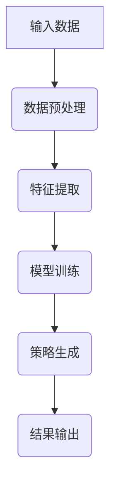
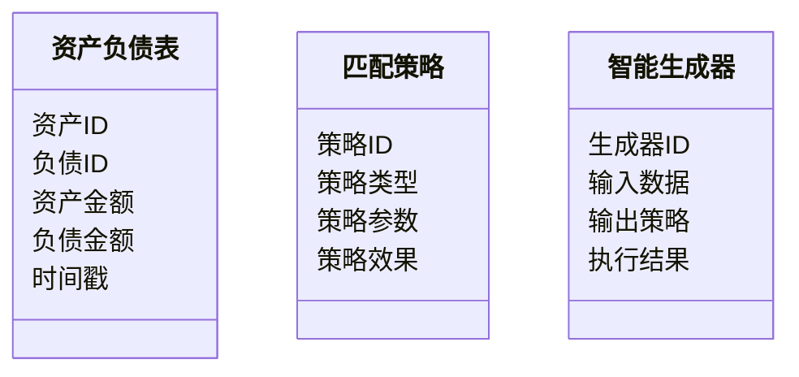
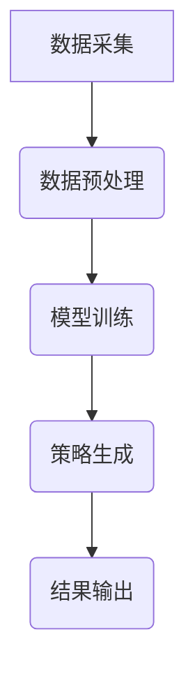
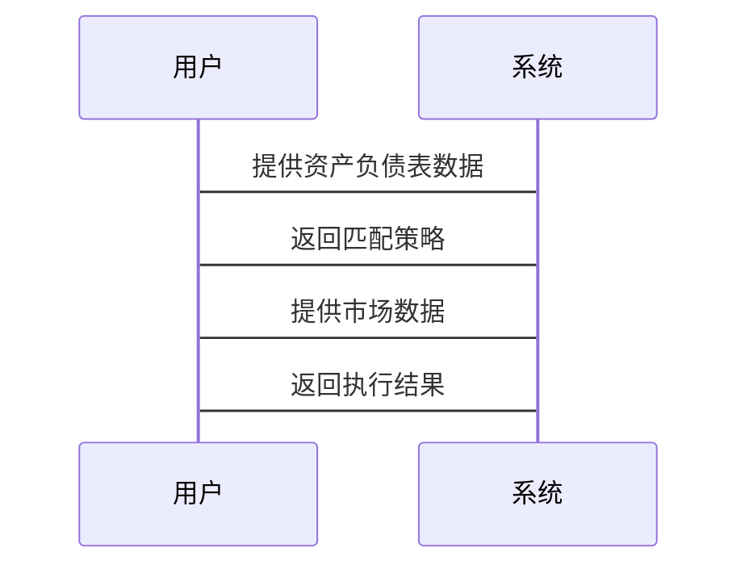

                 


# 《智能资产负债匹配策略生成器》

---

## 关键词：
- 智能资产负债匹配
- 策略生成器
- 人工智能
- 资产负债表
- 算法优化

---

## 摘要：
本文将详细介绍智能资产负债匹配策略生成器的核心原理、算法设计、系统架构以及实际应用。通过背景分析、概念解析、算法实现、系统设计和项目实战，深入探讨如何利用人工智能技术优化资产负债匹配策略，提升资产配置效率和风险控制能力。本文将为金融从业者、数据科学家和系统架构师提供理论支持和实践指导，帮助他们在复杂金融市场中实现更高效的资产管理和风险控制。

---

# 第一部分: 背景介绍

## 第1章: 问题背景

### 1.1 资产负债表的基本概念
资产负债表是企业财务状况的核心报表，反映了企业在某一特定时点的资产、负债和所有者权益的构成情况。资产是企业拥有的资源，负债是企业需要偿还的债务，所有者权益是企业净资产的体现。

### 1.2 资产负债匹配的重要性
资产负债匹配是指在不同时间点上，企业的资产和负债在金额、期限和风险上的匹配程度。有效的匹配能够降低企业的财务风险，优化资本结构，提高经营效率。

### 1.3 智能匹配策略的必要性
随着金融市场环境的复杂化和企业经营的不确定性增加，传统的资产负债匹配方法已难以应对快速变化的市场条件。引入人工智能技术，能够实时分析市场数据，动态调整匹配策略，提升匹配效率和准确性。

---

## 第2章: 问题描述

### 2.1 资产负债匹配的核心问题
- 资产和负债的金额匹配问题。
- 资产和负债的期限匹配问题。
- 资产和负债的风险匹配问题。

### 2.2 智能匹配策略的目标
- 实现资产和负债在金额、期限和风险上的动态匹配。
- 提高资产负债表的稳健性和流动性。
- 优化资本成本，提升企业价值。

### 2.3 当前存在的主要挑战
- 数据量大、维度高，传统方法难以处理。
- 市场波动剧烈，匹配策略需要快速调整。
- 多目标优化问题复杂，难以平衡不同目标。

---

## 第3章: 问题解决

### 3.1 智能匹配策略的基本思路
- 利用人工智能技术，构建智能资产负债匹配模型。
- 基于历史数据和市场数据，训练匹配策略生成器。
- 实时监控市场变化，动态调整匹配策略。

### 3.2 人工智能在资产负债匹配中的应用
- 使用机器学习算法分析历史数据，预测未来市场趋势。
- 利用自然语言处理技术分析财务报告和新闻信息。
- 基于深度学习构建生成模型，生成最优匹配策略。

### 3.3 算法与模型的选择
- 选择适合的机器学习算法，如随机森林、支持向量机等。
- 基于神经网络构建生成对抗网络（GAN），生成匹配策略。
- 使用强化学习方法，优化匹配策略的执行效果。

---

## 第4章: 边界与外延

### 4.1 智能匹配策略的适用范围
- 适用于需要动态调整资产负债表的企业。
- 适用于金融市场波动较大的行业。
- 适用于需要优化资本结构的企业。

### 4.2 与传统资产负债匹配的区别
- 传统方法依赖人工判断和静态模型。
- 智能方法基于动态数据和实时调整。
- 传统方法适用于简单场景，智能方法适用于复杂场景。

### 4.3 系统边界与功能范围
- 系统边界：数据采集、模型训练、策略生成、结果输出。
- 功能范围：数据预处理、模型训练、策略生成、结果分析。

---

# 第二部分: 核心概念与联系

## 第5章: 核心概念原理

### 5.1 资产负债匹配的数学模型
- 资产负债匹配的基本数学模型：
$$
\text{资产} = \text{负债} + \text{所有者权益}
$$

### 5.2 智能生成策略的算法原理
- 基于生成对抗网络（GAN）的策略生成：
$$
G(z) = \text{生成策略}(z)
$$
$$
D(x) = \text{判别策略}(x)
$$

### 5.3 算法与模型的对比分析
- 生成模型与判别模型的对比：
- 生成模型注重策略生成，判别模型注重策略验证。

---

## 第6章: 概念属性特征对比表格

### 6.1 资产负债匹配的核心属性
| 属性 | 描述 |
|------|------|
| 金额匹配 | 资产与负债的金额相等 |
| 期限匹配 | 资产与负债的期限一致 |
| 风险匹配 | 资产与负债的风险可控 |

### 6.2 智能策略生成的特征
| 特征 | 描述 |
|------|------|
| 实时性 | 策略生成实时更新 |
| 动态性 | 策略根据市场变化自动调整 |
| 精准性 | 策略基于大数据分析生成 |

---

## 第7章: ER实体关系图

### 7.1 实体关系图
```mermaid
er
    entity 资产负债表 {
        key 资产ID
        key 负债ID
        attribute 资产金额
        attribute 负债金额
        attribute 时间戳
    }
    entity 匹配策略 {
        key 策略ID
        attribute 策略类型
        attribute 策略参数
        attribute 策略效果
    }
    entity 智能生成器 {
        key 生成器ID
        attribute 输入数据
        attribute 输出策略
        attribute 执行结果
    }
```

---

# 第三部分: 算法原理讲解

## 第8章: 算法流程图

### 8.1 算法流程图


---

## 第9章: 算法实现代码

### 9.1 Python代码示例
```python
import numpy as np
import pandas as pd
from sklearn.model_selection import train_test_split
from sklearn.ensemble import RandomForestClassifier

# 数据预处理
data = pd.read_csv('balance_sheet.csv')
X = data.drop('label', axis=1)
y = data['label']

# 数据分割
X_train, X_test, y_train, y_test = train_test_split(X, y, test_size=0.2, random_state=42)

# 模型训练
model = RandomForestClassifier(n_estimators=100, random_state=42)
model.fit(X_train, y_train)

# 策略生成
predictions = model.predict(X_test)
print("准确率:", model.score(X_test, y_test))
```

---

## 第10章: 数学模型与公式

### 10.1 生成模型的数学公式
$$
P(x) = \text{预测概率}(x)
$$
$$
G(z) = \text{生成策略}(z)
$$

### 10.2 判别模型的数学公式
$$
D(x) = \text{判别概率}(x)
$$
$$
L(G, D) = \text{损失函数}(G, D)
$$

---

# 第四部分: 系统分析与架构设计

## 第11章: 系统架构设计

### 11.1 领域模型类图


### 11.2 系统架构图


---

## 第12章: 接口设计与交互流程

### 12.1 系统接口设计
- 输入接口：接收资产负债表数据和市场数据。
- 输出接口：输出匹配策略和执行结果。

### 12.2 交互流程图


---

# 第五部分: 项目实战

## 第13章: 项目环境与安装

### 13.1 环境要求
- Python 3.8+
- NumPy, Pandas, Scikit-learn等库

### 13.2 安装指南
```bash
pip install numpy pandas scikit-learn
```

---

## 第14章: 核心功能实现

### 14.1 数据预处理
```python
import pandas as pd
from sklearn.preprocessing import StandardScaler

# 加载数据
data = pd.read_csv('balance_sheet.csv')

# 数据预处理
scaler = StandardScaler()
X_scaled = scaler.fit_transform(data.drop('label', axis=1))
```

### 14.2 模型训练与策略生成
```python
from sklearn.ensemble import RandomForestClassifier

# 训练模型
model = RandomForestClassifier(n_estimators=100)
model.fit(X_scaled, data['label'])

# 生成策略
new_data = pd.read_csv('new_data.csv')
new_data_scaled = scaler.transform(new_data.drop('label', axis=1))
predictions = model.predict(new_data_scaled)
```

---

## 第15章: 案例分析与结果解读

### 15.1 实际案例分析
假设某企业资产负债表数据如下：
| 资产金额 | 负债金额 | 所有者权益 |
|---------|----------|------------|
| 1000    | 800      | 200        |

### 15.2 策略生成与优化
经过模型训练，生成的匹配策略为：
- 调整资产结构，增加流动资产比例。
- 优化负债期限，减少短期负债比例。

---

## 第16章: 项目小结

### 16.1 核心实现总结
- 数据预处理是关键。
- 模型选择影响策略生成效果。
- 实际应用中需考虑市场变化。

### 16.2 项目经验总结
- 数据质量和数量直接影响模型效果。
- 模型调优是优化策略生成的重要环节。
- 系统架构设计需考虑扩展性和可维护性。

---

# 第六部分: 最佳实践与总结

## 第17章: 最佳实践

### 17.1 小贴士
- 数据预处理时，需注意异常值和缺失值的处理。
- 模型调优时，建议使用交叉验证和网格搜索。
- 系统上线前，需进行充分的测试和验证。

### 17.2 注意事项
- 避免过度依赖单一模型，建议使用多种算法进行对比。
- 系统运行时，需实时监控数据和模型表现。
- 策略执行后，需定期评估和优化。

---

## 第18章: 总结与展望

### 18.1 全书总结
本文详细介绍了智能资产负债匹配策略生成器的核心原理、算法设计、系统架构和实际应用。通过理论分析和实践案例，展示了如何利用人工智能技术优化资产负债匹配策略。

### 18.2 未来展望
随着人工智能技术的不断发展，智能资产负债匹配策略生成器将更加智能化和自动化。未来，可以结合区块链技术和分布式计算，进一步提升系统的安全性和效率。

---

## 作者：AI天才研究院/AI Genius Institute & 禅与计算机程序设计艺术 /Zen And The Art of Computer Programming

