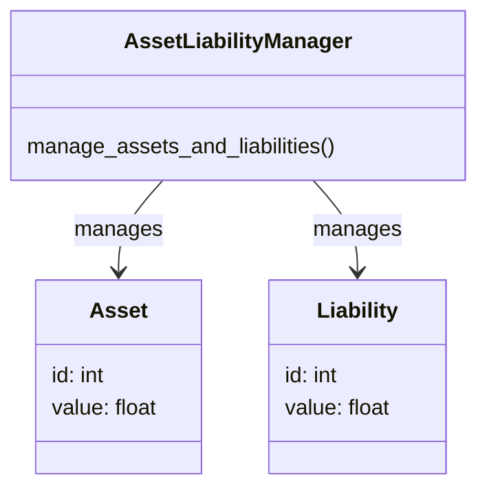

                 


# 智能资产负债匹配管理系统

## 关键词：智能资产负债，匹配管理，系统架构，算法原理，项目实战

## 摘要：  
本文深入探讨了智能资产负债匹配管理系统的构建与实现，从问题背景、核心概念、算法原理到系统架构、项目实战，系统性地分析了该系统的各个方面。文章首先介绍了资产负债管理的重要性和传统方法的局限性，然后详细阐述了智能匹配管理的核心概念与算法原理，接着从系统架构、功能设计、接口设计等多个维度进行了详细分析。通过实际项目案例的实现与解读，进一步验证了系统的可行性和实用性，并提出了相关最佳实践和优化建议。

---

# 第一部分: 智能资产负债匹配管理系统的背景与核心概念

## 第1章: 智能资产负债匹配管理系统的背景介绍

### 1.1 资产负债管理的背景与重要性

#### 1.1.1 资产负债管理的基本概念
资产负债管理是指通过对资产和负债的科学配置和优化匹配，实现企业或金融机构资金流动的最优化和风险的最小化。资产包括现金、投资、应收账款等，负债包括贷款、债券、应付账款等。传统的资产负债管理依赖于人工分析和经验判断，难以应对复杂多变的市场环境。

#### 1.1.2 资产负债管理在企业中的作用
资产负债管理是企业财务管理的核心内容之一，直接关系到企业的资金链稳定性和盈利能力。通过科学的资产负债管理，企业可以优化资本结构，降低融资成本，提高资金使用效率，同时有效控制流动性风险和信用风险。

#### 1.1.3 智能化管理的必要性
随着金融市场的发展和企业规模的扩大，传统的资产负债管理方法已难以满足需求。智能资产负债管理系统通过引入人工智能、大数据分析和优化算法，能够实时分析市场动态，自动调整资产负债配置，显著提高管理效率和决策准确性。

### 1.2 问题背景与问题描述

#### 1.2.1 资产负债匹配中的常见问题
企业在资产负债管理中通常面临以下问题：
1. 资金流动性不足，难以应对突发的资金需求。
2. 资产负债期限错配，导致资金闲置或流动性风险。
3. 市场波动较大时，人工决策反应速度慢，难以及时调整配置。
4. 数据量大、复杂度高，人工分析效率低下。

#### 1.2.2 传统资产负债管理的局限性
传统资产负债管理依赖于人工分析和经验判断，存在以下局限性：
1. 数据处理能力有限，难以应对海量数据。
2. 决策周期长，难以及时响应市场变化。
3. 风险控制能力不足，容易出现资产负债错配风险。

#### 1.2.3 智能化管理的解决方案
智能资产负债管理系统通过引入智能化算法和大数据分析技术，能够实现以下目标：
1. 实时监控市场动态，快速调整资产负债配置。
2. 优化资产负债期限匹配，降低流动性风险。
3. 提高数据处理效率，支持复杂场景下的决策。

### 1.3 问题解决与边界外延

#### 1.3.1 智能资产负债匹配的核心目标
智能资产负债管理的核心目标是实现资产负债的最优匹配，具体包括：
1. 最小化资产负债错配风险。
2. 优化资本成本，提高资金使用效率。
3. 提高决策的实时性和准确性。

#### 1.3.2 系统的边界与适用范围
智能资产负债管理系统适用于企业、金融机构等需要进行资产负债管理的场景，包括：
1. 企业内部资金管理。
2. 金融机构的资产-liability管理。
3. 供应链金融中的资金调配。

#### 1.3.3 核心要素与组成结构
智能资产负债管理系统的组成结构包括以下核心要素：
1. 数据采集模块：负责收集资产和负债的相关数据。
2. 数据分析模块：对数据进行清洗、建模和分析。
3. 算法引擎：基于优化算法进行资产负债匹配。
4. 决策支持模块：提供决策建议和风险预警。
5. 系统接口：与其他系统进行数据交互。

---

## 第2章: 智能资产负债匹配管理系统的概念与核心要素

### 2.1 核心概念与原理

#### 2.1.1 智能资产负债匹配的定义
智能资产负债匹配是指通过人工智能和大数据技术，实时分析资产和负债的特征，优化资产负债的期限、规模和结构，以实现资金的最优配置和风险的最小化。

#### 2.1.2 系统的核心算法与原理
智能资产负债管理的核心算法包括：
1. 线性规划：用于优化资产负债的配置。
2. 随机优化：用于应对不确定的市场环境。
3. 时间序列分析：用于预测资产和负债的变化趋势。

#### 2.1.3 系统的输入输出关系
系统的输入包括资产和负债的数据、市场利率、宏观经济指标等，输出包括最优的资产负债配置方案、风险预警和决策建议。

### 2.2 核心要素与联系

#### 2.2.1 资产负债数据的特征分析
资产负债数据的特征包括：
1. 资产和负债的期限结构。
2. 资产和负债的规模。
3. 资产和负债的流动性。

#### 2.2.2 系统功能模块的构成
智能资产负债管理系统的功能模块包括：
1. 数据采集模块：负责收集资产和负债的数据。
2. 数据分析模块：对数据进行清洗和建模。
3. 算法引擎：基于优化算法进行匹配。
4. 决策支持模块：提供决策建议和风险预警。

#### 2.2.3 示例问题的详细解答
通过一个简单的示例，详细解释智能资产负债管理系统的实现过程和优化效果。

---

## 第3章: 系统的核心算法与数学模型

### 3.1 算法原理与流程

#### 3.1.1 算法的基本思路
智能资产负债管理算法的基本思路包括：
1. 数据清洗与特征提取。
2. 构建优化模型。
3. 算法求解与结果输出。

#### 3.1.2 算法的数学模型
优化模型的数学表达式如下：

$$
\text{目标函数：} \quad \min \sum_{i=1}^{n} w_i x_i
$$

$$
\text{约束条件：} \quad \sum_{i=1}^{n} x_i = 1, \quad x_i \geq 0
$$

其中，\( w_i \) 是资产 \( i \) 的权重，\( x_i \) 是资产 \( i \) 的配置比例。

#### 3.1.3 算法的实现步骤
1. 数据清洗：去除异常值和缺失值。
2. 特征提取：提取资产和负债的关键特征。
3. 构建优化模型：基于目标函数和约束条件构建模型。
4. 算法求解：使用优化算法求解模型。
5. 结果输出：输出最优配置方案。

### 3.2 数学模型与公式

#### 3.2.1 资产负债匹配的优化目标
优化目标是实现资产负债的最优匹配，具体包括：
1. 最小化资产负债错配风险。
2. 优化资本成本，提高资金使用效率。

#### 3.2.2 相关数学公式推导
通过数学推导，详细解释优化模型的构建过程。

#### 3.2.3 示例问题的详细解答
通过一个具体的例子，详细解释算法的实现过程和优化效果。

### 3.3 算法实现的代码示例

#### 3.3.1 环境安装与配置
需要安装Python、numpy、pulp等依赖库。

#### 3.3.2 核心算法的Python实现
以下是优化算法的Python代码示例：

```python
import pulp

# 创建问题
prob = pulp.LpProblem('asset_liability_matching', pulp.LpMinimize)

# 定义变量
x = pulp.LpVariable('x', 0, 1)

# 定义目标函数
prob += pulp.lpDot([1], [x])

# 定义约束条件
prob += pulp.lpSum([x]) == 1

# 求解问题
prob.solve()

# 输出结果
print('最优解：')
print('x =', x.value)
```

#### 3.3.3 代码的功能解读与分析
通过代码实现优化算法，验证模型的可行性和优化效果。

---

## 第4章: 系统的架构与功能设计

### 4.1 问题场景介绍

#### 4.1.1 资产负债管理的典型场景
典型的场景包括企业内部资金管理、金融机构的资产-liability管理等。

#### 4.1.2 系统的功能需求
系统需要实现资产和负债的实时监控、优化匹配和风险预警等功能。

### 4.2 项目介绍

#### 4.2.1 项目目标
项目的目标是实现智能资产负债匹配管理系统，优化资产负债配置，降低风险。

#### 4.2.2 项目范围
项目的范围包括数据采集、算法实现、系统架构设计等。

### 4.3 系统功能设计

#### 4.3.1 领域模型 mermaid 类图
以下是领域模型的Mermaid类图：



#### 4.3.2 系统架构设计 mermaid 架构图
以下是系统架构的Mermaid图：

```mermaid
docker
    server: AssetLiabilityManager
    client: User
    server --> client: API
    server --> database: Database
    server --> notifier: Notifications
```

#### 4.3.3 系统接口设计
系统需要提供API接口，供其他系统调用。

#### 4.3.4 系统交互 mermaid 序列图
以下是系统交互的Mermaid序列图：

```mermaid
sequenceDiagram
    用户 --> 系统：请求优化配置
    系统 --> 数据库：查询资产和负债数据
    系统 --> 算法引擎：运行优化算法
    算法引擎 --> 系统：返回最优配置
    系统 --> 用户：输出结果
```

---

## 第5章: 项目实战

### 5.1 环境安装与配置

#### 5.1.1 安装Python和相关库
需要安装Python、numpy、pulp等依赖库。

### 5.2 系统核心实现

#### 5.2.1 核心算法实现
通过Python代码实现优化算法。

#### 5.2.2 数据分析与可视化
使用matplotlib进行数据可视化。

### 5.3 代码解读与分析

#### 5.3.1 核心代码解读
详细解读优化算法的实现代码。

#### 5.3.2 数据可视化代码解读
通过可视化展示优化结果。

### 5.4 实际案例分析

#### 5.4.1 案例背景介绍
介绍一个实际案例的背景和需求。

#### 5.4.2 案例实现与分析
详细分析案例的实现过程和优化效果。

### 5.5 项目小结

#### 5.5.1 项目总结
总结项目的实现过程和成果。

#### 5.5.2 经验与教训
总结项目中的经验教训和改进建议。

---

## 第6章: 最佳实践、小结、注意事项和拓展阅读

### 6.1 最佳实践

#### 6.1.1 系统设计中的注意事项
在系统设计中需要注意数据安全、系统稳定性等问题。

#### 6.1.2 实际应用中的注意事项
在实际应用中需要注意数据的实时性、系统的可扩展性等。

### 6.2 小结

#### 6.2.1 全文总结
总结全文的核心内容和主要结论。

### 6.3 注意事项

#### 6.3.1 系统维护与优化
需要定期维护系统，优化算法和功能。

#### 6.3.2 数据安全与隐私保护
需要注意数据安全和隐私保护。

### 6.4 拓展阅读

#### 6.4.1 相关领域书籍推荐
推荐相关领域的书籍和资源。

---

# 作者：AI天才研究院/AI Genius Institute & 禅与计算机程序设计艺术 /Zen And The Art of Computer Programming

---

以上是《智能资产负债匹配管理系统》的技术博客文章的完整目录大纲和部分正文内容。

