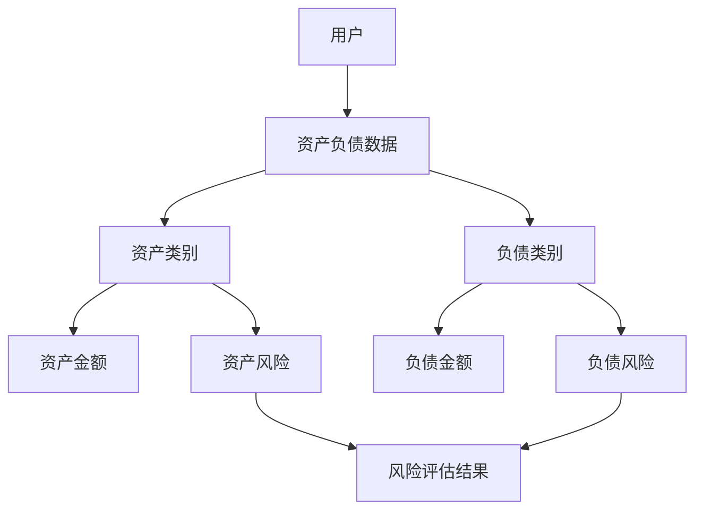
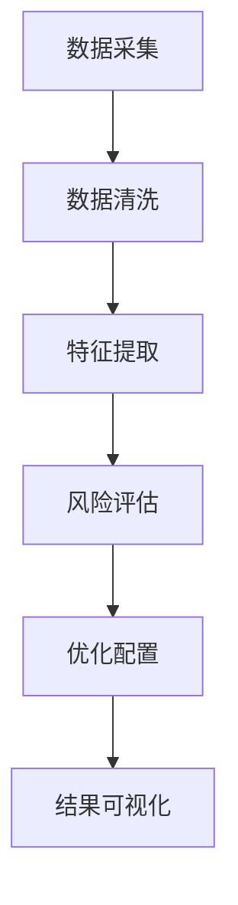
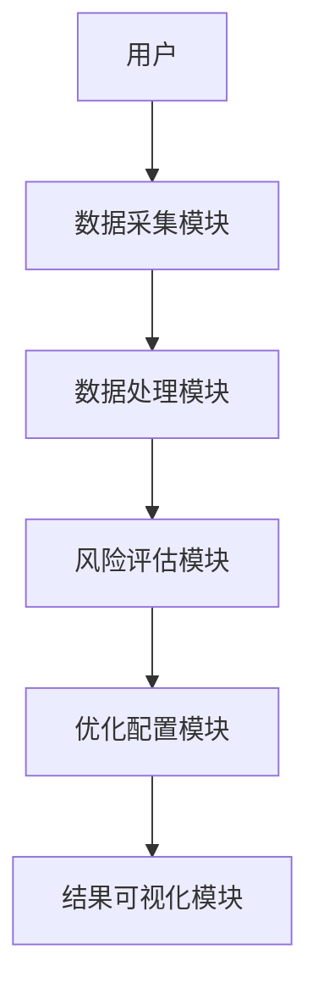
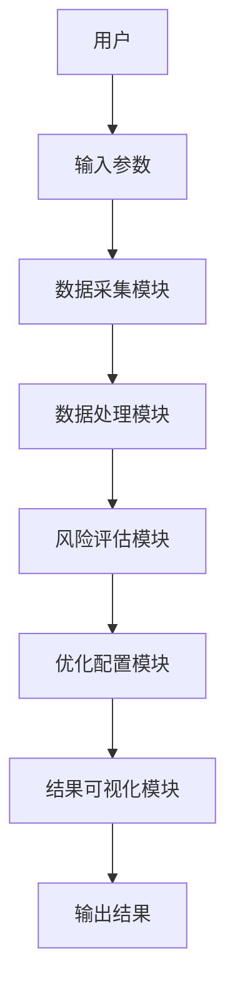

                 


# 智能资产负债管理工具

> 关键词：智能资产负债管理、风险管理、资产优化配置、算法原理、系统架构、项目实战

> 摘要：智能资产负债管理工具是一种结合人工智能和大数据分析的先进工具，用于帮助企业或个人实现资产与负债的动态平衡管理。本文将从背景介绍、核心概念、算法原理、系统架构、项目实战等多方面详细阐述智能资产负债管理工具的设计与实现，帮助读者全面理解其工作原理及应用价值。

---

## 第一部分: 智能资产负债管理工具的背景与现状

### 第1章: 智能资产负债管理工具的背景与现状

#### 1.1 资产负债管理的基本概念
##### 1.1.1 资产与负债的定义与分类
资产是指企业或个人拥有的资源，包括流动资产（如现金、应收账款）和非流动资产（如固定资产、无形资产）。负债是指企业或个人需要偿还的债务，包括短期负债（如应付账款）和长期负债（如长期贷款）。理解资产与负债的分类是资产负债管理的基础。

##### 1.1.2 资产负债管理的核心目标
资产负债管理的核心目标是实现资产与负债的动态平衡，确保在不同经济周期和市场环境下，企业或个人的财务状况保持稳健。具体目标包括风险最小化、收益最大化、流动性管理等。

##### 1.1.3 智能化管理的必要性与优势
传统资产负债管理依赖人工分析，效率低且容易出错。智能化管理通过引入人工智能和大数据技术，能够实时监控资产与负债的变化，快速响应市场波动，显著提高管理效率和准确性。

#### 1.2 智能资产负债管理工具的发展现状
##### 1.2.1 传统资产负债管理的局限性
传统资产负债管理方式存在以下问题：  
1. 数据处理效率低，难以应对海量数据。  
2. 风险评估主观性强，容易受到人为因素影响。  
3. 缺乏动态调整能力，难以应对快速变化的市场环境。

##### 1.2.2 智能化技术在资产负债管理中的应用
人工智能、大数据分析和区块链等技术的引入，使得资产负债管理更加智能化。例如：  
1. 使用机器学习算法进行风险评估。  
2. 通过大数据分析优化资产配置。  
3. 利用区块链技术确保数据安全与透明。

##### 1.2.3 当前市场上的主流工具与解决方案
当前市场上的智能资产负债管理工具主要分为三类：  
1. 基于规则的传统工具：依赖预设规则进行资产与负债管理。  
2. 基于机器学习的智能工具：利用算法动态调整资产与负债配置。  
3. 综合型工具：结合规则与算法，提供更加灵活的管理方式。

#### 1.3 智能资产负债管理工具的核心要素
##### 1.3.1 数据采集与处理
智能资产负债管理工具需要实时采集市场数据（如股票价格、汇率）和企业内部数据（如财务报表）。数据采集后，需要进行清洗、转换和存储，确保数据的准确性和完整性。

##### 1.3.2 风险评估与预警
通过机器学习算法（如随机森林、支持向量机）对资产与负债进行风险评估，并设置预警机制，及时发现潜在风险。

##### 1.3.3 资产负债优化配置
基于数学优化模型（如线性规划、非线性规划）对资产与负债进行动态配置，以实现风险最小化和收益最大化。

##### 1.3.4 可视化分析与报告生成
通过可视化工具（如Tableau、Power BI）生成资产负债表、损益表等报告，帮助用户直观了解财务状况。

---

## 第二部分: 智能资产负债管理工具的核心概念与联系

### 第2章: 智能资产负债管理工具的核心概念与联系

#### 2.1 核心概念原理
##### 2.1.1 资产负债动态平衡的数学模型
资产负债动态平衡的数学模型通常包括以下部分：  
1. 资产与负债的动态变化方程。  
2. 风险评估的数学模型。  
3. 优化配置的目标函数与约束条件。

##### 2.1.2 风险评估的算法原理
常用的风险评估算法包括：  
1. VaR（Value at Risk）：计算资产组合在一定置信水平下的最大可能损失。  
2. CVaR（Conditional Value at Risk）：计算资产组合在超过VaR值情况下的平均损失。  
3. 蒙特卡洛模拟：通过模拟市场波动，评估资产组合的风险。

##### 2.1.3 智能优化的算法机制
智能优化算法包括遗传算法、模拟退火算法和粒子群优化算法等。这些算法通过不断迭代优化，找到资产与负债的最优配置方案。

#### 2.2 核心概念属性特征对比表
以下表格对比了资产、负债、风险评估和优化配置的核心属性特征：

| 概念       | 属性       | 特征描述                                   |
|------------|------------|------------------------------------------|
| 资产       | 类型       | 流动资产、非流动资产                     |
| 负债       | 到期时间   | 短期负债、长期负债                     |
| 风险评估   | 方法       | VaR、CVaR、蒙特卡洛模拟                 |
| 优化配置   | 目标函数   | 最小化风险、最大化收益                   |

#### 2.3 ER实体关系图
以下是一个简化的ER实体关系图，展示了资产负债管理的核心实体关系：



---

## 第三部分: 智能资产负债管理工具的算法原理

### 第3章: 智能资产负债管理工具的算法原理

#### 3.1 算法原理概述
智能资产负债管理工具的核心算法包括数据预处理、风险评估、优化配置和结果可视化四个部分。以下是一个简化的算法流程图：



#### 3.2 风险评估算法实现
以下是一个基于机器学习的风险评估算法实现示例：

```python
import numpy as np
from sklearn.ensemble import RandomForestRegressor

# 示例数据
X = np.array([[1, 2], [3, 4], [5, 6]])
y = np.array([1, 2, 3])

# 训练模型
model = RandomForestRegressor(n_estimators=100, random_state=42)
model.fit(X, y)

# 预测风险
new_data = np.array([[2, 3]])
print("预测风险值：", model.predict(new_data))
```

#### 3.3 优化配置算法实现
以下是一个基于遗传算法的资产优化配置实现示例：

```python
import numpy as np
from sklearn.metrics import mean_squared_error

# 定义目标函数
def objective_function(weights):
    return mean_squared_error(weights, [1, 0])

# 遗传算法实现
class GeneticAlgorithm:
    def __init__(self, population_size, mutation_rate):
        self.population_size = population_size
        self.mutation_rate = mutation_rate
        self.population = np.random.random((population_size, 2))
    
    def evolve(self):
        # 计算适应度
        fitness = np.array([self.objective_function(weights) for weights in self.population])
        # 选择
        selected = self.select(fitness)
        # 交叉
        crossed = self.crossover(selected)
        # 变异
        mutated = self.mutate(crossed)
        return mutated

    def select(self, fitness):
        # 简单选择法
        return self.population[np.argsort(fitness)[:int(self.population_size/2)]]

    def crossover(self, selected):
        # 单点交叉
        cross_point = 1
        crossed = np.zeros_like(selected)
        for i in range(len(selected)):
            crossed[i] = np.concatenate([selected[i][:cross_point], selected[i][cross_point:]])
        return crossed

    def mutate(self, crossed):
        mutated = crossed.copy()
        for i in range(len(mutated)):
            if np.random.random() < self.mutation_rate:
                mutated[i] += np.random.normal(0, 0.1)
        return mutated

# 初始化并进化
ga = GeneticAlgorithm(population_size=10, mutation_rate=0.1)
optimized_weights = ga.evolve()[-1]
print("优化后的权重：", optimized_weights)
```

#### 3.4 数学模型与公式
以下是风险评估的核心数学公式：

$$
\text{VaR} = \text{Value at Risk} = F^{-1}(p)
$$

其中，\( F^{-1}(p) \) 是概率 \( p \) 对应的分位数函数。

---

## 第四部分: 智能资产负债管理工具的系统架构设计

### 第4章: 智能资产负债管理工具的系统架构设计

#### 4.1 系统功能设计
智能资产负债管理系统的功能模块包括：  
1. 数据采集模块：负责采集市场数据和企业内部数据。  
2. 数据处理模块：对数据进行清洗、转换和存储。  
3. 风险评估模块：基于机器学习算法评估资产与负债的风险。  
4. 优化配置模块：利用优化算法动态调整资产与负债配置。  
5. 结果可视化模块：生成资产负债表、损益表等报告。

#### 4.2 系统架构设计
以下是系统的架构图：



#### 4.3 系统接口设计
系统主要接口包括：  
1. 数据接口：与数据源（如股票交易系统）对接。  
2. 用户接口：提供给用户输入参数和查看结果的界面。  
3. 第三方接口：与外部数据源（如天气数据）对接。

#### 4.4 系统交互流程
以下是系统交互流程图：



---

## 第五部分: 智能资产负债管理工具的项目实战

### 第5章: 智能资产负债管理工具的项目实战

#### 5.1 环境安装与配置
以下是项目所需的环境配置：  
1. Python 3.8+  
2. NumPy、Pandas、Scikit-learn 等库  
3. Jupyter Notebook 或 IDE

#### 5.2 系统核心实现
以下是风险评估与优化配置的核心实现代码：

```python
import numpy as np
from sklearn import svm

# 示例数据
X = np.array([[1, 2], [3, 4], [5, 6]])
y = np.array([1, 2, 3])

# 训练模型
model = svm.SVR(kernel='linear')
model.fit(X, y)

# 预测结果
new_data = np.array([[2, 3]])
print("预测结果：", model.predict(new_data))
```

#### 5.3 代码应用解读与分析
上述代码实现了基于支持向量回归（SVR）的风险评估模型。通过训练模型，我们可以预测新数据的风险值，并根据预测结果优化资产与负债配置。

#### 5.4 实际案例分析
以下是一个实际案例分析：  
假设某企业的资产负债数据如下：  
- 资产：现金 100 万元，应收账款 200 万元  
- 负债：短期贷款 50 万元，长期贷款 150 万元  

通过智能资产负债管理工具，我们可以优化资产与负债配置，降低风险并提高收益。

#### 5.5 项目小结
通过本项目实战，我们了解了智能资产负债管理工具的核心实现过程，包括数据采集、风险评估、优化配置和结果可视化。

---

## 第六部分: 智能资产负债管理工具的最佳实践

### 第6章: 智能资产负债管理工具的最佳实践

#### 6.1 最佳实践 tips
1. 数据质量是关键：确保数据的准确性和完整性。  
2. 算法选择要合理：根据实际需求选择合适的算法。  
3. 系统架构要灵活：便于后续优化和扩展。

#### 6.2 小结
智能资产负债管理工具通过引入人工智能和大数据技术，显著提高了资产负债管理的效率和准确性。在实际应用中，我们需要结合具体需求选择合适的工具和方法。

#### 6.3 注意事项
1. 数据隐私与安全：确保数据的安全性。  
2. 系统稳定性：确保系统的高可用性。  
3. 用户培训：对用户进行充分的培训，确保工具的正确使用。

#### 6.4 拓展阅读
推荐以下书籍和资源：  
1. 《机器学习实战》  
2. 《Python 数据分析 cookbook》  
3. 《金融风险管理》

---

## 作者：AI天才研究院/AI Genius Institute & 禅与计算机程序设计艺术/Zen And The Art of Computer Programming

