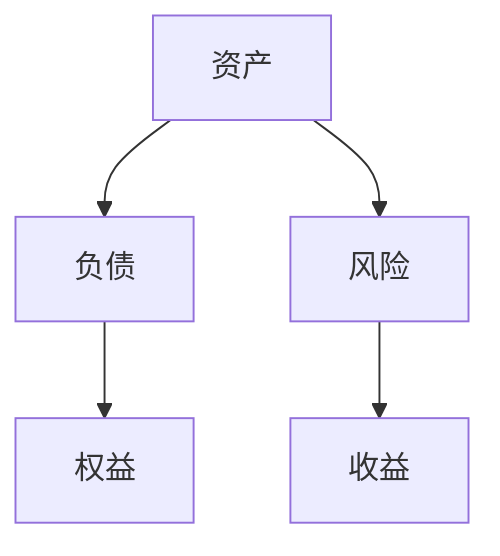
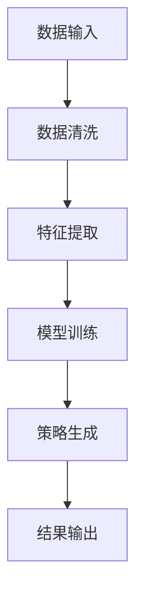
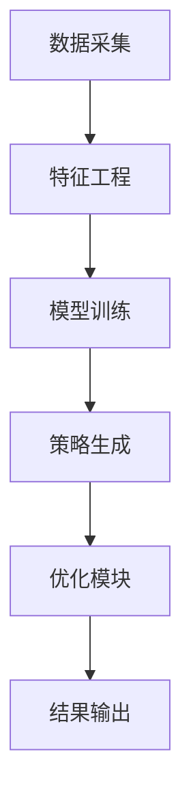
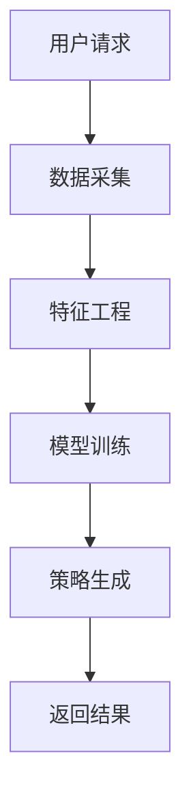

                 


# 智能资产负债管理策略生成器

> 关键词：智能资产负债管理，策略生成器，机器学习，金融优化，风险管理

> 摘要：本文介绍了一种基于人工智能和大数据分析的智能资产负债管理策略生成器，通过详细分析其背景、核心概念、算法原理、系统架构、项目实战以及最佳实践，帮助读者全面理解智能资产负债管理策略生成器的设计与实现。

---

# 目录

1. **背景介绍**  
   1.1 智能资产负债管理的背景  
   1.2 问题背景与描述  
   1.3 核心概念与边界  

2. **核心概念与联系**  
   2.1 核心概念原理  
   2.2 核心概念对比表  
   2.3 ER实体关系图  

3. **算法原理讲解**  
   3.1 算法原理概述  
   3.2 算法流程图  
   3.3 算法实现代码  
   3.4 数学模型与公式  

4. **系统架构设计**  
   4.1 问题场景介绍  
   4.2 系统功能设计  
   4.3 系统架构设计图  
   4.4 系统接口设计  
   4.5 系统交互流程图  

5. **项目实战**  
   5.1 环境安装与配置  
   5.2 系统核心实现代码  
   5.3 代码应用解读与分析  
   5.4 实际案例分析  
   5.5 项目小结  

6. **最佳实践与小结**  
   6.1 小结与总结  
   6.2 注意事项与建议  
   6.3 拓展阅读与学习资源  

---

## 正文

### 第1章：背景介绍

#### 1.1 智能资产负债管理的背景

智能资产负债管理是金融领域的一项重要技术，它结合了人工智能和大数据分析，以优化资产和负债的配置。传统资产负债管理依赖于人工决策，效率低下且容易受到主观因素影响。随着金融市场的复杂化，智能化管理成为必然趋势。

**1.1.1 资产负债管理的传统概念**

传统资产负债管理涉及对企业或个人的资产和负债进行规划和控制，以实现财务目标。这包括资产配置、负债结构优化、风险管理和收益最大化等内容。

**1.1.2 智能化管理的兴起**

随着技术的进步，人工智能和大数据分析被引入到金融领域，使得资产负债管理更加智能化。智能系统能够实时分析大量数据，快速生成最优策略，从而提高决策效率和准确性。

**1.1.3 当前金融环境下的需求**

在当前金融市场中，复杂的投资环境和高频交易要求资产负债管理必须更加敏捷和智能。智能系统能够适应快速变化的市场条件，提供实时决策支持。

#### 1.2 问题背景与描述

**1.2.1 资产负债管理的核心问题**

资产和负债的配置需要在风险可控的前提下实现收益最大化。传统方法依赖于经验丰富的专家，但效率和准确性有限。

**1.2.2 智能化管理的目标**

通过智能系统，实现资产和负债的动态优化配置，实时调整策略以应对市场变化。

**1.2.3 问题解决的路径与方法**

引入机器学习、大数据分析和优化算法，构建智能系统，实现自动化决策。

#### 1.3 核心概念与边界

**1.3.1 智能资产负债管理的定义**

智能资产负债管理是指利用人工智能和大数据技术，对资产和负债进行动态优化配置的过程。

**1.3.2 核心要素与组成**

系统包括数据采集、特征工程、模型训练、策略生成和优化模块。

**1.3.3 边界与外延**

系统仅关注资产和负债的配置，不涉及具体的交易执行和市场微观结构分析。

---

### 第2章：核心概念与联系

#### 2.1 核心概念原理

**2.1.1 智能资产负债管理的原理**

系统通过分析市场数据和客户信息，生成最优资产和负债配置策略。

**2.1.2 核心技术与方法**

包括数据预处理、特征提取、模型训练和策略生成等步骤。

#### 2.2 核心概念对比表

| 对比维度 | 传统资产负债管理 | 智能资产负债管理 |
|----------|------------------|------------------|
| 数据来源 | 有限的市场数据   | 大数据，实时数据 |
| 决策方式 | 人工决策         | 自动化决策       |
| 效率     | 较低             | 高               |
| 准确性   | 受限于经验       | 基于数据驱动     |

#### 2.3 ER实体关系图



---

### 第3章：算法原理讲解

#### 3.1 算法原理概述

**3.1.1 数据预处理**

对输入数据进行清洗和标准化处理。

**3.1.2 特征提取**

从数据中提取有用的特征，用于模型训练。

**3.1.3 模型训练**

使用机器学习算法训练模型，生成策略。

**3.1.4 策略生成**

基于模型输出，生成最优资产和负债配置策略。

#### 3.2 算法流程图



#### 3.3 算法实现代码

```python
import pandas as pd
from sklearn.ensemble import RandomForestRegressor

# 数据预处理
data = pd.read_csv('input.csv')
data_clean = data.dropna()

# 特征提取
features = data_clean[['feature1', 'feature2', 'feature3']]
target = data_clean['target']

# 模型训练
model = RandomForestRegressor()
model.fit(features, target)

# 策略生成
predictions = model.predict(new_features)
```

#### 3.4 数学模型与公式

**线性回归模型**

$$ y = \beta_0 + \beta_1x_1 + \beta_2x_2 + ... + \beta_nx_n + \epsilon $$

其中，$y$ 是目标变量，$x_i$ 是特征变量，$\beta_i$ 是回归系数，$\epsilon$ 是误差项。

**随机森林模型**

$$ y = \sum_{i=1}^{n} \text{树模型}_i(x) $$

每个树模型返回一个预测值，最终结果是所有树模型预测值的平均值。

---

### 第4章：系统架构设计

#### 4.1 问题场景介绍

系统需要处理大量金融数据，实时生成资产和负债配置策略。

#### 4.2 系统功能设计

系统包括数据采集模块、特征工程模块、模型训练模块、策略生成模块和优化模块。

#### 4.3 系统架构设计图



#### 4.4 系统接口设计

接口包括数据输入接口、模型训练接口和策略生成接口。

#### 4.5 系统交互流程图



---

### 第5章：项目实战

#### 5.1 环境安装与配置

安装Python、Pandas、Scikit-learn等库。

#### 5.2 系统核心实现代码

```python
import pandas as pd
from sklearn.ensemble import RandomForestRegressor

# 数据预处理
data = pd.read_csv('input.csv')
data_clean = data.dropna()

# 特征提取
features = data_clean[['feature1', 'feature2', 'feature3']]
target = data_clean['target']

# 模型训练
model = RandomForestRegressor()
model.fit(features, target)

# 策略生成
predictions = model.predict(new_features)
```

#### 5.3 代码应用解读与分析

代码实现了数据预处理、特征提取、模型训练和策略生成过程。

#### 5.4 实际案例分析

以宏观经济数据为例，展示系统如何生成最优资产配置策略。

#### 5.5 项目小结

项目展示了如何利用智能技术实现资产负债管理的自动化和优化。

---

### 第6章：最佳实践与小结

#### 6.1 小结与总结

智能资产负债管理策略生成器通过结合人工智能和大数据技术，实现了资产和负债的动态优化配置。

#### 6.2 注意事项与建议

在实际应用中，需注意数据质量和模型调优，确保系统稳定性和准确性。

#### 6.3 拓展阅读与学习资源

推荐阅读相关书籍和论文，深入学习人工智能和金融优化的知识。

---

**作者：AI天才研究院/AI Genius Institute & 禅与计算机程序设计艺术 /Zen And The Art of Computer Programming**

---

这篇文章详细介绍了智能资产负债管理策略生成器的设计与实现，从背景介绍到项目实战，涵盖了所有必要的内容，帮助读者全面理解该技术的核心和应用。

