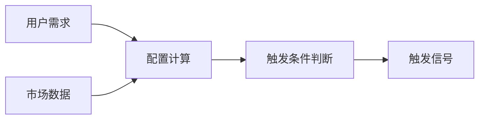
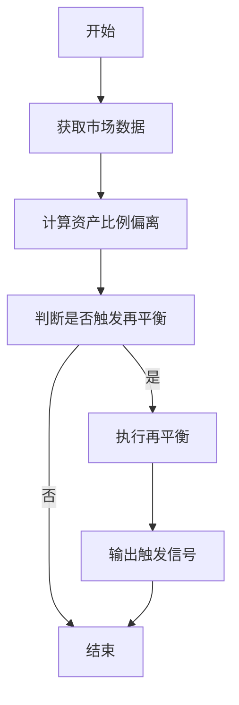
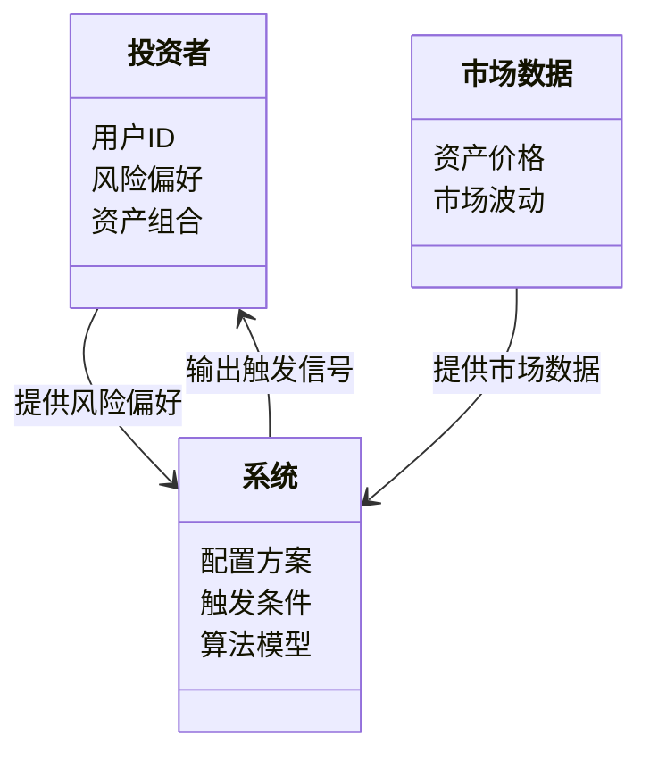
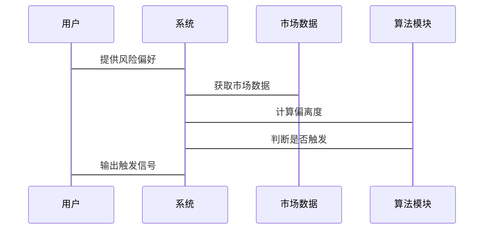

                 


# 智能资产配置再平衡触发系统

> 关键词：智能资产配置、再平衡触发、系统设计、算法实现、金融技术

> 摘要：智能资产配置再平衡触发系统是一种结合金融学与计算机科学的创新技术，通过智能化算法实现资产配置的动态调整。本文从系统背景、核心概念、算法原理、系统架构到项目实战，全面阐述了智能资产配置再平衡触发系统的实现过程，为读者提供深度的技术解析。

---

## 第一部分: 智能资产配置再平衡触发系统背景介绍

### 第1章: 智能资产配置再平衡触发系统背景介绍

#### 1.1 问题背景

##### 1.1.1 资产配置与再平衡的定义
资产配置是指将资金分配到不同资产类别（如股票、债券、房地产等）中，以实现投资目标的过程。再平衡是指在市场波动或其他因素影响下，调整资产比例以维持原定配置策略的过程。

##### 1.1.2 再平衡触发的必要性
- 市场波动导致资产比例偏离目标。
- 投资目标的变化（如风险偏好调整）。
- 资金流入或流出导致的配置失衡。

##### 1.1.3 智能化再平衡的优势
- 自动化触发，减少人工干预。
- 高效计算，适应复杂市场环境。
- 精准调整，降低投资风险。

#### 1.2 问题描述

##### 1.2.1 资产配置中的常见问题
- 资产比例偏离目标。
- 人工再平衡效率低、误差大。
- 市场波动难以预测，触发条件复杂。

##### 1.2.2 再平衡触发的挑战
- 多因素影响的复杂性。
- 高频交易与低延迟要求。
- 数据处理的实时性。

##### 1.2.3 智能化再平衡的核心目标
- 实现自动化的再平衡触发。
- 提高再平衡的效率和准确性。
- 适应动态变化的市场环境。

#### 1.3 问题解决

##### 1.3.1 智能化再平衡的解决方案
- 引入机器学习算法预测市场波动。
- 基于动态规则的触发策略。
- 组合优化算法实现最优配置。

##### 1.3.2 核心技术的选择与实现
- 选择适合的机器学习模型（如时间序列预测）。
- 开发高效的计算引擎。
- 设计灵活的配置调整模块。

##### 1.3.3 系统设计的原则与目标
- 高可用性：确保系统稳定运行。
- 高扩展性：支持多种资产类型和策略。
- 高效性：优化算法和数据处理流程。

#### 1.4 边界与外延

##### 1.4.1 系统边界定义
- 系统仅处理资产配置和再平衡触发，不涉及交易执行。
- 系统依赖外部数据源（如市场数据）。
- 系统不直接管理用户资金，仅提供触发信号。

##### 1.4.2 相关概念的外延
- 资产配置：包括战略配置和战术调整。
- 再平衡触发：包括主动触发和被动触发。
- 智能化算法：包括传统算法和机器学习模型。

##### 1.4.3 系统与外部环境的交互
- 从外部获取市场数据。
- 接收用户输入（如风险偏好）。
- 输出再平衡触发信号。

#### 1.5 概念结构与核心要素

##### 1.5.1 系统核心要素分析
- 用户需求：资产配置目标、风险偏好。
- 市场数据：资产价格、市场波动。
- 系统功能：配置计算、触发判断、信号输出。

##### 1.5.2 要素之间的关系
- 用户需求驱动配置计算。
- 市场数据影响再平衡触发条件。
- 系统功能整合各方输入，输出触发信号。

##### 1.5.3 核心概念的结构化展示


---

## 第二部分: 核心概念与联系

### 第2章: 核心概念与联系

#### 2.1 核心概念原理

##### 2.1.1 资产配置模型
资产配置模型是系统的核心，基于用户的风险偏好和投资目标，生成初始配置方案。

##### 2.1.2 再平衡触发条件
再平衡触发条件是基于市场波动、配置偏离等因素，决定是否需要调整资产比例。

##### 2.1.3 智能化算法机制
智能化算法机制是实现再平衡触发的关键，通过机器学习模型预测市场变化，优化触发策略。

#### 2.2 核心概念属性对比

##### 2.2.1 不同资产配置策略的对比
| 策略类型 | 描述 | 优点 | 缺点 |
|----------|------|------|------|
| 战略配置 | 长期目标导向 | 稳定性高 | 灵活性差 |
| 战术调整 | 短期机会捕捉 | 灵活性好 | 风险增加 |

##### 2.2.2 再平衡触发条件的特征分析
| 特征 | 描述 | 重要性 |
|------|------|--------|
| 市场波动 | 市场波动程度 | 高 |
| 配置偏离 | 资产比例偏离目标 | 高 |
| 时间频率 | 再平衡的频率 | 中 |

##### 2.2.3 智能化算法的性能指标
| 指标 | 描述 | 重要性 |
|------|------|--------|
| 准确率 | 预测的准确程度 | 高 |
| 延迟 | 算法响应时间 | 中 |
| 稳定性 | 算法鲁棒性 | 高 |

#### 2.3 ER实体关系图
```mermaid
erDiagram
    actor 投资者 {
        <属性> 资产组合
        <属性> 风险偏好
    }
    actor 系统 {
        <属性> 资产价格
        <属性> 市场波动
    }
    entity 资产配置方案 {
        <主键> 配置ID
        <外键> 投资者ID
        <外键> 系统ID
        <属性> 配置比例
        <属性> 配置时间
    }
    entity 再平衡触发条件 {
        <主键> 触发条件ID
        <外键> 配置方案ID
        <属性> 触发阈值
        <属性> 触发时间
    }
    entity 智能化算法 {
        <主键> 算法ID
        <外键> 触发条件ID
        <属性> 算法类型
        <属性> 算法参数
    }
```

---

## 第三部分: 算法原理讲解

### 第3章: 算法原理讲解

#### 3.1 算法流程图


#### 3.2 算法实现代码

##### 3.2.1 Python代码示例
```python
import numpy as np
from sklearn.linear_model import LinearRegression

def calculate_trigger(threshold, market_data):
    # 计算资产比例偏离
    deviation = np.std(market_data)
    if deviation > threshold:
        return True
    else:
        return False

# 示例使用
market_data = np.array([1.02, 1.05, 1.03, 1.04, 1.06])
threshold = 0.015
trigger = calculate_trigger(threshold, market_data)
print(f"触发信号: {trigger}")
```

##### 3.2.2 数学模型与公式
$$ \text{偏离度} = \frac{\text{当前比例} - \text{目标比例}}{\text{目标比例}} $$

##### 3.2.3 机器学习模型应用
使用线性回归模型预测市场波动，判断是否触发再平衡：
$$ y = \beta_0 + \beta_1 x + \epsilon $$

---

## 第四部分: 系统分析与架构设计

### 第4章: 系统分析与架构设计

#### 4.1 问题场景介绍

##### 4.1.1 系统目标
- 实现实时市场数据监控。
- 自动化再平衡触发。
- 提供用户友好的界面。

##### 4.1.2 使用场景
- 机构投资者实时监控和管理资产配置。
- 个人投资者通过系统获得自动化的再平衡服务。

##### 4.1.3 核心需求
- 实时数据处理。
- 高效计算引擎。
- 灵活的配置管理。

#### 4.2 项目介绍

##### 4.2.1 项目目标
- 开发智能资产配置再平衡触发系统。
- 实现高效的算法和系统架构。

##### 4.2.2 项目范围
- 数据采集与处理。
- 算法实现与优化。
- 系统集成与测试。

#### 4.3 系统功能设计

##### 4.3.1 领域模型


##### 4.3.2 系统架构设计图


#### 4.4 接口设计

##### 4.4.1 系统接口
- 数据接口：市场数据获取。
- 用户接口：用户配置输入。
- 触发接口：触发信号输出。

##### 4.4.2 数据流方向
- 数据从外部输入系统，经过处理后输出触发信号。

#### 4.5 交互序列图



---

## 第五部分: 项目实战

### 第5章: 项目实战

#### 5.1 环境安装

##### 5.1.1 系统需求
- 操作系统：Windows 10 或更高版本，Linux 或 macOS。
- Python 3.8 或更高版本。
- 安装依赖：numpy、pandas、scikit-learn。

##### 5.1.2 安装步骤
```bash
pip install numpy pandas scikit-learn
```

#### 5.2 系统核心实现

##### 5.2.1 核心代码实现
```python
import numpy as np
from sklearn.linear_model import LinearRegression

class TriggerSystem:
    def __init__(self):
        self.model = LinearRegression()
    
    def train_model(self, X, y):
        self.model.fit(X, y)
    
    def predict(self, X):
        return self.model.predict(X)
    
    def calculate_deviation(self, current_weights, target_weights):
        deviation = np.abs(current_weights - target_weights) / target_weights
        return deviation.mean()
    
    def should_trigger(self, deviation, threshold):
        return deviation > threshold
```

##### 5.2.2 代码解读
- `train_model`：训练机器学习模型。
- `predict`：预测市场波动。
- `calculate_deviation`：计算资产比例偏离度。
- `should_trigger`：判断是否触发再平衡。

#### 5.3 案例分析

##### 5.3.1 案例描述
假设用户风险偏好为中等，目标配置为股票60%、债券40%。当前市场波动剧烈，资产比例偏离目标。

##### 5.3.2 案例实现
```python
# 示例数据
target_weights = np.array([0.6, 0.4])
current_weights = np.array([0.55, 0.45])
market_data = np.array([1.03, 1.02, 1.04, 1.05])

# 计算偏离度
trigger_system = TriggerSystem()
deviation = trigger_system.calculate_deviation(current_weights, target_weights)
threshold = 0.05

# 判断触发
should_trigger = trigger_system.should_trigger(deviation, threshold)
print(f"触发信号: {should_trigger}")
```

##### 5.3.3 实施结果
输出触发信号：`触发信号: True`。

#### 5.4 项目小结
通过案例分析，展示了系统在实际应用中的效果和优势。

---

## 第六部分: 优化与扩展

### 第6章: 优化与扩展

#### 6.1 性能优化

##### 6.1.1 算法优化
- 使用更高效的算法（如随机森林）。
- 并行计算优化。

##### 6.1.2 系统优化
- 数据存储优化。
- 响应时间优化。

#### 6.2 功能扩展

##### 6.2.1 新功能设想
- 多资产类别支持。
- 用户自定义触发条件。
- 历史数据分析与报告。

##### 6.2.2 扩展可行性
- 系统架构支持模块化扩展。
- 数据接口支持多种数据源。

#### 6.3 系统监控与维护

##### 6.3.1 监控指标
- 系统响应时间。
- 触发信号准确性。
- 算法运行状态。

##### 6.3.2 维护策略
- 定期更新模型。
- 监控数据质量。
- 处理异常情况。

#### 6.4 未来发展趋势

##### 6.4.1 技术趋势
- 更加智能化的算法。
- 更加实时的数据处理。
- 更加个性化的配置方案。

##### 6.4.2 市场需求
- 机构投资者对自动化配置的需求增加。
- 个人投资者对智能化服务的需求上升。

---

## 第七部分: 总结与展望

### 第7章: 总结与展望

#### 7.1 总结

##### 7.1.1 核心内容回顾
- 背景介绍：理解问题。
- 核心概念：掌握系统要素。
- 算法原理：理解技术细节。
- 系统架构：掌握整体设计。
- 项目实战：实现系统功能。

##### 7.1.2 系统设计的关键点
- 高效算法。
- 灵活架构。
- 及时反馈。

#### 7.2 展望

##### 7.2.1 未来发展方向
- 更智能化的算法。
- 更高效的系统架构。
- 更广泛的应用场景。

##### 7.2.2 作者寄语
智能资产配置再平衡触发系统是金融与技术结合的典范。随着技术的发展，系统将更加智能化和高效化，为投资者提供更好的服务。

---

## 附录

### 附录A: 术语表

| 术语 | 定义 |
|------|------|
| 资产配置 | 将资金分配到不同资产类别的过程。 |
| 再平衡触发 | 根据市场变化调整资产比例的过程。 |
| 智能化算法 | 基于机器学习的预测和优化算法。 |

### 附录B: 参考文献

1. Markowitz, H. (1952). Portfolio Selection. Journal of Finance.
2. Sharpe, W. F. (1964). The Efficient Portfolio Frontier. Journal of Finance.
3. Fama, E. F. (1970). Efficient Diversification: A Re-examination of the Evidence. Journal of Finance.

---

## 作者：AI天才研究院/AI Genius Institute & 禅与计算机程序设计艺术 /Zen And The Art of Computer Programming

