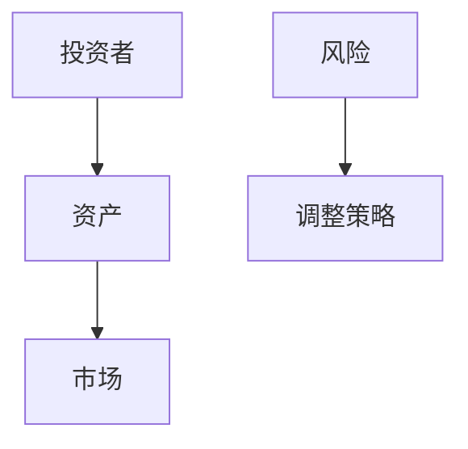
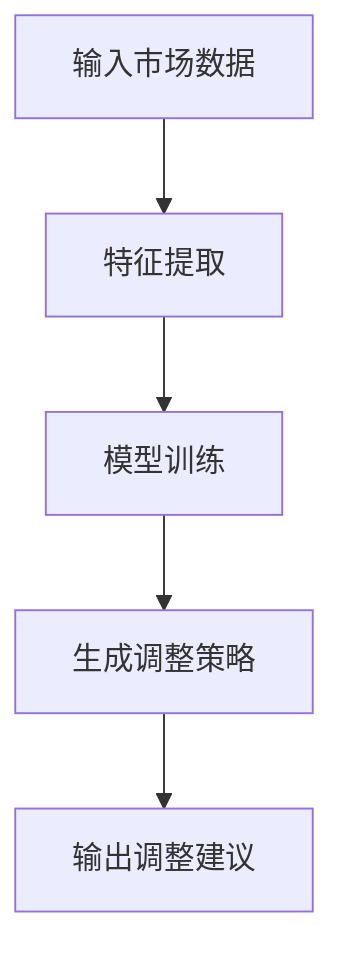
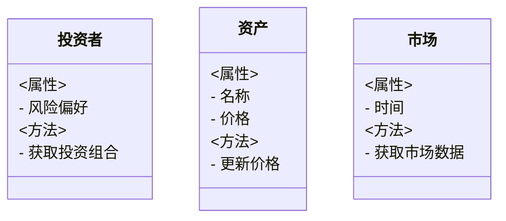
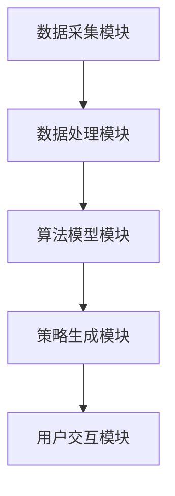
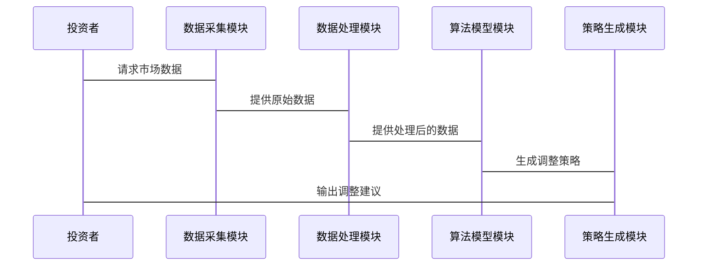

                 


# 《智能资产配置动态调整系统》

> 关键词：智能资产配置、动态调整、风险管理、机器学习、金融投资

> 摘要：本文将详细介绍智能资产配置动态调整系统的构建与应用。通过背景介绍、核心概念、算法原理、系统架构、项目实战以及最佳实践等部分，深入探讨如何利用人工智能技术实现资产配置的智能化和动态化，从而帮助投资者在复杂多变的金融市场中实现风险可控下的收益最大化。

---

## 第一部分: 智能资产配置动态调整系统的背景与核心概念

### 第1章: 智能资产配置的背景与问题背景

#### 1.1 智能资产配置的背景
##### 1.1.1 资产配置的基本概念
资产配置是指将资金分配到不同资产类别（如股票、债券、房地产等）中，以实现投资目标的过程。传统的资产配置方法依赖于历史数据和静态模型，但在市场波动加剧的情况下，其局限性日益显现。

##### 1.1.2 智能化资产配置的必要性
随着金融市场的复杂化和投资者需求的多样化，传统的静态资产配置方法已无法满足动态调整的需求。智能化资产配置通过引入人工智能技术，能够实时捕捉市场变化，动态优化投资组合，从而提高收益并降低风险。

##### 1.1.3 当前金融市场的动态变化特点
当前金融市场呈现出高度波动性、非线性关系和复杂性。传统的资产配置模型难以应对这些挑战，而智能化资产配置系统能够通过机器学习算法捕捉市场中的隐含规律，实时调整投资策略。

#### 1.2 动态调整的必要性
##### 1.2.1 资产配置的静态与动态调整区别
静态调整是指根据历史数据和固定模型进行的一次性资产配置，而动态调整则是指根据实时市场数据和变化的投资者需求，持续优化资产配置的过程。

##### 1.2.2 市场波动对资产配置的影响
市场波动会导致资产价格的频繁变化，从而影响投资组合的收益和风险。动态调整能够及时应对市场波动，避免投资组合的过度暴露于高风险资产。

##### 1.2.3 投资者风险偏好变化的应对策略
投资者的风险偏好可能随着时间推移而发生变化。动态调整能够根据投资者的实时风险偏好，灵活调整资产配置，确保投资组合的风险收益匹配。

#### 1.3 智能资产配置动态调整系统的核心要素
##### 1.3.1 系统的核心概念与组成
智能资产配置动态调整系统由数据采集模块、数据处理模块、算法模型模块、策略生成模块和用户交互模块组成。这些模块协同工作，实现对资产配置的智能化和动态化管理。

##### 1.3.2 系统的边界与外延
系统的边界包括数据输入、模型训练和策略输出。外延则涉及外部数据源的接入、第三方 API 的调用以及与其他金融系统的集成。

##### 1.3.3 系统的功能目标与实现路径
系统的目标是通过实时数据处理和智能算法，实现对投资组合的动态优化。实现路径包括数据采集、特征提取、模型训练、策略生成和策略执行。

---

### 第2章: 智能资产配置动态调整系统的核心概念与联系

#### 2.1 核心概念的原理
##### 2.1.1 资产配置的数学模型
资产配置的数学模型通常基于优化理论，如均值-方差优化（Markowitz 有效组合模型）。该模型通过最小化投资组合的风险（方差）来实现收益最大化。

##### 2.1.2 动态调整的算法原理
动态调整算法基于时间序列分析和机器学习技术，能够实时捕捉市场变化并调整资产配置。常用算法包括线性回归、ARIMA 模型和强化学习算法。

##### 2.1.3 风险管理的核心机制
风险管理的核心机制包括风险评估、风险对冲和风险监控。通过动态调整资产配置，系统能够在不同市场条件下有效控制投资组合的风险。

#### 2.2 核心概念的属性特征对比
##### 2.2.1 资产配置与投资组合管理的对比
| 特性 | 资产配置 | 投资组合管理 |
|------|----------|--------------|
| 目标 | 确定各类资产的权重 | 实现特定投资目标 |
| 方法 | 基于历史数据和模型 | 基于实时数据和动态调整 |
| 风险 | 通过分散化降低风险 | 通过风险对冲降低风险 |

##### 2.2.2 动态调整与静态调整的对比
| 特性 | 动态调整 | 静态调整 |
|------|---------|-----------|
| 调整频率 | 实时或定期 | 一次性 |
| 响应市场变化 | 是 | 否 |
| 灵活性 | 高 | 低 |

##### 2.2.3 风险控制与收益优化的对比
| 特性 | 风险控制 | 收益优化 |
|------|----------|----------|
| 目标 | 降低投资组合风险 | 提高投资组合收益 |
| 方法 | 通过调整资产权重 | 通过优化资产配置 |
| 优先级 | 首要任务 | 次要任务 |

#### 2.3 ER实体关系图


---

## 第三部分: 智能资产配置动态调整系统的算法原理

### 第3章: 基于机器学习的动态调整算法

#### 3.1 算法原理概述
##### 3.1.1 基于马科维茨有效组合模型的改进
马科维茨有效组合模型是传统资产配置的核心模型，但其静态特性无法应对市场变化。通过引入机器学习技术，可以对模型进行动态优化。

##### 3.1.2 时间序列分析与预测
时间序列分析用于预测资产价格的变化趋势，从而指导动态调整。常用算法包括ARIMA和LSTM网络。

##### 3.1.3 基于强化学习的动态优化
强化学习通过模拟市场环境，训练智能体在不同市场状态下做出最优决策。这种方法能够有效应对市场的不确定性。

#### 3.2 算法流程图


#### 3.3 算法实现代码
##### 3.3.1 特征提取
```python
import pandas as pd
import numpy as np

# 假设data是一个包含资产价格的DataFrame
features = data[['close', 'open', 'high', 'low', 'volume']]
```

##### 3.3.2 模型训练
```python
from sklearn.linear_model import LinearRegression

model = LinearRegression()
model.fit(features, target)
```

##### 3.3.3 算法数学模型
动态调整算法的数学模型可以表示为：
$$
w_{t+1} = w_t + \alpha \cdot \nabla f(w_t)
$$
其中，\( w \) 表示投资权重，\( \alpha \) 表示学习率，\( \nabla f \) 表示目标函数的梯度。

---

### 第4章: 系统分析与架构设计方案

#### 4.1 系统功能设计
##### 4.1.1 领域模型类图


##### 4.1.2 系统架构设计


##### 4.1.3 系统接口设计
系统接口包括数据接口（用于获取市场数据）和用户接口（用于交互调整建议）。

##### 4.1.4 系统交互流程


---

## 第四部分: 智能资产配置动态调整系统的项目实战

### 第5章: 项目实战

#### 5.1 环境安装
##### 5.1.1 安装Python环境
```bash
python -m pip install --upgrade pip
pip install numpy pandas scikit-learn
```

#### 5.2 系统核心实现
##### 5.2.1 数据采集模块
```python
import requests

url = "http://api.marketdata.com/stocks"
response = requests.get(url)
data = response.json()
```

##### 5.2.2 算法模型模块
```python
from sklearn.linear_model import LinearRegression

model = LinearRegression()
model.fit(X, y)
```

##### 5.2.3 策略生成模块
```python
def generate_strategy(data, model):
    predictions = model.predict(data)
    return predictions
```

#### 5.3 案例分析
##### 5.3.1 案例背景
假设我们有三个资产（股票、债券、黄金），需要根据市场波动动态调整它们的权重。

##### 5.3.2 数据分析
通过分析历史数据，我们发现股票在市场上涨时表现较好，而债券在市场下跌时表现较好。因此，我们需要动态调整它们的权重以适应市场变化。

##### 5.3.3 策略实现
使用强化学习算法训练一个智能体，使其能够在不同市场状态下做出最优决策。

---

## 第五部分: 智能资产配置动态调整系统的总结与展望

### 第6章: 总结与展望

#### 6.1 最佳实践
##### 6.1.1 系统设计
- 确保系统的实时性和准确性
- 定期更新模型和策略
- 做好风险管理

##### 6.1.2 项目小结
通过本项目的实施，我们成功构建了一个智能化的资产配置动态调整系统，能够在复杂多变的金融市场中实现风险可控下的收益最大化。

#### 6.2 注意事项
##### 6.2.1 系统稳定性
- 定期备份数据
- 建立容错机制
- 监控系统运行状态

##### 6.2.2 数据隐私
- 确保数据的安全性
- 遵守相关法律法规
- 建立数据访问权限控制

#### 6.3 拓展阅读
##### 6.3.1 推荐书籍
- 《Python机器学习实战》
- 《算法导论》

##### 6.3.2 推荐博客
- Towards Data Science
- Medium上的机器学习专栏

##### 6.3.3 推荐课程
- Coursera上的《机器学习专项课程》
- edX上的《金融工程专项课程》

---

## 作者：AI天才研究院/AI Genius Institute & 禅与计算机程序设计艺术/Zen And The Art of Computer Programming

