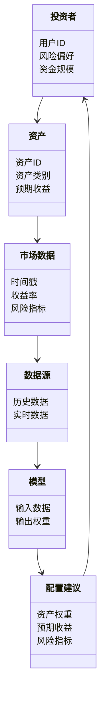
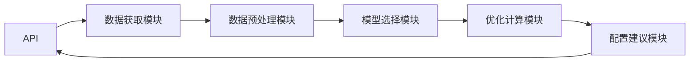
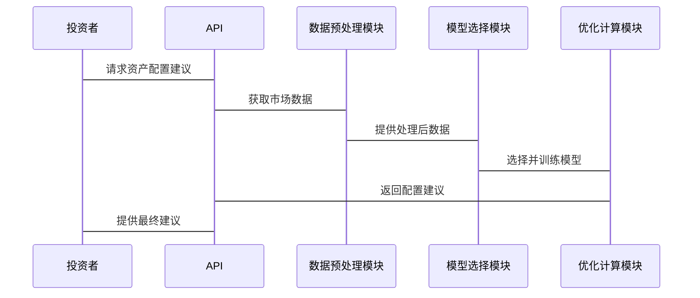

                 


# 智能资产配置建议生成器

## 关键词：智能资产配置、AI、大数据、投资组合优化、量化金融、机器学习、资产分配

## 摘要：本文探讨了智能资产配置生成器的设计与实现，结合AI和大数据技术，通过数学建模和机器学习算法，提供实时、动态、个性化的资产配置建议，帮助投资者优化投资组合。

---

## 目录

1. [问题背景与描述](#问题背景与描述)
2. [核心概念与联系](#核心概念与联系)
3. [算法原理](#算法原理)
4. [系统分析与架构设计](#系统分析与架构设计)
5. [项目实战](#项目实战)
6. [最佳实践](#最佳实践)

---

## 第1章：问题背景与描述

### 1.1 问题背景

#### 1.1.1 资产配置的传统方法与挑战

传统资产配置依赖人工经验和静态模型，难以适应市场变化，且效率低下。投资者面临市场波动、通胀风险和资产流动性等多重挑战，传统方法难以满足个性化需求。

#### 1.1.2 问题描述

智能资产配置旨在通过AI和大数据技术，动态优化投资组合，平衡风险与收益，实现个性化配置，提高投资效率。

#### 1.1.3 问题解决思路

利用数据驱动和AI技术，构建动态优化模型，实时调整资产配置，提升投资收益，降低风险。

---

## 第2章：核心概念与联系

### 2.1 核心概念原理

智能资产配置基于数学模型和机器学习，通过数据驱动优化投资组合，实现风险控制和收益最大化。

### 2.2 核心概念属性特征对比

| 属性       | 基于规则的配置 | 基于机器学习的配置 |
|------------|----------------|-------------------|
| 数据依赖   | 较低           | 高                |
| 灵活性      | 低            | 高                |
| 调整频率   | 低            | 高                |

### 2.3 实体关系图


---

## 第3章：算法原理

### 3.1 基于规则的资产配置算法

#### 3.1.1 均值-方差模型

目标：最小化投资组合的方差，同时满足收益目标。

数学模型：
$$
\min_w \quad w^T \Sigma w \\
\text{s.t.} \quad w^T \mu \geq \mu_{target}, \quad 1^T w = 1
$$

Python代码实现：
```python
import numpy as np

def mean_variance_optimization(returns, mu, Sigma):
    n = returns.shape[1]
    Sigma_inv = np.linalg.inv(Sigma)
    w_ml = Sigma_inv @ mu / (mu.T @ Sigma_inv @ mu)
    return w_ml
```

#### 3.1.2 现金流匹配

通过匹配现金流来优化资产配置，确保在特定时间点满足现金流需求。

### 3.2 基于机器学习的资产配置算法

#### 3.2.1 算法实现

使用历史数据训练机器学习模型，预测资产收益，动态调整配置。

数学模型：
$$
\min_w \quad -w^T \mu + \lambda w^T \Sigma w
$$

Python代码：
```python
from sklearn.linear_model import LinearRegression

model = LinearRegression()
model.fit(X, y)
predicted_returns = model.predict(X)
```

---

## 第4章：系统分析与架构设计

### 4.1 项目场景介绍

实时获取市场数据，动态优化资产配置，生成个性化建议。

### 4.2 系统功能设计

- 数据获取与预处理
- 模型选择与训练
- 优化计算
- 建议生成

### 4.3 领域模型类图



### 4.4 系统架构图



### 4.5 系统接口设计

- 数据接口：REST API获取市场数据和用户信息
- 交互接口：API返回配置建议和优化结果

### 4.6 系统交互序列图



---

## 第5章：项目实战

### 5.1 环境安装

安装Python和必要的库：
```bash
pip install numpy pandas sklearn matplotlib
```

### 5.2 核心代码实现

```python
import numpy as np
import pandas as pd
from sklearn.linear_model import LinearRegression

# 数据获取与预处理
def get_market_data():
    # 示例代码，实际应从API获取
    return pd.DataFrame({'return': [0.01, 0.02, 0.015, 0.03]})

# 模型训练
def train_model(X, y):
    model = LinearRegression()
    model.fit(X, y)
    return model

# 优化计算
def optimize_portfolio(predicted_returns):
    n = predicted_returns.shape[1]
    mu = predicted_returns.mean(axis=0)
    Sigma = predicted_returns.cov()
    inv_Sigma = np.linalg.inv(Sigma)
    w_ml = inv_Sigma @ mu / (mu.T @ inv_Sigma @ mu)
    return w_ml

# 主函数
def main():
    data = get_market_data()
    X = data.iloc[:, :-1]
    y = data.iloc[:, -1]
    model = train_model(X, y)
    predicted_returns = model.predict(X)
    weights = optimize_portfolio(predicted_returns)
    print("配置建议权重：", weights)

if __name__ == '__main__':
    main()
```

### 5.3 代码应用解读

分析代码实现，解释各部分的作用，以及如何动态调整资产配置。

### 5.4 实际案例分析

通过具体案例，分析优化过程和结果，展示实际应用的效果。

### 5.5 项目小结

总结项目实现的关键点和经验教训，强调系统的优势和潜在改进方向。

---

## 第6章：最佳实践

### 6.1 小结

智能资产配置生成器通过结合AI和大数据，提供了高效、动态的解决方案，帮助投资者优化投资组合。

### 6.2 注意事项

- 数据质量至关重要，需确保数据的准确性和及时性。
- 模型需定期更新，以适应市场变化。
- 风险管理是关键，需设定止损点和监控机制。

### 6.3 拓展阅读

推荐相关书籍和论文，进一步深入学习智能资产配置的技术和应用。

---

## 作者

作者：AI天才研究院/AI Genius Institute & 禅与计算机程序设计艺术 /Zen And The Art of Computer Programming

