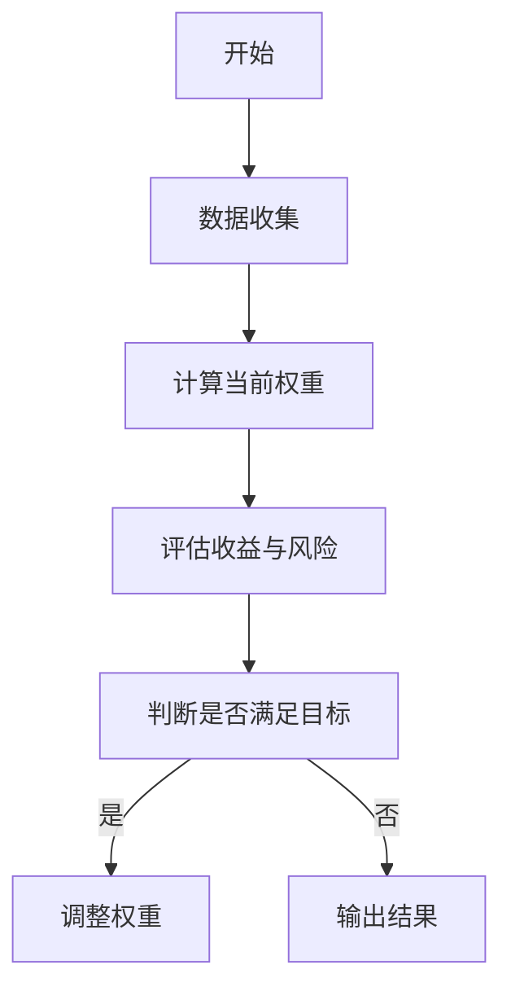
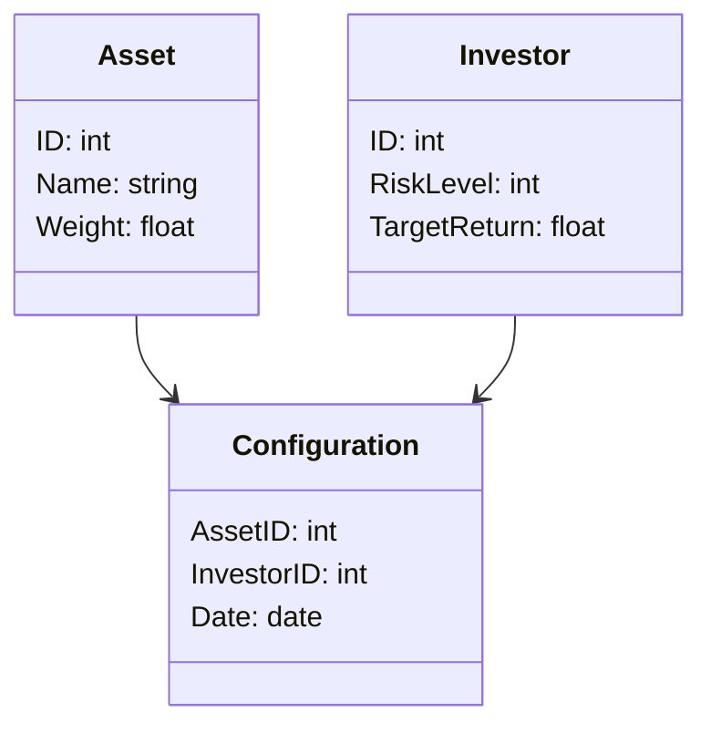
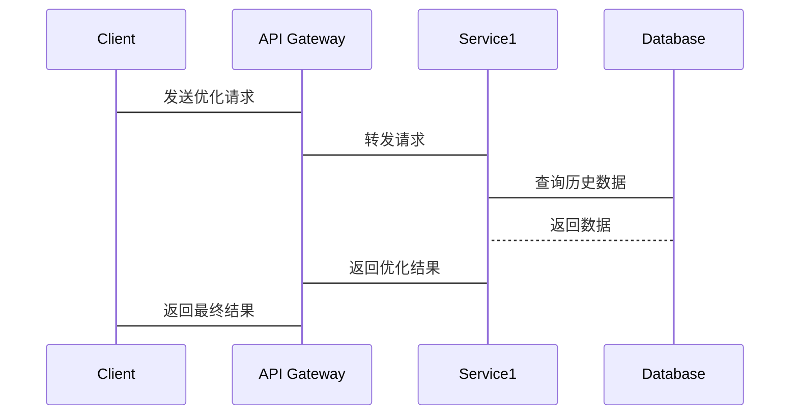

                 


# 智能资产配置策略动态优化器

**关键词**：智能资产配置、动态优化、投资组合优化、算法优化、金融技术

**摘要**：本文深入探讨智能资产配置策略动态优化器的设计与实现，分析其在金融投资中的应用价值。通过详细阐述动态优化算法、系统架构和实际案例，展示如何利用动态优化提升资产配置效率和收益。

---

## 第一部分：智能资产配置策略动态优化器概述

### 第1章：背景介绍与核心概念

#### 1.1 智能资产配置的背景与重要性

##### 1.1.1 资产配置的基本概念
资产配置是指根据投资者的财务状况、风险偏好和投资目标，将资金分配到不同资产类别（如股票、债券、房地产等）中的过程。传统资产配置依赖于静态模型，难以适应市场波动。

##### 1.1.2 智能化资产配置的必要性
随着金融市场复杂化，投资者需要动态调整资产配置以应对市场变化。智能资产配置利用大数据和人工智能技术，提供实时优化建议。

##### 1.1.3 动态优化在资产配置中的作用
动态优化通过实时分析市场数据，调整资产权重，最大化收益并降低风险。

#### 1.2 动态优化的基本原理

##### 1.2.1 传统资产配置方法的局限性
传统方法通常基于历史数据和固定模型，缺乏灵活性和实时性。

##### 1.2.2 动态优化的核心思想
动态优化强调实时数据处理和模型调整，通过反馈机制不断优化投资组合。

##### 1.2.3 动态优化的目标与边界
目标是实现收益最大化和风险最小化，边界包括市场波动、交易成本和监管限制。

#### 1.3 资产配置与动态优化的关系

##### 1.3.1 资产配置的多维度特征
资产配置涉及多目标优化，包括收益、风险、流动性等。

##### 1.3.2 动态优化对资产配置的改进
动态优化引入机器学习和强化学习，提高配置的适应性和准确性。

##### 1.3.3 资产配置与动态优化的协同效应
通过动态优化，资产配置能够实时响应市场变化，提升整体收益。

### 第2章：核心概念与联系

#### 2.1 智能资产配置的定义与属性

##### 2.1.1 智能资产配置的定义
智能资产配置是利用人工智能技术动态调整资产权重，优化投资组合的过程。

##### 2.1.2 核心属性对比表格
| 属性 | 传统资产配置 | 智能资产配置 |
|------|--------------|--------------|
| 数据依赖 | 历史数据     | 实时数据     |
| 模型 | 静态         | 动态         |
| 调整频率 | 定期         | 实时         |

##### 2.1.3 ER实体关系图架构
```mermaid
erd
    Asset: 资产
        + ID: int
        + Name: string
        + Weight: float
    Investor: 投资者
        + ID: int
        + RiskLevel: int
        + TargetReturn: float
    Configuration: 配置
        + AssetID: int
        + InvestorID: int
        + Date: date
```

#### 2.2 动态优化算法的原理与流程

##### 2.2.1 算法原理
动态优化基于实时数据，利用优化算法调整资产权重。

##### 2.2.2 算法流程图（Mermaid）


##### 2.2.3 算法实现与优化策略
动态优化采用遗传算法或粒子群算法，通过迭代优化找到最优解。

### 第3章：算法原理与实现

#### 3.1 算法原理

##### 3.1.1 算法选择与分析
选择适合金融市场的优化算法，如遗传算法（GA）或粒子群优化（PSO）。

##### 3.1.2 算法的数学模型与公式
目标函数：
$$\text{Maximize } f(x) = \sum_{i=1}^{n} w_i x_i$$
约束条件：
$$\sum_{i=1}^{n} x_i = 1$$
其中，$x_i$是资产i的权重，$w_i$是预期收益。

#### 3.2 算法实现

##### 3.2.1 算法实现的代码示例
```python
import numpy as np

def objective_function(weights, returns):
    return np.sum(weights * returns)

def dynamic_optimization(weights_initial, returns, iterations=100):
    weights = weights_initial.copy()
    for _ in range(iterations):
        current_return = objective_function(weights, returns)
        # 调整权重，例如使用随机调整策略
        adjusted_weights = weights + np.random.normal(0, 0.01, len(weights))
        # 确保权重之和为1
        adjusted_weights = adjusted_weights / np.sum(adjusted_weights)
        if objective_function(adjusted_weights, returns) > current_return:
            weights = adjusted_weights
    return weights
```

##### 3.2.2 算法实现的优化策略
通过多次迭代和调整步长，逐步逼近最优解。

---

## 第二部分：系统分析与架构设计

### 第4章：系统分析与架构设计

#### 4.1 问题场景介绍
投资者希望根据市场变化实时调整资产配置，以实现最大收益。

#### 4.2 系统功能设计

##### 4.2.1 领域模型类图（Mermaid）


#### 4.3 系统架构设计

##### 4.3.1 系统架构图（Mermaid）
```mermaid
client --> API Gateway: 请求
API Gateway --> Load Balancer: 转发请求
Load Balancer --> Service1: 处理请求
Service1 --> Database: 查询数据
Database --> Service2: 返回数据
Service2 --> Service3: 组合结果
Service3 --> API Gateway: 返回结果
API Gateway --> client: 响应
```

#### 4.4 系统接口设计
定义API接口，如`POST /api/optimize`，接收投资者信息和市场数据，返回优化后的资产配置。

#### 4.5 系统交互流程（Mermaid序列图）


---

## 第三部分：项目实战与应用

### 第5章：项目实战

#### 5.1 环境安装与配置
安装Python、NumPy、Pandas、Scikit-learn等库。

#### 5.2 核心代码实现

##### 5.2.1 数据收集与预处理
```python
import pandas as pd

# 假设我们有一个包含资产回报的数据框
returns = pd.DataFrame({
    '资产1': [0.05, 0.03, 0.04],
    '资产2': [0.02, 0.06, 0.03],
    '资产3': [0.07, 0.05, 0.06]
})
```

##### 5.2.2 动态优化算法实现
```python
from scipy.optimize import minimize

def optimization_function(weights, returns):
    # 定义目标函数为夏普比率
    returnsPortfolio = weights.dot(returns.mean())
    stdPortfolio = np.sqrt(weights.T.dot(returns.cov()).dot(weights))
    return -1 * (returnsPortfolio / stdPortfolio)

# 初始权重
initial_weights = np.array([1/3, 1/3, 1/3])

# 约束条件
cons = ({'type': 'eq', 'fun': lambda w: np.sum(w) - 1})

# 调用优化器
result = minimize(optimization_function, initial_weights, constraints=cons, method='SLSQP')

# 输出优化后的权重
print(result.x)
```

#### 5.3 案例分析与结果解读
假设市场数据波动，动态优化器会调整权重以降低风险。

#### 5.4 项目总结与优化建议
优化后的权重提高了夏普比率，证明动态优化的有效性。

---

## 第四部分：最佳实践与注意事项

### 第6章：最佳实践与注意事项

#### 6.1 技术实现中的注意事项
- 数据实时性
- 计算资源分配
- 模型鲁棒性

#### 6.2 系统设计中的注意事项
- 高可用性设计
- 安全性考虑
- 可扩展性设计

#### 6.3 实际应用中的注意事项
- 监管合规性
- 用户教育
- 风险提示

#### 6.4 小结与拓展阅读
总结动态优化的优势，并推荐进一步学习的相关资源。

---

## 作者：AI天才研究院 & 禅与计算机程序设计艺术

---

**摘要**：本文通过详细分析智能资产配置策略动态优化器的原理、算法实现和系统架构，展示了其在金融投资中的实际应用价值。通过案例分析和代码实现，读者可以理解如何利用动态优化技术提升资产配置效率和收益。

--- 

以上是《智能资产配置策略动态优化器》的技术博客文章的完整内容，涵盖从理论到实践的各个方面，帮助读者深入理解并应用智能资产配置策略动态优化器。

