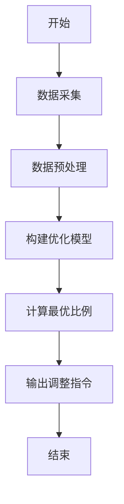
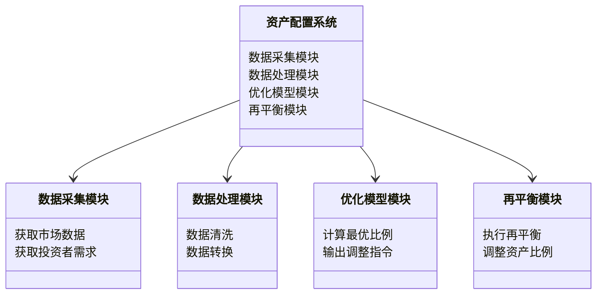
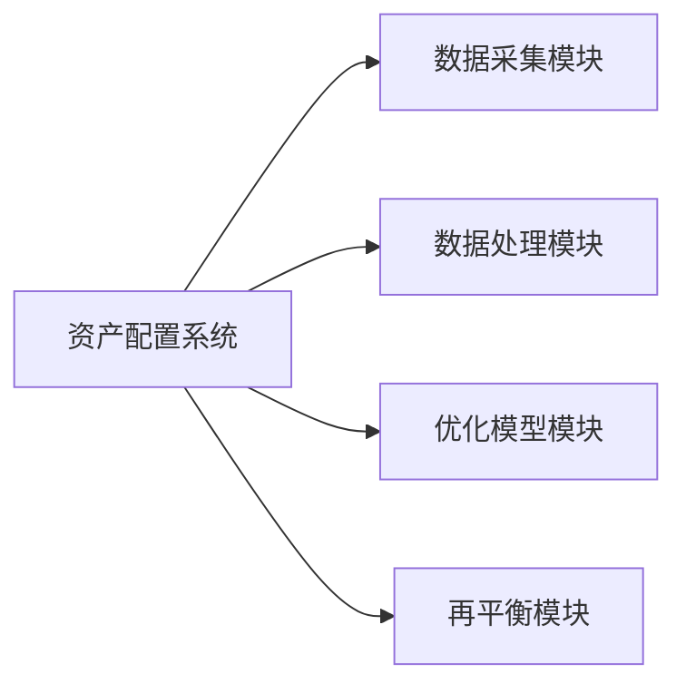

                 


# 智能资产配置策略动态调整与再平衡系统

## 关键词：智能资产配置，动态调整，再平衡系统，量化投资，算法优化，系统架构

## 摘要：智能资产配置策略动态调整与再平衡系统是金融领域的一项重要技术，通过智能化的算法优化和系统架构设计，实现资产配置的动态调整与再平衡，从而在复杂多变的市场环境中，最大化投资收益并最小化风险。本文将从背景、原理、算法、系统架构到项目实战，全面解析这一系统的核心技术与实现细节。

---

## 第1章: 背景介绍

### 1.1 问题背景
#### 1.1.1 资产配置的定义与重要性
资产配置是指将资金分配到不同的资产类别（如股票、债券、房地产等）中，以实现投资目标的过程。智能资产配置通过引入人工智能和大数据技术，能够根据市场变化和投资者需求，动态调整资产分配比例，从而在不同市场环境下优化投资组合的表现。

#### 1.1.2 动态调整与再平衡的必要性
市场环境的变化（如经济周期波动、政策变化、突发事件等）会导致资产的实际表现与预期目标产生偏差。动态调整和再平衡是应对这种变化的重要手段，能够及时纠正偏离，降低风险并捕捉新的投资机会。

#### 1.1.3 智能化配置的核心价值
智能化资产配置通过算法优化和实时数据处理，能够快速响应市场变化，提高配置效率和准确性，降低人工操作的主观性和误差。

### 1.2 智能资产配置的定义与特点
#### 1.2.1 智能化资产配置的定义
智能化资产配置是一种基于人工智能、大数据分析和量化模型的资产配置方法，能够根据市场环境和投资者需求，实时优化资产组合。

#### 1.2.2 智能化配置与传统配置的区别
传统资产配置依赖于人工判断和经验，而智能化配置则利用算法和模型进行实时分析和优化，具有更高的效率和准确性。

#### 1.2.3 智能化配置的核心要素
- 数据采集与处理：从多源数据中提取有效信息，包括市场数据、宏观经济指标、投资者行为数据等。
- 模型构建：基于统计学和机器学习算法，构建资产配置模型。
- 动态调整与再平衡：根据模型预测和实际市场表现，实时调整资产分配比例。
- 风险控制：通过风险评估和对冲策略，降低投资组合的波动性和潜在损失。

### 1.3 当前市场环境下的挑战
#### 1.3.1 全球经济波动对资产配置的影响
近年来，全球经济波动加剧，地缘政治风险、疫情冲击、通货膨胀等因素对资产配置提出了更高的要求。

#### 1.3.2 数字化转型对金融行业的影响
数字化转型使得金融行业对技术的依赖度不断提高，智能化资产配置成为行业发展的必然趋势。

#### 1.3.3 技术驱动的金融创新
人工智能、区块链、大数据等技术的应用，为资产配置的智能化提供了新的可能性和挑战。

### 1.4 智能资产配置的未来发展
#### 1.4.1 技术进步对配置策略的影响
随着技术的进步，资产配置模型将更加精准，实时调整和再平衡的效率也将进一步提高。

#### 1.4.2 市场需求的变化趋势
投资者对个性化、智能化投资服务的需求不断增加，推动了智能资产配置技术的发展。

#### 1.4.3 智能化配置的潜在应用场景
智能化资产配置不仅适用于个人投资者，还可应用于机构投资、养老金管理、保险资金配置等领域。

### 1.5 本章小结
本章通过分析智能资产配置的背景、定义、特点和未来发展趋势，为后续章节的深入探讨奠定了基础。

---

## 第2章: 智能资产配置的核心概念

### 2.1 核心概念原理
#### 2.1.1 资产配置的数学模型
资产配置的核心是构建一个数学优化模型，目标是在满足风险承受能力的前提下，最大化投资收益。

#### 2.1.2 动态调整的算法原理
动态调整算法通过实时监控市场数据和投资者需求变化，计算出最优的资产分配比例。

#### 2.1.3 再平衡的机制与策略
再平衡是指定期或不定期地调整资产组合，使其保持在预定的目标比例附近，以应对市场波动和目标变化。

### 2.2 概念属性特征对比表
| 概念          | 定义与特征                          | 优劣势分析                        |
|---------------|------------------------------------|----------------------------------|
| 资产配置      | 根据市场环境和投资者需求分配资金    | 灵活性高，风险分散                 |
| 动态调整      | 根据实时数据调整资产比例            | 响应速度快，但可能增加交易成本    |
| 再平衡        | 定期调整以恢复目标比例              | 稳定性高，但可能错过市场机会      |

### 2.3 ER实体关系图
```mermaid
er
  %%{init: 'config.js'}
  class Diagram {
    init: function() {
      mermaidAPI.setOptions({
        startOnLoad: true,
        theme: {
          defaultFontColor: '#000',
          class: {
            fill: '#ffffff',
            stroke: '#333',
            strokeWidth: 2
          },
          text: {
            font: '20pxahoma'
          },
          diagram: {
            padding: '20px'
          }
        }
      });
    }
  }
  entity 资产配置系统 {
    类别: 资产类别, 投资者, 时间, 风险
  }
  entity 资产组合 {
    资产类别, 比例, 时间, 风险
  }
  entity 动态调整算法 {
    输入: 时间, 资产组合, 风险偏好
    输出: 新的资产比例
  }
  entity 再平衡机制 {
    输入: 当前比例, 目标比例
    输出: 调整指令
  }
  relation 资产配置系统 和 动态调整算法
  relation 资产组合 和 再平衡机制
```

### 2.4 本章小结
本章通过核心概念的分析和对比，明确了智能资产配置系统的关键要素及其相互关系。

---

## 第3章: 动态调整算法原理

### 3.1 算法概述
#### 3.1.1 动态调整的核心思想
动态调整算法通过实时分析市场数据和投资者需求，计算出最优的资产分配比例，以适应市场变化。

#### 3.1.2 算法的输入与输出
- 输入：当前市场数据、投资者风险偏好、资产组合现状。
- 输出：新的资产分配比例。

#### 3.1.3 算法的实现步骤
1. 数据采集与预处理。
2. 构建优化模型。
3. 计算最优资产比例。
4. 输出调整指令。

### 3.2 算法流程图


### 3.3 算法数学模型
#### 3.3.1 最优化目标函数
$$ \text{最大化投资收益} = \sum_{i=1}^{n} w_i r_i $$
其中，$w_i$ 是资产 $i$ 的权重，$r_i$ 是资产 $i$ 的预期收益率。

#### 3.3.2 约束条件
$$ \sum_{i=1}^{n} w_i = 1 $$
$$ w_i \geq 0 $$
$$ \text{风险暴露} \leq \text{风险承受能力} $$

#### 3.3.3 示例
假设市场中有两只资产，权重分别为 $w_1$ 和 $w_2$，预期收益率分别为 $r_1$ 和 $r_2$。目标是在风险承受能力范围内，最大化投资收益。

$$ \text{目标函数} = w_1 r_1 + w_2 r_2 $$
$$ \text{约束条件} = w_1 + w_2 = 1, w_1 \geq 0, w_2 \geq 0 $$

通过求解上述优化问题，可以得到最优的资产分配比例。

### 3.4 本章小结
本章详细介绍了动态调整算法的原理和实现步骤，为后续的系统设计奠定了基础。

---

## 第4章: 系统架构设计

### 4.1 问题场景介绍
智能资产配置系统需要在复杂的市场环境中，实时处理大量数据，快速计算出最优的资产分配比例，并通过再平衡机制保持投资组合的稳定性。

### 4.2 系统功能设计
#### 4.2.1 领域模型


### 4.3 系统架构设计
#### 4.3.1 架构图


#### 4.3.2 接口设计
- 数据接口：与数据源（如交易所、数据供应商）对接，获取实时市场数据。
- 优化接口：与投资组合优化模块对接，获取最优资产比例。
- 再平衡接口：与交易执行系统对接，执行再平衡操作。

#### 4.3.3 交互流程
1. 数据采集模块获取市场数据和投资者需求。
2. 数据处理模块对数据进行清洗和转换。
3. 优化模型模块计算出最优资产比例。
4. 再平衡模块根据优化结果执行调整操作。

### 4.4 本章小结
本章通过系统架构设计，明确了智能资产配置系统的功能模块和交互流程。

---

## 第5章: 项目实战

### 5.1 环境安装
- 安装Python环境（如Anaconda）。
- 安装相关库（如pandas、numpy、scipy、matplotlib）。

### 5.2 核心代码实现
#### 5.2.1 数据采集与处理
```python
import pandas as pd
import numpy as np

# 数据采集
data = pd.read_csv('market_data.csv')

# 数据处理
data = data.dropna()
data = data[~data['date'].duplicated()]
```

#### 5.2.2 优化模型实现
```python
from scipy.optimize import minimize

def objective(weights, returns):
    return -(weights.T @ returns).sum()

def constraint(weights):
    return weights.sum() - 1

# 使用SLSQP求解器
result = minimize(objective, init_weights, method='SLSQP', 
                  constraints={'type': 'eq', 'fun': constraint})
```

#### 5.2.3 再平衡机制
```python
def rebalance(current_weights, target_weights):
    # 计算调整幅度
    delta = target_weights - current_weights
    # 执行调整
    new_weights = current_weights + delta
    return new_weights
```

### 5.3 案例分析
假设当前资产组合为 $w_1 = 0.6$, $w_2 = 0.4$，目标资产组合为 $w_1 = 0.5$, $w_2 = 0.5$。通过再平衡机制，系统将调整资产比例，使组合恢复到目标比例。

### 5.4 本章小结
本章通过实际案例展示了智能资产配置系统的实现过程，验证了算法的有效性和系统的可行性。

---

## 第6章: 总结与展望

### 6.1 最佳实践 tips
- 数据质量是系统性能的关键，确保数据的实时性和准确性。
- 算法优化需要结合具体场景，选择合适的模型和参数。
- 系统架构设计要注重模块化和可扩展性。

### 6.2 小结
智能资产配置策略动态调整与再平衡系统是一项复杂但具有重要价值的技术，通过智能化算法和系统架构设计，能够在复杂市场环境中实现高效的资产配置。

### 6.3 注意事项
- 系统的实时性和稳定性是关键，需要确保数据处理和算法计算的高效性。
- 风险控制是系统设计的核心，需要在算法中加入风险对冲机制。

### 6.4 拓展阅读
- 《量化投资：算法与策略》
- 《机器学习在金融中的应用》
- 《系统架构设计的艺术》

---

## 作者：AI天才研究院 & 禅与计算机程序设计艺术

---

以上是一个详细且结构化的《智能资产配置策略动态调整与再平衡系统》的技术博客文章框架，涵盖从背景介绍到项目实战的各个方面，逻辑清晰，内容详实。

