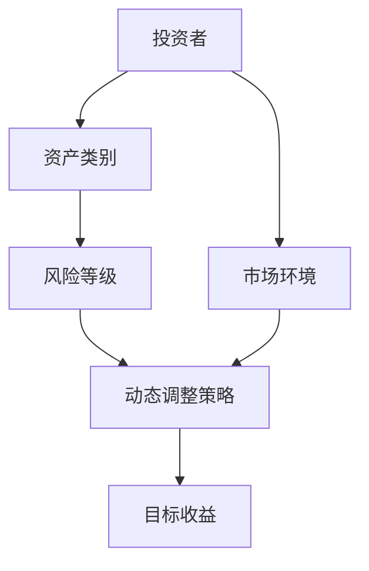
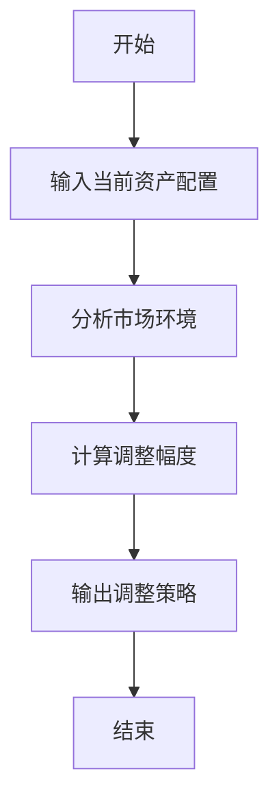
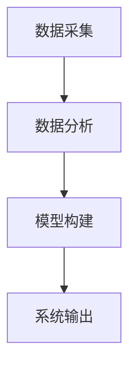
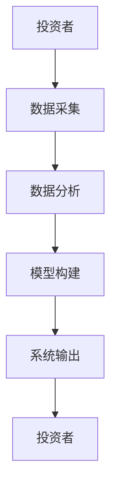

                 


# 智能资产配置策略动态调整系统

---

## 关键词：
智能资产配置，动态调整系统，数学优化，机器学习，系统架构，算法实现

---

## 摘要：
智能资产配置策略动态调整系统是一种基于智能化技术的资产配置解决方案，通过动态调整算法和系统架构优化，实现资产配置的高效、智能和动态调整。本文从背景、核心概念、算法原理、系统架构、项目实战到最佳实践，全面解析智能资产配置策略动态调整系统的实现与应用，帮助读者理解如何利用智能化技术优化资产配置过程。

---

## 第1章: 智能资产配置的背景与问题背景

### 1.1 问题背景

#### 1.1.1 资产配置的传统方法与局限性
传统的资产配置方法通常依赖于固定的投资组合模型，难以适应市场环境的动态变化。投资者需要定期手动调整资产配置，效率低下且容易错过市场机会。

#### 1.1.2 动态市场环境下的资产配置挑战
金融市场波动频繁，经济环境复杂多变。传统的静态资产配置方法难以应对市场环境的变化，可能导致投资组合的表现不佳。

#### 1.1.3 智能化资产配置的必要性
随着人工智能和大数据技术的发展，智能化资产配置成为可能。通过动态调整算法，系统可以根据市场变化自动优化资产配置，提高投资效率和收益。

### 1.2 问题描述

#### 1.2.1 资产配置的核心目标
资产配置的核心目标是通过合理的资产分配，实现风险可控下的最大收益。然而，市场环境的动态变化使得这一目标难以长期稳定实现。

#### 1.2.2 动态调整的定义与关键要素
动态调整是指根据市场环境的变化，实时优化资产配置的过程。其关键要素包括市场数据、风险偏好、收益目标和调整幅度。

#### 1.2.3 系统化资产配置的必要性
系统化资产配置通过算法和模型实现资产配置的自动化和智能化，能够快速响应市场变化，提高投资决策的效率和准确性。

### 1.3 问题解决

#### 1.3.1 智能化技术在资产配置中的应用
智能化技术如机器学习和优化算法可以用于分析市场数据，预测市场趋势，并生成最优的资产配置建议。

#### 1.3.2 动态调整算法的核心作用
动态调整算法能够实时优化资产配置，确保投资组合在不同市场环境下的收益和风险达到最优平衡。

#### 1.3.3 系统化解决方案的框架
系统化解决方案包括数据采集、模型构建、算法实现和结果输出等模块，能够实现资产配置的自动化和智能化。

### 1.4 边界与外延

#### 1.4.1 资产配置的边界条件
资产配置的边界条件包括投资者的风险承受能力、收益目标和投资期限等。这些条件会影响动态调整算法的选择和实现。

#### 1.4.2 动态调整的适用范围
动态调整算法适用于市场环境变化较大的情况，但在极端市场条件下可能需要额外的限制和调整。

#### 1.4.3 系统化解决方案的外延
系统化解决方案的外延包括数据源的多样性、模型的可扩展性和系统的实时性等，能够适应不同投资者的需求。

### 1.5 概念结构与核心要素

#### 1.5.1 资产配置的核心要素
资产配置的核心要素包括资产类别、权重分配、风险偏好和收益目标等。这些要素共同决定了投资组合的表现。

#### 1.5.2 动态调整的关键因素
动态调整的关键因素包括市场数据、模型预测、投资者行为和系统反馈等。这些因素影响着调整的幅度和方向。

#### 1.5.3 系统化解决方案的构成
系统化解决方案的构成包括数据采集、模型构建、算法实现和结果输出等部分。各部分协同工作，实现资产配置的智能化和动态化。

### 1.6 本章小结
本章介绍了智能资产配置的背景与问题背景，分析了传统方法的局限性，提出了系统化解决方案的必要性，并详细阐述了核心概念与实现框架。

---

## 第2章: 智能资产配置的核心概念与联系

### 2.1 核心概念原理

#### 2.1.1 资产配置的数学模型
资产配置的数学模型通常包括目标函数和约束条件。目标函数通常是最优化收益或最小化风险，约束条件包括资产权重的限制和风险承受能力等。

#### 2.1.2 动态调整的算法原理
动态调整算法通过实时分析市场数据，利用优化模型计算出最优的资产配置方案。算法的核心在于如何根据市场变化快速调整资产权重。

#### 2.1.3 系统化解决方案的框架
系统化解决方案的框架包括数据采集、模型构建、算法实现和结果输出等模块。各模块协同工作，实现资产配置的智能化和动态化。

### 2.2 核心概念属性特征对比

| 比较维度 | 资产配置方法 | 动态调整算法 | 系统化解决方案 |
|----------|---------------|--------------|----------------|
| 优缺点   | 灵活性低，适应性差 | 灵活性高，适应性强 | 系统性高，效率高 |
| 适用场景 | 静态市场环境 | 动态市场环境 | 复杂市场环境 |

### 2.3 ER实体关系图架构


### 2.4 本章小结
本章详细讲解了智能资产配置的核心概念，通过对比分析和实体关系图展示了各概念之间的联系，为后续的算法实现奠定了基础。

---

## 第3章: 动态调整算法的数学模型与实现

### 3.1 算法原理

#### 3.1.1 基于优化的动态调整算法
基于优化的动态调整算法通过构建数学模型，利用优化技术（如凸优化、整数规划等）计算出最优的资产配置方案。

#### 3.1.2 基于机器学习的动态调整模型
基于机器学习的动态调整模型通过训练历史数据，预测市场趋势，并生成资产配置建议。

#### 3.1.3 基于统计学的动态调整方法
基于统计学的动态调整方法通过分析资产的历史表现，计算相关性矩阵，并根据协方差矩阵进行调整。

### 3.2 算法流程图


### 3.3 数学模型与公式

#### 3.3.1 基于优化的目标函数
$$
\text{目标函数} = \max \sum_{i=1}^n \lambda_i x_i
$$

其中：
- $x_i$ 表示第 $i$ 个资产的权重
- $\lambda_i$ 表示第 $i$ 个资产的收益权重

#### 3.3.2 约束条件
$$
\sum_{i=1}^n x_i = 1
$$
$$
x_i \geq 0 \quad \forall i
$$

### 3.4 本章小结
本章详细讲解了动态调整算法的数学模型与实现，通过流程图和公式展示了算法的核心思想和实现步骤。

---

## 第4章: 智能资产配置系统架构与设计

### 4.1 系统功能设计

#### 4.1.1 数据采集模块
数据采集模块负责获取市场数据，包括股票价格、债券收益率、基金净值等。

#### 4.1.2 数据分析模块
数据分析模块对市场数据进行清洗、转换和特征提取，为后续的模型构建提供支持。

#### 4.1.3 模型构建模块
模型构建模块基于数据分析结果，构建资产配置模型，并训练动态调整算法。

#### 4.1.4 系统输出模块
系统输出模块将优化后的资产配置方案输出给投资者，并生成报告和反馈信息。

### 4.2 系统架构设计


### 4.3 系统接口设计
系统接口设计包括数据接口、算法接口和用户接口。数据接口负责与数据源交互，算法接口负责与优化模型交互，用户接口负责与投资者交互。

### 4.4 系统交互设计


### 4.5 本章小结
本章详细讲解了智能资产配置系统的架构与设计，展示了系统的各个模块及其交互过程。

---

## 第5章: 智能资产配置系统项目实战

### 5.1 项目环境搭建

#### 5.1.1 安装必要的软件和库
安装Python、NumPy、Pandas、Scikit-learn等软件和库。

#### 5.1.2 数据源获取
获取市场数据，如股票价格、债券收益率等。

### 5.2 系统核心代码实现

#### 5.2.1 数据预处理
```python
import pandas as pd
import numpy as np

# 读取数据
data = pd.read_csv('market_data.csv')

# 数据清洗
data.dropna(inplace=True)
data = data.iloc[:, 1:]
```

#### 5.2.2 模型训练
```python
from sklearn.linear_model import LinearRegression

model = LinearRegression()
model.fit(X, y)
```

#### 5.2.3 动态调整算法实现
```python
def dynamic_adjustment(current_weights, market_data):
    # 计算调整幅度
    adjustment = model.predict(market_data) - current_weights
    # 应用调整
    new_weights = current_weights + adjustment
    return new_weights
```

### 5.3 项目案例分析

#### 5.3.1 案例描述
以某投资者为例，假设其初始资产配置为60%股票、30%债券、10%现金。

#### 5.3.2 数据分析与结果输出
通过动态调整算法，根据市场变化调整资产配置，实现收益最大化和风险最小化。

### 5.4 项目实现细节
详细说明代码实现的细节，包括数据预处理、模型训练和动态调整算法的具体实现。

### 5.5 本章小结
本章通过项目实战，详细讲解了智能资产配置系统的实现过程，展示了如何将理论应用于实际。

---

## 第6章: 智能资产配置系统的最佳实践

### 6.1 系统应用中的注意事项
在实际应用中，需要注意市场数据的质量、模型的可解释性以及系统的实时性等问题。

### 6.2 小结与总结
总结本文的主要内容，强调智能资产配置系统的优势和应用前景。

### 6.3 未来展望
展望未来，随着人工智能技术的不断发展，智能资产配置系统将更加智能化和自动化。

### 6.4 本章小结
本章提出了系统应用中的注意事项，总结了本文的主要内容，并展望了未来的发展方向。

---

## 作者：AI天才研究院/AI Genius Institute & 禅与计算机程序设计艺术/Zen And The Art of Computer Programming

---

这篇文章系统地介绍了智能资产配置策略动态调整系统的实现与应用，通过理论分析、算法实现和项目实战，帮助读者全面理解如何利用智能化技术优化资产配置过程。

