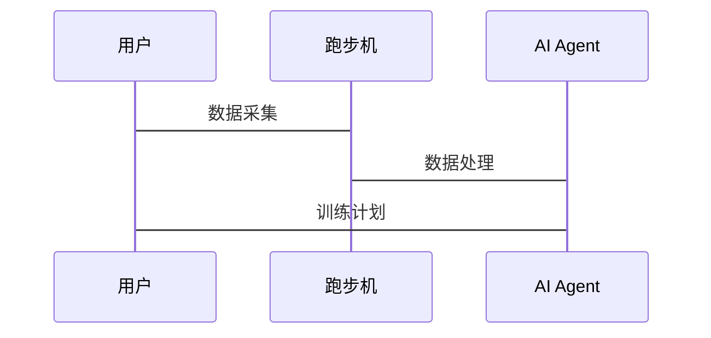

                 


# 智能跑步机：AI Agent的个性化训练计划生成器

---

## 关键词

- 智能跑步机
- AI Agent
- 个性化训练计划
- 机器学习
- 系统架构设计
- 数学模型

---

## 摘要

智能跑步机通过集成AI Agent技术，能够根据用户的生理数据、运动偏好和健康目标，自动生成个性化的训练计划。本文从背景、原理、算法、系统架构、项目实现到最佳实践，全面解析智能跑步机的AI Agent实现方案。通过详细的技术分析和案例解读，本文揭示了如何利用机器学习和数据挖掘技术，为用户提供高效、科学的运动指导。

---

# 第一部分: 背景与概述

## 第1章: 问题背景与问题描述

### 1.1 传统跑步机的局限性

传统跑步机的功能单一，仅提供固定的速度和坡度设置，无法满足用户的个性化需求。用户在使用过程中缺乏实时反馈和科学指导，难以达到最佳的健身效果。

### 1.2 问题背景的扩展

现代健身行业正朝着智能化方向发展，用户对个性化、科学化的运动指导需求日益增长。AI技术的快速发展为智能跑步机的实现提供了技术支撑。

### 1.3 问题解决的思路

通过引入AI Agent技术，智能跑步机能够实时采集用户的运动数据，结合历史行为和健康目标，生成个性化的训练计划。

### 1.4 边界与外延

智能跑步机的功能边界包括数据采集、训练计划生成和实时反馈；AI Agent的应用范围涵盖健身、医疗和教育领域。

---

# 第二部分: AI Agent的核心原理

## 第2章: AI Agent的定义与工作原理

### 2.1 AI Agent的基本概念

AI Agent是一种能够感知环境、执行任务的智能体，通过数据处理和模型训练实现个性化推荐。

### 2.2 AI Agent的工作流程

- 数据采集与处理
- 模型训练与优化
- 个性化推荐的实现

---

# 第三部分: 个性化训练计划生成算法

## 第3章: 算法原理与实现

### 3.1 算法核心思想

个性化训练计划生成算法基于协同过滤推荐模型，结合用户特征和运动数据，实现精准推荐。

### 3.2 算法实现步骤

1. 数据预处理
2. 用户特征提取
3. 训练推荐模型
4. 生成个性化计划

---

# 第四部分: 系统分析与架构设计

## 第4章: 问题场景与系统设计

### 4.1 系统架构设计

- 数据层：用户数据存储
- 业务逻辑层：算法实现
- 接口层：与跑步机交互

### 4.2 系统交互流程图



---

# 第五部分: 项目实战

## 第5章: 项目实现与案例分析

### 5.1 项目环境安装

```bash
pip install numpy scikit-learn
```

### 5.2 核心代码实现

```python
from sklearn.neighbors import NearestNeighbors
import numpy as np

# 示例数据集
X = np.array([[0.2, 0.4], [0.6, 0.8], [0.3, 0.3]])

# 训练模型
nbrs = NearestNeighbors(n_neighbors=2).fit(X)

# 查询点
query = np.array([[0.5, 0.5]])

# 获取最近邻
distances, indices = nbrs.kneighbors(query)

print(indices)
```

---

# 第六部分: 最佳实践与总结

## 第6章: 最佳实践与小结

### 6.1 小结

通过AI Agent技术，智能跑步机能够为用户提供科学、个性化的训练计划，显著提升健身效果。

### 6.2 注意事项

- 数据隐私保护
- 模型优化与更新
- 系统稳定性保障

### 6.3 拓展阅读

- 推荐阅读《机器学习实战》
- 关注AI在健身领域的最新应用

---

# 作者

作者：AI天才研究院 & 禅与计算机程序设计艺术

