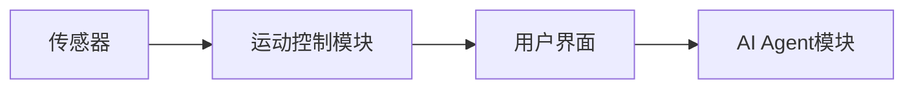
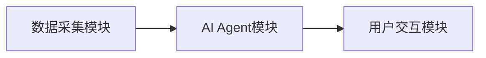
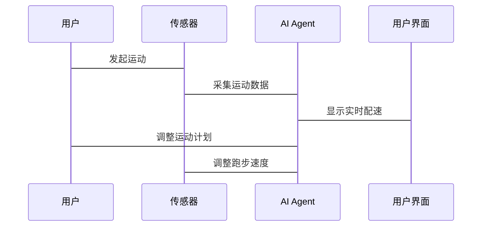

                 


# 智能跑步机：AI Agent的实时配速与体能管理

## 关键词：AI Agent, 实时配速, 体能管理, 智能跑步机, 运动数据分析, 人工智能算法

## 摘要：  
本文深入探讨了智能跑步机中AI Agent的核心作用，重点分析了实时配速与体能管理的实现原理与技术方案。通过结合运动科学、人工智能算法和系统架构设计，本文详细阐述了AI Agent如何通过实时数据分析优化用户的跑步体验，并提出了基于机器学习和强化学习的算法实现方案。同时，本文还探讨了智能跑步机的系统架构设计、项目实战开发及未来发展趋势，为相关领域的研究与实践提供了有价值的参考。

---

## 第1章 智能跑步机的背景与应用

### 1.1 智能跑步机的定义与特点  
智能跑步机是一种结合了物联网技术、人工智能算法和运动科学的健身设备。与传统跑步机相比，智能跑步机通过内置传感器和AI Agent（智能代理）能够实时采集用户的运动数据（如速度、心率、步频等），并根据用户的体能状况和运动目标动态调整运动计划。其核心特点包括：  
1. **智能化**：通过AI技术实现个性化运动建议。  
2. **实时反馈**：能够实时监测用户的运动状态并提供反馈。  
3. **数据驱动**：基于大数据分析优化运动方案。  

### 1.2 AI Agent在智能跑步机中的作用  
AI Agent（智能代理）是一种能够感知环境、自主决策并执行任务的智能系统。在智能跑步机中，AI Agent主要负责以下任务：  
1. **实时数据处理**：分析用户的运动数据，如速度、心率、步频等。  
2. **个性化推荐**：根据用户的体能状况和运动目标，动态调整跑步计划。  
3. **安全监控**：在用户出现疲劳或潜在健康风险时，及时发出预警。  

### 1.3 智能跑步机的市场现状与发展趋势  
近年来，随着人工智能技术的快速发展，智能跑步机逐渐成为健身设备市场的主流产品。根据市场调研，智能跑步机的优势在于：  
- 提供个性化的运动体验。  
- 能够实时监测用户的健康状况。  
- 结合运动数据分析，帮助用户制定科学的运动计划。  
未来，智能跑步机将朝着更加智能化、数据驱动化的方向发展，AI Agent将在运动健康管理中扮演更加重要的角色。

---

## 第2章 实时配速与体能管理的核心概念

### 2.1 实时配速的定义与实现  
实时配速是指在用户跑步过程中，智能跑步机根据用户的运动数据实时调整跑步速度，以达到最佳的运动效果。其实现过程包括以下步骤：  
1. **数据采集**：通过传感器采集用户的运动数据，如速度、心率、步频等。  
2. **数据分析**：AI Agent通过机器学习算法对数据进行分析，判断用户的运动状态。  
3. **配速调整**：根据分析结果，动态调整跑步速度，以优化用户的运动体验。  

### 2.2 体能管理的定义与方法  
体能管理是指通过分析用户的运动数据，评估其体能状况，并制定个性化的运动计划。常见的体能管理方法包括：  
1. **基础代谢率计算**：通过心率和运动数据估算用户的能量消耗。  
2. **运动负荷评估**：根据用户的运动强度和持续时间评估其体能水平。  
3. **个性化运动计划**：基于用户的体能状况和运动目标，制定个性化的运动方案。  

### 2.3 AI Agent在实时配速与体能管理中的作用  
AI Agent通过实时数据分析和机器学习算法，能够实现以下功能：  
1. **实时配速调整**：根据用户的运动数据动态调整跑步速度。  
2. **体能评估**：通过分析用户的运动数据，评估其体能状况。  
3. **运动计划优化**：基于用户的体能评估结果，优化运动计划。  

---

## 第3章 AI Agent的算法原理与实现

### 3.1 AI Agent的核心算法  
AI Agent的核心算法包括以下几种：  
1. **机器学习算法**：用于数据分析和模式识别。  
2. **神经网络算法**：用于复杂运动数据的深度学习。  
3. **强化学习算法**：用于动态调整运动计划。  

#### 3.1.1 机器学习算法  
机器学习算法通过训练模型，能够从用户的运动数据中提取特征，并预测用户的运动状态。例如，可以使用线性回归算法预测用户的配速变化趋势。  

#### 3.1.2 神经网络算法  
神经网络算法能够对复杂的运动数据进行深度学习，提取更细粒度的特征。例如，可以使用卷积神经网络（CNN）分析用户的步频和步幅变化。  

#### 3.1.3 强化学习算法  
强化学习算法通过与环境的交互，动态调整运动计划。例如，可以使用Q-learning算法优化用户的配速调整策略。  

### 3.2 实时配速的算法实现  
实时配速的算法实现包括以下步骤：  
1. **数据采集**：通过传感器采集用户的运动数据。  
2. **数据预处理**：对采集到的数据进行清洗和特征提取。  
3. **配速预测**：基于机器学习算法预测用户的配速变化。  
4. **配速调整**：根据预测结果动态调整跑步速度。  

#### 3.2.1 数据预处理  
数据预处理是实时配速算法实现的关键步骤。例如，可以使用滑动窗口方法对数据进行平滑处理。  

#### 3.2.2 配速预测  
配速预测可以通过回归算法实现。例如，可以使用线性回归模型预测用户的配速变化趋势。  

### 3.3 体能管理的算法实现  
体能管理的算法实现包括以下步骤：  
1. **数据采集**：通过传感器采集用户的运动数据。  
2. **数据分析**：通过机器学习算法分析用户的体能状况。  
3. **体能评估**：基于分析结果评估用户的体能水平。  
4. **运动计划优化**：根据体能评估结果优化运动计划。  

---

## 第4章 系统架构与设计

### 4.1 系统整体架构  
智能跑步机的系统架构包括以下模块：  
1. **硬件模块**：包括传感器、运动控制模块和用户界面。  
2. **软件模块**：包括数据采集模块、AI Agent模块和用户交互模块。  

#### 4.1.1 硬件架构  
硬件架构设计如图所示：  



#### 4.1.2 软件架构  
软件架构设计如图所示：  



### 4.2 系统接口设计  
系统接口设计包括以下部分：  
1. **传感器接口**：用于采集用户的运动数据。  
2. **用户界面接口**：用于显示运动数据和运动计划。  
3. **AI Agent接口**：用于与外部系统进行交互。  

### 4.3 系统交互流程  
系统交互流程如图所示：  



---

## 第5章 项目实战

### 5.1 环境安装与配置  
开发环境包括以下工具和库：  
- **Python**：用于算法实现。  
- **TensorFlow**：用于机器学习模型训练。  
- **传感器SDK**：用于数据采集。  

### 5.2 核心代码实现  
以下是实时配速算法的Python实现代码：  

```python
import numpy as np
from sklearn.linear_model import LinearRegression

# 数据预处理
def preprocess(data):
    # 假设data是一个包含速度和心率的二维数组
    # 使用滑动窗口方法进行平滑处理
    smoothed_data = []
    for i in range(len(data)):
        if i < 5:
            smoothed_data.append(np.mean(data[:i+1]))
        else:
            smoothed_data.append(np.mean(data[i-5:i+1]))
    return smoothed_data

# 配速预测
def predict_speed(data):
    model = LinearRegression()
    X = np.array([i for i in range(len(data))]).reshape(-1, 1)
    y = np.array(data).reshape(-1, 1)
    model.fit(X, y)
    # 预测下一个配速
    next_X = np.array([len(data)]).reshape(-1, 1)
    predicted_speed = model.predict(next_X)
    return predicted_speed[0][0]

# 示例数据
data = [8, 8.2, 8.1, 8.3, 8.4, 8.5, 8.6]
smoothed_data = preprocess(data)
predicted_speed = predict_speed(smoothed_data)
print("预测配速:", predicted_speed)
```

---

## 第6章 最佳实践与展望

### 6.1 性能优化与注意事项  
- 在数据采集阶段，需要注意传感器的精度和采样率。  
- 在算法实现阶段，需要优化模型的训练效率和预测速度。  

### 6.2 未来展望  
随着人工智能技术的不断进步，智能跑步机将朝着更加智能化、数据驱动化的方向发展。未来的研究方向包括：  
1. **更精准的运动数据分析**：通过深度学习算法实现更细粒度的运动数据分析。  
2. **更个性化的运动计划**：基于用户的基因数据和健康状况制定个性化的运动计划。  
3. **更安全的运动监控**：通过实时监测用户的健康状况，预防运动损伤。  

---

## 小结  
本文通过结合运动科学、人工智能算法和系统架构设计，深入探讨了智能跑步机中AI Agent的核心作用。通过实时数据分析和动态调整，AI Agent能够优化用户的跑步体验，帮助用户实现科学的运动管理。未来，随着人工智能技术的进一步发展，智能跑步机将在运动健康管理领域发挥更大的作用。

---

## 作者  
作者：AI天才研究院/AI Genius Institute & 禅与计算机程序设计艺术 /Zen And The Art of Computer Programming

