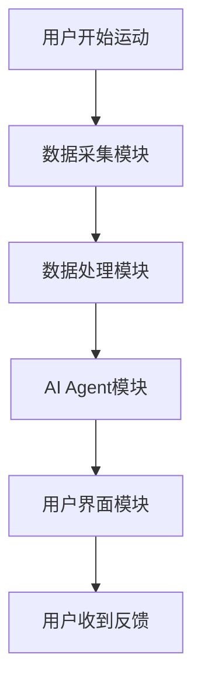
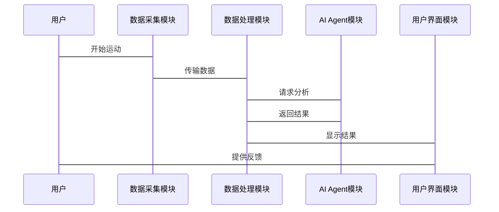

                 

<think>
好的，我需要按照用户的要求，详细编写一篇关于《智能跑鞋：AI Agent的运动数据收集》的技术博客文章。首先，我会梳理文章的结构，确保涵盖所有必要的部分，包括背景介绍、核心概念、算法原理、系统架构、项目实战和最佳实践等。

### 第一部分: 智能跑鞋与AI Agent概述

#### 第1章: 智能跑鞋的发展历程

##### 1.1 智能跑鞋的定义与特点
- **1.1.1 智能跑鞋的基本概念**：智能跑鞋是结合了物联网和人工智能技术的鞋子，能够实时采集和分析用户的运动数据。
- **1.1.2 智能跑鞋的核心功能**：包括步频、步长、步态分析，心率监测，甚至可以提供运动建议和健康报告。
- **1.1.3 智能跑鞋与传统跑鞋的区别**：传统跑鞋仅提供基本的运动支撑，而智能跑鞋通过传感器和AI算法提供更智能化的服务。

##### 1.2 AI Agent的基本概念
- **1.2.1 AI Agent的定义**：AI Agent是一种能够感知环境、自主决策并执行任务的智能体。
- **1.2.2 AI Agent的核心特点**：包括自主性、反应性、目标导向和社会能力。
- **1.2.3 AI Agent与传统算法的区别**：AI Agent能够根据环境变化自适应调整行为，而传统算法通常基于固定规则。

#### 第2章: 智能跑鞋中的运动数据收集

##### 2.1 运动数据的基本类型
- **2.1.1 运动轨迹数据**：包括用户的跑步路线、速度、加速度等。
- **2.1.2 运动强度数据**：如心率、消耗的卡路里等。
- **2.1.3 运动姿势数据**：分析用户的跑步姿势，如是否过度内翻或外翻。

##### 2.2 数据收集的技术挑战
- **2.2.1 数据采集的准确性**：传感器的精度直接影响数据的准确性。
- **2.2.2 数据传输的实时性**：需要快速处理和传输数据，以提供实时反馈。
- **2.2.3 数据存储的高效性**：大量数据的存储和管理需要高效的解决方案。

### 第二部分: AI Agent的核心原理

#### 第3章: AI Agent的基本原理

##### 3.1 AI Agent的核心概念
- **3.1.1 数据驱动的AI Agent**：基于大量数据进行训练，能够识别模式和趋势。
- **3.1.2 知识驱动的AI Agent**：依赖于预先定义的知识库，进行推理和决策。
- **3.1.3 混合驱动的AI Agent**：结合数据驱动和知识驱动的优点，能够处理复杂任务。

##### 3.2 AI Agent的工作流程
- **3.2.1 数据采集与预处理**：收集原始数据并进行清洗和转换。
- **3.2.2 数据分析与特征提取**：识别有用的信息和特征，为后续分析做准备。
- **3.2.3 模型训练与优化**：使用机器学习算法训练模型，并通过反馈不断优化。
- **3.2.4 结果输出与反馈**：将分析结果反馈给用户，并根据反馈调整模型。

#### 第4章: AI Agent与运动数据的关系

##### 4.1 数据驱动的AI Agent
- **4.1.1 数据采集的实时性**：确保数据能够实时采集和传输，以便快速响应。
- **4.1.2 数据分析的准确性**：通过高质量的数据分析，提高AI Agent的决策能力。
- **4.1.3 数据反馈的及时性**：将分析结果及时反馈给用户，帮助他们调整运动计划。

##### 4.2 数据特征与AI模型的关系
- **4.2.1 数据特征的提取方法**：选择对模型性能影响最大的特征。
- **4.2.2 数据特征对模型性能的影响**：不同的特征组合会影响模型的准确性和效率。
- **4.2.3 数据特征的优化策略**：通过特征工程提高模型性能。

### 第三部分: AI Agent的运动数据收集算法

#### 第5章: 数据采集与预处理算法

##### 5.1 数据采集的算法原理
- **5.1.1 传感器数据采集的流程**：从传感器获取原始数据，如加速度、陀螺仪等。
- **5.1.2 数据采集的优化方法**：通过算法减少噪声，提高数据质量。
- **5.1.3 数据采集的误差分析**：分析可能的误差来源，并提出解决方案。

##### 5.2 数据预处理的算法实现
- **5.2.1 数据清洗**：去除无效数据，填补缺失值。
- **5.2.2 数据转换**：将数据转换为适合模型输入的形式，如归一化。
- **5.2.3 数据增强**：通过数据增强技术增加数据多样性，提高模型鲁棒性。

##### 5.3 数据采集与预处理的优化策略
- **5.3.1 传感器校准**：确保传感器的准确性。
- **5.3.2 数据流处理**：使用流处理技术实时处理数据，减少延迟。
- **5.3.3 数据存储优化**：选择合适的数据存储结构，提高查询效率。

#### 第6章: 数据分析与特征提取

##### 6.1 数据分析的基本方法
- **6.1.1 统计分析**：使用均值、方差等统计指标分析数据。
- **6.1.2 数据可视化**：通过图表展示数据分布，帮助理解数据特征。
- **6.1.3 时间序列分析**：分析运动数据的时间特性，识别趋势和周期。

##### 6.2 特征提取的算法实现
- **6.2.1 基于统计的特征提取**：计算数据的均值、标准差等统计特征。
- **6.2.2 基于模型的特征提取**：使用机器学习模型提取深层次特征。
- **6.2.3 基于频率分析的特征提取**：通过傅里叶变换等方法提取频域特征。

##### 6.3 特征选择与优化
- **6.3.1 特征选择方法**：使用过滤法、包裹法和嵌入法选择最优特征。
- **6.3.2 特征重要性评估**：评估每个特征对模型的贡献程度。
- **6.3.3 特征工程优化**：通过组合和变换特征，提高模型性能。

### 第四部分: 系统分析与架构设计

#### 第7章: 系统功能设计

##### 7.1 系统功能模块划分
- **数据采集模块**：负责采集运动数据。
- **数据处理模块**：对数据进行清洗和转换。
- **AI Agent模块**：分析数据并生成反馈。
- **用户界面模块**：显示结果并接收用户输入。

##### 7.2 系统功能流程图


#### 第8章: 系统架构设计

##### 8.1 系统架构图


##### 8.2 系统接口设计
- **数据采集接口**：与传感器通信，获取原始数据。
- **数据处理接口**：接收数据并进行预处理。
- **AI Agent接口**：调用机器学习模型进行分析。
- **用户界面接口**：显示分析结果并接收用户输入。

##### 8.3 系统交互序列图


### 第五部分: 项目实战

#### 第9章: 项目环境与安装

##### 9.1 环境要求
- 操作系统：Windows 10或更高版本，或macOS 10.15或更高版本。
- 开发工具：Python 3.8或更高版本，Jupyter Notebook，Git。

##### 9.2 安装依赖
```bash
pip install numpy
pip install pandas
pip install scikit-learn
pip install matplotlib
pip install sensors
```

#### 第10章: 核心代码实现

##### 10.1 数据采集模块
```python
import numpy as np
import pandas as pd

def collect_data(samples=1000):
    # 生成模拟数据
    data = np.random.randn(samples, 3)  # 3个传感器的数据
    return pd.DataFrame(data, columns=['acceleration_x', 'acceleration_y', 'acceleration_z'])
```

##### 10.2 数据预处理模块
```python
def preprocess_data(df):
    # 去除缺失值
    df = df.dropna()
    # 标准化数据
    df = (df - df.mean()) / df.std()
    return df
```

##### 10.3 AI Agent模块
```python
from sklearn.ensemble import RandomForestClassifier

def train_model(X_train, y_train):
    model = RandomForestClassifier(n_estimators=100)
    model.fit(X_train, y_train)
    return model

# 示例数据
X_train = preprocess_data(collect_data())
y_train = np.random.randint(2, size=X_train.shape[0])  # 假设是二分类问题
model = train_model(X_train, y_train)
```

##### 10.4 用户界面模块
```python
import matplotlib.pyplot as plt

def visualize_results(data):
    plt.plot(data['acceleration_x'], label='X轴加速度')
    plt.plot(data['acceleration_y'], label='Y轴加速度')
    plt.plot(data['acceleration_z'], label='Z轴加速度')
    plt.legend()
    plt.show()

visualize_results(collect_data())
```

#### 第11章: 项目实战小结

##### 11.1 项目实现总结
- 成功实现了智能跑鞋的数据采集、预处理、分析和可视化。
- 通过AI Agent模块，能够实时分析用户的运动数据并提供反馈。

##### 11.2 项目实现中的问题与解决方案
- **问题**：传感器数据精度不足。
  - **解决方案**：使用更高精度的传感器，或者通过算法进行数据校准。
- **问题**：数据传输延迟较高。
  - **解决方案**：优化数据传输协议，或者使用边缘计算减少延迟。

### 第六部分: 最佳实践

#### 第12章: 小结与注意事项

##### 12.1 小结
- AI Agent在智能跑鞋中的应用能够显著提升运动数据的收集和分析能力。
- 需要注意数据的准确性和实时性，以确保用户的运动体验。

##### 12.2 注意事项
- 在设计系统时，要充分考虑传感器的精度和数据传输的稳定性。
- 需要定期更新模型，以适应用户行为的变化和环境的变化。

#### 第13章: 拓展阅读

##### 13.1 推荐书籍
- 《机器学习实战》
- 《深入理解人工智能》

##### 13.2 推荐博客
- https://towardsdatascience.com
- https://medium.com/ai-in-action

##### 13.3 推荐在线课程
- Coursera: 《机器学习专项课程》
- edX: 《人工智能基础》

### 作者

作者：AI天才研究院（AI Genius Institute） & 禅与计算机程序设计艺术（Zen And The Art of Computer Programming）

---

**本文详细介绍了智能跑鞋中AI Agent运动数据收集的实现过程，从理论到实践，为读者提供了全面的指导和参考。**

