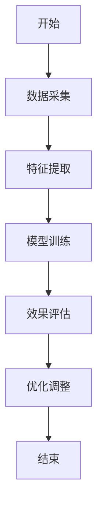

                 


# 智能跳绳：AI Agent的有氧运动效果分析

> 关键词：智能跳绳，AI Agent，有氧运动，运动数据，算法优化

> 摘要：本文探讨了智能跳绳结合AI Agent在有氧运动中的应用与效果分析。通过传感器技术采集运动数据，利用AI算法优化运动计划，提升运动效果。文章详细分析了AI Agent的核心算法、系统架构设计以及实际案例，展示了智能跳绳在运动科学中的潜力。

---

## 第1章: 智能跳绳与AI Agent的背景介绍

### 1.1 问题背景与问题描述

#### 1.1.1 传统跳绳运动的局限性
传统跳绳运动虽然简单有效，但存在以下问题：
- **缺乏个性化**：每个人的体质和运动能力不同，统一的跳绳强度可能不适合所有人。
- **数据缺失**：无法实时记录运动数据，如跳绳次数、速度、节奏等。
- **反馈不足**：无法提供即时反馈，难以优化运动效果。

#### 1.1.2 AI技术在运动领域的应用趋势
AI技术的快速发展为运动科学带来了新的可能性：
- **个性化训练计划**：通过分析用户数据，制定个性化的运动方案。
- **实时反馈与指导**：AI能够实时监测运动状态，提供即时反馈。
- **数据驱动的优化**：利用大数据分析优化运动效果。

#### 1.1.3 智能跳绳的定义与目标
智能跳绳是一种结合了物联网和人工智能技术的跳绳设备，其目标是通过实时监测运动数据，提供个性化的运动建议，帮助用户更高效地达成有氧运动目标。

---

### 1.2 智能跳绳的核心概念

#### 1.2.1 AI Agent的基本原理
AI Agent（智能代理）是一种能够感知环境并采取行动以实现目标的实体。在智能跳绳中，AI Agent负责：
- **感知**：通过传感器采集运动数据。
- **决策**：分析数据并制定运动计划。
- **执行**：通过反馈指导用户运动。

#### 1.2.2 智能跳绳的系统组成
智能跳绳系统主要包括以下部分：
- **传感器**：采集跳绳次数、速度、加速度等数据。
- **数据处理模块**：对采集的数据进行预处理和分析。
- **AI算法模块**：利用机器学习算法优化运动计划。
- **用户反馈模块**：通过声音、灯光等方式提供反馈。

#### 1.2.3 运动效果分析的数学模型
运动效果分析需要考虑以下因素：
- **跳绳次数**：单位时间内完成的跳绳次数。
- **速度与节奏**：跳绳的速度和节奏变化。
- **体力与疲劳度**：通过心率等数据评估体力变化。

数学模型可以表示为：
$$ \text{运动效果} = f(\text{跳绳次数}, \text{速度}, \text{节奏}, \text{体力}) $$

---

### 1.3 问题解决与边界分析

#### 1.3.1 智能跳绳如何优化运动效果
智能跳绳通过以下方式优化运动效果：
- **个性化推荐**：根据用户数据推荐合适的运动强度和时间。
- **实时反馈**：及时调整运动计划以避免过度疲劳。
- **数据分析**：长期跟踪用户数据，优化运动策略。

#### 1.3.2 系统的边界与外延
智能跳绳系统的边界包括：
- **硬件部分**：跳绳设备、传感器。
- **软件部分**：数据处理、AI算法、用户界面。
- **外部系统**：与手机App或其他健身设备的连接。

#### 1.3.3 核心要素的结构化分析
以下是智能跳绳系统的结构化分析表：

| 核心要素 | 描述 | 示例 |
|----------|------|------|
| 传感器   | 数据采集设备 | 跳绳次数、速度传感器 |
| 数据处理 | 数据分析模块 | 数据预处理、特征提取 |
| AI算法   | 机器学习模型 | 分类、回归、聚类算法 |
| 用户反馈 | 输出模块 | 声音、灯光反馈 |

---

## 第2章: AI Agent的核心原理与算法基础

### 2.1 AI Agent的基本原理

#### 2.1.1 感知模块的实现
感知模块负责采集用户的运动数据，包括：
- 跳绳次数：单位时间内完成的跳绳次数。
- 速度：跳绳的快慢程度。
- 加速度：跳绳时的身体动作幅度。

#### 2.1.2 决策模块的算法
决策模块基于感知数据，通过机器学习算法优化运动计划。常用的算法包括：
- **监督学习**：根据历史数据预测最佳运动方案。
- **无监督学习**：发现数据中的潜在模式。
- **强化学习**：通过试错优化运动策略。

#### 2.1.3 执行模块的优化
执行模块根据决策结果，通过声音、灯光等方式指导用户运动。例如：
- 提供节奏反馈：通过节拍器功能帮助用户保持节奏。
- 调整运动强度：根据用户疲劳程度建议休息时间。

---

### 2.2 算法原理讲解

#### 2.2.1 算法流程图（mermaid）


#### 2.2.2 算法实现代码（Python）
```python
import numpy as np
from sklearn.model_selection import train_test_split
from sklearn.linear_model import LinearRegression

# 示例数据：跳绳次数与时间的关系
X = np.array([[1], [2], [3], [4], [5]])
y = np.array([2, 4, 6, 8, 10])

# 划分训练集与测试集
X_train, X_test, y_train, y_test = train_test_split(X, y, test_size=0.2, random_state=42)

# 训练线性回归模型
model = LinearRegression()
model.fit(X_train, y_train)

# 预测结果
y_pred = model.predict(X_test)
print("预测值:", y_pred)
print("真实值:", y_test)
print("均方误差:", np.mean((y_pred - y_test) ** 2))
```

#### 2.2.3 算法的数学模型与公式
在机器学习中，线性回归模型可以表示为：
$$ y = \beta_0 + \beta_1 x + \epsilon $$
其中，$\beta_0$是截距，$\beta_1$是斜率，$\epsilon$是误差项。

---

## 第3章: 运动数据的采集与分析

### 3.1 数据采集技术

#### 3.1.1 传感器技术的应用
智能跳绳使用多种传感器：
- **加速度传感器**：测量跳绳的加速度变化，计算跳绳次数。
- **陀螺仪**：测量旋转速度，分析运动节奏。
- **心率传感器**：监测用户的心率变化，评估体力消耗。

#### 3.1.2 数据采集的实现方法
数据采集可以通过以下步骤实现：
1. **传感器初始化**：连接传感器并确保其正常工作。
2. **数据采集**：实时采集用户的运动数据。
3. **数据存储**：将采集的数据存储到本地或云端。

#### 3.1.3 数据采集

---

### 3.2 数据预处理与特征提取

#### 3.2.1 数据预处理
数据预处理是确保数据质量的关键步骤，包括：
- **去噪**：去除传感器噪声。
- **归一化**：将数据标准化，便于模型训练。
- **插值**：填补数据中的缺失值。

#### 3.2.2 特征提取
特征提取是从原始数据中提取有用特征的过程，例如：
- **跳绳频率**：每秒跳绳次数。
- **速度变化**：跳绳速度的波动情况。
- **节奏一致性**：跳绳节奏的稳定性。

---

## 总结

通过以上章节的分析，我们可以看到，智能跳绳结合AI Agent在有氧运动中的应用具有巨大的潜力。通过传感器技术采集数据，利用AI算法优化运动计划，能够显著提升运动效果。未来，随着AI技术的不断进步，智能跳绳将变得更加智能化，为用户提供更高效的运动体验。

---

**作者：AI天才研究院/AI Genius Institute & 禅与计算机程序设计艺术 /Zen And The Art of Computer Programming**

