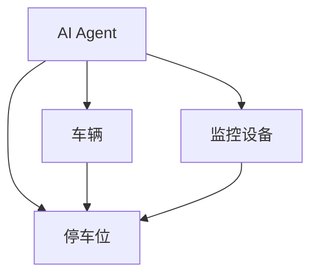
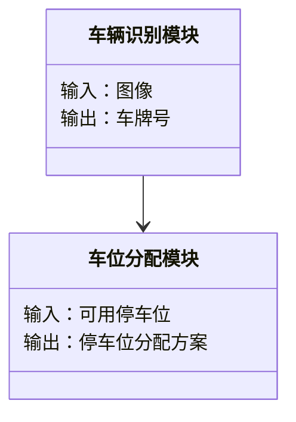

                 


# 智能车库：AI Agent的车辆管理与安全监控

---

## 关键词

智能车库, AI Agent, 车辆管理, 安全监控, 多智能体协作, 边缘计算, AI伦理

---

## 摘要

本文深入探讨了智能车库系统的设计与实现，结合AI Agent技术，分析了车辆管理与安全监控的核心问题。文章从问题背景出发，详细讲解了AI Agent的基本原理、系统架构设计、核心算法实现，以及实际项目中的应用。同时，还探讨了高级主题、安全与隐私保护，以及未来的发展趋势，为读者提供了全面的技术视角。

---

## 第一部分：引言

### 第1章：智能车库的背景与重要性

#### 1.1 智能车库的背景

随着城市化进程的加快，停车难问题日益突出，传统车库的管理效率低、安全性差，难以满足现代用户的需求。AI Agent的引入为智能车库带来了革命性的变化，通过智能化管理，提高了停车效率和安全性。

#### 1.2 问题背景与描述

- **车辆管理的复杂性**：传统车库依赖人工管理，效率低下且容易出错。
- **安全监控的挑战**：传统监控设备难以实时分析异常情况。
- **用户需求的多样性**：不同用户对停车服务的需求各不相同。

#### 1.3 问题解决与系统边界

AI Agent通过实时感知、决策和执行，解决了传统车库的痛点。系统边界包括车辆识别、车位分配、路径规划和安全监控等功能，确保系统在特定范围内高效运行。

#### 1.4 核心概念与系统结构

AI Agent作为系统的核心，通过与车辆、停车位和监控设备的交互，实现智能管理。系统结构包括感知层、决策层和执行层，确保各模块协同工作。

---

## 第二部分：AI Agent的核心概念与原理

### 第2章：AI Agent的基本原理

#### 2.1 AI Agent的定义与分类

AI Agent是一种能够感知环境并采取行动以实现目标的智能实体。根据智能水平和环境类型，可分为反应式、基于模型和混合式Agent。

#### 2.2 AI Agent的核心要素

- **感知与理解**：通过传感器和摄像头获取环境信息。
- **决策与规划**：基于感知信息做出决策。
- **执行与反馈**：通过执行机构完成决策，并根据反馈调整行为。

#### 2.3 AI Agent与传统AI的区别

AI Agent具有主动性、反应性和社会性，能够独立决策和与环境交互，而传统AI主要依赖预设规则。

#### 2.4 AI Agent的实体关系图



---

## 第三部分：智能车库的系统架构设计

### 第3章：智能车库的系统架构

#### 3.1 系统功能模块

系统主要包括车辆识别、车位分配、路径规划和安全监控模块。

#### 3.2 领域模型



#### 3.3 系统架构设计


#### 3.4 系统接口设计

系统通过API接口实现各模块之间的通信，确保数据流畅传输。

---

## 第四部分：车辆管理与安全监控的实现

### 第4章：车辆管理与安全监控的实现

#### 4.1 车辆识别算法

车牌识别流程：

1. 图像预处理
2. 边缘检测
3. 车牌定位
4. 字符识别

数学模型：使用卷积神经网络（CNN）进行图像分类。

#### 4.2 车位分配算法

基于实时数据，采用贪心算法分配停车位。

#### 4.3 路径规划算法

使用Dijkstra算法计算最优路径。

#### 4.4 安全监控实现

通过目标检测算法（如YOLO）实时监控车库区域。

---

## 第五部分：项目实战

### 第5章：智能车库系统实现

#### 5.1 环境搭建

安装Python、TensorFlow、OpenCV等库。

#### 5.2 核心代码实现

车牌识别代码示例：

```python
import tensorflow as tf
from tensorflow.keras.models import load_model

model = load_model('车牌识别模型.h5')
def 识别车牌(image):
    预处理图像
    预测结果 = model.predict(image)
    return 预测结果
```

#### 5.3 功能测试与案例分析

测试车牌识别准确率，分析系统性能。

---

## 第六部分：高级主题

### 第6章：多智能体协作与边缘计算

多智能体协作实现协同管理，边缘计算提升实时性。

---

## 第七部分：安全与隐私保护

### 第7章：智能车库的安全与隐私

加密技术保护数据，隐私保护策略防止信息泄露。

---

## 第八部分：未来展望

### 第8章：新技术与发展趋势

5G和区块链技术将进一步提升智能车库的效率和安全性。

---

## 第九部分：附录与参考文献

### 第9章：附录

工具推荐：TensorFlow、OpenCV、ROS。

### 参考文献

- 《深度学习入门》
- 《AI Agent原理与应用》

---

## 作者信息

作者：AI天才研究院/AI Genius Institute & 禅与计算机程序设计艺术 /Zen And The Art of Computer Programming

