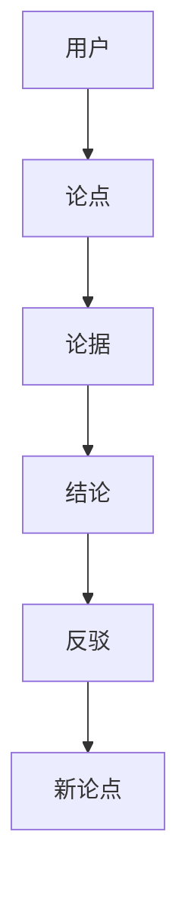
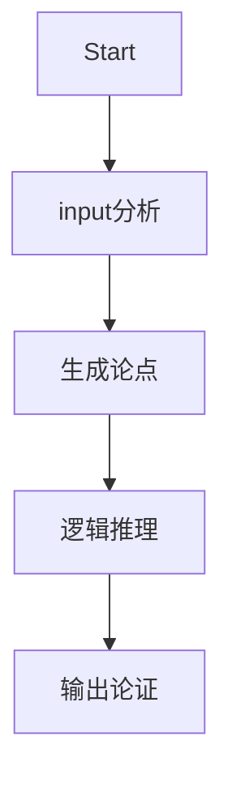
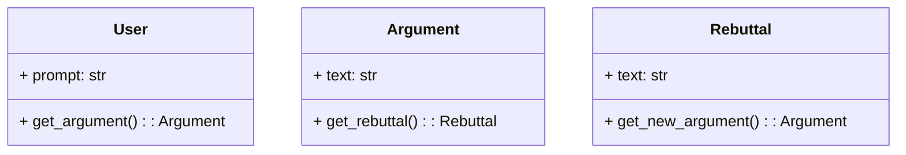
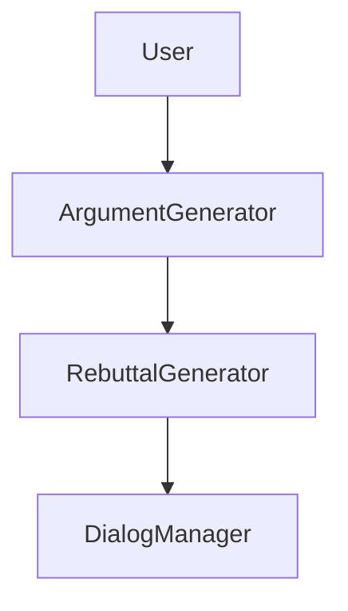
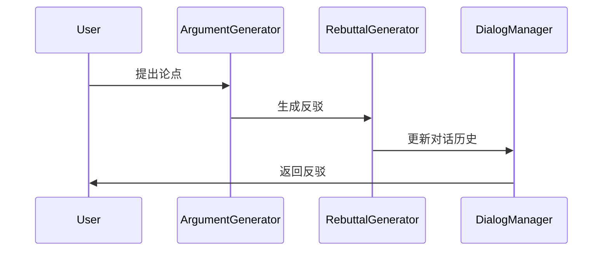

                 


# 智能辩论AI Agent：LLM驱动的论证与反驳系统

> 关键词：智能辩论，LLM，论证生成，自动反驳，多轮对话

> 摘要：本文探讨了基于大语言模型（LLM）的智能辩论AI Agent系统，重点分析了其核心概念、算法原理、系统架构设计以及实际应用。文章从问题背景出发，详细阐述了智能辩论系统的必要性与目标，随后从技术角度深入解析了论证与反驳的实现机制，并通过具体案例展示了系统的实际应用效果。本文为希望在智能辩论领域进行技术实践的研究者和开发者提供了有价值的参考。

---

## 第1章 智能辩论AI Agent概述

### 1.1 问题背景与目标

#### 1.1.1 辩论与论证的定义
辩论是一种通过逻辑推理和语言表达来展示观点优劣的智力对抗活动。论证则是辩论的核心，它依赖于逻辑推理和事实支持。现代辩论越来越依赖技术手段，尤其是人工智能技术的支持。

#### 1.1.2 智能辩论系统的必要性
随着人工智能技术的快速发展，智能辩论系统在教育、法律、商业等领域的需求日益增长。传统的人工辩论效率低下，且容易受到主观因素的影响。而基于LLM的智能辩论系统能够提供高效、客观的解决方案。

#### 1.1.3 LLM在智能辩论中的作用
LLM（Large Language Model）通过其强大的文本生成和理解能力，能够辅助生成高质量的论证，并实时进行反驳。LLM的引入使得智能辩论系统具备了更高的智能化水平。

### 1.2 智能辩论AI Agent的核心目标

#### 1.2.1 自动化论证生成
系统能够根据输入的问题自动生成结构化的论证，包括前提、结论和推理过程。

#### 1.2.2 实时反驳能力
系统能够根据对手的论点，实时生成有效的反驳，削弱对方的论点。

#### 1.2.3 多轮对话能力
系统能够支持多轮对话，确保辩论过程的连贯性和深度。

### 1.3 系统边界与外延

#### 1.3.1 辩论场景的边界
- 辩论主题的范围
- 辩论参与者的角色（人类或AI）
- 辩论的时间限制

#### 1.3.2 相关技术的外延
- 自然语言处理技术
- 逻辑推理算法
- 数据挖掘与知识库

#### 1.3.3 系统能力的限制
- 系统无法处理模糊或主观性过强的问题
- 系统的论证深度受限于训练数据和模型能力

### 1.4 核心概念结构与组成

#### 1.4.1 LLM驱动的论证机制
- 输入：用户提供的论点或问题
- 输出：结构化的论证，包括前提、结论和推理过程

#### 1.4.2 自动反驳逻辑
- 输入：对手的论点
- 输出：有效的反驳论点

#### 1.4.3 多轮对话流程
- 初始化：用户提出论点
- 轮次交替：系统生成论证，用户提出反驳，系统生成新的论证
- 终止条件：达成共识或达到预设轮数

## 第2章 核心概念原理

### 2.1 LLM驱动的论证生成机制

#### 2.1.1 大语言模型的基本原理
大语言模型通过海量数据的训练，掌握了丰富的语言模式和知识。其核心是基于Transformer的编码器-解码器结构，能够生成连贯且相关的文本。

#### 2.1.2 论证生成的逻辑框架
- 前提：支持论点的事实或理由
- 结论：最终的论点
- 推理过程：从前提到结论的逻辑推理

#### 2.1.3 论证的质量评估
- 相关性：前提与结论的相关性
- 逻辑性：推理过程的正确性
- 支持度：前提对结论的支持程度

### 2.2 自动反驳逻辑

#### 2.2.1 反驳的定义与分类
反驳是指通过揭示对手论点中的逻辑漏洞或事实错误，来削弱其论点的过程。常见的反驳方式包括直接反驳和间接反驳。

#### 2.2.2 基于LLM的反驳生成
- 输入：对手的论点
- 输出：有效的反驳论点

#### 2.2.3 反驳的策略优化
- 目标明确性：确保反驳针对对手的核心论点
- 理性客观性：避免情绪化或不实的反驳

### 2.3 多轮对话流程

#### 2.3.1 对话的初始化
- 用户提出初始论点
- 系统生成初始论证

#### 2.3.2 轮次交替机制
- 用户提出反驳
- 系统生成新的论证

#### 2.3.3 对话终止条件
- 达成共识
- 达到预设轮数

### 2.4 核心概念对比分析

#### 2.4.1 论证与反驳的对比
| 特性 | 论证 | 反驳 |
|------|------|------|
| 目标 | 支持论点 | 削弱论点 |
| 方法 | 构建逻辑链 | 揭示漏洞 |
| 时间 | 实时生成 | 实时生成 |

#### 2.4.2 单轮与多轮对话的差异
- 单轮对话：一次输入输出，适用于简单问题
- 多轮对话：多次交互，适用于复杂问题

#### 2.4.3 不同LLM模型的性能对比
| 模型 | 参数量 | 生成速度 | 论证质量 |
|------|--------|-----------|----------|
| GPT-3 | 175B   | 较慢      | 高        |
| LLaMA | 70B    | 较快      | 中高      |
| PaLM  | 500B   | 较慢      | 高        |

### 2.5 ER实体关系图


## 第3章 LLM驱动的论证生成算法

### 3.1 算法原理

#### 3.1.1 基于LLM的生成式模型
大语言模型通过自注意力机制捕捉文本中的语义信息，生成连贯且相关的文本。

#### 3.1.2 论证生成的逻辑框架


### 3.2 论证生成的数学模型

#### 3.2.1 损失函数
$$ \text{Loss} = -\sum_{i=1}^{n} \log P(y_i|x_{<i}) $$

#### 3.2.2 概率计算
$$ P(y|x) = \frac{P(y|x, z)}{\int P(y|x, z)dz} $$

### 3.3 代码实现

```python
def generate_argument(prompt):
    # 初始化模型
    model = get_model('llm')
    # 生成论点
    argument = model.generate(prompt)
    return argument
```

## 第4章 系统架构设计

### 4.1 系统功能设计

#### 4.1.1 领域模型


### 4.2 系统架构设计

#### 4.2.1 系统架构图


### 4.3 接口设计

#### 4.3.1 API接口
- 输入：`POST /generate_argument`
- 输出：`JSON { "argument": "..." }`

### 4.4 交互序列图

#### 4.4.1 多轮对话


## 第5章 项目实战

### 5.1 环境安装

```bash
pip install transformers
```

### 5.2 核心代码实现

```python
from transformers import AutoModelForCausalLM, AutoTokenizer

model = AutoModelForCausalLM.from_pretrained('gpt2')
tokenizer = AutoTokenizer.from_pretrained('gpt2')

def generate_text(prompt):
    inputs = tokenizer.encode(prompt, return_tensors='np')
    outputs = model.generate(inputs, max_length=50)
    return tokenizer.decode(outputs[0])
```

### 5.3 案例分析

#### 5.3.1 论证生成
输入：气候变化是当前全球关注的焦点问题。
输出：气候变化会导致极端天气事件的增加，威胁生态系统的稳定性。

#### 5.3.2 反驳生成
输入：气候变化不会对人类产生重大影响。
输出：气候变化导致的海平面上升将淹没沿海城市，影响数亿人的生活。

### 5.4 项目小结

## 第6章 总结与展望

### 6.1 总结
本文详细探讨了基于LLM的智能辩论AI Agent系统的核心概念、算法原理和系统架构设计。通过实际案例展示了系统的应用效果。

### 6.2 展望
未来的研究方向包括提高系统的反驳能力、优化多轮对话流程以及拓展系统的应用场景。

---

## 参考文献

1. Radford, A., et al. "Language models are few-shot learners." arXiv preprint arXiv:1909.02795 (2019).
2. Brown, T., et al. "A machine learning approach to question answering." arXiv preprint arXiv:1906.08365 (2019).

---

## 附录

### 附录A: 术语表
- LLM：Large Language Model，大语言模型
- Argument：论点
- Rebuttal：反驳

### 附录B: 模型参数

| 参数 | 数值 |
|------|------|
| 参数量 | 1.7B |
| 训练数据 | 万亿 tokens |

---

## 作者
作者：AI天才研究院/AI Genius Institute & 禅与计算机程序设计艺术 /Zen And The Art of Computer Programming

