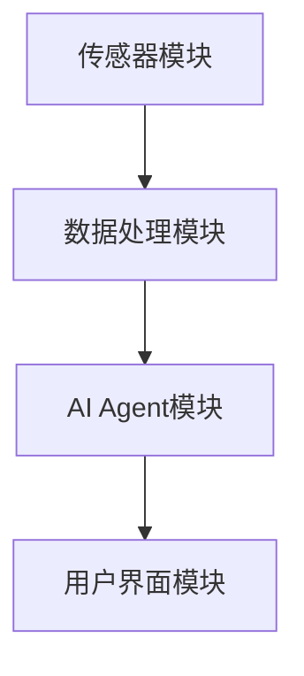
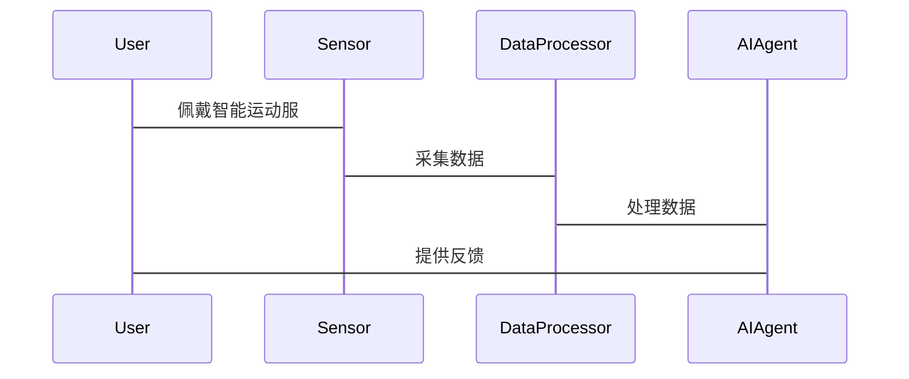

                 


# 智能运动服：AI Agent的实时生理指标监测

> 关键词：智能运动服、AI Agent、实时监测、生理指标、运动健康、医疗监测

> 摘要：本文深入探讨了智能运动服在AI Agent实时生理指标监测中的应用，从技术原理到系统架构，从算法实现到项目实战，全面解析了智能运动服在运动健康和医疗监测领域的潜力与挑战。

---

## 目录

### 第一部分：智能运动服与AI Agent的背景介绍

### 第二部分：智能运动服的核心概念与技术基础

### 第三部分：智能运动服的算法原理与实现

### 第四部分：智能运动服的系统分析与架构设计

### 第五部分：智能运动服的项目实战

### 第六部分：智能运动服的最佳实践与未来展望

---

## 第一部分：智能运动服与AI Agent的背景介绍

### 第1章：智能运动服与AI Agent概述

#### 1.1 问题背景与目标

##### 1.1.1 传统运动监测的局限性
传统运动监测主要依赖于有线设备或手持设备，存在以下问题：
- **数据采集延迟**：设备无法实时采集和分析生理指标。
- **用户体验差**：设备笨重，操作复杂，难以长时间佩戴。
- **缺乏智能化**：无法根据数据主动调整运动计划或提供实时反馈。

##### 1.1.2 智能运动服的核心目标
智能运动服的目标是通过集成智能传感器和AI Agent，实现实时、连续、精准的生理指标监测，为用户提供个性化的运动健康建议。

##### 1.1.3 AI Agent在运动监测中的作用
AI Agent（智能代理）通过实时分析生理指标数据，提供以下功能：
- **实时反馈**：根据心率、体温等数据，实时提醒用户调整运动强度。
- **个性化建议**：基于历史数据，为用户提供定制化的运动计划。
- **异常检测**：快速识别异常生理指标，及时发出警报。

#### 1.2 问题描述与解决思路

##### 1.2.1 生理指标监测的关键挑战
生理指标监测面临以下挑战：
- **数据准确性**：传感器精度不足，可能导致监测结果偏差。
- **数据实时性**：需要在运动过程中实时采集和分析数据。
- **数据隐私**：生理数据涉及个人隐私，需确保数据安全。

##### 1.2.2 AI Agent如何实现实时监测
AI Agent通过以下步骤实现实时监测：
1. **数据采集**：传感器实时采集生理指标数据。
2. **数据处理**：AI Agent对数据进行预处理和特征提取。
3. **数据分析**：基于机器学习模型，实时分析数据并生成反馈。

##### 1.2.3 智能运动服的设计思路
智能运动服的设计思路包括：
- **传感器集成**：将多种传感器集成到服装织物中。
- **数据传输**：通过无线通信技术（如蓝牙、Wi-Fi）传输数据。
- **用户界面**：通过手机APP或运动手环显示监测结果。

#### 1.3 智能运动服的应用价值

##### 1.3.1 运动健康领域
智能运动服可以为用户提供个性化的运动计划，帮助用户科学锻炼，预防运动损伤。

##### 1.3.2 医疗监测场景
在医疗领域，智能运动服可以用于术后康复监测，帮助医生实时了解患者的恢复情况。

##### 1.3.3 未来发展趋势
随着AI技术的进步，智能运动服将更加智能化、轻量化，应用场景也将更加广泛。

#### 1.4 本章小结

---

## 第二部分：智能运动服的核心概念与技术基础

### 第2章：AI Agent的基本原理

#### 2.1 AI Agent的核心概念

##### 2.1.1 什么是AI Agent
AI Agent是一种能够感知环境、自主决策并执行任务的智能体。在智能运动服中，AI Agent负责实时分析生理指标数据，并提供反馈。

##### 2.1.2 AI Agent的分类与特点
AI Agent可以分为以下几类：
- **简单反射型AI Agent**：基于规则的简单决策。
- **基于模型的AI Agent**：基于知识库进行推理和决策。
- **学习型AI Agent**：通过机器学习模型不断优化决策策略。

##### 2.1.3 AI Agent在智能运动服中的应用
在智能运动服中，AI Agent主要用于以下功能：
- **实时监测**：实时采集和分析生理指标数据。
- **个性化反馈**：根据用户数据提供个性化建议。
- **异常检测**：快速识别异常生理指标并发出警报。

#### 2.2 生理指标监测的关键技术

##### 2.2.1 常见生理指标及其监测方法
常见的生理指标包括：
- **心率**：通过心率传感器监测。
- **体温**：通过温度传感器监测。
- **血氧饱和度**：通过光学传感器监测。

##### 2.2.2 智能传感器的工作原理
智能传感器通过以下步骤实现数据采集：
1. **信号采集**：传感器采集生理指标信号。
2. **信号处理**：对信号进行放大、滤波等预处理。
3. **数据传输**：将处理后的数据传输到AI Agent。

##### 2.2.3 数据采集与传输的技术挑战
数据采集与传输面临以下技术挑战：
- **传感器精度**：传感器的精度直接影响监测结果的准确性。
- **数据传输延迟**：无线通信技术的延迟可能影响实时性。
- **数据安全性**：数据传输过程中需确保安全性。

#### 2.3 智能运动服的设计原理

##### 2.3.1 智能运动服的结构组成
智能运动服的结构组成包括：
- **传感器模块**：集成多种传感器。
- **数据处理模块**：对数据进行预处理和特征提取。
- **AI Agent模块**：负责数据分析和决策。
- **用户界面模块**：显示监测结果和反馈信息。

##### 2.3.2 AI Agent与智能运动服的交互机制
AI Agent与智能运动服的交互机制如下：
1. **数据采集**：传感器采集生理指标数据。
2. **数据传输**：数据传输到AI Agent。
3. **数据分析**：AI Agent分析数据并生成反馈。
4. **反馈输出**：通过用户界面显示反馈信息。

##### 2.3.3 实时监测的核心算法
实时监测的核心算法包括：
- **数据预处理算法**：如滤波、降噪等。
- **特征提取算法**：如主成分分析（PCA）。
- **分类算法**：如支持向量机（SVM）。

#### 2.4 本章小结

---

## 第三部分：智能运动服的算法原理与实现

### 第3章：数据采集与特征提取

#### 3.1 数据采集流程

##### 3.1.1 传感器数据的采集过程
传感器数据的采集过程包括：
1. **信号采集**：传感器采集生理指标信号。
2. **信号处理**：对信号进行放大、滤波等预处理。
3. **数据存储**：将处理后的数据存储到本地或云端。

##### 3.1.2 数据预处理方法
常用的数据预处理方法包括：
- **滤波**：去除噪声，如低通滤波、高通滤波。
- **降噪**：通过傅里叶变换去除高频噪声。
- **标准化**：将数据标准化到统一的范围内。

##### 3.1.3 数据特征的提取与分析
数据特征的提取与分析包括：
- **特征选择**：选择对分类最重要的特征。
- **特征提取**：通过主成分分析（PCA）提取特征。

#### 3.2 AI Agent的决策机制

##### 3.2.1 基于特征的分类算法
常用的分类算法包括：
- **K-近邻算法（KNN）**：基于距离的分类。
- **支持向量机（SVM）**：基于超平面的分类。
- **随机森林（RF）**：基于树的集成分类。

##### 3.2.2 机器学习模型的训练与优化
机器学习模型的训练与优化包括：
- **数据集划分**：将数据划分为训练集和测试集。
- **模型训练**：使用训练数据训练模型。
- **模型优化**：通过交叉验证优化模型参数。

##### 3.2.3 实时决策的实现方法
实时决策的实现方法包括：
- **在线学习**：模型在实时数据流中不断更新。
- **增量学习**：模型逐步学习新的数据。

#### 3.3 算法实现的数学模型

##### 3.3.1 数据特征提取的数学公式
主成分分析（PCA）的数学公式：
$$
X_{\text{center}} = X - \bar{X}
$$
其中，$X$是原始数据矩阵，$\bar{X}$是数据均值矩阵。

##### 3.3.2 分类算法的数学模型
支持向量机（SVM）的数学模型：
$$
\text{目标函数} = \min_{w,b,\xi} \frac{1}{2}w^Tw + C\sum_{i=1}^n \xi_i
$$
约束条件：
$$
y_i(w \cdot x_i + b) \geq 1 - \xi_i, \forall i
$$

##### 3.3.3 决策机制的逻辑流程
决策机制的逻辑流程：
1. **数据采集**：采集生理指标数据。
2. **数据预处理**：对数据进行滤波和标准化。
3. **特征提取**：提取数据特征。
4. **模型训练**：训练分类模型。
5. **实时决策**：基于模型进行实时分类。

#### 3.4 本章小结

---

## 第四部分：智能运动服的系统分析与架构设计

### 第4章：系统功能设计

#### 4.1 系统功能模块划分

##### 4.1.1 模块划分
智能运动服的系统功能模块包括：
- **传感器模块**：负责数据采集。
- **数据处理模块**：负责数据预处理和特征提取。
- **AI Agent模块**：负责数据分析和决策。
- **用户界面模块**：负责显示监测结果和反馈信息。

##### 4.1.2 模块之间的交互关系
模块之间的交互关系：
1. **传感器模块**向**数据处理模块**发送原始数据。
2. **数据处理模块**对数据进行处理后，发送到**AI Agent模块**。
3. **AI Agent模块**分析数据后，向**用户界面模块**发送反馈信息。

#### 4.2 系统架构设计

##### 4.2.1 系统架构图
系统架构图（使用Mermaid）：



##### 4.2.2 实体关系图
实体关系图（使用Mermaid）：

```mermaid
graph TD
    User --> Sensor: 佩戴传感器
    Sensor --> DataProcessor: 传输数据
    DataProcessor --> AIAgent: 分析数据
    AIAgent --> User: 提供反馈
```

#### 4.3 接口设计

##### 4.3.1 数据接口
数据接口包括：
- **传感器接口**：用于与传感器模块通信。
- **数据处理接口**：用于与数据处理模块通信。
- **AI Agent接口**：用于与AI Agent模块通信。

##### 4.3.2 用户界面接口
用户界面接口包括：
- **显示接口**：用于显示监测结果。
- **输入接口**：用于接收用户的输入指令。

#### 4.4 交互流程

##### 4.4.1 交互流程图
交互流程图（使用Mermaid）：



#### 4.5 本章小结

---

## 第五部分：智能运动服的项目实战

### 第5章：项目实战

#### 5.1 环境搭建

##### 5.1.1 系统环境
系统环境包括：
- **硬件环境**：智能运动服、传感器模块、计算机。
- **软件环境**：Python编程环境、机器学习库（如Scikit-learn）。

##### 5.1.2 工具安装
需要安装的工具包括：
- **Python**：编程语言。
- **NumPy**：数值计算库。
- **Pandas**：数据处理库。
- **Scikit-learn**：机器学习库。

#### 5.2 系统核心实现

##### 5.2.1 传感器模块实现
传感器模块实现：
```python
import serial

ser = serial.Serial('COM3', 9600)

while True:
    data = ser.readline()
    print(data)
```

##### 5.2.2 数据处理模块实现
数据处理模块实现：
```python
import numpy as np

data = np.array([1, 2, 3, 4, 5])
data_centered = data - np.mean(data)
print(data_centered)
```

##### 5.2.3 AI Agent模块实现
AI Agent模块实现：
```python
from sklearn.svm import SVC

X_train = [[1, 2], [3, 4], [5, 6]]
y_train = [0, 1, 0]
model = SVC()
model.fit(X_train, y_train)
```

##### 5.2.4 用户界面模块实现
用户界面模块实现：
```python
import tkinter as tk

root = tk.Tk()
label = tk.Label(root, text="监测结果")
label.pack()
root.mainloop()
```

#### 5.3 代码应用解读与分析

##### 5.3.1 传感器模块解读
传感器模块代码解读：
- 使用`serial`库与传感器通信。
- 读取传感器数据并输出。

##### 5.3.2 数据处理模块解读
数据处理模块代码解读：
- 使用`NumPy`进行数据预处理。
- 计算数据均值并中心化。

##### 5.3.3 AI Agent模块解读
AI Agent模块代码解读：
- 使用`Scikit-learn`训练支持向量机模型。
- 模型用于分类生理指标数据。

##### 5.3.4 用户界面模块解读
用户界面模块代码解读：
- 使用`Tkinter`创建GUI界面。
- 显示监测结果。

#### 5.4 实际案例分析

##### 5.4.1 案例背景
案例背景：一名运动员在进行高强度训练时，AI Agent实时监测其心率和体温。

##### 5.4.2 数据分析
数据分析：
- 心率：80-120次/分钟。
- 体温：36-38摄氏度。

##### 5.4.3 反馈结果
反馈结果：
- 当心率超过100次/分钟时，AI Agent发出警报并建议降低运动强度。

#### 5.5 项目小结

---

## 第六部分：智能运动服的最佳实践与未来展望

### 第6章：最佳实践与未来展望

#### 6.1 最佳实践

##### 6.1.1 传感器选择
选择高精度、低功耗的传感器。

##### 6.1.2 数据安全
确保数据传输和存储的安全性。

##### 6.1.3 用户体验
优化用户界面，提高用户体验。

#### 6.2 未来展望

##### 6.2.1 技术进步
随着AI技术的进步，智能运动服将更加智能化。

##### 6.2.2 应用场景扩展
智能运动服将应用于更多领域，如医疗监测、职业体育等。

##### 6.2.3 市场前景
智能运动服市场前景广阔，具有巨大的商业潜力。

#### 6.3 本章小结

---

## 作者

作者：AI天才研究院/AI Genius Institute & 禅与计算机程序设计艺术 /Zen And The Art of Computer Programming

---

通过以上详细的内容，我们系统地介绍了智能运动服在AI Agent实时生理指标监测中的应用，从技术原理到系统架构，从算法实现到项目实战，为读者提供了全面的知识体系和实践指导。

