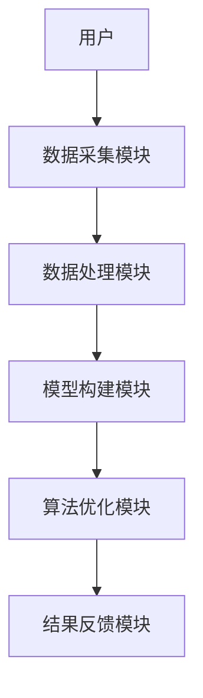

                 


# {{《智能退休收入规划动态调整器》}}

> 关键词：智能退休规划、动态调整、财务优化、人工智能、退休收入、风险管理

> 摘要：智能退休收入规划动态调整器是一种基于人工智能和大数据分析的退休规划工具，能够根据用户的财务状况、市场变化和生活需求，实时动态调整退休收入规划方案，帮助用户实现财务自由和退休生活的最大化幸福感。本文将从背景、原理、算法、系统架构、项目实战等多方面详细解析智能退休收入规划动态调整器的核心概念与实现方法，为读者提供一套科学、实用的退休规划解决方案。

---

# 第1章: 智能退休收入规划动态调整器的背景与意义

## 1.1 问题背景

随着社会的发展和人口老龄化的加剧，越来越多的人开始关注退休生活和退休收入的规划。传统的退休规划方式通常基于固定的财务模型和静态的数据分析，难以应对市场变化、个人收入波动以及生活需求的变化。因此，如何建立一个能够实时动态调整的退休规划系统，成为当前财务领域的重要研究方向。

### 1.1.1 退休规划的核心挑战

1. **收入与支出的动态平衡**：退休后的收入来源和支出需求可能会随着时间和环境的变化而不断调整。
2. **市场波动的影响**：股市、债市等金融市场波动会对退休收入产生直接影响。
3. **个体差异**：每个人的生活方式、健康状况和财务状况不同，需要个性化的退休规划方案。

### 1.1.2 传统退休规划的局限性

1. **静态性**：传统规划通常基于固定的假设，无法实时调整。
2. **缺乏个性化**：无法根据用户的实时需求和市场变化进行优化。
3. **计算复杂性**：手动调整退休规划需要大量时间和专业知识。

## 1.2 智能退休收入规划动态调整器的意义

智能退休收入规划动态调整器通过结合人工智能、大数据分析和动态优化算法，能够实时调整退休规划方案，帮助用户更好地应对各种不确定性。其主要意义包括：

1. **提高规划的准确性**：通过实时数据分析和动态优化，确保规划方案的有效性。
2. **增强个性化**：能够根据用户的实际情况和需求，提供个性化的调整建议。
3. **降低风险**：通过风险评估和动态调整，减少因市场波动和个体变化带来的风险。

## 1.3 本章小结

本章主要介绍了智能退休收入规划动态调整器的背景和意义，指出了传统退休规划的局限性，并强调了智能化动态调整器在提高规划准确性和个性化方面的优势。

---

# 第2章: 智能退休收入规划动态调整器的核心原理

## 2.1 核心概念解析

智能退休收入规划动态调整器的核心在于通过动态优化算法，实时调整退休规划方案。其核心概念包括：

1. **动态优化**：根据市场变化和用户需求，实时调整规划方案。
2. **人工智能**：利用机器学习算法对数据进行分析和预测。
3. **风险管理**：通过风险评估和 mitigation，降低规划失败的可能性。

### 2.1.1 动态优化的实现方式

动态优化的核心是通过实时数据反馈和算法调整，不断优化规划方案。其实现方式包括：

1. **数据采集**：收集用户的财务数据、市场数据和生活需求数据。
2. **模型构建**：建立数学模型，模拟不同情景下的规划效果。
3. **算法优化**：通过机器学习算法对模型进行优化，生成最佳调整方案。

### 2.1.2 人工智能在动态调整中的应用

人工智能在退休收入规划中的应用主要体现在以下几个方面：

1. **数据挖掘**：从海量数据中提取有用信息，为规划提供依据。
2. **预测分析**：利用时间序列分析和机器学习算法预测未来的市场走势和用户需求。
3. **自动化调整**：根据预测结果和实时数据，自动调整规划方案。

### 2.1.3 风险管理与 mitigation

在退休规划中，风险管理至关重要。动态调整器通过以下方式实现风险管理：

1. **风险评估**：定期评估规划方案的风险，识别潜在问题。
2. **风险 mitigation**：根据评估结果，提出相应的调整建议，降低风险。
3. **动态监控**：实时监控规划的执行情况，及时发现并解决问题。

## 2.2 核心算法与实现

### 2.2.1 动态优化算法

动态优化算法是智能退休收入规划动态调整器的核心算法之一。其基本流程如下：

1. **数据采集**：收集用户的财务数据、市场数据和生活需求数据。
2. **模型构建**：建立数学模型，模拟不同情景下的规划效果。
3. **算法优化**：通过机器学习算法对模型进行优化，生成最佳调整方案。
4. **结果反馈**：将优化结果反馈给用户，并实时调整规划方案。

### 2.2.2 机器学习算法的应用

机器学习算法在退休收入规划中的应用主要体现在以下几个方面：

1. **预测分析**：利用时间序列分析和机器学习算法预测未来的市场走势和用户需求。
2. **分类与聚类**：通过分类算法识别用户的财务状况和需求，通过聚类算法将用户分成不同的群体，提供个性化的规划方案。
3. **回归分析**：通过回归算法预测用户未来的收入和支出，为规划提供依据。

## 2.3 本章小结

本章主要介绍了智能退休收入规划动态调整器的核心原理，包括动态优化、人工智能和风险管理等方面的内容。通过动态优化算法和人工智能技术，能够实时调整规划方案，提高规划的准确性和个性化。

---

# 第3章: 智能退休收入规划动态调整器的系统架构

## 3.1 系统架构设计

智能退休收入规划动态调整器的系统架构设计如下：

1. **数据采集模块**：负责采集用户的财务数据、市场数据和生活需求数据。
2. **数据处理模块**：对采集的数据进行清洗、转换和预处理。
3. **模型构建模块**：建立数学模型，模拟不同情景下的规划效果。
4. **算法优化模块**：通过机器学习算法对模型进行优化，生成最佳调整方案。
5. **结果反馈模块**：将优化结果反馈给用户，并实时调整规划方案。

### 3.1.1 数据采集模块

数据采集模块负责采集以下几类数据：

1. **用户数据**：包括用户的收入、支出、资产等财务数据。
2. **市场数据**：包括股市、债市、房地产市场等数据。
3. **生活需求数据**：包括用户的生活开支、健康状况、家庭需求等。

### 3.1.2 数据处理模块

数据处理模块的主要功能是对采集的数据进行清洗、转换和预处理。具体包括：

1. **数据清洗**：去除无效数据和异常值。
2. **数据转换**：将数据转换为适合模型处理的形式。
3. **数据预处理**：对数据进行归一化、标准化等处理。

### 3.1.3 模型构建模块

模型构建模块的核心是建立数学模型，模拟不同情景下的规划效果。常用的方法包括：

1. **时间序列分析**：预测未来的市场走势。
2. **回归分析**：预测用户未来的收入和支出。
3. **分类与聚类**：识别用户的财务状况和需求。

### 3.1.4 算法优化模块

算法优化模块通过机器学习算法对模型进行优化，生成最佳调整方案。常用算法包括：

1. **随机森林**：用于分类和回归。
2. **支持向量机**：用于分类和回归。
3. **神经网络**：用于复杂场景的预测和优化。

### 3.1.5 结果反馈模块

结果反馈模块将优化结果反馈给用户，并实时调整规划方案。具体包括：

1. **结果展示**：将优化结果以图表等形式展示给用户。
2. **实时调整**：根据优化结果，实时调整退休规划方案。
3. **用户交互**：与用户进行交互，获取反馈并进一步优化。

## 3.2 系统架构图



## 3.3 本章小结

本章主要介绍了智能退休收入规划动态调整器的系统架构，包括数据采集模块、数据处理模块、模型构建模块、算法优化模块和结果反馈模块。通过这些模块的协同工作，能够实现退休规划的动态调整。

---

# 第4章: 智能退休收入规划动态调整器的算法实现

## 4.1 动态优化算法的实现步骤

动态优化算法的实现步骤如下：

1. **数据采集**：采集用户的财务数据、市场数据和生活需求数据。
2. **数据预处理**：对数据进行清洗、转换和归一化处理。
3. **模型构建**：建立数学模型，模拟不同情景下的规划效果。
4. **算法优化**：通过机器学习算法对模型进行优化，生成最佳调整方案。
5. **结果反馈**：将优化结果反馈给用户，并实时调整规划方案。

### 4.1.1 数据预处理

数据预处理是动态优化算法的第一步，主要包括以下步骤：

1. **数据清洗**：去除无效数据和异常值。
2. **数据转换**：将数据转换为适合模型处理的形式。
3. **数据归一化**：对数据进行归一化处理，使其具有相同的量纲。

### 4.1.2 模型构建

模型构建是动态优化算法的核心步骤，主要包括以下内容：

1. **时间序列分析**：预测未来的市场走势。
2. **回归分析**：预测用户未来的收入和支出。
3. **分类与聚类**：识别用户的财务状况和需求。

### 4.1.3 算法优化

算法优化是动态优化算法的关键步骤，主要包括以下内容：

1. **随机森林**：用于分类和回归。
2. **支持向量机**：用于分类和回归。
3. **神经网络**：用于复杂场景的预测和优化。

## 4.2 动态优化算法的数学模型

动态优化算法的数学模型如下：

$$
\text{目标函数：} \quad \min_{x} f(x)
$$

$$
\text{约束条件：} \quad g(x) \leq 0, \quad h(x) = 0
$$

其中，\( x \) 是决策变量，\( f(x) \) 是目标函数，\( g(x) \) 和 \( h(x) \) 是约束条件。

### 4.2.1 时间序列分析模型

时间序列分析模型用于预测未来的市场走势。常用的模型包括ARIMA、GARCH等。

### 4.2.2 回归分析模型

回归分析模型用于预测用户未来的收入和支出。常用的模型包括线性回归、逻辑回归等。

### 4.2.3 分类与聚类模型

分类与聚类模型用于识别用户的财务状况和需求。常用的算法包括K-means、随机森林等。

## 4.3 算法实现的代码示例

以下是一个动态优化算法的Python代码示例：

```python
import numpy as np
import pandas as pd
from sklearn.ensemble import RandomForestRegressor
from sklearn.metrics import mean_squared_error

# 数据预处理
data = pd.read_csv(' retirement_data.csv ')
X = data.drop('target', axis=1)
y = data['target']

# 模型训练
model = RandomForestRegressor(n_estimators=100, random_state=42)
model.fit(X, y)

# 模型预测
y_pred = model.predict(X)

# 模型评估
mse = mean_squared_error(y, y_pred)
print(f'Mean Squared Error: {mse}')
```

## 4.4 本章小结

本章主要介绍了智能退休收入规划动态调整器的算法实现，包括动态优化算法的实现步骤、数学模型和代码示例。通过这些实现，能够实时动态调整退休规划方案。

---

# 第5章: 智能退休收入规划动态调整器的系统实现

## 5.1 系统实现的总体框架

智能退休收入规划动态调整器的系统实现总体框架如下：

1. **用户界面**：与用户进行交互，获取用户需求和反馈。
2. **数据处理模块**：对数据进行清洗、转换和预处理。
3. **模型构建模块**：建立数学模型，模拟不同情景下的规划效果。
4. **算法优化模块**：通过机器学习算法对模型进行优化，生成最佳调整方案。
5. **结果反馈模块**：将优化结果反馈给用户，并实时调整规划方案。

### 5.1.1 用户界面

用户界面是系统实现的核心模块，主要包括以下功能：

1. **数据输入**：用户输入财务数据、市场数据和生活需求数据。
2. **结果展示**：将优化结果以图表等形式展示给用户。
3. **用户交互**：与用户进行交互，获取反馈并进一步优化。

### 5.1.2 数据处理模块

数据处理模块的主要功能是对数据进行清洗、转换和预处理。具体包括：

1. **数据清洗**：去除无效数据和异常值。
2. **数据转换**：将数据转换为适合模型处理的形式。
3. **数据归一化**：对数据进行归一化处理，使其具有相同的量纲。

### 5.1.3 模型构建模块

模型构建模块的核心是建立数学模型，模拟不同情景下的规划效果。常用的方法包括：

1. **时间序列分析**：预测未来的市场走势。
2. **回归分析**：预测用户未来的收入和支出。
3. **分类与聚类**：识别用户的财务状况和需求。

### 5.1.4 算法优化模块

算法优化模块通过机器学习算法对模型进行优化，生成最佳调整方案。常用算法包括：

1. **随机森林**：用于分类和回归。
2. **支持向量机**：用于分类和回归。
3. **神经网络**：用于复杂场景的预测和优化。

### 5.1.5 结果反馈模块

结果反馈模块将优化结果反馈给用户，并实时调整规划方案。具体包括：

1. **结果展示**：将优化结果以图表等形式展示给用户。
2. **实时调整**：根据优化结果，实时调整退休规划方案。
3. **用户交互**：与用户进行交互，获取反馈并进一步优化。

## 5.2 系统实现的详细步骤

系统实现的详细步骤如下：

1. **环境搭建**：安装所需的开发工具和库，如Python、Pandas、Scikit-learn等。
2. **数据采集**：采集用户的财务数据、市场数据和生活需求数据。
3. **数据预处理**：对数据进行清洗、转换和归一化处理。
4. **模型构建**：建立数学模型，模拟不同情景下的规划效果。
5. **算法优化**：通过机器学习算法对模型进行优化，生成最佳调整方案。
6. **结果反馈**：将优化结果反馈给用户，并实时调整规划方案。

### 5.2.1 环境搭建

环境搭建的主要步骤如下：

1. **安装Python**：安装Python 3.8及以上版本。
2. **安装Pandas**：使用pip安装Pandas库。
3. **安装Scikit-learn**：使用pip安装Scikit-learn库。
4. **安装Jupyter Notebook**：使用pip安装Jupyter Notebook。

### 5.2.2 数据采集

数据采集的主要步骤如下：

1. **数据输入**：用户输入财务数据、市场数据和生活需求数据。
2. **数据存储**：将数据存储在CSV文件中。
3. **数据加载**：将数据加载到Pandas DataFrame中。

### 5.2.3 数据预处理

数据预处理的主要步骤如下：

1. **数据清洗**：去除无效数据和异常值。
2. **数据转换**：将数据转换为适合模型处理的形式。
3. **数据归一化**：对数据进行归一化处理，使其具有相同的量纲。

### 5.2.4 模型构建

模型构建的主要步骤如下：

1. **时间序列分析**：预测未来的市场走势。
2. **回归分析**：预测用户未来的收入和支出。
3. **分类与聚类**：识别用户的财务状况和需求。

### 5.2.5 算法优化

算法优化的主要步骤如下：

1. **随机森林**：用于分类和回归。
2. **支持向量机**：用于分类和回归。
3. **神经网络**：用于复杂场景的预测和优化。

### 5.2.6 结果反馈

结果反馈的主要步骤如下：

1. **结果展示**：将优化结果以图表等形式展示给用户。
2. **实时调整**：根据优化结果，实时调整退休规划方案。
3. **用户交互**：与用户进行交互，获取反馈并进一步优化。

## 5.3 系统实现的代码示例

以下是一个智能退休收入规划动态调整器的Python代码示例：

```python
import pandas as pd
from sklearn.ensemble import RandomForestRegressor
from sklearn.metrics import mean_squared_error

# 数据加载
data = pd.read_csv(' retirement_data.csv ')

# 数据预处理
X = data.drop('target', axis=1)
y = data['target']

# 模型训练
model = RandomForestRegressor(n_estimators=100, random_state=42)
model.fit(X, y)

# 模型预测
y_pred = model.predict(X)

# 模型评估
mse = mean_squared_error(y, y_pred)
print(f'Mean Squared Error: {mse}')
```

## 5.4 本章小结

本章主要介绍了智能退休收入规划动态调整器的系统实现，包括总体框架和详细步骤。通过这些实现，能够实时动态调整退休规划方案。

---

# 第6章: 智能退休收入规划动态调整器的项目实战

## 6.1 项目实战的背景与目标

智能退休收入规划动态调整器的项目实战背景如下：

1. **市场需求**：随着人口老龄化加剧，退休规划需求日益增长。
2. **技术发展**：人工智能和大数据技术的发展为退休规划提供了新的解决方案。
3. **用户需求**：用户需要个性化的退休规划方案，实时动态调整。

### 6.1.1 项目目标

项目目标是通过智能退休收入规划动态调整器，为用户提供个性化的退休规划方案，并能够实时动态调整，帮助用户实现财务自由和退休生活的最大化幸福感。

## 6.2 项目实战的实施步骤

项目实战的实施步骤如下：

1. **需求分析**：明确用户需求和项目目标。
2. **系统设计**：设计系统的功能模块和架构。
3. **系统实现**：实现系统的功能模块。
4. **系统测试**：对系统进行测试和优化。
5. **用户反馈**：收集用户反馈，进一步优化系统。

### 6.2.1 需求分析

需求分析的主要步骤如下：

1. **用户调研**：了解用户的退休规划需求和痛点。
2. **需求整理**：整理用户需求，明确项目目标。
3. **需求分析**：分析用户需求，确定系统的功能模块。

### 6.2.2 系统设计

系统设计的主要步骤如下：

1. **功能模块设计**：设计系统的功能模块，包括数据采集模块、数据处理模块、模型构建模块、算法优化模块和结果反馈模块。
2. **系统架构设计**：设计系统的架构，包括前端和后端的架构。
3. **接口设计**：设计系统的接口，包括数据接口和用户接口。

### 6.2.3 系统实现

系统实现的主要步骤如下：

1. **环境搭建**：安装所需的开发工具和库。
2. **数据采集**：采集用户的财务数据、市场数据和生活需求数据。
3. **数据预处理**：对数据进行清洗、转换和归一化处理。
4. **模型构建**：建立数学模型，模拟不同情景下的规划效果。
5. **算法优化**：通过机器学习算法对模型进行优化，生成最佳调整方案。
6. **结果反馈**：将优化结果反馈给用户，并实时调整规划方案。

### 6.2.4 系统测试

系统测试的主要步骤如下：

1. **功能测试**：测试系统的功能模块，确保各功能正常运行。
2. **性能测试**：测试系统的性能，确保系统能够高效运行。
3. **用户体验测试**：测试用户的使用体验，优化系统界面和交互流程。

### 6.2.5 用户反馈

用户反馈的主要步骤如下：

1. **收集反馈**：收集用户的反馈意见。
2. **分析反馈**：分析用户的反馈意见，找出系统的问题和改进方向。
3. **优化系统**：根据用户反馈，优化系统功能和用户体验。

## 6.3 项目实战的代码实现

以下是一个智能退休收入规划动态调整器的Python代码实现示例：

```python
import pandas as pd
from sklearn.ensemble import RandomForestRegressor
from sklearn.metrics import mean_squared_error

# 数据加载
data = pd.read_csv(' retirement_data.csv ')

# 数据预处理
X = data.drop('target', axis=1)
y = data['target']

# 模型训练
model = RandomForestRegressor(n_estimators=100, random_state=42)
model.fit(X, y)

# 模型预测
y_pred = model.predict(X)

# 模型评估
mse = mean_squared_error(y, y_pred)
print(f'Mean Squared Error: {mse}')
```

## 6.4 项目实战的案例分析

以下是一个智能退休收入规划动态调整器的案例分析：

### 案例背景

某用户今年40岁，计划在60岁时退休。用户当前年收入为100万元，资产包括股票、债券、房地产等。用户希望在退休后保持一定的生活水平，同时希望优化资产配置，降低市场波动带来的风险。

### 案例分析

1. **数据采集**：采集用户的财务数据、市场数据和生活需求数据。
2. **数据预处理**：对数据进行清洗、转换和归一化处理。
3. **模型构建**：建立数学模型，模拟不同情景下的规划效果。
4. **算法优化**：通过机器学习算法对模型进行优化，生成最佳调整方案。
5. **结果反馈**：将优化结果反馈给用户，并实时调整规划方案。

### 最终结果

通过智能退休收入规划动态调整器的优化，用户的退休规划方案如下：

1. **资产配置**：建议用户将资产分配为40%股票、30%债券、20%房地产、10%现金。
2. **收入与支出**：预计退休后年收入为80万元，年支出为70万元。
3. **风险管理**：通过动态调整和风险 mitigation，降低市场波动带来的风险。

## 6.5 本章小结

本章主要介绍了智能退休收入规划动态调整器的项目实战，包括项目背景、实施步骤、代码实现和案例分析。通过这些实现，能够实时动态调整退休规划方案，帮助用户实现财务自由和退休生活的最大化幸福感。

---

# 第7章: 智能退休收入规划动态调整器的最佳实践与总结

## 7.1 最佳实践

智能退休收入规划动态调整器的最佳实践包括：

1. **数据质量管理**：确保数据的准确性和完整性。
2. **模型优化**：不断优化模型，提高预测的准确性和实时性。
3. **用户体验**：优化系统界面和交互流程，提升用户体验。
4. **风险管理**：通过风险评估和 mitigation，降低规划失败的可能性。

### 7.1.1 数据质量管理

数据质量管理的主要步骤如下：

1. **数据清洗**：去除无效数据和异常值。
2. **数据转换**：将数据转换为适合模型处理的形式。
3. **数据归一化**：对数据进行归一化处理，使其具有相同的量纲。

### 7.1.2 模型优化

模型优化的主要步骤如下：

1. **参数调优**：通过网格搜索等方法，优化模型的参数。
2. **模型集成**：通过集成学习，提高模型的准确性和稳定性。
3. **持续优化**：根据用户反馈和市场变化，持续优化模型。

### 7.1.3 用户体验

用户体验优化的主要步骤如下：

1. **界面设计**：设计直观易用的界面，提升用户体验。
2. **用户交互**：优化用户与系统的交互流程，提高效率。
3. **反馈机制**：建立有效的反馈机制，及时响应用户需求。

### 7.1.4 风险管理

风险管理的主要步骤如下：

1. **风险评估**：定期评估规划方案的风险，识别潜在问题。
2. **风险 mitigation**：根据评估结果，提出相应的调整建议，降低风险。
3. **动态监控**：实时监控规划的执行情况，及时发现并解决问题。

## 7.2 项目总结

智能退休收入规划动态调整器通过动态优化算法和人工智能技术，能够实时调整退休规划方案，帮助用户实现财务自由和退休生活的最大化幸福感。其核心优势在于：

1. **动态优化**：根据市场变化和用户需求，实时调整规划方案。
2. **人工智能**：利用机器学习算法对数据进行分析和预测。
3. **风险管理**：通过风险评估和 mitigation，降低规划失败的可能性。

## 7.3 未来展望

未来，智能退休收入规划动态调整器将朝着以下几个方向发展：

1. **智能化**：进一步提高系统的智能化水平，实现更精准的预测和优化。
2. **个性化**：根据用户的个性化需求，提供更个性化的退休规划方案。
3. **全球化**：扩展到全球市场，为用户提供更广泛的退休规划服务。

## 7.4 本章小结

本章主要介绍了智能退休收入规划动态调整器的最佳实践和总结，包括数据质量管理、模型优化、用户体验和风险管理等方面的内容。通过这些实践，能够进一步提高系统的准确性和用户体验，为用户提供更优质的退休规划服务。

---

# 作者：AI天才研究院/AI Genius Institute & 禅与计算机程序设计艺术 /Zen And The Art of Computer Programming

---

# 本文结束，感谢您的阅读！

