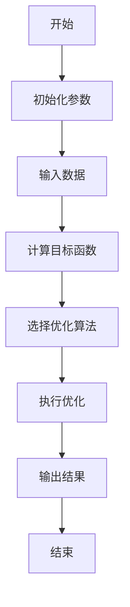
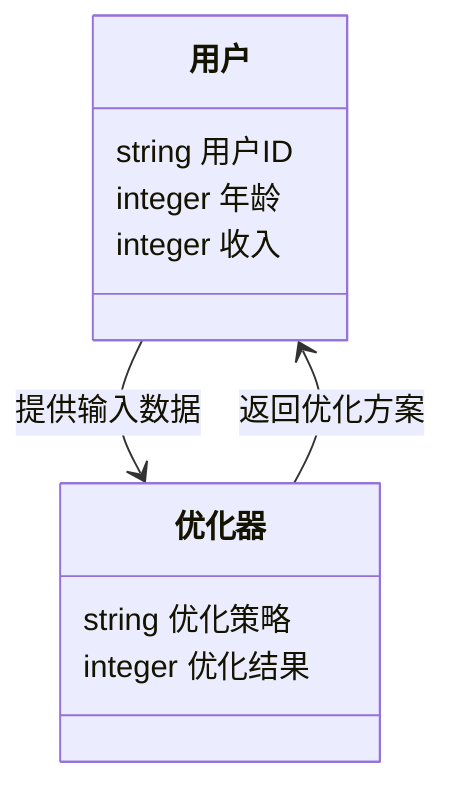

                 


# 《智能退休计划优化器》

> **关键词**：智能退休计划优化器，算法优化，人工智能，退休规划，投资组合优化，财务风险管理，智能决策系统

> **摘要**：  
《智能退休计划优化器》是一本深入探讨如何利用人工智能技术优化退休计划的权威指南。本书从基本概念出发，逐步解析智能优化器的核心原理、算法实现、系统架构，再到实际项目实战，最后展望未来发展方向。通过丰富的案例分析和详细的技术解读，帮助读者掌握智能退休计划优化器的设计与应用，为个人和机构提供科学的退休规划解决方案。

---

# 目录

## 第一章：智能退休计划优化器概述

### 1.1 退休计划优化的背景与问题背景
- 1.1.1 退休计划优化的必要性
- 1.1.2 当前退休计划的主要问题
- 1.1.3 智能优化的核心价值

### 1.2 智能退休计划优化器的核心概念
- 1.2.1 优化器的基本定义
- 1.2.2 核心要素与概念结构
- 1.2.3 边界与外延分析

## 第二章：智能退休计划优化器的核心概念与联系

### 2.1 核心概念原理
- 2.1.1 优化算法的基本原理
- 2.1.2 数据驱动的优化方法
- 2.1.3 人工智能在优化中的应用

### 2.2 核心概念属性特征对比
- 2.2.1 优化目标的特征对比
- 2.2.2 数据输入的特征对比
- 2.2.3 优化结果的特征对比

### 2.3 ER实体关系图
```mermaid
erDiagram
    actor 用户 {
        string 用户ID
        string 用户名
        integer 年龄
        integer 收入
    }
    actor 优化器 {
        string 优化器ID
        string 优化策略
        integer 优化结果
    }
    用户 --> 优化器 : 提供输入数据
    优化器 --> 用户 : 返回优化方案
```

## 第三章：智能退休计划优化器的算法原理

### 3.1 算法原理概述
- 3.1.1 强化学习的基本原理
- 3.1.2 动态规划的应用
- 3.1.3 遗传算法的原理

### 3.2 算法流程图


### 3.3 算法实现代码
```python
def optimize RetirementPlan(inputs):
    # 输入数据预处理
    processed_inputs = preprocess(inputs)
    # 初始化优化器
    optimizer = RetirementOptimizer()
    # 执行优化
    result = optimizer.run(processed_inputs)
    return result
```

## 第四章：数学模型与公式

### 4.1 收益最大化模型
$$\text{收益最大化} = \max_{x} \sum_{i=1}^{n} r_i x_i$$
其中，$r_i$ 是第 $i$ 个投资组合的收益率，$x_i$ 是投资比例。

### 4.2 风险最小化模型
$$\text{风险最小化} = \min_{x} \sum_{i=1}^{n} w_i (x_i - \mu_i)^2$$
其中，$w_i$ 是风险权重，$\mu_i$ 是第 $i$ 个投资组合的期望收益。

## 第五章：系统分析与架构设计

### 5.1 系统应用场景
- 用户输入个人财务数据
- 优化器根据数据生成最佳退休计划

### 5.2 系统功能设计


## 第六章：项目实战

### 6.1 环境安装
- 安装Python和必要的库（如NumPy、Pandas）

### 6.2 核心代码实现
```python
import numpy as np
import pandas as pd

def calculate_optimal_portfolio(returns, weights):
    # 计算优化结果
    result = np.min(weights * (returns - np.mean(returns))**2)
    return result
```

### 6.3 案例分析
- 输入历史收益数据
- 输出最优投资组合

## 第七章：高级应用与未来展望

### 7.1 智能投资策略
- 利用机器学习模型预测市场趋势

### 7.2 风险管理
- 实时监控市场波动，动态调整投资组合

### 7.3 未来技术趋势
- 更智能的算法优化
- 多模态数据融合

## 第八章：总结与建议

### 8.1 核心内容回顾
- 优化器的基本原理和实现

### 8.2 小结与注意事项
- 数据质量的重要性
- 模型的局限性

## 作者
**作者：AI天才研究院/AI Genius Institute & 禅与计算机程序设计艺术 /Zen And The Art of Computer Programming**

---

这本书的目录设计注重逻辑性和实用性，从基础概念到高级应用，层层递进，为读者提供了全面的知识体系。

