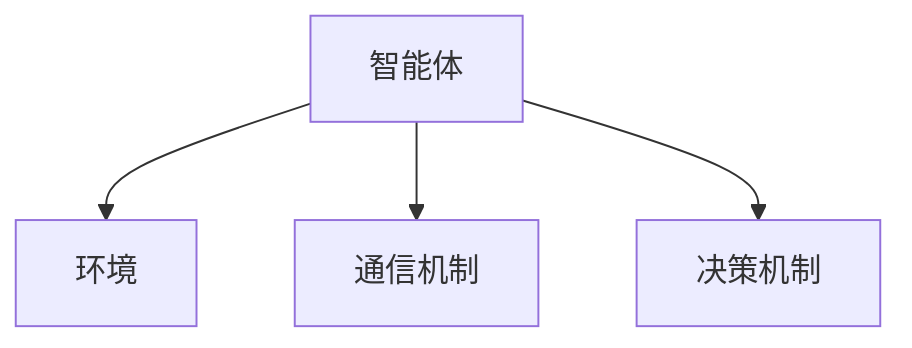
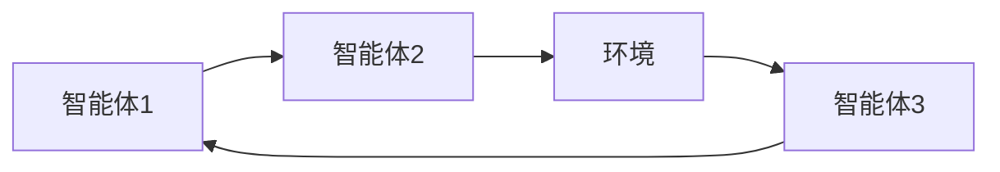
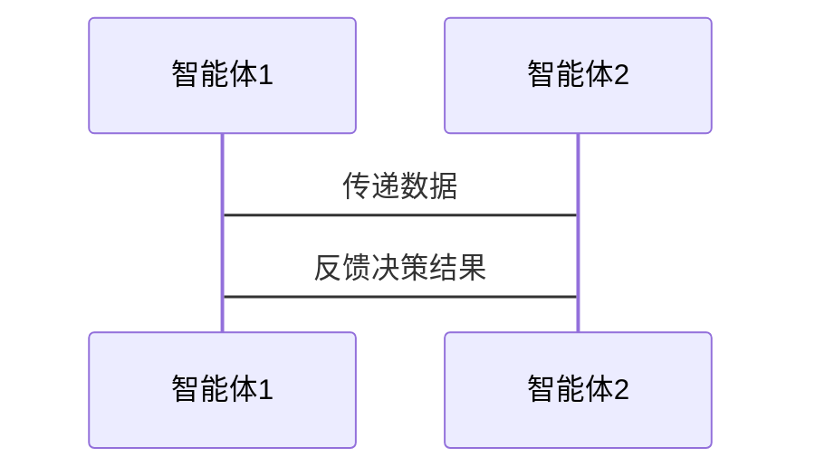

                 


# 智能金融中的多智能体协作：重塑价值投资流程

> 关键词：智能金融，多智能体协作，价值投资，算法原理，系统架构，项目实战

> 摘要：本文探讨了多智能体协作在智能金融中的应用，重点分析了其如何重塑传统价值投资流程。通过详细阐述多智能体协作的核心概念、算法原理、系统架构及项目实战，本文为读者提供了从理论到实践的全面指导。

---

## 第1章: 多智能体协作的基本概念与背景

### 1.1 多智能体协作的定义与特点
#### 1.1.1 多智能体协作的定义
多智能体协作（Multi-Agent Collaboration）是指多个智能体（Agent）通过共享信息、协同决策和共同行动，以实现共同目标的过程。与单智能体相比，多智能体协作能够利用多个智能体的互补优势，提升整体系统的智能性和灵活性。

#### 1.1.2 多智能体协作的核心特点
- **分布性**：多个智能体独立运行，通过通信和协调实现协作。
- **智能性**：每个智能体具备自主决策和问题解决能力。
- **协作性**：智能体之间通过共享信息和任务分配，共同完成复杂任务。
- **动态性**：协作过程具有高度的动态性，能够适应环境变化。

#### 1.1.3 多智能体协作与传统单智能体的区别
- **决策方式**：单智能体独立决策，多智能体通过协作决策。
- **计算复杂度**：单智能体计算简单，多智能体协作需要复杂的通信和协调机制。
- **适应性**：多智能体协作更具灵活性和适应性。

### 1.2 智能金融的背景与发展趋势
#### 1.2.1 智能金融的定义与内涵
智能金融（Intelligent Finance）是指利用人工智能、大数据、区块链等技术，提升金融业务的智能化水平，优化金融服务流程，提高决策效率和准确性。

#### 1.2.2 人工智能在金融领域的应用现状
- **智能投顾**：通过算法推荐投资组合。
- **风险控制**：利用机器学习模型评估信用风险。
- **高频交易**：借助算法快速执行交易指令。

#### 1.2.3 多智能体协作在智能金融中的重要性
- **提升决策效率**：通过多智能体协作，实现信息共享和快速决策。
- **优化资源配置**：多个智能体协同工作，提高资源利用效率。
- **增强适应性**：多智能体协作能够快速适应市场变化。

### 1.3 价值投资流程的现状与问题
#### 1.3.1 传统价值投资流程的特点
- **依赖人工分析**：主要依靠分析师的经验和判断。
- **信息处理效率低**：数据收集和分析耗时且容易出错。
- **决策风险高**：单点决策风险较高，缺乏灵活性。

#### 1.3.2 传统流程中的痛点与局限性
- **信息孤岛**：不同部门之间的信息共享不足。
- **决策延迟**：人工分析导致决策周期长。
- **风险集中**：单点决策导致风险集中。

#### 1.3.3 多智能体协作如何解决这些问题
- **信息共享**：多智能体协作能够实时共享信息，减少信息孤岛。
- **快速决策**：通过协作决策，缩短决策周期。
- **风险分散**：多个智能体协作，降低单点风险。

### 1.4 多智能体协作在智能金融中的应用前景
#### 1.4.1 多智能体协作的潜在应用场景
- **智能投顾**：多个智能体协作，为投资者提供个性化的投资建议。
- **风险控制**：多个智能体协作，实时监控和评估风险。
- **高频交易**：多个智能体协作，优化交易策略和执行效率。

#### 1.4.2 金融行业对多智能体协作的需求
- **提升效率**：金融机构需要更快的决策和执行速度。
- **降低成本**：通过协作减少人工干预，降低运营成本。
- **提高准确性**：多智能体协作能够提高数据分析和决策的准确性。

#### 1.4.3 多智能体协作技术的发展趋势
- **智能化**：智能体具备更强的自主学习和决策能力。
- **分布式**：协作过程更加分布式，提高系统的容错性和扩展性。
- **实时性**：协作过程更加实时，适应金融市场快速变化的需求。

---

## 第2章: 多智能体协作的核心概念与联系

### 2.1 多智能体协作的核心原理
#### 2.1.1 多智能体协作的理论基础
- **分布式系统理论**：研究多个独立组件如何协作完成任务。
- **博弈论**：分析多个智能体之间的策略互动和协作。
- **人工智能**：智能体具备自主学习和决策能力。

#### 2.1.2 多智能体协作的实现机制
- **通信机制**：智能体之间通过消息传递共享信息。
- **协调机制**：通过协商和任务分配实现协作。
- **决策机制**：基于共享信息和个体目标，做出协作决策。

#### 2.1.3 多智能体协作的关键技术
- **一致性算法**：确保分布式系统中数据的一致性。
- **分布式计算**：在分布式环境中进行计算和数据处理。
- **强化学习**：通过奖励机制优化智能体的协作行为。

### 2.2 多智能体协作的概念模型
#### 2.2.1 多智能体协作的概念模型介绍
多智能体协作的概念模型描述了智能体之间的关系、协作过程和目标实现方式。模型包括智能体、环境、通信机制和决策机制四个核心要素。

#### 2.2.2 多智能体协作的概念模型图（Mermaid）


### 2.3 多智能体协作的ER实体关系图
#### 2.3.1 多智能体协作的ER实体关系图（Mermaid）
```mermaid
er
    entity 智能体 {
        id: string
        role: string
        capability: string
    }
    entity 环境 {
        id: string
        state: string
        action: string
    }
    entity 通信机制 {
        id: string
        message: string
        channel: string
    }
```

### 2.4 多智能体协作的流程图
#### 2.4.1 多智能体协作的流程图（Mermaid）


---

## 第3章: 多智能体协作的算法原理与数学模型

### 3.1 多智能体协作的算法原理
#### 3.1.1 分布式一致性算法
分布式一致性算法（如Paxos、Raft）用于确保分布式系统中数据的一致性。

#### 3.1.2 分布式计算与通信协议
分布式计算通过将任务分解到多个节点上执行，通信协议确保节点之间的高效通信。

#### 3.1.3 强化学习在多智能体协作中的应用
强化学习通过奖励机制，优化智能体的协作行为，提升整体系统性能。

### 3.2 多智能体协作的数学模型与公式
#### 3.2.1 一致性算法的数学模型
一致性算法通过投票和协商确保系统中所有节点的数据一致。

#### 3.2.2 强化学习的数学模型
强化学习通过状态、动作和奖励的循环，优化智能体的决策策略。

$$ V(s) = \max_a Q(s, a) $$

---

## 第4章: 系统分析与架构设计

### 4.1 问题场景介绍
价值投资流程中的信息孤岛和决策延迟问题，可以通过多智能体协作技术进行优化。

### 4.2 系统功能设计
- **数据采集**：从多个数据源采集金融数据。
- **数据分析**：利用机器学习算法进行数据分析和预测。
- **决策协作**：多个智能体协作，制定投资策略。

### 4.3 系统架构设计


### 4.4 系统接口设计
- **通信接口**：智能体之间的消息传递接口。
- **数据接口**：与数据源的接口，用于数据采集和分析。

### 4.5 系统交互流程图


---

## 第5章: 项目实战

### 5.1 环境安装
安装必要的开发工具和库，如Python、TensorFlow、Kafka等。

### 5.2 核心代码实现
#### 5.2.1 分布式一致性算法的实现
```python
def consensus(nodes):
    # 实现一致性算法
    pass
```

#### 5.2.2 强化学习算法的实现
```python
def reinforcement_learning(env):
    # 实现强化学习算法
    pass
```

### 5.3 案例分析
通过具体案例展示多智能体协作在价值投资流程中的应用。

### 5.4 项目小结
总结项目实施的经验和教训，提出改进建议。

---

## 第6章: 最佳实践与总结

### 6.1 最佳实践 tips
- **选择合适的算法**：根据具体需求选择合适的多智能体协作算法。
- **确保通信效率**：优化智能体之间的通信机制，提高协作效率。

### 6.2 小结
多智能体协作在智能金融中的应用前景广阔，能够显著提升价值投资流程的效率和准确性。

### 6.3 注意事项
- **数据安全**：确保数据在传输和存储过程中的安全性。
- **系统容错性**：设计容错机制，确保系统在部分节点故障时仍能正常运行。

### 6.4 拓展阅读
推荐相关的书籍和论文，供读者进一步学习。

---

作者：AI天才研究院/AI Genius Institute & 禅与计算机程序设计艺术 /Zen And The Art of Computer Programming

