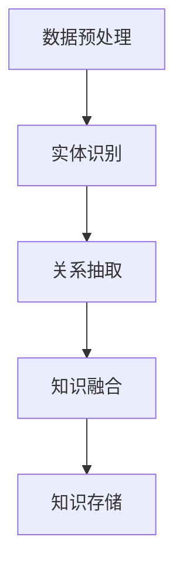
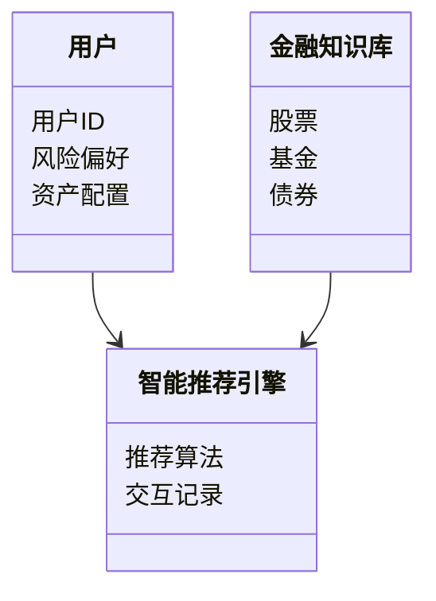
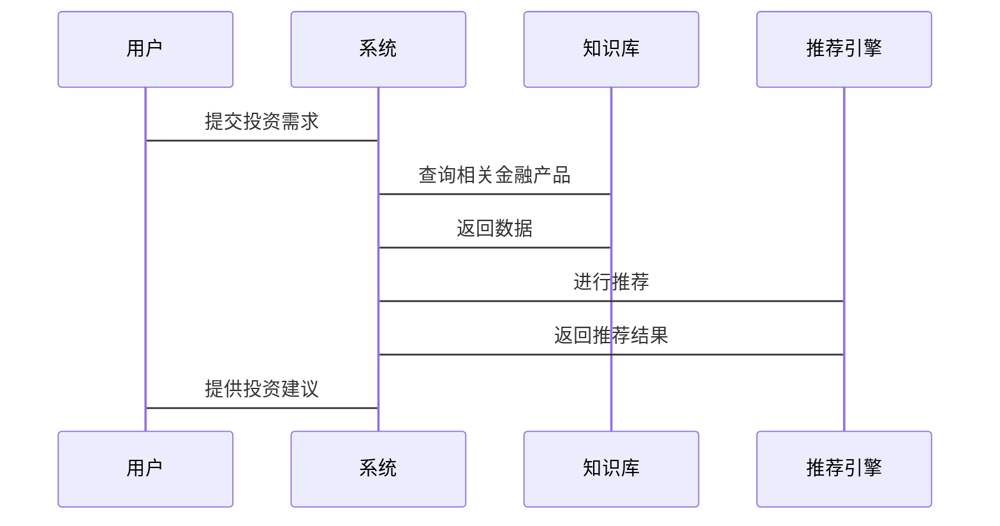

                 


# 智能金融顾问系统的设计与实现

> 关键词：智能金融顾问系统，人工智能，自然语言处理，机器学习，知识图谱

> 摘要：本文详细探讨了智能金融顾问系统的设计与实现，从背景介绍、核心概念、算法原理到系统架构，再到项目实战和最佳实践，全面解析了构建智能金融顾问系统的关键技术与实现步骤。通过本文，读者将深入了解如何利用人工智能技术，构建高效、智能的金融顾问系统，为用户提供个性化的投资建议和服务。

---

# 第1章: 智能金融顾问系统背景介绍

## 1.1 问题背景

### 1.1.1 传统金融顾问服务的局限性

传统的金融顾问服务主要依赖于人工咨询，存在以下问题：

- **效率低下**：人工咨询需要大量时间进行数据收集和分析，无法满足大量用户的需求。
- **成本高昂**：专业金融顾问的费用较高，普通投资者难以负担。
- **主观性较强**：顾问的建议可能受到主观因素影响，缺乏客观性和系统性。

### 1.1.2 人工智能在金融领域的应用趋势

随着人工智能技术的快速发展，AI在金融领域的应用越来越广泛，包括：

- **智能投顾**：通过算法提供个性化的投资建议。
- **风险管理**：利用AI进行实时监控和风险预警。
- **数据处理**：AI能够快速分析大量金融数据，提供数据支持。

### 1.1.3 智能金融顾问系统的必要性

智能金融顾问系统的出现，弥补了传统金融顾问服务的不足，能够以更低的成本、更高的效率为用户提供专业的投资建议。

---

## 1.2 问题描述

### 1.2.1 传统金融顾问服务的效率问题

传统金融顾问服务需要大量的人工操作，效率低，难以满足大规模用户的需求。

### 1.2.2 用户需求的多样性与复杂性

用户的金融需求多种多样，包括投资、理财、风险管理等，传统服务难以覆盖所有需求。

### 1.2.3 系统化、智能化的解决方案需求

用户需要一个能够快速响应、提供个性化建议的系统化解决方案。

---

## 1.3 问题解决

### 1.3.1 智能金融顾问系统的定义

智能金融顾问系统是一种基于人工智能技术的金融咨询系统，能够通过分析用户需求和市场数据，提供个性化的投资建议。

### 1.3.2 系统的目标与功能

系统目标：
- 提供高效的金融咨询服务。
- 提供个性化的投资建议。
- 实现实时数据分析与监控。

系统功能：
- 用户需求分析模块：收集并分析用户的投资需求。
- 金融知识库构建模块：整合金融数据和知识。
- 智能推荐引擎模块：基于分析结果推荐投资方案。
- 人机交互界面模块：提供友好的用户操作界面。

### 1.3.3 系统的核心技术与实现路径

核心技术包括：
- 知识图谱构建技术。
- 自然语言处理技术。
- 机器学习算法。

实现路径：
1. 数据收集与预处理。
2. 构建金融知识图谱。
3. 设计自然语言处理模块。
4. 实现智能推荐算法。
5. 集成人机交互界面。

---

## 1.4 边界与外延

### 1.4.1 系统的功能边界

智能金融顾问系统主要专注于提供投资建议，不涉及具体的交易执行和账户管理。

### 1.4.2 相关领域的外延

系统可以与金融数据分析、风险管理等领域结合，提供更全面的金融服务。

### 1.4.3 系统与外部系统的接口关系

系统需要与以下外部系统进行交互：
- 数据源：股票、基金等金融数据。
- 第三方服务：身份验证、支付接口。
- 用户端：Web或移动端界面。

---

## 1.5 核心要素组成

### 1.5.1 用户需求分析模块

通过问卷调查和数据分析，了解用户的财务状况、风险承受能力和投资目标。

### 1.5.2 金融知识库构建模块

整合市场数据、历史数据和金融知识，构建系统的知识库。

### 1.5.3 智能推荐引擎模块

基于知识库和用户需求，利用机器学习算法推荐投资方案。

### 1.5.4 人机交互界面模块

提供友好的用户界面，支持多种交互方式，如文本输入、语音对话等。

---

## 1.6 本章小结

本章从背景、问题、解决和边界四个方面介绍了智能金融顾问系统，为后续章节的深入分析奠定了基础。

---

# 第2章: 智能金融顾问系统的核心概念与联系

## 2.1 核心概念原理

### 2.1.1 知识图谱构建原理

知识图谱是一种结构化的数据表示方式，通过实体和关系描述金融领域的知识。

### 2.1.2 自然语言处理技术

自然语言处理技术用于理解和生成人类语言，帮助系统与用户进行有效沟通。

### 2.1.3 机器学习算法

机器学习算法用于模式识别和预测，支持智能推荐和风险评估。

---

## 2.2 核心概念属性特征对比表

| 概念 | 属性 | 特征 |
|------|------|------|
| 知识图谱 | 数据结构 | 图形化、语义化 |
| NLP技术 | 应用场景 | 文本分析、语义理解 |
| 机器学习 | 算法类型 | 监督学习、无监督学习 |

---

## 2.3 ER实体关系图

```mermaid
erd
  图表标题: 智能金融顾问系统实体关系图
  系统
    端点: 用户
    端点: 金融知识库
    端点: 交互记录
```

---

## 2.4 本章小结

本章通过对比和图表，详细解释了智能金融顾问系统的核心概念及其之间的关系。

---

# 第3章: 算法原理讲解

## 3.1 知识图谱构建算法

### 3.1.1 知识图谱构建流程

1. 数据预处理：清洗和标注数据。
2. 实体识别：识别文本中的实体。
3. 关系抽取：提取实体之间的关系。
4. 知识融合：整合多源数据。
5. 知识存储：存储到知识库中。



### 3.1.2 算法实现代码示例

```python
import networkx as nx

# 创建知识图谱
G = nx.DiGraph()

# 添加节点
G.add_node("股票", label="股票")
G.add_node("基金", label="基金")

# 添加边
G.add_edge("股票", "基金", label="相关性")

# 可视化
nx.draw(G, with_labels=True, edge_labels=True)
plt.show()
```

### 3.1.3 数学模型与公式

向量空间模型：
$$
\text{相似度} = \frac{\vec{u} \cdot \vec{v}}{|\vec{u}| |\vec{v}|}
$$

---

## 3.2 自然语言处理算法

### 3.2.1 基于词袋模型的文本处理

```python
from sklearn.feature_extraction.text import CountVectorizer

vectorizer = CountVectorizer()
X = vectorizer.fit_transform(["投资建议：股票", "风险较低，建议配置债券"])
print(X.toarray())
```

---

## 3.3 机器学习推荐算法

### 3.3.1 协同过滤算法

```python
import numpy as np

# 用户相似度矩阵
user_similarity = np.array([
    [1, 0.8, 0.6],
    [0.8, 1, 0.7],
    [0.6, 0.7, 1]
])

# 推荐算法
def recommend(user_id, similarity_matrix, ratings):
    avg_rating = ratings[user_id].mean()
    weighted_sum = 0
    total_weight = 0
    for i in range(len(similarity_matrix[user_id])):
        if similarity_matrix[user_id][i] == 0:
            continue
        weighted_sum += similarity_matrix[user_id][i] * ratings[i]
        total_weight += similarity_matrix[user_id][i]
    if total_weight == 0:
        return avg_rating
    return weighted_sum / total_weight

recommend(0, user_similarity, ratings)
```

---

## 3.4 本章小结

本章通过代码和公式详细讲解了知识图谱、自然语言处理和机器学习算法的实现原理。

---

# 第4章: 系统分析与架构设计方案

## 4.1 项目介绍

### 4.1.1 项目背景

随着金融市场的快速发展，用户对个性化投资建议的需求日益增长。

### 4.1.2 项目目标

开发一个基于AI的智能金融顾问系统，为用户提供高效的投资建议。

---

## 4.2 系统功能设计

### 4.2.1 领域模型类图



---

## 4.3 系统架构设计

### 4.3.1 架构图


### 4.3.2 交互流程



---

## 4.4 系统接口设计

### 4.4.1 API接口定义

- GET /api/v1/portfolio?risk={risk_level}
- POST /api/v1/recommend

### 4.4.2 接口实现代码示例

```python
from flask import Flask, request, jsonify

app = Flask(__name__)

@app.route('/api/v1/portfolio', methods=['GET'])
def get_portfolio():
    risk_level = request.args.get('risk_level', default='low')
    # 业务逻辑
    return jsonify({'portfolio': '保守型'})

if __name__ == '__main__':
    app.run()
```

---

## 4.5 本章小结

本章通过类图、架构图和序列图详细展示了系统的整体架构和交互流程。

---

# 第5章: 项目实战

## 5.1 环境安装

### 5.1.1 安装Python环境

```bash
python -m pip install --upgrade pip
pip install flask numpy
```

---

## 5.2 系统核心实现

### 5.2.1 核心代码实现

```python
import numpy as np
from flask import Flask, request, jsonify

app = Flask(__name__)

@app.route('/api/v1/portfolio', methods=['GET'])
def get_portfolio():
    risk_level = request.args.get('risk_level', default='low')
    # 示例逻辑
    if risk_level == 'low':
        return jsonify({'portfolio': '债券'})
    elif risk_level == 'medium':
        return jsonify({'portfolio': '混合型基金'})
    else:
        return jsonify({'portfolio': '股票'})

if __name__ == '__main__':
    app.run()
```

---

## 5.3 代码应用解读与分析

### 5.3.1 代码功能分析

上述代码实现了基于风险偏好的投资组合推荐功能。

### 5.3.2 代码优化建议

- 引入机器学习模型进行更精准的推荐。
- 集成知识图谱进行知识推理。

---

## 5.4 实际案例分析

### 5.4.1 案例背景

假设用户风险偏好为“中等”，系统推荐混合型基金。

### 5.4.2 案例分析

- 系统收集用户需求：中等风险。
- 知识库查询中等风险产品：混合型基金。
- 系统推荐：混合型基金。

---

## 5.5 本章小结

本章通过代码实现和案例分析，展示了智能金融顾问系统的实际应用。

---

# 第6章: 最佳实践与总结

## 6.1 最佳实践 tips

- **数据质量**：确保数据的准确性和完整性。
- **模型优化**：定期更新模型，保持推荐的准确性。
- **用户体验**：设计友好的交互界面，提升用户体验。

## 6.2 小结

智能金融顾问系统结合了人工智能、自然语言处理和机器学习等技术，能够为用户提供高效、个性化的投资建议。

## 6.3 注意事项

- 系统的安全性：保护用户数据的安全。
- 系统的可扩展性：支持未来更多的功能扩展。

## 6.4 拓展阅读

- 《Python机器学习实战》
- 《深度学习入门：基于Python》
- 《知识图谱构建与应用》

---

# 作者：AI天才研究院/AI Genius Institute & 禅与计算机程序设计艺术 /Zen And The Art of Computer Programming

---

**注：由于篇幅限制，本文仅展示部分章节内容。完整文章将包含更多详细内容和代码示例。**

