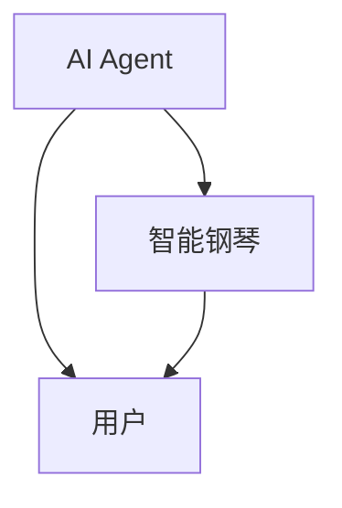
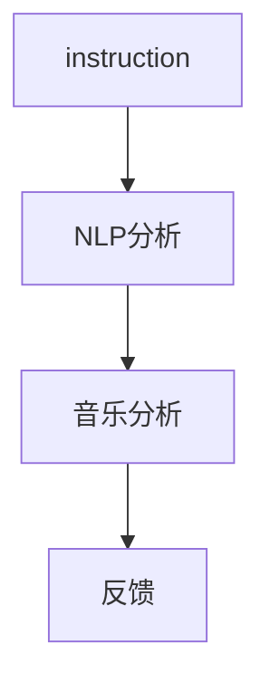
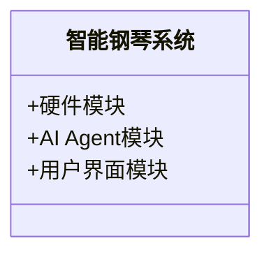
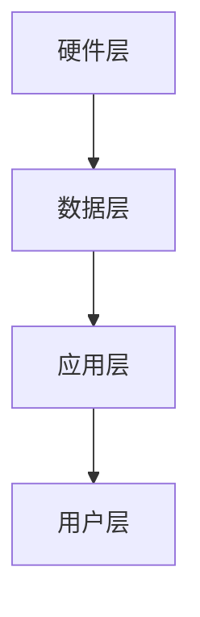
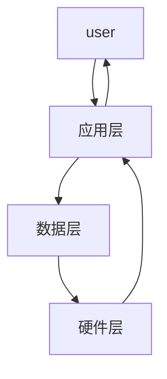

                 


# 智能钢琴：AI Agent的演奏技巧指导

## 关键词：
AI Agent, 智能钢琴, 演奏技巧, 音乐指导, 人工智能, 钢琴教育, 技术实现

## 摘要：
随着人工智能技术的飞速发展，智能钢琴与AI Agent的结合为钢琴演奏者提供了前所未有的学习和练习工具。本文从背景介绍、核心概念、算法原理、系统架构、项目实战到最佳实践，全面探讨了AI Agent在智能钢琴中的应用。通过详细分析AI Agent的工作原理，系统设计，以及实际项目案例，本文为读者提供了从理论到实践的完整指南，帮助钢琴演奏者提升技巧，实现更高效的音乐指导。

---

# 第一部分：智能钢琴与AI Agent的背景介绍

## 第1章：智能钢琴与AI Agent概述

### 1.1 智能钢琴的发展历程
1.1.1 传统钢琴的数字化演变  
传统钢琴通过机械结构产生音符，而智能钢琴通过数字技术实现了音色的模拟与演奏数据的记录。  

1.1.2 智能钢琴的定义与特点  
智能钢琴是一种结合了数字技术与传统钢琴的乐器，具有录音、 playback、 MIDI 接口、AI 分析等功能。  

1.1.3 智能钢琴在音乐教育中的应用  
智能钢琴能够实时分析演奏者的技巧，提供反馈，帮助学习者快速进步。  

### 1.2 AI Agent的基本概念  
1.2.1 什么是AI Agent  
AI Agent（人工智能代理）是指能够感知环境、执行任务并做出决策的智能体。  

1.2.2 AI Agent的核心功能与优势  
AI Agent的核心功能包括感知、推理、规划与执行。其优势在于能够实时分析数据，提供个性化建议。  

1.2.3 AI Agent在音乐指导中的应用前景  
AI Agent可以通过分析演奏者的动作和音准，提供实时反馈和技巧指导。  

### 1.3 智能钢琴与AI Agent的结合  
1.3.1 智能钢琴中的AI Agent功能  
AI Agent可以实时分析演奏者的技巧，提供反馈和改进建议。  

1.3.2 AI Agent如何提升演奏技巧  
通过分析演奏者的节奏、音准和力度，AI Agent能够提供针对性的指导。  

1.3.3 智能钢琴与传统钢琴的对比分析  
智能钢琴结合了传统钢琴的音质与数字技术的优势，AI Agent的加入使其更具智能化。  

### 1.4 本章小结  
本章介绍了智能钢琴与AI Agent的基本概念及其在音乐指导中的应用，为后续章节奠定了基础。

---

## 第二部分：智能钢琴与AI Agent的核心概念与联系

## 第2章：AI Agent与智能钢琴的核心概念

### 2.1 AI Agent的核心原理  
2.1.1 AI Agent的基本原理  
AI Agent通过感知环境、分析数据、推理并做出决策，帮助用户完成任务。  

2.1.2 AI Agent的分类与特点  
AI Agent可以分为简单反射型、基于模型的反应型、目标驱动型和效用驱动型。  

2.1.3 AI Agent在智能钢琴中的具体应用  
AI Agent可以实时分析演奏者的动作和音准，提供个性化指导。  

### 2.2 智能钢琴的系统架构  
2.2.1 智能钢琴的硬件组成  
智能钢琴包括声学系统、数字控制系统、传感器和用户界面。  

2.2.2 AI Agent在智能钢琴中的作用  
AI Agent负责分析演奏数据，提供反馈和改进建议。  

2.2.3 智能钢琴与AI Agent的优缺点对比  
智能钢琴的优势在于结合了传统钢琴的音质与AI Agent的智能化，缺点在于初期成本较高。  

### 2.3 核心概念的联系与对比  

#### 对比表格：AI Agent与传统音乐指导的对比  

| 特性          | AI Agent指导 | 传统音乐指导 |
|---------------|---------------|---------------|
| 实时反馈      | 是            | 否            |
| 个性化        | 是            | 是            |
| 效率          | 高            | 低            |
| 可扩展性      | 高            | 低            |

#### ER实体关系图：AI Agent与智能钢琴的交互关系  


### 2.4 本章小结  
本章详细讲解了AI Agent的核心原理和智能钢琴的系统架构，并通过对比和图示展示了两者之间的联系。

---

## 第三部分：智能钢琴与AI Agent的算法原理

## 第3章：AI Agent的算法原理

### 3.1 自然语言处理在AI Agent中的应用  
3.1.1 自然语言处理的基本原理  
自然语言处理（NLP）用于理解和生成人类语言，AI Agent可以通过NLP分析用户的指令。  

3.1.2 基于Transformer的模型在NLP中的应用  
Transformer模型（如BERT）在NLP任务中表现出色，适用于钢琴演奏者的指令解析。  

3.1.3 算法实现  
```python
def process_instruction(instruction):
    # 使用NLP模型分析指令
    model = load_model("bert-base")
    result = model(instruction)
    return result
```

### 3.2 音乐分析算法  
3.2.1 音乐分析的基本原理  
音乐分析算法用于识别音符、节奏和音准。  

3.2.2 基于机器学习的音乐分析  
使用深度学习模型（如CNN）进行音符识别。  

3.2.3 算法实现  
```python
import librosa

def analyze_audio(audio_path):
    # 加载音频文件
    y, sr = librosa.load(audio_path, sr=44100)
    # 识别音符
    notes = librosa.note_onset(y, sr=sr)
    return notes
```

### 3.3 综合分析算法  
3.3.1 综合分析的基本原理  
综合分析算法结合了NLP和音乐分析，提供全面的演奏反馈。  

3.3.2 算法流程图  


### 3.4 本章小结  
本章详细讲解了AI Agent中涉及的自然语言处理和音乐分析算法，并通过代码示例展示了其实现过程。

---

## 第四部分：智能钢琴与AI Agent的系统分析与架构设计

## 第4章：智能钢琴的系统架构设计

### 4.1 系统功能设计  
4.1.1 功能模块划分  
智能钢琴系统包括硬件模块、AI Agent模块和用户界面模块。  

4.1.2 领域模型设计  


### 4.2 系统架构设计  
4.2.1 分层架构设计  
智能钢琴系统采用分层架构，包括硬件层、数据层、应用层和用户层。  

4.2.2 系统架构图  


### 4.3 接口设计  
4.3.1 系统接口设计  
智能钢琴系统需要与AI Agent模块、用户界面模块进行交互。  

4.3.2 接口交互流程图  


### 4.4 本章小结  
本章详细讲解了智能钢琴系统的架构设计，包括功能模块、系统架构和接口设计。

---

## 第五部分：智能钢琴与AI Agent的项目实战

## 第5章：智能钢琴的项目实战

### 5.1 环境安装与配置  
5.1.1 系统需求  
需要安装Python、深度学习框架（如TensorFlow）和音乐处理库（如librosa）。  

5.1.2 安装步骤  
```bash
pip install python-librosa tensorflow
```

### 5.2 系统核心实现  
5.2.1 AI Agent的核心代码  
```python
class AI-Agent:
    def __init__(self):
        self.model = load_model("music_agent_model")

    def analyze演奏(self, audio_data):
        return self.model.predict(audio_data)
```

5.2.2 智能钢琴的硬件接口  
```python
class PianoHardware:
    def __init__(self):
        self.sensors = initialize_sensors()

    def record_audio(self):
        return record_audio_data(self.sensors)
```

### 5.3 代码应用解读与分析  
5.3.1 AI Agent的代码解读  
AI Agent通过模型分析音频数据，提供演奏反馈。  

5.3.2 智能钢琴的代码解读  
智能钢琴硬件记录音频数据，AI Agent分析数据并提供反馈。  

### 5.4 实际案例分析  
5.4.1 案例背景介绍  
一位钢琴学习者使用智能钢琴进行练习，AI Agent实时分析并提供建议。  

5.4.2 案例分析与讲解  
AI Agent分析演奏者的节奏和音准，提供个性化的改进建议。  

### 5.5 本章小结  
本章通过实际项目案例展示了智能钢琴的实现过程，帮助读者理解系统的核心代码和实际应用。

---

## 第六部分：智能钢琴与AI Agent的最佳实践

## 第6章：最佳实践

### 6.1 小结与总结  
AI Agent与智能钢琴的结合为音乐教育带来了新的可能性，帮助演奏者提升技巧。  

### 6.2 注意事项  
- 确保硬件和软件的兼容性  
- 定期更新AI模型以提高准确性  
- 注意数据隐私和安全性  

### 6.3 拓展阅读  
建议读者深入学习AI Agent和音乐信息处理的相关技术，探索更多应用场景。

### 6.4 本章小结  
本章总结了智能钢琴与AI Agent的应用经验，并提供了实用的建议。

---

## 作者：AI天才研究院/AI Genius Institute & 禅与计算机程序设计艺术 /Zen And The Art of Computer Programming

---

以上是《智能钢琴：AI Agent的演奏技巧指导》的技术博客文章的完整目录和内容框架。通过一步步的分析与讲解，文章详细探讨了AI Agent在智能钢琴中的应用，从背景介绍到项目实战，为读者提供了全面的知识和实用的指导。

