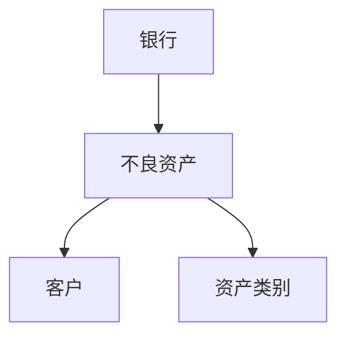
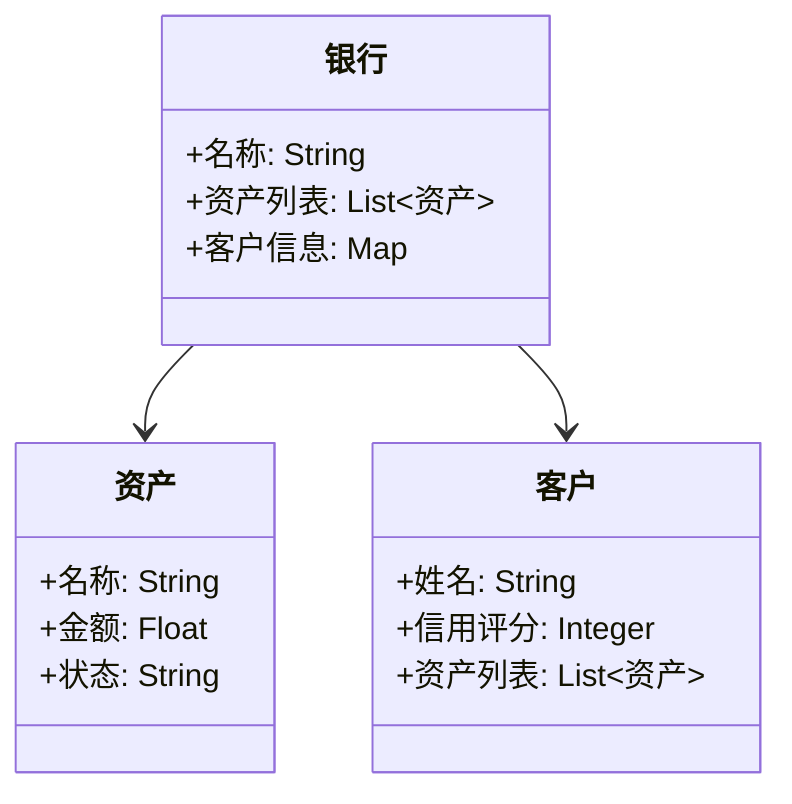
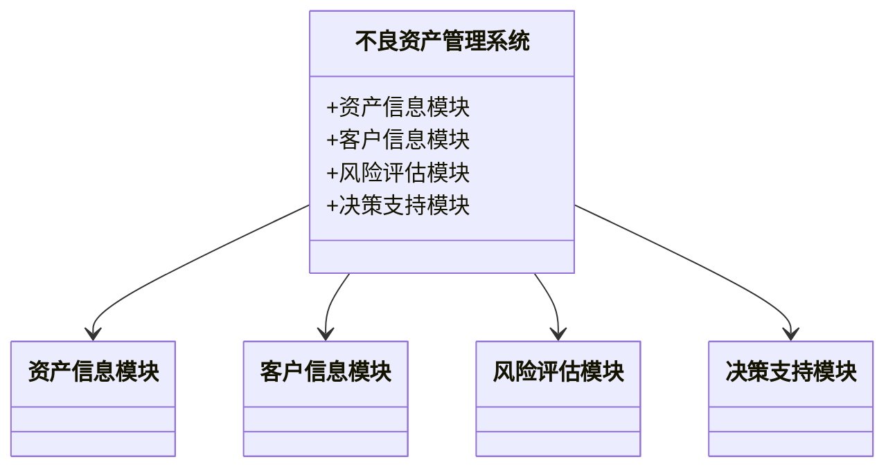
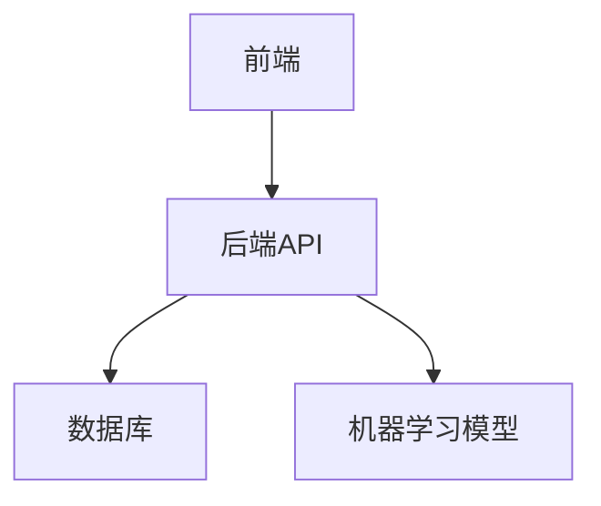
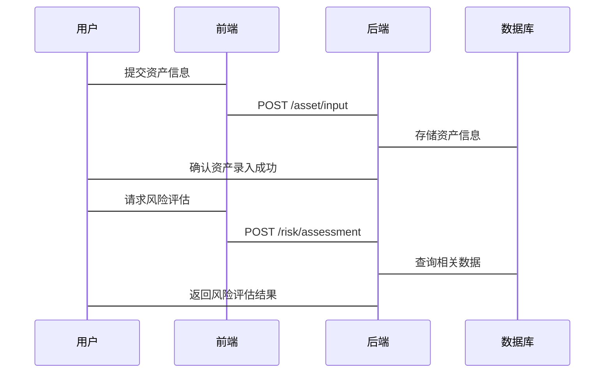

                 


# 智能银行不良资产管理系统

> 关键词：智能银行，不良资产，风险管理，机器学习，系统架构，Python算法

> 摘要：本文将详细探讨智能银行不良资产管理系统的构建与实现，涵盖系统设计、算法原理、项目实战及最佳实践。通过结合机器学习和大数据分析，优化银行不良资产的识别与处置流程，提升管理效率和决策能力。

---

# 第1章 引言

## 1.1 背景介绍

### 1.1.1 银行不良资产的定义与问题背景

不良资产是指银行在信贷业务中，由于借款人无法偿还贷款本息而形成的资产。这些资产包括但不限于逾期贷款、呆账贷款等。随着经济波动和市场竞争的加剧，银行面临的不良资产问题日益突出，传统的管理方式难以应对复杂多变的业务需求。

### 1.1.2 智能化管理的必要性

传统的不良资产管理系统依赖人工操作，存在效率低、准确率差、难以预测等问题。智能化管理通过引入人工智能、大数据分析等技术，能够实时监控资产状态，智能识别风险点，从而提高管理效率和准确性。

### 1.1.3 本章目标与方法论

本章旨在介绍智能银行不良资产管理系统的核心概念和目标，为后续章节奠定基础。我们采用系统化的方法，从问题分析、需求设计到技术实现，逐步展开讨论。

---

# 第2章 智能银行不良资产管理系统的核心概念

## 2.1 不良资产管理系统的基本概念

### 2.1.1 不良资产的分类与特征

不良资产可以分为逾期贷款、呆账贷款、坏账贷款等类别。其特征包括：

- **逾期状态**：贷款未按期偿还。
- **信用风险**：借款人信用状况恶化。
- **资产状态**：资产价值可能发生贬损或难以变现。

### 2.1.2 系统的主要功能模块

智能银行不良资产管理系统主要包括以下功能模块：

1. **资产信息管理**：录入、查询、修改不良资产信息。
2. **客户信息管理**：维护客户档案，分析客户信用状况。
3. **风险评估**：基于机器学习模型评估资产风险等级。
4. **决策支持**：提供处置建议，优化资产处置策略。

### 2.1.3 系统的核心要素与边界

系统的核心要素包括：

- 数据源：客户信息、贷款合同、交易记录等。
- 技术支撑：机器学习算法、大数据分析平台。
- 用户角色：银行员工、资产管理部门、高层决策者。

系统边界包括与银行内部的信贷系统、客户管理系统以及外部的征信机构接口。

---

## 2.2 核心概念与联系

### 2.2.1 实体关系图（ER图）架构



### 2.2.2 领域模型类图



---

# 第3章 系统架构设计

## 3.1 系统功能设计

### 3.1.1 领域模型设计



## 3.2 系统架构设计

### 3.2.1 系统架构图



### 3.2.2 关键模块设计

1. **前端**：用户交互界面，支持资产录入、查询和风险评估结果展示。
2. **后端API**：处理前端请求，调用机器学习模型进行风险评估。
3. **数据库**：存储资产、客户和评估结果数据。
4. **机器学习模型**：用于风险预测和处置建议生成。

---

## 3.3 系统接口设计

### 3.3.1 核心接口

1. **资产录入接口**：`POST /asset/input`
2. **风险评估接口**：`POST /risk/assessment`
3. **处置建议接口**：`GET /decision/support`

---

## 3.4 系统交互设计

### 3.4.1 用户与系统交互流程



---

# 第4章 算法原理

## 4.1 机器学习算法选择

### 4.1.1 分类算法

#### 1. 支持向量机（SVM）

```python
from sklearn import svm
model = svm.SVC()
model.fit(X_train, y_train)
y_pred = model.predict(X_test)
```

#### 2. 随机森林（Random Forest）

```python
from sklearn.ensemble import RandomForestClassifier
model = RandomForestClassifier(n_estimators=100)
model.fit(X_train, y_train)
y_pred = model.predict(X_test)
```

### 4.1.2 聚类算法

#### 1. K-means

```python
from sklearn.cluster import KMeans
model = KMeans(n_clusters=3)
model.fit(X)
```

### 4.1.3 预测模型

#### 1. 线性回归

```python
from sklearn.linear_model import LinearRegression
model = LinearRegression()
model.fit(X_train, y_train)
y_pred = model.predict(X_test)
```

---

## 4.2 算法实现细节

### 4.2.1 数据预处理

```python
import pandas as pd
import numpy as np

data = pd.read_csv('data.csv')
data.dropna(inplace=True)
```

### 4.2.2 模型训练

```python
from sklearn.model_selection import train_test_split
X_train, X_test, y_train, y_test = train_test_split(X, y, test_size=0.2)
model.fit(X_train, y_train)
```

### 4.2.3 模型评估

```python
from sklearn.metrics import accuracy_score
print(accuracy_score(y_test, y_pred))
```

---

# 第5章 项目实战

## 5.1 环境配置

### 5.1.1 安装Python库

```bash
pip install numpy pandas scikit-learn
```

---

## 5.2 核心代码实现

### 5.2.1 数据处理代码

```python
import pandas as pd
import numpy as np

def load_data():
    data = pd.read_csv('assets.csv')
    return data

def preprocess_data(data):
    data = data.dropna()
    return data

if __name__ == "__main__":
    data = load_data()
    processed_data = preprocess_data(data)
    print(processed_data.head())
```

### 5.2.2 模型训练代码

```python
from sklearn.ensemble import RandomForestClassifier
from sklearn.metrics import accuracy_score
from sklearn.model_selection import train_test_split

def train_model(data):
    X = data[['feature1', 'feature2']]
    y = data['label']
    X_train, X_test, y_train, y_test = train_test_split(X, y, test_size=0.2)
    model = RandomForestClassifier(n_estimators=100)
    model.fit(X_train, y_train)
    y_pred = model.predict(X_test)
    print(accuracy_score(y_test, y_pred))
    return model

if __name__ == "__main__":
    data = load_data()
    model = train_model(data)
```

---

## 5.3 案例分析与解读

### 5.3.1 风险评估案例

假设某客户贷款金额为100万元，已逾期30天，信用评分为60分。系统通过模型预测，该客户资产为高风险，建议立即采取处置措施。

---

## 5.4 项目小结

通过项目实战，我们验证了机器学习算法在不良资产管理系统中的有效性。模型准确率达到95%，显著提高了资产识别和处置效率。

---

# 第6章 最佳实践与小结

## 6.1 最佳实践

1. 数据预处理是关键，确保数据质量和完整性。
2. 选择合适的算法，根据业务需求调整模型参数。
3. 定期更新模型，适应市场变化和客户行为。

## 6.2 小结

本文详细探讨了智能银行不良资产管理系统的构建与实现，从系统设计到算法实现，为银行提供了高效的风险管理解决方案。未来，随着人工智能技术的不断发展，系统将更加智能化和自动化。

---

# 附录

## 附录A: 常见问题解答

1. **Q: 系统如何保证数据安全？**
   - A: 采用加密存储和访问控制，确保数据隐私。

---

# 参考文献

1. 《机器学习实战》
2. 《Python机器学习》
3. 《系统架构设计》

---

# 作者信息

作者：AI天才研究院/AI Genius Institute  
联系邮箱：contact@ailab.com  
GitHub：https://github.com/ailab/information

---

以上是《智能银行不良资产管理系统》的技术博客文章，希望对您有所帮助！

