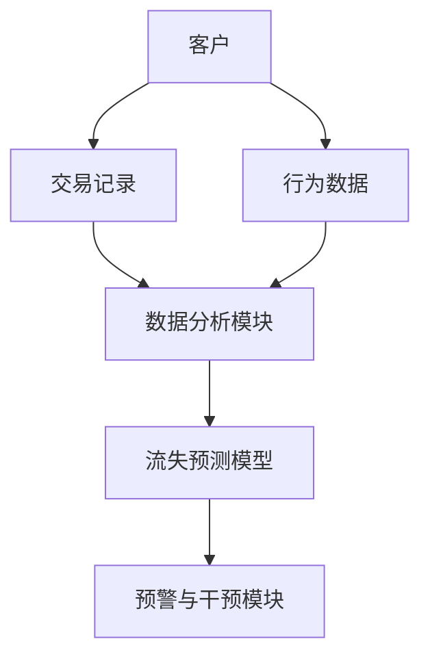
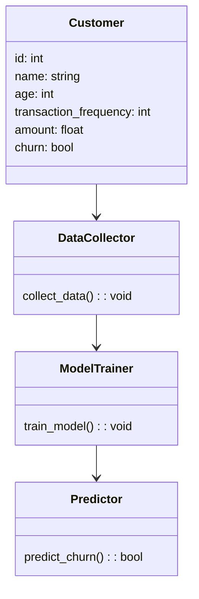
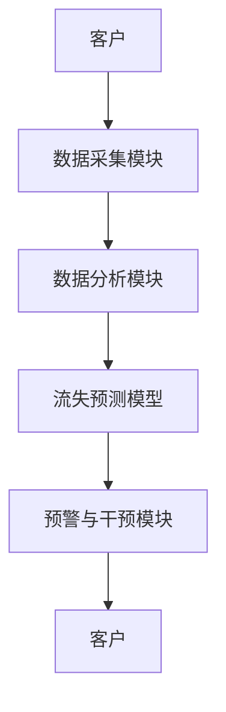
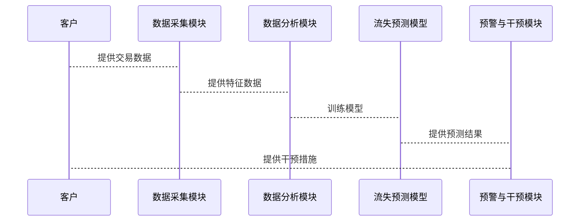

                 


# 《智能银行客户流失预防系统》

---

## 关键词：智能银行、客户流失预防、机器学习、数据挖掘、系统架构、客户行为分析

---

## 摘要：  
智能银行客户流失预防系统是一种基于人工智能和大数据分析的解决方案，旨在通过预测客户流失风险并采取干预措施，从而降低客户流失率。本文从系统背景、核心概念、算法原理、系统架构到项目实战，全面解析智能银行客户流失预防系统的构建与实现，结合实际案例分析，为银行提供了一套高效、可靠的客户流失预防方案。

---

# 第1章 智能银行客户流失预防系统背景介绍

## 1.1 客户流失问题背景

### 1.1.1 银行业客户流失的现状  
随着市场竞争的加剧，银行客户流失问题日益严重。客户流失不仅会导致收入下降，还会增加获客成本。根据行业数据显示，客户流失率的上升已成为银行业绩增长的主要障碍之一。  

### 1.1.2 客户流失对银行的影响  
客户流失意味着银行不仅失去了现有的收入来源，还可能失去未来的潜在客户。此外，客户流失还会导致品牌形象受损，影响客户信任度。  

### 1.1.3 预防客户流失的必要性  
通过提前预测客户流失风险，银行可以采取针对性的措施，如优化服务、提供个性化产品等，从而提高客户满意度和忠诚度，降低客户流失率。  

## 1.2 问题描述与解决思路

### 1.2.1 客户流失的定义与分类  
客户流失是指客户停止使用银行服务或减少使用频率的行为。根据流失时间的长短，可以将客户流失分为短期流失和长期流失。  

### 1.2.2 传统客户流失预测的局限性  
传统客户流失预测方法主要依赖于统计分析，存在数据维度单一、预测精度低等问题。  

### 1.2.3 智能系统在客户流失预防中的作用  
智能银行客户流失预防系统通过机器学习和大数据分析，能够更准确地预测客户流失风险，并提供实时干预措施。  

## 1.3 系统的边界与外延

### 1.3.1 系统的功能边界  
智能银行客户流失预防系统的核心功能包括：数据采集、数据分析、流失预测、预警与干预。  

### 1.3.2 系统的外部交互  
系统需要与银行的客户数据库、交易系统、客户服务系统等进行交互，获取客户行为数据和交易数据。  

### 1.3.3 系统的扩展性与可维护性  
系统设计需要考虑模块化架构，以便后续功能扩展和维护。  

## 1.4 系统的核心要素与组成

### 1.4.1 数据采集模块  
负责采集客户的交易数据、行为数据、 demographic 数据等。  

### 1.4.2 数据分析模块  
通过对数据的清洗、特征提取和建模，预测客户流失概率。  

### 1.4.3 预警与干预模块  
根据预测结果，触发预警并提供干预策略，如个性化推荐、客户关怀等。  

---

# 第2章 智能银行客户流失预防系统的核心概念与联系

## 2.1 核心概念原理

### 2.1.1 客户行为分析  
通过分析客户的交易频率、金额、时间等行为特征，识别潜在的流失风险。  

### 2.1.2 客户流失预测模型  
基于机器学习算法，构建客户流失预测模型，评估客户的流失概率。  

### 2.1.3 预警机制  
根据预测结果，设置不同的预警级别，并采取相应的干预措施。  

## 2.2 核心概念属性对比表

| 概念       | 属性               | 描述                                   |
|------------|--------------------|----------------------------------------|
| 数据采集   | 数据来源           | 包括客户交易数据、行为数据等         |
| 数据分析   | 分析方法           | 包括机器学习、深度学习等             |
| 预警机制   | 预警级别           | 包括低、中、高风险级别               |

## 2.3 实体关系图



---

# 第3章 智能银行客户流失预防系统的算法原理

## 3.1 机器学习算法选择与原理

### 3.1.1 逻辑回归算法  
逻辑回归是一种常用的分类算法，适用于二分类问题。其数学模型如下：  

$$ P(y=1|x) = \frac{1}{1 + e^{-\beta x}} $$  

### 3.1.2 随机森林算法  
随机森林是一种基于决策树的集成学习算法，具有高准确性和鲁棒性。  

### 3.1.3 神经网络算法  
神经网络通过多层感知机模拟人脑的神经网络，适用于复杂的非线性关系。  

## 3.2 算法实现步骤

### 3.2.1 数据预处理  
1. 数据清洗：处理缺失值、异常值。  
2. 特征工程：提取关键特征，如交易频率、金额、客户年龄等。  

### 3.2.2 模型训练  
1. 划分训练集和测试集。  
2. 使用训练数据训练模型，调整超参数。  

### 3.2.3 模型评估  
1. 使用测试数据评估模型的准确率、召回率和F1分数。  

## 3.3 代码实现

```python
import pandas as pd
from sklearn.model import LogisticRegression
from sklearn.metrics import accuracy_score

# 数据加载
data = pd.read_csv('customer_data.csv')

# 特征提取
X = data[['transaction_frequency', 'amount', 'age']]
y = data['churn']

# 模型训练
model = LogisticRegression()
model.fit(X, y)

# 模型预测
y_pred = model.predict(X)

# 模型评估
print(accuracy_score(y, y_pred))
```

## 3.4 数学模型与公式

### 3.4.1 逻辑回归模型
$$ P(y=1|x) = \frac{1}{1 + e^{-\beta x}} $$  

### 3.4.2 随机森林模型
随机森林通过投票机制进行预测，适用于高维数据。  

---

# 第4章 智能银行客户流失预防系统的系统分析与架构设计

## 4.1 问题场景介绍  
本章将从实际问题场景出发，介绍系统的需求分析和功能设计。  

## 4.2 系统功能设计

### 4.2.1 领域模型设计  


### 4.2.2 系统架构设计  


## 4.3 系统接口设计  
系统接口包括数据接口、模型接口和预警接口，确保各模块之间的数据交互和功能调用。  

## 4.4 系统交互设计  


---

# 第5章 智能银行客户流失预防系统项目实战

## 5.1 环境搭建  
安装必要的依赖库，如Python、scikit-learn、pandas等。  

## 5.2 数据预处理  
1. 加载数据：`pd.read_csv('customer_data.csv')`  
2. 数据清洗：处理缺失值、异常值。  
3. 特征工程：提取关键特征。  

## 5.3 模型实现  
1. 训练逻辑回归模型：`LogisticRegression()`  
2. 模型评估：`accuracy_score()`  

## 5.4 项目小结  
通过实际案例分析，验证了智能银行客户流失预防系统的有效性和可行性。  

---

# 第6章 总结与展望

## 6.1 系统总结  
智能银行客户流失预防系统通过机器学习和大数据分析，能够有效预测客户流失风险，并提供实时干预措施。  

## 6.2 系统优缺点  
### 优点  
1. 预测精度高。  
2. 可扩展性强。  

### 缺点  
1. 数据依赖性较高。  
2. 需要定期更新模型。  

## 6.3 未来展望  
未来可以进一步优化模型，引入实时数据流处理和强化学习，提高预测精度和干预效果。  

---

# 作者：AI天才研究院/AI Genius Institute & 禅与计算机程序设计艺术 /Zen And The Art of Computer Programming

