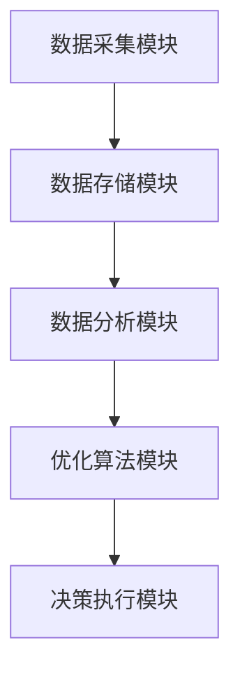
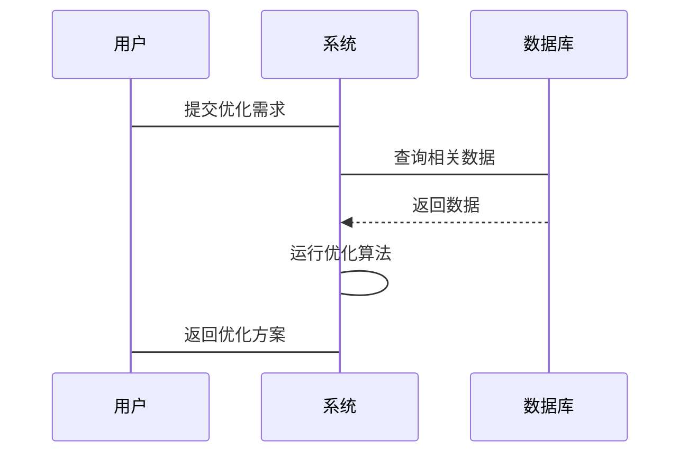

                 


# 智能银行资产负债管理优化系统

## 关键词：智能银行，资产负债管理，优化系统，人工智能，大数据技术，系统架构

## 摘要：随着金融行业的快速发展，智能银行的概念逐渐兴起，传统的资产负债管理方式已无法满足现代银行的需求。本文将介绍智能银行资产负债管理优化系统的核心概念、优化算法、系统架构及其实现方案，通过详细的理论分析和实际案例，展示如何利用人工智能和大数据技术提升银行的资产负债管理效率和决策能力。

---

# 第一部分：智能银行与资产负债管理概述

## 第1章：智能银行与资产负债管理的基本概念

### 1.1 智能银行的概念与特点
智能银行是传统银行与现代科技结合的产物，通过人工智能、大数据、区块链等技术实现智能化的金融服务。其主要特点包括：
- **数据驱动**：利用大数据技术进行精准客户画像和风险评估。
- **自动化服务**：通过智能算法实现自动化交易和客户服务。
- **实时决策**：基于实时数据分析，快速做出业务决策。
- **个性化体验**：为客户提供定制化的金融服务。

### 1.2 资产负债管理的核心概念
资产负债管理是银行管理中的重要组成部分，涉及资产和负债的配置、定价、风险控制等。其主要目标是：
- **优化资产配置**：提高资产回报率，降低风险。
- **降低负债成本**：通过合理负债结构降低融资成本。
- **保持流动性**：确保银行在不同市场环境下的流动性需求。

### 1.3 优化资产负债管理的必要性
传统资产负债管理方式存在效率低、决策滞后、风险控制不足等问题。随着市场竞争的加剧和客户需求的多样化，银行需要通过智能化技术优化资产负债管理，提升竞争力。

---

## 第2章：智能银行资产负债管理优化系统的背景与需求

### 2.1 当前银行面临的挑战
- 利率市场化导致的利润压力。
- 金融科技公司对传统银行的冲击。
- 客户对个性化、智能化服务的需求日益增长。

### 2.2 优化资产负债管理的市场需求
- 提高资产配置效率，降低负债成本。
- 实现风险可控下的收益最大化。
- 满足监管要求，确保合规性。

### 2.3 智能化技术在银行管理中的应用前景
- **人工智能**：用于客户画像、风险评估和智能决策。
- **大数据技术**：支持实时数据分析和预测性建模。
- **区块链技术**：提高交易透明度和安全性。

---

## 第3章：智能银行资产负债管理优化系统的概念与核心要素

### 3.1 系统的核心概念
智能银行资产负债管理优化系统是一个基于人工智能和大数据技术的智能化管理平台，旨在通过数据分析和优化算法，帮助银行实现资产和负债的最优配置。

### 3.2 系统的核心要素
- **数据采集与处理模块**：收集和处理银行的资产、负债、客户行为等数据。
- **智能分析与决策模块**：利用机器学习算法进行数据分析和预测，生成优化方案。
- **系统优化与执行模块**：根据优化方案调整资产和负债结构，并执行相关操作。

### 3.3 系统的优化目标
- 提高资产回报率。
- 降低负债成本。
- 优化资本结构，确保流动性需求。

---

## 第4章：智能银行资产负债管理优化系统的原理与算法

### 4.1 优化算法的基本原理
优化算法是智能银行资产负债管理的核心技术，常用的算法包括线性规划和遗传算法。

#### 4.1.1 线性规划算法
线性规划是一种优化方法，适用于目标函数和约束条件均为线性的情况。其数学模型如下：

$$
\text{目标函数：} \quad \min \text{或} \max \quad c^T x
$$

$$
\text{约束条件：} \quad A x \leq b
$$

$$
\quad \quad \quad \quad x \geq 0
$$

其中，\( c \) 是目标函数的系数向量，\( x \) 是决策变量，\( A \) 是约束条件的系数矩阵，\( b \) 是约束条件的常数项。

#### 4.1.2 遗传算法
遗传算法是一种基于生物进化论的优化算法，适用于复杂的非线性问题。其主要步骤如下：

1. 初始化种群。
2. 计算适应度。
3. 选择优秀个体。
4. 进行交叉和变异操作。
5. 重复步骤 2-4 直到满足终止条件。

---

### 4.2 算法实现与案例分析

#### 4.2.1 线性规划算法实现
以下是一个简单的线性规划算法实现示例：

```python
import numpy as np
from scipy.optimize import linprog

# 定义目标函数和约束条件
c = [-2, -3]
A = [[2, 1], [1, 2]]
b = [6, 8]
x_bounds = (0, None)

# 使用 scipy.optimize.linprog 进行优化
result = linprog(c, A, b, bounds=x_bounds, method='highs')

print("最优解：", result.x)
print("最优值：", -result.fun)
```

#### 4.2.2 遗传算法实现
以下是一个遗传算法的实现示例：

```python
import random

def fitness(individual):
    # 计算适应度函数，具体实现根据问题而定
    return sum(individual)

def evolve(population, fitness_func, mutate_rate=0.1):
    # 选择
    population.sort(key=lambda x: -fitness_func(x))
    selected = population[:len(population)//2]

    # 交叉
    new_population = []
    while len(new_population) < len(population):
        parent1 = random.choice(selected)
        parent2 = random.choice(selected)
        child = [gene for gene in parent1]
        for i in range(len(child)):
            if random.random() < 0.5:
                child[i] = parent2[i]
        # 变异
        for i in range(len(child)):
            if random.random() < mutate_rate:
                child[i] = 1 - child[i]
        new_population.append(child)
    return new_population

# 初始化种群
population = [[random.randint(0, 1) for _ in range(10)] for _ in range(10)]
# 进行进化
new_population = evolve(population, fitness)
print("新种群：", new_population)
```

---

## 第5章：智能银行资产负债管理优化系统的架构与实现

### 5.1 系统架构设计
以下是智能银行资产负债管理优化系统的架构设计：



### 5.2 系统功能模块
- **数据采集模块**：收集银行的资产、负债和客户数据。
- **数据分析模块**：对数据进行清洗、特征提取和建模。
- **优化算法模块**：基于数据分析结果，运行优化算法，生成最优方案。
- **决策执行模块**：根据优化结果，执行相应的资产和负债调整操作。

### 5.3 系统接口设计
- 数据接口：与银行的核心系统进行数据对接。
- 用户接口：提供给银行管理人员查看和操作的界面。

### 5.4 系统交互设计
以下是系统交互的示例：



---

## 第6章：项目实战与案例分析

### 6.1 环境搭建
- **工具安装**：安装 Python、NumPy、Scipy、Matplotlib 等工具。
- **数据准备**：收集银行的资产和负债数据，清洗和预处理。

### 6.2 核心代码实现
以下是一个优化系统的实现示例：

```python
import numpy as np
from sklearn.linear_model import LinearRegression

# 数据准备
X = np.array([[2, 3], [4, 5], [6, 7]])
y = np.array([5, 7, 9])

# 模型训练
model = LinearRegression()
model.fit(X, y)

# 模型预测
new_X = np.array([[5, 6]])
predicted_y = model.predict(new_X)
print("预测结果：", predicted_y)
```

### 6.3 案例分析
通过一个实际案例，展示系统如何优化资产和负债配置，降低风险，提高收益。

---

## 第7章：总结与展望

### 7.1 最佳实践 tips
- 确保数据的准确性和完整性。
- 定期更新优化算法，适应市场变化。
- 加强系统安全性和稳定性。

### 7.2 项目小结
智能银行资产负债管理优化系统通过人工智能和大数据技术，显著提高了银行的管理效率和决策能力。

### 7.3 注意事项
- 数据隐私和安全问题需要高度重视。
- 系统上线前需进行充分的测试和验证。

### 7.4 未来展望
随着技术的不断进步，智能银行资产负债管理优化系统将更加智能化和个性化，为银行带来更大的竞争优势。

---

# 作者：AI天才研究院 & 禅与计算机程序设计艺术

---

希望这篇文章能够为读者提供关于智能银行资产负债管理优化系统的全面了解，从理论到实践，帮助读者掌握相关技术的核心要点。

