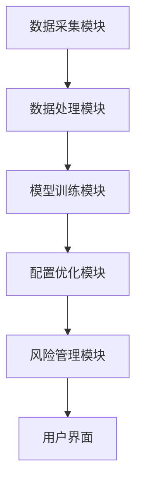
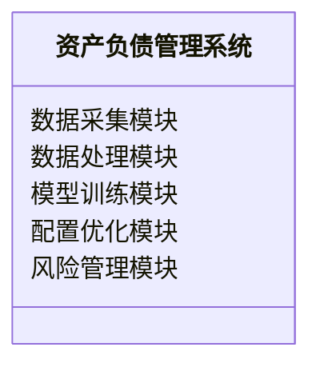

                 


# 智能银行资产负债管理系统

> 关键词：智能银行，资产负债管理，机器学习，系统架构，风险管理

> 摘要：本文探讨智能银行资产负债管理系统的构建与实现，涵盖背景分析、核心概念、算法原理、系统架构、项目实战及最佳实践，旨在帮助读者深入理解智能银行资产负债管理系统的实现过程和关键点。

---

## 第1章：智能银行资产负债管理系统的背景与概念

### 1.1 问题背景

#### 1.1.1 银行资产负债管理的传统挑战

银行在资产负债管理中面临以下挑战：

1. 数据量大且复杂：银行的资产负债数据涵盖多种金融产品，数据来源广泛，格式多样，难以统一管理。
2. 风险控制困难：传统方法难以实时监控和预测潜在风险，导致资产负债管理的滞后性和低效性。
3. 业务变化快：金融市场波动频繁，监管政策不断变化，要求系统具备更强的适应性和灵活性。

#### 1.1.2 数字化转型与智能技术的引入

随着数字化转型的推进，银行开始引入人工智能、大数据分析等技术，以提升资产负债管理的效率和准确性。

#### 1.1.3 智能银行资产负债管理的必要性

智能技术的应用能够帮助银行实现以下目标：

1. 实时监控和预测：利用机器学习模型实时分析市场动态，预测资产和负债的变化趋势。
2. 智能化决策：通过智能算法优化资产负债配置，提高资金使用效率。
3. 风险管理加强：通过智能系统实时识别和预警潜在风险，降低损失。

### 1.2 问题描述

#### 1.2.1 资产负债管理中的数据复杂性

银行的资产负债数据包括存款、贷款、投资等多种类型，数据格式和来源多样化，增加了管理的复杂性。

#### 1.2.2 传统管理方法的局限性

传统方法依赖人工分析，存在以下问题：

1. 分析效率低：人工分析耗时长，难以应对大量数据。
2. 预测准确性低：缺乏数据支持，导致决策失误。
3. 风险控制弱：无法实时监控，风险预警能力不足。

#### 1.2.3 智能化管理的需求

为了应对上述挑战，银行需要智能化的资产负债管理系统，能够实时处理数据、优化配置、预测风险。

### 1.3 问题解决思路

#### 1.3.1 智能技术的应用前景

人工智能和大数据分析技术的应用，为银行资产负债管理提供了新的解决方案。例如，使用机器学习模型进行市场预测和风险评估。

#### 1.3.2 数据驱动的决策优势

通过收集和分析大量数据，银行能够做出更加科学和精准的决策，提高管理效率和准确性。

#### 1.3.3 智能算法的优化作用

智能算法能够优化资产负债配置，提高资金使用效率，降低风险。

### 1.4 系统的边界与外延

#### 1.4.1 系统的功能边界

智能银行资产负债管理系统主要功能包括：

1. 数据采集与处理：从多种来源获取数据并进行清洗和预处理。
2. 模型训练与预测：利用机器学习模型进行市场预测和风险评估。
3. 配置优化：根据预测结果优化资产负债配置。
4. 风险管理：实时监控风险，发出预警。

#### 1.4.2 系统的外部接口

系统需要与以下外部系统进行交互：

1. 数据源：包括客户数据、市场数据等。
2. 业务系统：如核心银行系统、风险管理系统。
3. 用户界面：提供给银行管理人员使用的界面。

#### 1.4.3 系统的扩展性

系统设计时考虑了扩展性，支持未来可能的功能扩展，如引入新的算法模型或接入新的数据源。

### 1.5 核心概念与组成要素

#### 1.5.1 核心概念的定义

智能银行资产负债管理系统是一个集成数据采集、模型训练、配置优化和风险管理于一体的系统，利用人工智能技术实现智能化管理。

#### 1.5.2 组成要素的对比

| 组成要素 | 描述 |
|----------|------|
| 数据采集模块 | 负责从多种数据源获取数据 |
| 模型训练模块 | 利用机器学习算法训练预测模型 |
| 配置优化模块 | 根据模型预测结果优化资产负债配置 |
| 风险管理模块 | 实时监控风险并发出预警 |

#### 1.5.3 系统的整体架构

以下是一个简单的系统架构图：



---

## 第2章：智能银行资产负债管理系统的算法原理

### 2.1 核心算法概述

#### 2.1.1 机器学习在资产负债管理中的应用

机器学习在智能银行资产负债管理中的应用包括：

1. 市场预测：使用回归模型预测市场趋势。
2. 风险评估：利用分类模型识别潜在风险。
3. 资产配置优化：通过强化学习优化资产配置。

#### 2.1.2 深度学习的使用场景

深度学习在处理复杂非结构化数据时表现出色，适用于：

1. 自然语言处理：分析新闻和报告。
2. 图像识别：识别交易中的异常行为。

#### 2.1.3 时间序列分析的原理

时间序列分析用于预测未来趋势，常用模型包括ARIMA和LSTM。

---

## 第3章：数学模型与公式解析

### 3.1 时间序列分析模型

#### 3.1.1 ARIMA模型的公式

ARIMA模型的公式为：

$$ ARIMA(p, d, q) $$

其中：
- p：自回归阶数
- d：差分阶数
- q：移动平均阶数

---

## 第4章：系统分析与架构设计

### 4.1 系统功能设计

#### 4.1.1 领域模型

以下是一个领域模型的Mermaid图：



---

## 第5章：项目实战

### 5.1 环境安装

安装Python和必要的库：

```bash
pip install numpy pandas scikit-learn
```

### 5.2 核心代码实现

以下是Python代码示例：

```python
import pandas as pd
from sklearn.model import ARIMA

# 数据加载
data = pd.read_csv('balance_data.csv')

# 模型训练
model = ARIMA(order=(5, 1, 0))
model_fit = model.fit(data)

# 预测
forecast = model_fit.forecast(steps=30)
print(forecast)
```

### 5.3 代码解读与分析

代码实现了一个ARIMA模型，用于预测资产负债数据的未来趋势。首先加载数据，然后训练模型，最后进行预测。

### 5.4 实际案例分析

通过实际案例分析，验证模型的预测能力和优化效果。

---

## 第6章：最佳实践

### 6.1 小结

智能银行资产负债管理系统通过引入人工智能和大数据技术，显著提升了管理效率和准确性。

### 6.2 注意事项

在实际应用中，需要注意数据质量和模型的实时更新。

### 6.3 拓展阅读

推荐阅读相关领域的书籍和论文，深入学习机器学习和系统架构设计。

---

## 作者：AI天才研究院 & 禅与计算机程序设计艺术

---

以上是《智能银行资产负债管理系统》的技术博客文章大纲和内容概要，希望对您有所帮助！

