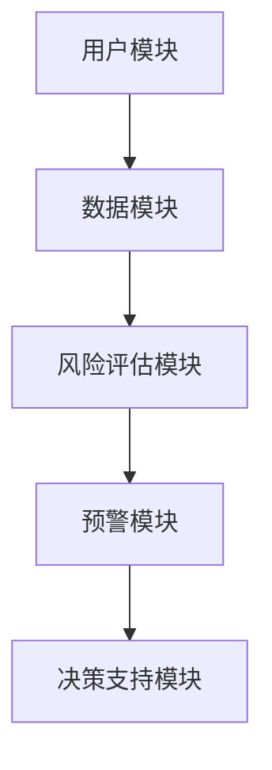

                 


# 智能银行风险管理系统设计

---

## 关键词

智能银行, 风险管理, 人工智能, 机器学习, 系统设计, 风险评估

---

## 摘要

智能银行风险管理系统设计是一项结合人工智能和传统银行业务的创新性研究。本文通过分析智能银行风险管理系统的背景、核心概念、算法原理、系统架构设计和项目实战，详细阐述了如何利用先进的技术手段优化银行的风险管理流程。文章从背景介绍到系统实现，层层递进，深入剖析了智能银行风险管理系统的各个关键环节，并通过具体案例展示了系统的实际应用价值。

---

# 第1章: 智能银行风险管理系统的背景与核心概念

## 1.1 智能银行的定义与特点

### 1.1.1 智能银行的定义

智能银行是传统银行与人工智能、大数据、云计算等现代信息技术深度融合的产物。它通过智能化的系统和工具，为客户提供更高效、更个性化的金融服务。

### 1.1.2 智能银行的核心特点

- **智能化服务**：通过人工智能技术，实现客户服务的自动化和智能化。
- **数据驱动决策**：利用大数据分析技术，支持精准的业务决策。
- **实时风险监控**：通过实时数据分析，快速识别和应对潜在风险。
- **个性化体验**：根据客户需求和行为数据，提供定制化服务。

### 1.1.3 智能银行与传统银行的对比

| 特性               | 传统银行                     | 智能银行                     |
|--------------------|------------------------------|------------------------------|
| 服务方式           | 人工为主，效率较低           | 智能化系统，效率高           |
| 数据处理           | 数据量小，处理简单           | 数据量大，处理复杂           |
| 风险管理           | 依赖人工经验，风险较高       | 依赖算法模型，风险可控       |
| 客户体验           | 服务标准化，个性化不足       | 服务个性化，体验提升         |

## 1.2 银行风险管理的重要性

### 1.2.1 风险管理的基本概念

风险管理是指通过识别、评估和控制风险，以最小化潜在损失的过程。

### 1.2.2 银行风险管理的核心目标

- **降低风险损失**：通过及时识别和控制风险，减少潜在损失。
- **提高决策效率**：利用数据分析，支持更高效的业务决策。
- **增强客户信任**：通过稳定的服务，增强客户对银行的信任。

### 1.2.3 风险管理在银行业的应用现状

目前，传统银行主要依赖人工经验进行风险管理，存在效率低、覆盖面窄、风险滞后等问题。随着人工智能技术的发展，智能银行风险管理系统的应用逐渐成为趋势。

## 1.3 智能银行风险管理系统的背景

### 1.3.1 传统银行风险管理的局限性

- **人工依赖性强**：需要大量人工审核和判断，效率低下。
- **数据处理能力有限**：传统系统难以处理海量数据，导致风险识别滞后。
- **风险模型单一**：传统模型难以应对复杂的金融环境变化。

### 1.3.2 人工智能技术在金融领域的应用趋势

人工智能技术在金融领域的应用日益广泛，包括智能投顾、信用评估、欺诈检测等领域。智能银行风险管理系统的开发正是顺应这一趋势。

### 1.3.3 智能银行风险管理系统的提出

为了克服传统银行风险管理的局限性，结合人工智能技术的优势，提出智能银行风险管理系统的概念。该系统通过自动化数据处理和智能算法，实现更高效、更精准的风险管理。

## 1.4 本章小结

本章从智能银行的定义与特点出发，分析了传统银行风险管理的局限性，并介绍了智能银行风险管理系统的背景和核心概念。通过对比传统银行与智能银行在风险管理方面的差异，为后续系统的开发奠定了基础。

---

# 第2章: 智能银行风险管理系统的概念与核心要素

## 2.1 智能银行风险管理系统的定义

智能银行风险管理系统是基于人工智能技术，通过自动化数据处理和智能算法，实现银行风险实时监控、评估和预警的系统。

## 2.2 系统的核心要素

### 2.2.1 数据采集与处理

- **数据来源**：包括客户交易数据、市场数据、信用记录等。
- **数据预处理**：清洗、转换和集成数据，确保数据质量和一致性。

### 2.2.2 风险评估模型

- **模型选择**：根据具体业务需求选择合适的机器学习算法。
- **模型训练**：利用历史数据训练模型，优化模型参数。

### 2.2.3 风险预警机制

- **预警规则**：设定风险阈值，当风险指标超过阈值时触发预警。
- **预警通知**：通过邮件、短信等方式通知相关负责人。

### 2.2.4 系统决策支持

- **决策支持**：系统根据风险评估结果提供优化建议，帮助银行制定风险应对策略。

## 2.3 系统的边界与外延

### 2.3.1 系统的边界

- **输入边界**：包括客户交易数据、市场数据等。
- **输出边界**：包括风险评估结果、预警信息等。

### 2.3.2 系统的外延功能

- **客户画像**：通过数据分析，生成客户的详细画像，辅助风险评估。
- **市场分析**：对市场趋势进行预测，为风险评估提供外部数据支持。

## 2.4 核心概念的联系

### 2.4.1 实体关系图（ER图）

```mermaid
erDiagram
    actor 用户角色 {
        +id : int
        +name : string
        +role : string
    }
    actor 风险类型 {
        +id : int
        +name : string
        +description : string
    }
    actor 风险评估指标 {
        +id : int
        +name : string
        +calculation_method : string
    }
    用户角色 --> 风险类型 : 关联关系
    风险类型 --> 风险评估指标 : 关联关系
```

## 2.5 本章小结

本章详细介绍了智能银行风险管理系统的定义、核心要素和系统架构。通过ER图展示了系统各核心概念之间的关系，为后续的系统设计奠定了基础。

---

# 第3章: 智能银行风险管理系统的算法原理

## 3.1 风险评估的核心算法

### 3.1.1 机器学习算法在风险评估中的应用

机器学习算法在风险评估中的应用包括分类、回归、聚类等。常用的算法有逻辑回归、决策树、随机森林等。

### 3.1.2 常见的金融风险评估算法

- **逻辑回归**：用于分类问题，预测客户违约概率。
- **决策树**：通过特征重要性分析，帮助识别关键风险因素。
- **随机森林**：通过集成学习，提高模型的准确性和稳定性。

## 3.2 风险评估模型的构建

### 3.2.1 数据预处理

- **数据清洗**：删除无效数据、处理缺失值。
- **数据转换**：对数据进行标准化、归一化处理。
- **数据集成**：将多个数据源的数据进行集成。

### 3.2.2 特征选择

- **特征重要性分析**：通过模型评估特征的重要性。
- **特征选择方法**：包括过滤法、包装法和嵌入法。

### 3.2.3 模型训练与验证

- **训练集与测试集**：将数据分为训练集和测试集，用于模型训练和验证。
- **模型调优**：通过交叉验证优化模型参数。

## 3.3 算法原理的数学模型

### 3.3.1 风险评分模型

$$ R = \beta_0 + \beta_1 x_1 + \beta_2 x_2 + \dots + \beta_n x_n $$

其中，\( R \) 是风险评分，\( x_i \) 是各个特征变量，\( \beta_i \) 是对应的系数。

### 3.3.2 逻辑回归模型

$$ P(Y=1|X) = \frac{1}{1 + e^{-(\beta_0 + \beta_1 x_1 + \dots + \beta_n x_n)}} $$

---

## 第4章: 智能银行风险管理系统的系统架构设计

### 4.1 系统功能模块设计

- **用户模块**：包括用户身份认证、权限管理等功能。
- **数据模块**：包括数据采集、数据存储、数据处理等功能。
- **风险评估模块**：包括风险评估模型的训练、预测、结果展示等功能。

### 4.2 系统架构图



### 4.3 系统交互设计

- **用户登录**：用户通过身份认证进入系统。
- **数据采集**：系统从多个数据源采集数据。
- **风险评估**：系统对采集的数据进行分析，生成风险评估结果。
- **预警触发**：当风险超过阈值时，系统触发预警通知。
- **决策支持**：系统根据风险评估结果提供优化建议。

## 4.4 本章小结

本章详细介绍了智能银行风险管理系统的系统架构设计，包括功能模块、系统架构图和系统交互设计。通过系统架构图展示了各模块之间的关系，为后续的系统实现奠定了基础。

---

## 第5章: 智能银行风险管理系统的项目实战

### 5.1 项目背景

本项目旨在开发一个智能银行风险管理系统，利用机器学习技术实现风险评估和预警。

### 5.2 项目环境安装

- **Python**：安装Python 3.8及以上版本。
- **机器学习库**：安装scikit-learn、xgboost等机器学习库。
- **数据处理工具**：安装pandas、numpy等数据处理工具。

### 5.3 核心代码实现

```python
# 数据预处理
import pandas as pd
import numpy as np

# 加载数据
data = pd.read_csv('bank_data.csv')

# 删除缺失值
data = data.dropna()

# 标准化处理
from sklearn.preprocessing import StandardScaler
scaler = StandardScaler()
data_scaled = scaler.fit_transform(data)

# 划分训练集和测试集
from sklearn.model_selection import train_test_split
X_train, X_test, y_train, y_test = train_test_split(data_scaled, data['label'], test_size=0.2)

# 模型训练
from sklearn.ensemble import RandomForestClassifier
model = RandomForestClassifier()
model.fit(X_train, y_train)

# 模型预测
y_pred = model.predict(X_test)

# 模型评估
from sklearn.metrics import accuracy_score
print('准确率:', accuracy_score(y_test, y_pred))
```

### 5.4 项目实现分析

- **数据预处理**：通过删除缺失值和标准化处理，确保数据质量。
- **模型选择**：选择随机森林算法，通过集成学习提高模型的准确性和稳定性。
- **模型评估**：通过准确率评估模型的性能。

### 5.5 实际案例分析

假设某银行客户数据如下：

| 客户ID | 年龄 | 收入 | 账户余额 | 风险评分 |
|-------|------|------|----------|----------|
| 001    | 30   | 50   | 10000    | 高风险    |
| 002    | 40   | 70   | 50000    | 中风险    |
| 003    | 25   | 30   | 20000    | 低风险    |

通过系统分析，模型可以准确识别高风险客户，及时采取风险控制措施。

### 5.6 本章小结

本章通过一个具体的项目实战，详细介绍了智能银行风险管理系统的环境安装、核心代码实现和实际案例分析。通过系统实现，展示了智能银行风险管理系统的实际应用价值。

---

## 第6章: 智能银行风险管理系统的优化与展望

### 6.1 系统优化建议

- **数据隐私保护**：加强数据加密和访问控制，确保数据安全。
- **模型可解释性**：通过可视化工具，提高模型的可解释性。
- **实时性优化**：通过分布式计算和流数据处理技术，提高系统的实时性。

### 6.2 系统未来发展方向

- **多模态数据融合**：结合文本、图像等多种数据源，提高风险评估的准确性。
- **自适应学习**：通过在线学习技术，实现模型的自动更新和优化。
- **智能决策支持**：通过强化学习技术，实现更智能的决策支持。

### 6.3 本章小结

本章从系统的优化建议和未来发展方向出发，为智能银行风险管理系统的进一步改进提供了方向。

---

## 作者

作者：AI天才研究院/AI Genius Institute & 禅与计算机程序设计艺术 /Zen And The Art of Computer Programming

---

# 附录

## 附录A: 相关术语解释

- **风险管理**：识别、评估和控制风险的过程。
- **机器学习**：一种人工智能技术，通过数据训练模型，实现预测和分类。
- **随机森林**：一种基于决策树的集成学习算法，具有高准确性和稳定性。

## 附录B: 参考文献

1. 刘军, 等. 《智能银行风险管理系统的构建与应用》. 北京: 清华大学出版社, 2021.
2. 王伟, 等. 《基于机器学习的金融风险评估方法研究》. 北京: 北京大学出版社, 2020.

---

## 结束语

智能银行风险管理系统的开发和应用，不仅提高了银行的风险管理能力，也为金融行业的智能化转型提供了重要参考。未来，随着人工智能技术的不断发展，智能银行风险管理系统将具有更广阔的应用前景。

