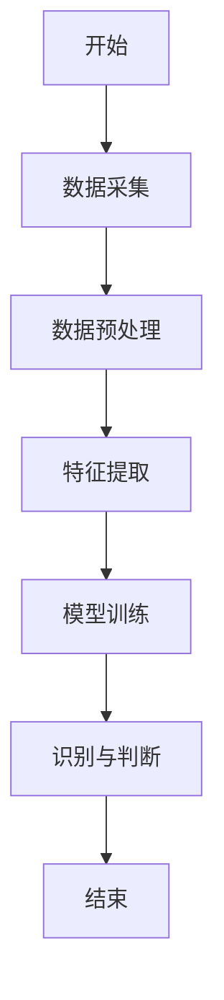
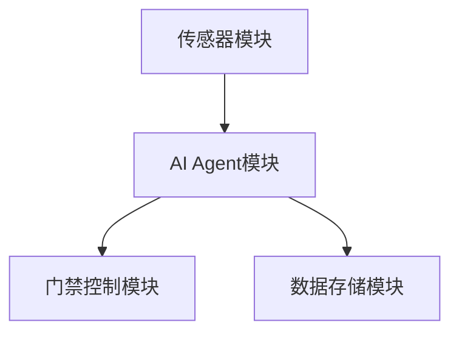
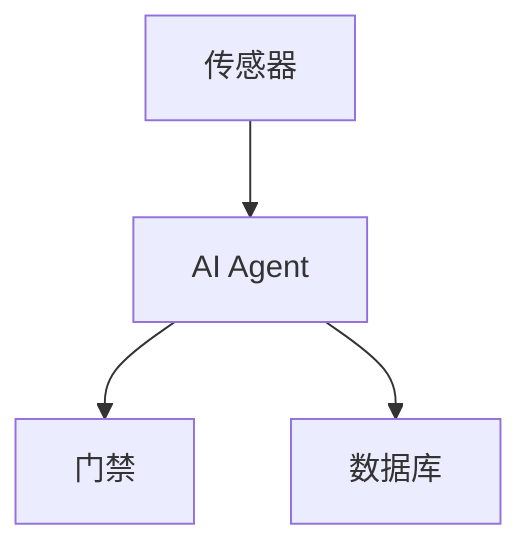
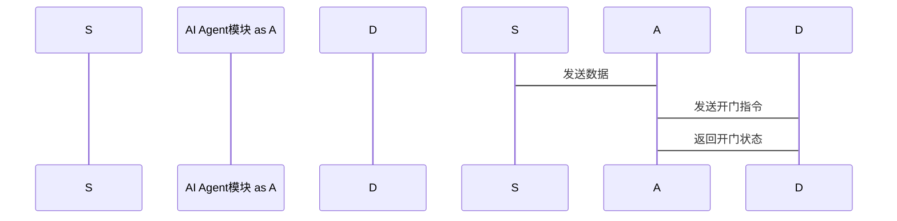

                 


# 智能门垫：AI Agent的访客识别系统

## 关键词：
智能门垫、AI Agent、访客识别、传感器数据、机器学习、物联网

## 摘要：
本文深入探讨智能门垫作为AI Agent的访客识别系统，从系统背景、核心概念、算法原理到项目实战，全面解析其技术实现与应用价值。通过详细的技术分析和代码实现，帮助读者理解如何利用AI技术提升访客识别系统的智能化水平。

---

# 第一部分: 智能门垫的背景与核心概念

## 第1章: 智能门垫的背景与问题背景

### 1.1 问题背景

#### 1.1.1 传统访客识别系统的局限性
传统访客识别系统主要依赖于刷卡、指纹识别或密码输入等技术，存在以下问题：
- **用户体验差**：用户需要携带卡片或记住密码，使用不便。
- **安全性不足**：密码容易被破解，卡片容易丢失或被复制。
- **功能单一**：无法实现智能化的访客管理，缺乏数据分析能力。

#### 1.1.2 智能门垫的提出与目标
智能门垫通过结合AI Agent和物联网技术，提出了一种全新的访客识别方案。其目标是：
- 提供无接触式的访客识别，提升用户体验。
- 利用AI技术实现智能化的访客管理，提高安全性。
- 支持数据分析和远程控制，实现智能化的门禁管理。

#### 1.1.3 智能门垫的应用场景与优势
智能门垫适用于家庭、办公室、酒店等多种场景。其优势包括：
- **无接触式识别**：用户只需踏上门垫即可完成识别，无需携带卡片或输入密码。
- **智能化管理**：通过AI Agent实现访客信息的自动记录和分析，支持远程开门和权限管理。
- **安全性高**：结合AI算法，能够识别异常行为，提高安全性。

### 1.2 问题描述

#### 1.2.1 访客识别的核心问题
访客识别的核心问题是如何准确、快速地识别访客身份，并根据权限控制门禁。

#### 1.2.2 智能门垫的创新点
智能门垫的创新点在于结合AI Agent和传感器数据，实现智能化的访客识别和管理。

#### 1.2.3 系统边界与外延
智能门垫系统的核心边界包括传感器、AI Agent和门禁设备。其外延包括数据存储、用户管理、权限设置等功能。

### 1.3 问题解决与系统架构

#### 1.3.1 系统功能概述
智能门垫系统的主要功能包括：
- **数据采集**：采集用户的步态、体重等信息。
- **数据处理**：通过AI算法分析数据，识别访客身份。
- **权限控制**：根据访客身份控制门禁开关。
- **数据存储**：记录访客信息和访问记录。

#### 1.3.2 核心技术与实现路径
智能门垫的核心技术包括传感器数据采集、AI算法实现和物联网通信。实现路径如下：
1. **数据采集**：通过压力传感器采集用户的步态数据。
2. **数据预处理**：对采集的数据进行清洗和特征提取。
3. **模型训练**：利用机器学习算法训练访客识别模型。
4. **系统集成**：将传感器、模型和门禁设备集成，实现智能化的访客识别。

#### 1.3.3 系统架构的初步设想
智能门垫系统的初步架构包括：
- **传感器模块**：负责采集用户数据。
- **AI Agent模块**：负责数据处理和访客识别。
- **门禁控制模块**：负责根据识别结果控制门禁。
- **数据存储模块**：负责存储访客信息和访问记录。

---

## 第2章: 智能门垫的核心概念与联系

### 2.1 核心概念原理

#### 2.1.1 AI Agent的基本原理
AI Agent是一种智能体，能够感知环境并采取行动以实现目标。在智能门垫中，AI Agent负责处理传感器数据，识别访客身份，并根据权限控制门禁。

#### 2.1.2 传感器数据的采集与处理
智能门垫通过压力传感器采集用户的步态数据，包括体重分布、步频等特征。这些数据经过预处理后，提取关键特征用于访客识别。

#### 2.1.3 访客识别的算法模型
智能门垫采用机器学习算法，如支持向量机（SVM）或随机森林（Random Forest）进行访客识别。模型通过训练数据学习访客的特征，实现高精度的识别。

### 2.2 核心概念对比表

| 对比维度       | 传统门禁系统          | 智能门垫          |
|----------------|----------------------|------------------|
| 识别方式       | 刷卡、指纹、密码输入  | 无接触式传感器数据采集 |
| 用户体验       | 依赖卡片或密码，使用不便 | 踏上门垫即可识别，便捷高效 |
| 智能化水平     | 无智能化分析，仅实现基本门禁控制 | 支持数据分析和远程控制，智能化管理 |

### 2.3 系统实体关系图

```mermaid
er
    Entity: 用户
    Entity: 设备
    Entity: 识别记录
    Relationship: 用户-设备: 使用
    Relationship: 设备-识别记录: 生成
```

---

## 第3章: 算法原理与实现

### 3.1 算法原理

#### 3.1.1 数据采集与预处理
智能门垫通过压力传感器采集用户的步态数据，包括体重分布、步频等特征。数据预处理包括去噪、特征提取和标准化。

#### 3.1.2 特征提取与模型训练
通过主成分分析（PCA）提取关键特征，并利用支持向量机（SVM）进行模型训练。训练数据包括已知用户的步态特征，模型通过学习这些特征实现访客识别。

#### 3.1.3 访客识别的分类算法
访客识别采用分类算法，如SVM或随机森林。模型通过输入用户的步态特征，输出识别结果。

### 3.2 算法流程图



### 3.3 代码实现

#### 3.3.1 数据预处理代码

```python
import numpy as np
import pandas

# 假设我们有一个包含传感器数据的DataFrame
df = pandas.read_csv('visitor_data.csv')
```

#### 3.3.2 特征提取与模型训练

```python
from sklearn.decomposition import PCA
from sklearn.svm import SVC

# 提取特征
X = df.drop('label', axis=1)
y = df['label']

# PCA降维
pca = PCA(n_components=2)
X_pca = pca.fit_transform(X)

# 训练SVM模型
model = SVC()
model.fit(X_pca, y)
```

#### 3.3.3 模型预测

```python
# 预测新用户的身份
new_user_data = pandas.read_csv('new_visitor.csv')
new_X = new_user_data.drop('label', axis=1)
new_X_pca = pca.transform(new_X)
predicted_label = model.predict(new_X_pca)
```

### 3.4 数学公式

#### 3.4.1 支持向量机（SVM）的数学模型
支持向量机的目标是最小化 hinge loss 函数，优化过程如下：
$$
\min_{w,b,\xi} \frac{1}{2}||w||^2 + C \sum_{i=1}^n \xi_i
$$
其中，$\xi_i$ 是松弛变量，$C$ 是惩罚系数。

---

## 第4章: 系统分析与架构设计方案

### 4.1 系统分析

#### 4.1.1 问题场景介绍
智能门垫系统应用于家庭、办公室等场景，提供智能化的访客识别和门禁控制。

#### 4.1.2 系统功能设计
系统功能包括：
- **数据采集**：采集用户的步态数据。
- **数据处理**：通过AI Agent处理数据，识别访客身份。
- **权限控制**：根据识别结果控制门禁。
- **数据存储**：记录访客信息和访问记录。

#### 4.1.3 系统架构设计



### 4.2 系统架构图



### 4.3 接口设计

#### 4.3.1 接口定义
- **传感器接口**：提供数据采集接口。
- **AI Agent接口**：提供数据处理和识别接口。
- **门禁接口**：提供开门和关门控制接口。

#### 4.3.2 交互流程图



---

## 第5章: 项目实战

### 5.1 环境搭建

#### 5.1.1 开发环境
- 操作系统：Windows/Mac/Linux
- 开发工具：Python、Jupyter Notebook
- 传感器：压力传感器模块

#### 5.1.2 安装必要的库
```bash
pip install numpy pandas scikit-learn mermaid
```

### 5.2 系统核心实现

#### 5.2.1 传感器数据采集

```python
import numpy as np
import pandas

# 模拟传感器数据
data = np.random.rand(100, 5)
df = pandas.DataFrame(data, columns=['x1', 'y1', 'x2', 'y2', 'pressure'])
```

#### 5.2.2 AI Agent实现

```python
from sklearn.svm import SVC

# 训练SVM模型
model = SVC()
model.fit(X_pca, y)
```

### 5.3 代码应用解读与分析

#### 5.3.1 代码功能分析
- 数据采集：通过传感器模块采集用户数据。
- 数据处理：对数据进行预处理和特征提取。
- 模型训练：利用机器学习算法训练访客识别模型。
- 系统集成：将传感器、模型和门禁设备集成，实现智能化的访客识别。

#### 5.3.2 实际案例分析
通过实际案例分析，验证系统的识别准确性和稳定性。例如，通过实验测试系统的识别率和响应时间。

### 5.4 项目小结
智能门垫项目通过结合AI Agent和物联网技术，实现了智能化的访客识别和门禁控制。系统具有高效、便捷和安全的特点，适用于多种场景。

---

## 第6章: 最佳实践

### 6.1 小结
智能门垫通过结合AI Agent和物联网技术，提供了一种全新的访客识别方案。系统的核心在于数据采集、处理和模型训练，实现智能化的访客识别和管理。

### 6.2 注意事项
- 数据隐私保护：确保用户数据的安全性。
- 系统稳定性：保证系统的稳定运行，避免故障。
- 法律合规：遵守相关法律法规，确保系统的合法性和合规性。

### 6.3 拓展阅读
- 深度学习在访客识别中的应用
- 物联网技术在智能家居中的应用
- 支持向量机（SVM）的优化与改进

---

# 作者：AI天才研究院/AI Genius Institute & 禅与计算机程序设计艺术 /Zen And The Art of Computer Programming

