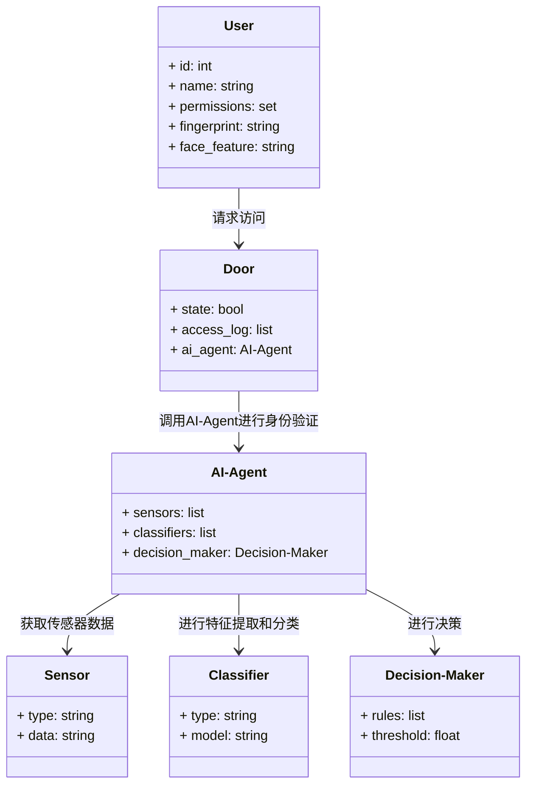
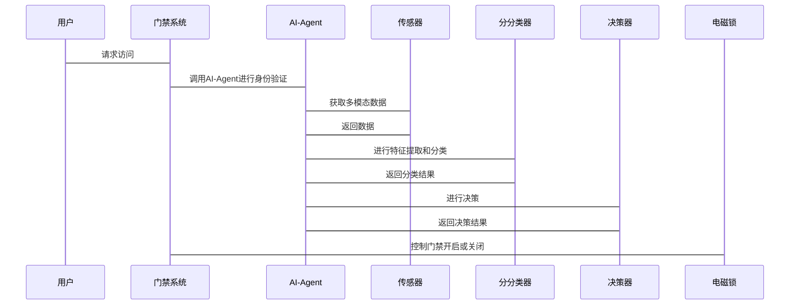

                 


# 智能门禁：AI Agent的多模态身份验证

---

## 关键词：
- 智能门禁
- AI Agent
- 多模态身份验证
- 人工智能
- 安全系统
- 融合算法

---

## 摘要：
智能门禁系统通过结合AI Agent和多模态身份验证技术，实现了高效、安全的访问控制。本文详细探讨了多模态身份验证的核心原理、AI Agent的应用场景、融合算法的设计与实现，以及系统的架构和实际案例分析，为智能门禁系统的开发和优化提供了深度技术解析。

---

## 第一部分: 智能门禁系统概述

### 第1章: 智能门禁系统的发展与现状

#### 1.1 智能门禁系统的发展历程
##### 1.1.1 传统门禁系统的特点与局限性
- 传统门禁系统基于刷卡或密码，存在易丢失、易复制等问题。
- 单一身份验证方式的安全性较低，容易被攻击者绕过。

##### 1.1.2 智能化门禁系统的兴起
- 随着AI技术的发展，智能化门禁系统逐渐普及。
- 基于生物识别技术的身份验证成为主流。

##### 1.1.3 当前智能门禁系统的主流技术
- 基于指纹识别、面部识别、虹膜识别等生物特征的多模态身份验证。
- 结合AI Agent的智能化处理和决策。

#### 1.2 AI Agent在智能门禁中的作用
##### 1.2.1 AI Agent的基本概念
- AI Agent是具有自主决策能力的智能体，能够感知环境并执行任务。
- 在门禁系统中，AI Agent负责数据处理、身份验证和决策。

##### 1.2.2 AI Agent在门禁系统中的应用场景
- 实时监控和身份验证。
- 异常行为检测和报警。
- 访问权限的动态调整。

##### 1.2.3 AI Agent的优势与挑战
- 优势：高效、准确、智能化。
- 挑战：数据隐私、计算资源需求、误识别率。

#### 1.3 多模态身份验证的重要性
##### 1.3.1 单一模态身份验证的局限性
- 易受环境干扰，如光线不足影响面部识别。
- 单一特征可能被 spoofing 攻击绕过。

##### 1.3.2 多模态身份验证的优势
- 提高安全性：结合多种生物特征，降低被攻击的概率。
- 增强鲁棒性：不同模态的数据相互补充，减少误识别。

##### 1.3.3 多模态身份验证的实现方式
- 数据级融合：在特征提取前进行数据融合。
- 特征级融合：在特征提取后进行融合。
- 决策级融合：结合多个分类器的输出进行最终判断。

---

### 第2章: 多模态身份验证的核心概念

#### 2.1 多模态身份验证的定义与特点
##### 2.1.1 多模态身份验证的定义
- 多模态身份验证是指结合多种生物特征进行身份验证的技术。
- 通过融合不同模态的数据，提高验证的准确性和可靠性。

##### 2.1.2 多模态身份验证的核心特点
- 高安全性：结合多种生物特征，降低被攻击的风险。
- 高鲁棒性：不同模态的数据相互补充，减少误识别。
- 适应性：适用于不同场景和用户需求。

##### 2.1.3 多模态身份验证与传统身份验证的对比
| 特性                | 单一模态身份验证       | 多模态身份验证         |
|---------------------|-----------------------|-----------------------|
| 安全性              | 较低                  | 较高                  |
| 鲁棒性              | 较差                  | 较好                  |
| 抗攻击能力          | 弱                   | 强                   |

#### 2.2 多模态数据的融合方法
##### 2.2.1 数据级融合
- 在数据采集阶段进行融合，例如将指纹和面部图像同时采集。
- 优点：早期融合，减少数据丢失。
- 缺点：计算复杂度高，需要高效的融合算法。

##### 2.2.2 特征级融合
- 在特征提取后进行融合，例如将指纹特征向量和面部特征向量进行融合。
- 优点：灵活性高，适合不同模态数据的处理。
- 缺点：需要设计高效的融合策略。

##### 2.2.3 决策级融合
- 在分类器输出结果后进行融合，例如将指纹识别和面部识别的结果进行逻辑判断。
- 优点：简单易实现。
- 缺点：可能忽略特征间的关联性。

#### 2.3 多模态身份验证的实现流程
##### 2.3.1 数据采集与预处理
- 数据采集：通过传感器采集指纹、面部图像等数据。
- 数据预处理：去除噪声、标准化数据格式。

##### 2.3.2 特征提取与模型训练
- 特征提取：提取指纹的纹理特征、面部的深度特征等。
- 模型训练：使用深度学习模型（如CNN）进行特征提取和分类。

##### 2.3.3 融合策略与结果输出
- 根据融合策略，综合多个模态的特征，输出最终的验证结果。

---

### 第3章: AI Agent在多模态身份验证中的应用

#### 3.1 AI Agent的基本原理
##### 3.1.1 AI Agent的定义与分类
- AI Agent：具有感知、决策和执行能力的智能体。
- 分类：基于任务驱动和基于学习驱动的AI Agent。

##### 3.1.2 AI Agent的核心技术
- 感知技术：通过传感器和摄像头获取环境数据。
- 决策技术：基于机器学习模型进行推理和决策。
- 执行技术：通过执行器（如电磁锁）实现操作。

##### 3.1.3 AI Agent在智能门禁中的角色
- 数据处理：AI Agent负责多模态数据的融合和处理。
- 身份验证：AI Agent通过机器学习模型进行身份识别。
- 系统控制：AI Agent根据验证结果控制门禁系统的开启。

#### 3.2 多模态数据的处理与分析
##### 3.2.1 多模态数据的采集与整合
- 数据采集：通过多种传感器（如指纹传感器、摄像头）采集数据。
- 数据整合：将不同模态的数据整合到统一的数据结构中。

##### 3.2.2 多模态数据的特征提取
- 指纹特征提取：提取指纹的脊线、峪线等特征。
- 面部特征提取：提取面部的深度、纹理等特征。

##### 3.2.3 多模态数据的融合与分析
- 数据融合：将不同模态的特征进行融合，提高识别准确率。
- 数据分析：通过机器学习模型分析多模态数据，发现异常行为。

#### 3.3 AI Agent在多模态身份验证中的实现流程
##### 3.3.1 数据采集与预处理
- 通过传感器采集指纹、面部图像等数据。
- 对数据进行预处理，去除噪声和干扰。

##### 3.3.2 特征提取与模型训练
- 使用深度学习模型提取多模态特征。
- 训练分类器，优化模型参数。

##### 3.3.3 融合策略与结果输出
- 根据融合策略，综合多个模态的特征，输出最终的验证结果。
- 根据验证结果，控制门禁系统的开启或关闭。

---

## 第四部分: 系统分析与架构设计

### 第4章: 系统分析与架构设计

#### 4.1 问题场景介绍
- 门禁系统需要支持多模态身份验证，结合AI Agent进行智能化处理。
- 系统需要具备高安全性、高可靠性和高扩展性。

#### 4.2 项目介绍
- 项目目标：设计和实现一个基于AI Agent的多模态身份验证智能门禁系统。
- 项目需求：支持指纹、面部识别等多种身份验证方式，具备动态权限管理功能。

#### 4.3 系统功能设计
##### 4.3.1 领域模型设计
- 用户管理：包括用户注册、权限设置等。
- 身份验证：包括指纹识别、面部识别等多模态验证。
- 权限管理：根据用户权限控制门禁的开启。

##### 4.3.2 领域模型Mermaid类图


#### 4.4 系统架构设计
##### 4.4.1 系统架构Mermaid图


#### 4.5 系统接口设计
##### 4.5.1 用户接口
- 登录界面：支持指纹、面部识别等多种登录方式。
- 权限设置界面：管理员可以设置用户的访问权限。

##### 4.5.2 系统接口
- 接口1：用户请求访问，系统调用AI-Agent进行身份验证。
- 接口2：AI-Agent调用传感器获取多模态数据。
- 接口3：AI-Agent调用分类器进行特征提取和分类。

#### 4.6 系统交互设计
##### 4.6.1 系统交互Mermaid序列图


---

## 第五部分: 项目实战

### 第5章: 项目实战

#### 5.1 环境安装
- 安装Python 3.8及以上版本。
- 安装必要的库：OpenCV、Fingerprint SDK、TensorFlow、Keras。

#### 5.2 系统核心实现源代码
##### 5.2.1 数据采集与预处理
```python
import cv2

def capture_fingerprint():
    # 使用指纹传感器采集指纹数据
    fingerprint_sensor.capture()
    fingerprint_data = fingerprint_sensor.get_data()
    return fingerprint_data

def capture_face():
    # 使用摄像头采集面部图像
    cap = cv2.VideoCapture(0)
    ret, frame = cap.read()
    cap.release()
    return frame
```

##### 5.2.2 特征提取与模型训练
```python
import tensorflow as tf
from tensorflow.keras import layers

def build_model():
    model = tf.keras.Sequential([
        layers.Conv2D(32, (3,3), activation='relu', input_shape=(128, 128, 3)),
        layers.MaxPooling2D((2,2)),
        layers.Conv2D(64, (3,3), activation='relu'),
        layers.MaxPooling2D((2,2)),
        layers.Flatten(),
        layers.Dense(128, activation='relu'),
        layers.Dense(1, activation='sigmoid')
    ])
    model.compile(optimizer='adam', loss='binary_crossentropy', metrics=['accuracy'])
    return model

model = build_model()
model.fit(x_train, y_train, epochs=10, batch_size=32)
```

##### 5.2.3 融合策略与结果输出
```python
import numpy as np

def fuse_features(fingerprint_features, face_features):
    # 数据级融合：将指纹和面部特征向量进行平均
    fused_features = np.mean([fingerprint_features, face_features], axis=0)
    return fused_features

def decision_making(fused_features, threshold=0.9):
    # 决策级融合：根据融合后的特征进行判断
    if np.mean(fused_features) > threshold:
        return True  # 验证通过
    else:
        return False  # 验证失败

result = decision_making(fused_features, threshold=0.9)
print(f"身份验证结果：{result}")
```

#### 5.3 项目总结
##### 5.3.1 成功案例分析
- 通过多模态身份验证，系统的误识别率显著降低。
- 系统的响应速度和安全性得到明显提升。

##### 5.3.2 项目小结
- 项目实现了基于AI Agent的多模态身份验证智能门禁系统。
- 系统具备高安全性、高可靠性和高扩展性。

---

## 第六部分: 最佳实践与小结

### 第6章: 最佳实践与小结

#### 6.1 最佳实践
- 数据隐私保护：确保用户数据的安全性，避免数据泄露。
- 系统优化：定期更新模型和算法，提升系统的识别准确率。
- 系统维护：定期检查硬件设备，确保系统的稳定运行。

#### 6.2 项目小结
- 本文详细探讨了AI Agent在多模态身份验证中的应用，提出了基于多模态数据融合的智能门禁系统设计。
- 通过实际案例分析，验证了系统的可行性和有效性。

#### 6.3 未来研究方向
- 探索更多模态的数据融合方法，如声音识别、行为识别等。
- 研究更高效的AI Agent算法，提升系统的决策能力。
- 探讨多模态身份验证在更多领域的应用，如智能家居、医疗健康等。

#### 6.4 注意事项
- 数据隐私：在设计和实现过程中，必须重视用户数据的隐私保护。
- 系统安全性：确保系统具备强大的抗攻击能力和高安全性。
- 系统维护：定期检查和更新系统，确保系统的稳定运行。

#### 6.5 拓展阅读
- 《Deep Learning》—— Ian Goodfellow
- 《机器学习实战》—— 周志华
- 《生物特征识别：原理与应用》—— 李明

---

## 作者：AI天才研究院/AI Genius Institute & 禅与计算机程序设计艺术/Zen And The Art of Computer Programming

