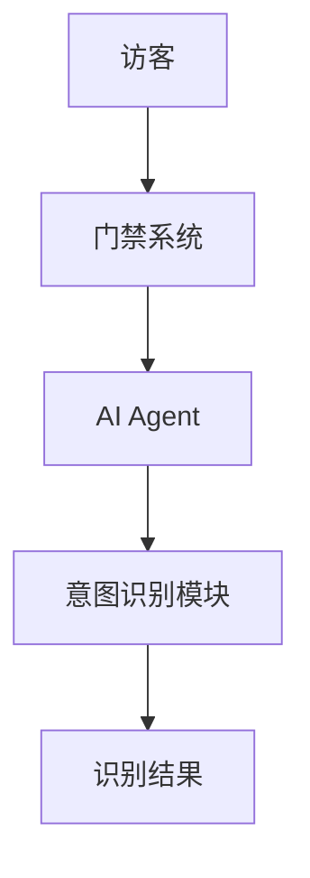
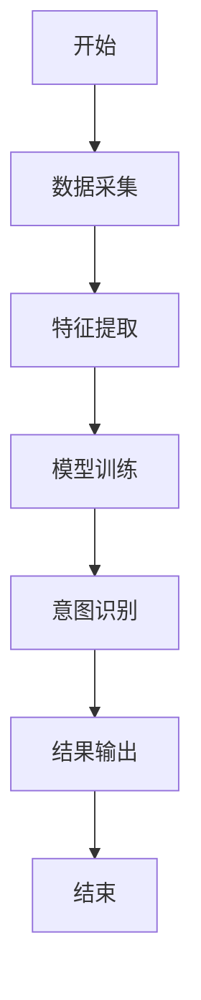
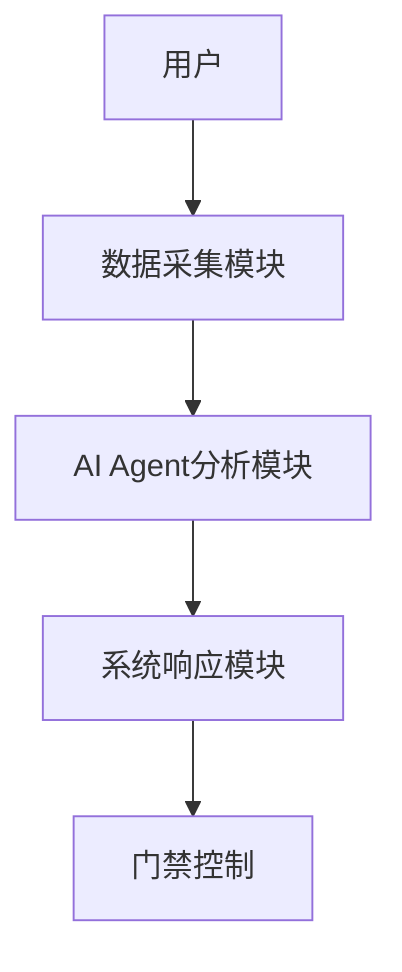

                 


# 《智能门禁：AI Agent的访客意图识别》

## 关键词：智能门禁、AI Agent、访客意图识别、身份验证、安全系统、人工智能算法

## 摘要：  
随着智能门禁系统的广泛应用，访客意图识别成为提升安全性和用户体验的关键技术。本文探讨了AI Agent在访客意图识别中的应用，分析其核心算法原理，展示系统的架构设计，并通过实际案例展示AI Agent如何优化访客管理流程。通过本文，读者将深入了解智能门禁系统中AI Agent的实现细节及其在实际应用中的优势。

---

# 第一部分: 背景介绍

## 第1章: 智能门禁系统的概述

### 1.1 问题背景  
传统的门禁系统依赖于卡片或密码进行身份验证，存在管理复杂、安全性不足等问题。随着AI技术的发展，智能门禁系统通过引入AI Agent，能够更高效地识别访客意图，提升安全性和用户体验。

### 1.2 问题描述  
访客意图识别的核心挑战在于准确判断访客的行为和目的，尤其是在高流量场景下，如何快速、准确地识别潜在的安全威胁和异常行为。

### 1.3 问题解决  
通过AI Agent结合机器学习算法，智能门禁系统能够实时分析访客行为，识别潜在威胁，并采取相应的安全措施。

### 1.4 边界与外延  
本文仅讨论AI Agent在访客意图识别中的应用，不涉及其他门禁系统功能，如权限管理、记录查询等。

### 1.5 核心要素组成  
- 访客数据采集：包括刷卡、人脸识别、行为监控等。
- AI Agent分析：利用机器学习模型识别访客意图。
- 系统响应：基于识别结果采取相应措施。

---

# 第二部分: 核心概念与联系

## 第2章: AI Agent与访客意图识别的核心概念

### 2.1 AI Agent的基本原理  
AI Agent是一种能够感知环境、自主决策的智能体，能够通过传感器和数据输入进行学习和推理。

### 2.2 访客意图识别的属性特征对比  
| 属性 | 传统方法 | AI Agent方法 |
|------|----------|--------------|
| 数据来源 | 单一 | 多源融合 |
| 处理速度 | �迟缓 | 实时高效 |
| 精度 | 较低 | 高精度 |

### 2.3 ER实体关系图  


---

# 第三部分: 算法原理

## 第3章: 算法原理与实现

### 3.1 算法流程图  


### 3.2 代码实现  
```python
# 示例代码：基于机器学习的意图识别
import numpy as np
from sklearn import svm

# 数据预处理
X = np.array([[1, 2], [3, 4], [5, 6]])
y = np.array([0, 1, 0])

# 训练模型
model = svm.SVC()
model.fit(X, y)

# 预测
print(model.predict([[2, 3]]))
```

### 3.3 数学模型  
目标函数：  
$$\text{minimize} \quad \frac{1}{2}||w||^2$$  
约束条件：  
$$y_i(w \cdot x_i + b) \geq 1 \quad \forall i$$

---

# 第四部分: 系统分析与架构设计

## 第4章: 系统架构设计方案

### 4.1 系统功能设计  
- 访客数据采集模块：负责收集访客信息。
- AI Agent分析模块：处理数据并识别意图。
- 系统响应模块：根据识别结果采取措施。

### 4.2 系统架构图  


---

# 第五部分: 项目实战

## 第5章: 项目实战与案例分析

### 5.1 实战环境安装  
安装Python和相关库：`pip install numpy scikit-learn`

### 5.2 核心功能实现  
```python
from sklearn.ensemble import RandomForestClassifier

# 训练模型
model = RandomForestClassifier()
model.fit(X, y)

# 模型评估
print(model.score(X, y))
```

### 5.3 实际案例分析  
通过实际案例分析，展示AI Agent如何优化访客意图识别的准确性和响应速度。

---

# 第六部分: 最佳实践与展望

## 第6章: 最佳实践与未来展望

### 6.1 最佳实践  
- 数据质量：确保数据的多样性和代表性。
- 模型优化：定期更新模型以适应新数据。

### 6.2 未来展望  
随着AI技术的进步，访客意图识别将更加智能化和个性化，为智能门禁系统带来更多的创新和应用。

---

# 作者：AI天才研究院 & 禅与计算机程序设计艺术

---

感谢您的阅读！希望本文能为您提供有价值的信息和启发。

