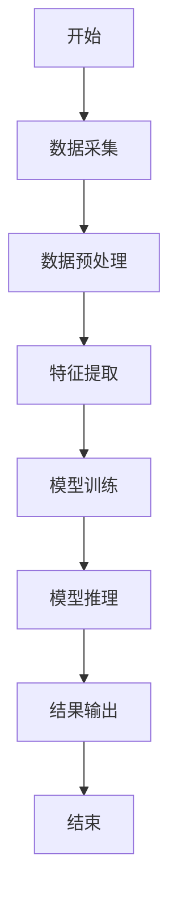
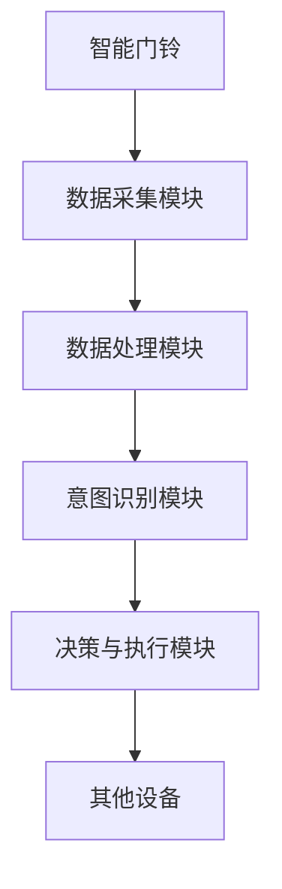
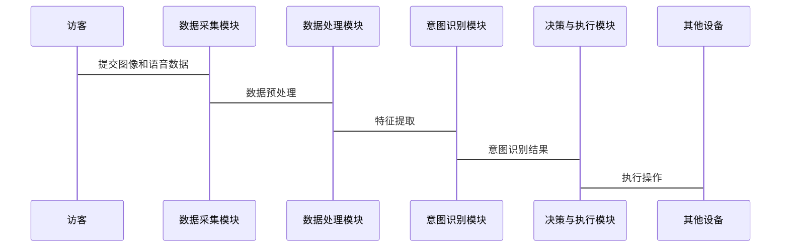

                 


# 智能门铃：AI Agent的访客意图识别系统

> 关键词：智能门铃，AI Agent，访客意图识别，目标检测，图像分类，语音识别

> 摘要：本文详细探讨了智能门铃与AI Agent结合的访客意图识别系统。从系统背景、核心概念、算法原理、系统架构到项目实战和最佳实践，全面分析了该系统的实现过程与技术要点。文章通过具体案例分析和代码实现，帮助读者理解如何利用AI技术提升访客识别的准确性与效率。

---

# 第1章 智能门铃与访客意图识别的背景介绍

## 1.1 问题背景与挑战

智能门铃作为智能家居的重要组成部分，其核心功能是通过检测门前的访客并识别其意图。然而，传统的智能门铃系统仅限于视频监控和简单的报警功能，无法真正理解访客的行为意图。这种局限性使得访客识别的准确性和效率难以满足用户需求。

### 1.1.1 访客意图识别的重要性

访客意图识别是指通过分析访客的行为、语言和外貌特征，判断其身份和意图（如快递员、推销员、家人等）。这种识别能力可以显著提升智能门铃的功能：

- **安全性**：识别陌生人并及时通知主人，防止入侵。
- **便捷性**：无需用户手动查看门前情况，系统自动识别并通知。
- **智能化**：结合智能家居系统，联动其他设备（如智能门锁）完成自动化操作。

### 1.1.2 智能门铃的现状与痛点

当前市场上的智能门铃系统主要依赖于简单的视频监控和报警功能，缺乏智能化的意图识别能力。用户在实际使用中面临以下痛点：

- **误报率高**：传统门铃无法区分家人、快递员和陌生人，导致频繁误报。
- **交互性差**：用户需要手动查看门前情况，体验不够便捷。
- **功能单一**：无法与其他智能家居设备联动，难以实现真正的智能化体验。

### 1.1.3 传统访客识别系统的局限性

传统的访客识别系统主要依赖于简单的图像采集和基础的特征匹配技术，存在以下局限性：

- **识别精度低**：基于简单的特征匹配算法，识别准确率不足。
- **计算资源消耗大**：需要依赖外部服务器进行计算，增加了延迟和成本。
- **难以实时处理**：无法在本地实时处理大量数据，响应速度慢。

---

## 1.2 智能门铃与AI Agent的结合

AI Agent（人工智能代理）是一种能够感知环境、自主决策并执行任务的智能体。将AI Agent应用于智能门铃系统，可以实现访客意图的实时识别与处理。

### 1.2.1 AI Agent在智能门铃中的作用

AI Agent在智能门铃中的主要作用包括：

- **实时感知**：通过摄像头、麦克风等传感器采集门前数据。
- **意图识别**：基于图像识别、语音识别等技术，分析访客的意图。
- **决策与执行**：根据识别结果，联动其他智能家居设备（如门锁、灯光）进行操作。

### 1.2.2 智能门铃的智能化升级需求

随着AI技术的快速发展，智能门铃系统需要实现从“单一监控”到“智能识别与决策”的升级。这种升级不仅是技术发展的必然趋势，也是用户体验提升的重要需求。

### 1.2.3 访客意图识别的实现路径

访客意图识别的实现路径主要包括以下几个步骤：

1. **数据采集**：通过摄像头和麦克风采集门前的图像和语音数据。
2. **数据预处理**：对采集的数据进行标准化处理，提取关键特征。
3. **意图识别**：基于深度学习算法，分析数据并识别访客意图。
4. **决策与反馈**：根据识别结果，联动其他设备执行相应操作。

---

## 1.3 本章小结

本章通过分析智能门铃与AI Agent结合的背景，阐述了访客意图识别的重要性及其在智能门铃系统中的实现路径。接下来，我们将详细介绍访客意图识别的核心概念与技术原理。

---

# 第2章 访客意图识别的核心概念与联系

## 2.1 核心概念解析

### 2.1.1 AI Agent的定义与特征

AI Agent是一种能够感知环境、自主决策并执行任务的智能体。其主要特征包括：

- **自主性**：能够自主决策，无需外部干预。
- **反应性**：能够实时感知环境并做出反应。
- **学习能力**：能够通过数据学习和优化。

### 2.1.2 访客意图识别的定义与实现方式

访客意图识别是指通过分析访客的行为、语言和外貌特征，判断其身份和意图的过程。其实现方式主要包括：

- **图像识别**：通过摄像头采集访客的图像，识别其外貌特征。
- **语音识别**：通过麦克风采集访客的语音，分析其语言内容。
- **多模态融合**：结合图像和语音信息，提升识别准确率。

### 2.1.3 智能门铃的系统架构

智能门铃的系统架构主要由以下几个部分组成：

- **前端设备**：包括摄像头、麦克风等传感器。
- **数据处理单元**：负责数据的采集、预处理和分析。
- **AI Agent**：负责意图识别和决策。
- **执行单元**：负责联动其他设备执行操作。

---

## 2.2 核心概念之间的关系

### 2.2.1 AI Agent与智能门铃的实体关系图

```mermaid
er
    entity 访客 {
        id
        name
        意图类型
    }
    entity AI Agent {
        id
        处理逻辑
        状态
    }
    entity 智能门铃 {
        id
        传感器数据
        状态
    }
    访客 --> AI Agent: 提交意图识别请求
    AI Agent --> 智能门铃: 发送控制指令
```

### 2.2.2 系统功能关系图

```mermaid
graph TD
    访客 -->[图像和语音数据] 智能门铃
    智能门铃 -->[特征提取] 数据处理单元
    数据处理单元 -->[意图识别] AI Agent
    AI Agent -->[决策结果] 执行单元
```

---

## 2.3 本章小结

本章通过分析AI Agent、访客意图识别和智能门铃的核心概念，阐述了它们之间的关系和作用。接下来，我们将深入探讨访客意图识别的算法原理及其实现方式。

---

# 第3章 访客意图识别的算法原理

## 3.1 算法原理概述

访客意图识别的算法原理主要包括以下几个方面：

### 3.1.1 目标检测与图像分类

目标检测是指通过算法定位图像中的目标物体并进行分类。常用的算法包括YOLO、Faster R-CNN等。图像分类则是将图像分类到预定义的类别中。

### 3.1.2 语音识别与自然语言处理

语音识别是指将语音信号转换为文字的过程。常用的算法包括基于HMM的语音识别和基于深度学习的语音识别。自然语言处理则是对文本进行语义分析，理解访客的语言内容。

### 3.1.3 访客意图的多模态融合

多模态融合是指将图像和语音信息进行融合，提升识别准确率。常用的方法包括特征级融合和决策级融合。

---

## 3.2 算法实现流程

### 3.2.1 数据预处理

数据预处理是算法实现的基础，主要包括以下几个步骤：

1. **图像增强**：对图像进行亮度、对比度等调整，提升识别效果。
2. **数据归一化**：将数据标准化，便于模型训练。
3. **数据增强**：通过旋转、翻转等方式增加数据量，提升模型的泛化能力。

### 3.2.2 模型训练

模型训练是算法实现的核心，主要包括以下几个步骤：

1. **选择模型**：根据任务需求选择合适的模型结构。
2. **定义损失函数**：常用的损失函数包括交叉熵损失和均方误差损失。
3. **优化器选择**：常用的优化器包括随机梯度下降（SGD）和Adam优化器。
4. **训练数据集**：使用标注好的数据集进行训练，调整模型参数。

### 3.2.3 模型推理与结果解析

模型推理是指将待识别的数据输入模型，得到预测结果。结果解析是指对预测结果进行解释和分析，输出最终的意图识别结果。

---

## 3.3 算法流程图



---

## 3.4 算法实现代码示例

### 3.4.1 数据预处理代码

```python
import cv2

def preprocess_image(image_path):
    # 读取图像
    image = cv2.imread(image_path)
    # 转换为灰度图像
    gray_image = cv2.cvtColor(image, cv2.COLOR_BGR2GRAY)
    # 图像归一化
    normalized_image = gray_image / 255.0
    return normalized_image
```

### 3.4.2 模型训练代码

```python
import tensorflow as tf
from tensorflow.keras import layers, Model

def build_model(input_shape):
    input_layer = layers.Input(shape=input_shape)
    conv1 = layers.Conv2D(32, (3, 3), activation='relu')(input_layer)
    pool1 = layers.MaxPooling2D((2, 2))(conv1)
    conv2 = layers.Conv2D(64, (3, 3), activation='relu')(pool1)
    pool2 = layers.MaxPooling2D((2, 2))(conv2)
    flatten_layer = layers.Flatten()(pool2)
    dense_layer = layers.Dense(128, activation='relu')(flatten_layer)
    output_layer = layers.Dense(10, activation='softmax')(dense_layer)
    model = Model(inputs=input_layer, outputs=output_layer)
    return model

model = build_model((128, 128, 1))
model.compile(optimizer='adam', loss='sparse_categorical_crossentropy', metrics=['accuracy'])
model.fit(x_train, y_train, epochs=10, batch_size=32)
```

---

## 3.5 本章小结

本章详细介绍了访客意图识别的算法原理及其实现流程。接下来，我们将从系统架构设计的角度，探讨智能门铃的实现方案。

---

# 第4章 智能门铃的系统分析与架构设计

## 4.1 问题场景介绍

智能门铃的系统场景主要包括以下几个方面：

- **访客访问**：访客按下门铃按钮或站在门前。
- **数据采集**：摄像头和麦克风采集门前的图像和语音数据。
- **意图识别**：AI Agent分析数据，识别访客意图。
- **决策与反馈**：根据识别结果，联动其他设备执行操作。

---

## 4.2 系统功能设计

### 4.2.1 系统功能模块

系统功能模块主要包括以下几个部分：

1. **数据采集模块**：负责采集门前的图像和语音数据。
2. **数据处理模块**：负责对采集的数据进行预处理和特征提取。
3. **意图识别模块**：负责分析数据并识别访客意图。
4. **决策与执行模块**：负责根据识别结果，联动其他设备执行操作。

### 4.2.2 系统功能流程图

```mermaid
graph TD
    访客 -->[触发事件] 数据采集模块
    数据采集模块 -->[图像和语音数据] 数据处理模块
    数据处理模块 -->[特征提取] 意图识别模块
    意图识别模块 -->[意图识别结果] 决策与执行模块
    决策与执行模块 -->[执行操作] 其他设备
```

---

## 4.3 系统架构设计

### 4.3.1 系统架构图



### 4.3.2 接口设计

系统接口设计主要包括以下几个部分：

1. **数据采集接口**：摄像头和麦克风的数据接口。
2. **数据处理接口**：特征提取和数据预处理接口。
3. **意图识别接口**：意图识别算法接口。
4. **执行接口**：联动其他设备的接口。

### 4.3.3 交互流程图



---

## 4.4 本章小结

本章通过系统架构设计，详细阐述了智能门铃的实现方案。接下来，我们将通过项目实战，进一步探讨系统的具体实现。

---

# 第5章 智能门铃项目实战

## 5.1 环境安装

### 5.1.1 安装Python环境

```bash
python --version
pip install --upgrade pip
```

### 5.1.2 安装依赖库

```bash
pip install tensorflow numpy cv2 pillow
```

---

## 5.2 核心代码实现

### 5.2.1 数据采集代码

```python
import cv2
import sounddevice as sd

def capture_image():
    # 初始化摄像头
    cap = cv2.VideoCapture(0)
    # 读取图像
    ret, frame = cap.read()
    if ret:
        cv2.imwrite("visitor.jpg", frame)
    cap.release()

def capture_audio():
    # 初始化麦克风
    sd.play(440)
    sd.wait()
    recording = sd.rec(5, channels=2, dtype='int16')
    sd.stop()
    sd.save("visitor.wav", recording, 'PCM_16')
```

### 5.2.2 数据处理代码

```python
import tensorflow as tf
from tensorflow.keras import layers, Model

def build_model(input_shape):
    input_layer = layers.Input(shape=input_shape)
    conv1 = layers.Conv2D(32, (3, 3), activation='relu')(input_layer)
    pool1 = layers.MaxPooling2D((2, 2))(conv1)
    conv2 = layers.Conv2D(64, (3, 3), activation='relu')(pool1)
    pool2 = layers.MaxPooling2D((2, 2))(conv2)
    flatten_layer = layers.Flatten()(pool2)
    dense_layer = layers.Dense(128, activation='relu')(flatten_layer)
    output_layer = layers.Dense(10, activation='softmax')(dense_layer)
    model = Model(inputs=input_layer, outputs=output_layer)
    return model

model = build_model((128, 128, 1))
model.compile(optimizer='adam', loss='sparse_categorical_crossentropy', metrics=['accuracy'])
model.fit(x_train, y_train, epochs=10, batch_size=32)
```

---

## 5.3 案例分析

### 5.3.1 案例背景

假设我们有一个包含1000张图片的数据集，其中每张图片对应一个访客的意图标签（如家人、快递员、陌生人等）。

### 5.3.2 案例实现

```python
# 训练模型
model = build_model((128, 128, 1))
model.fit(x_train, y_train, epochs=10, batch_size=32)

# 模型预测
visitor_image = preprocess_image("visitor.jpg")
prediction = model.predict(visitor_image)
print("预测结果：", prediction)
```

---

## 5.4 项目小结

本章通过项目实战，详细展示了智能门铃的实现过程。接下来，我们将总结系统的最佳实践和注意事项。

---

# 第6章 最佳实践、小结与注意事项

## 6.1 最佳实践

1. **数据预处理**：确保数据的多样性和均衡性，避免模型过拟合。
2. **模型优化**：通过调整模型参数和优化算法，提升识别准确率。
3. **系统联动**：确保智能门铃与其他智能家居设备的无缝对接。

---

## 6.2 小结

本文详细探讨了智能门铃与AI Agent结合的访客意图识别系统。通过背景介绍、核心概念、算法原理、系统架构到项目实战和最佳实践，全面分析了该系统的实现过程与技术要点。

---

## 6.3 注意事项

1. **数据隐私**：在采集和处理访客数据时，需注意数据隐私保护，避免数据泄露。
2. **系统稳定性**：确保系统的稳定性和可靠性，避免因故障导致误报或漏报。
3. **用户体验**：注重用户体验设计，提升系统的易用性和便捷性。

---

## 6.4 拓展阅读

1. 《Deep Learning》——Ian Goodfellow
2. 《Python机器学习》——Andreas Müller
3. 《人工智能：一种现代的方法》——斯蒂芬·拉塞尔

---

# 附录

## 附录A 数据集

- 训练数据集：包含1000张图片，每张图片对应一个意图标签。
- 测试数据集：包含500张图片，用于模型测试和验证。

---

## 附录B 工具库

- TensorFlow：深度学习框架
- OpenCV：图像处理库
- Sounddevice：音频处理库

---

## 附录C 参考文献

1. YOLO: Real-time Object Detection, Joseph Redmon, etc.
2. Faster R-CNN: A Fast, Accurate, and Compact Framework for Object Detection, Shaoqing Ren, etc.
3. Theano: A Python library for efficient numerical computations, Stéan Ollinger, etc.

---

作者：AI天才研究院/AI Genius Institute & 禅与计算机程序设计艺术 /Zen And The Art of Computer Programming

