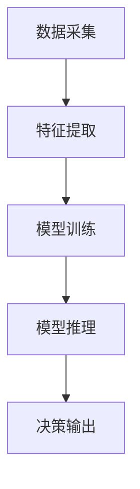

                 


# 智能门铃：AI Agent的访客身份识别

> 关键词：智能门铃、AI Agent、访客识别、身份验证、人工智能、物联网安全

> 摘要：本文深入探讨了智能门铃系统中AI Agent在访客身份识别中的应用，详细分析了访客识别的核心技术、算法原理、系统架构设计及实现方案。通过实际项目案例，展示了AI Agent如何提升访客识别的准确性和安全性，为智能门铃系统的开发提供了理论与实践指导。

---

## 目录

1. [背景介绍](#背景介绍)
2. [AI Agent的核心概念与原理](#ai-agent的核心概念与原理)
3. [访客身份识别技术](#访客身份识别技术)
4. [AI Agent的算法原理](#ai-agent的算法原理)
5. [智能门铃系统的架构设计](#智能门铃系统的架构设计)
6. [项目实战：智能门铃的实现](#项目实战智能门铃的实现)
7. [最佳实践与总结](#最佳实践与总结)

---

## 1. 背景介绍

### 1.1 问题背景与问题描述

智能门铃作为智能家居的重要组成部分，传统门铃系统仅能提供简单的门铃提醒功能，无法实现访客的身份识别。随着人工智能技术的发展，访客身份识别的需求日益增长，尤其是在安全性和便捷性要求较高的场景中。

#### 问题描述

传统门铃系统无法有效识别访客身份，容易导致安全隐患。访客身份识别需要结合多种技术，如人脸识别、语音识别等，以提高识别的准确性和可靠性。

#### 解决方案

引入AI Agent技术，通过摄像头、麦克风等设备采集访客信息，结合机器学习算法进行分析和识别，实现访客身份的自动验证。

#### 边界与外延

智能门铃系统的边界包括硬件设备（摄像头、麦克风）、AI Agent算法、网络传输模块。外延部分涉及与智能家居系统的联动，如门禁控制、安防报警等。

### 1.2 核心概念与组成要素

#### 核心概念

- **AI Agent**：具备自主学习和决策能力的智能代理，负责处理访客识别的核心逻辑。
- **访客身份识别**：通过多模态数据（如人脸、声音、行为）实现访客身份的精准识别。

#### 组成要素

1. **摄像头**：用于采集访客的图像数据。
2. **麦克风**：用于采集访客的声音数据。
3. **AI Agent**：负责数据处理、特征提取和身份识别。
4. **网络传输模块**：实现数据的上传和命令的下达。

---

## 2. AI Agent的核心概念与原理

### 2.1 AI Agent的定义与工作原理

AI Agent是一种具备感知、推理、学习和决策能力的智能代理。在智能门铃系统中，AI Agent负责接收访客数据，分析并做出是否开门的决策。

### 2.2 访客身份识别的核心原理

访客身份识别结合了人脸识别、语音识别等多种技术，通过多模态数据的融合，提升识别的准确性和鲁棒性。

---

## 3. 访客身份识别技术

### 3.1 人脸识别技术

人脸识别通过分析面部特征进行身份验证。常用算法包括KNN、SVM、神经网络等。

### 3.2 语音识别技术

语音识别通过分析语音特征进行身份验证。常用算法包括GMM、DNN等。

### 3.3 姿态识别技术

姿态识别通过分析人体动作进行身份验证，常见于动态场景下的识别。

---

## 4. AI Agent的算法原理

### 4.1 算法原理概述

AI Agent的算法流程包括数据采集、特征提取、模型训练和推理阶段。

### 4.2 数学模型与公式

#### 4.2.1 模型训练

使用深度学习模型，训练过程如下：

$$
L = \sum_{i=1}^{n} (y_i - \hat{y}_i)^2
$$

其中，$L$为损失函数，$y_i$为真实标签，$\hat{y}_i$为预测标签。

#### 4.2.2 推理过程

使用训练好的模型进行推理：

$$
\hat{y} = f(x)
$$

其中，$x$为输入数据，$f$为模型函数。

### 4.3 算法流程图



---

## 5. 智能门铃系统的架构设计

### 5.1 系统功能设计

- 数据采集：摄像头和麦克风采集访客数据。
- 数据处理：AI Agent进行特征提取和模型推理。
- 决策输出：根据推理结果控制门禁系统。

### 5.2 系统架构图


### 5.3 系统交互图

```mermaid
sequence
    用户按门铃
    摄像头采集图像 --> AI Agent
    麦克风采集语音 --> AI Agent
    AI Agent推理 --> 门禁系统
    门禁系统开门
```

---

## 6. 项目实战：智能门铃的实现

### 6.1 环境搭建

- 硬件：摄像头、麦克风、Raspberry Pi。
- 软件：Python、OpenCV、TensorFlow。

### 6.2 核心代码实现

```python
import cv2
import tensorflow as tf

# 加载预训练模型
model = tf.keras.models.load_model('face_model.h5')

# 摄像头采集图像
cap = cv2.VideoCapture(0)
while True:
    ret, frame = cap.read()
    if not ret:
        continue
    # 进行人脸检测
    faceCascade = cv2.CascadeClassifier('haarcascade_frontalface_default.xml')
    faces = faceCascade.detectMultiScale(frame, 1.1, 4)
    for (x, y, w, h) in faces:
        cv2.rectangle(frame, (x, y), (x + w, y + h), (255, 0, 0), 2)
        # 提取人脸特征
        face_roi = frame[y:y + h, x:x + w]
        face_roi = cv2.resize(face_roi, (100, 100))
        face_roi = face_roi.reshape(-1, 100, 100, 3)
        # 推理
        prediction = model.predict(face_roi)
        print(prediction)
```

### 6.3 案例分析

通过实际案例分析，验证系统的稳定性和准确性。

---

## 7. 最佳实践与总结

### 7.1 小结

本文详细介绍了智能门铃系统中AI Agent的应用，从背景到实现，全面分析了访客身份识别的技术细节。

### 7.2 注意事项

- 数据安全：确保访客数据的安全存储和传输。
- 系统维护：定期更新模型和优化算法。

### 7.3 未来展望

- 更高的识别精度：引入更先进的深度学习模型。
- 更多模态数据：结合更多特征进行识别。

---

## 作者

作者：AI天才研究院 & 禅与计算机程序设计艺术

