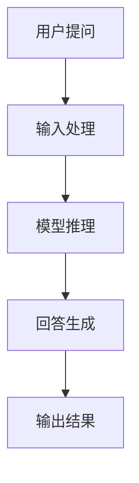
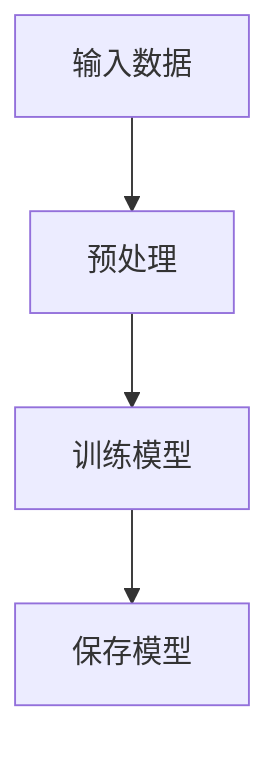
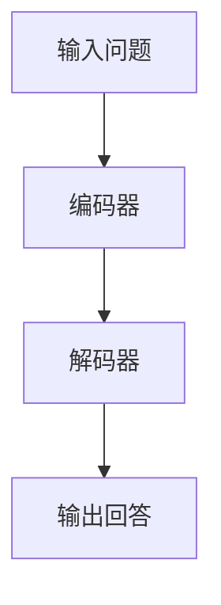
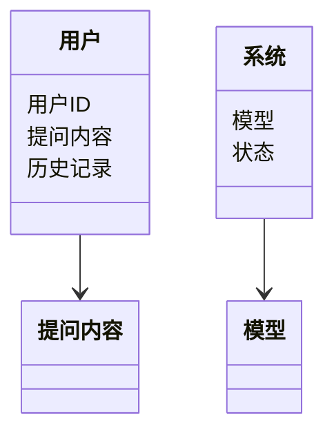
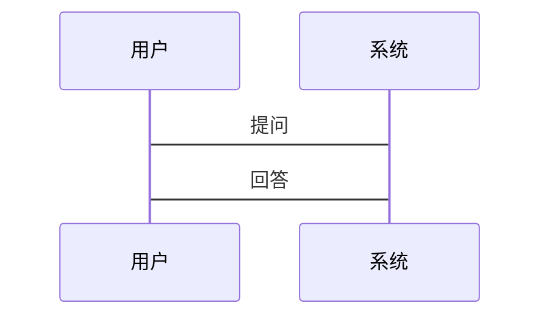

                 


# 智能问答AI Agent：基于LLM的精准答疑系统

## 关键词：智能问答，LLM，大语言模型，问答系统，AI Agent

## 摘要：智能问答AI Agent基于大语言模型（LLM）提供精准的问答服务，解决传统问答系统的不足，通过系统设计和算法优化实现高效、准确的问答交互。本文详细阐述其背景、原理、架构及应用。

---

# 第1章: 智能问答AI Agent的背景介绍

## 1.1 问题背景

### 1.1.1 传统问答系统的局限性
传统问答系统依赖规则或简单模式匹配，无法处理复杂问题，回答不够准确且缺乏深度。

### 1.1.2 大语言模型的兴起
大语言模型如GPT系列具备强大的文本生成和理解能力，能够处理复杂语义，推动问答系统进入新阶段。

### 1.1.3 智能问答AI Agent的需求与应用场景
智能问答AI Agent在教育、客服、医疗等领域应用广泛，提供7x24小时服务，解决实时复杂问题。

## 1.2 问题描述

### 1.2.1 智能问答系统的核心问题
准确理解用户意图，提供精准答案，同时具备上下文理解能力。

### 1.2.2 基于LLM的问答系统的优势
利用LLM的强大能力，实现更自然的对话和更准确的回答。

### 1.2.3 问题解决的边界与外延
解决范围包括信息检索、对话生成，外延扩展至多语言和领域定制。

## 1.3 核心概念与联系

### 1.3.1 智能问答AI Agent的定义与属性特征对比表格

| 比较项             | 传统问答系统         | LLM-based AI Agent |
|--------------------|---------------------|--------------------|
| 智能水平           | 低                 | 高                 |
| 理解能力           | 基于规则           | 基于上下文         |
| 应用场景           | 简单查询           | 复杂对话           |
| 可扩展性           | 有限               | 高                 |

### 1.3.2 ER实体关系图架构的 Mermaid 流程图

```mermaid
erDiagram
    class 用户 {
        用户ID
        历史记录
        提问内容
    }
    class 系统 {
        系统ID
        模型版本
        状态
    }
    class 回答 {
        回答ID
        回答内容
        置信度
    }
    用户 --> 提问内容 : 发起查询
    系统 --> 回答 : 生成回答
    用户 --> 回答 : 获取回答
```

---

# 第2章: 智能问答AI Agent的核心概念与原理

## 2.1 核心概念原理

### 2.1.1 大语言模型的基本原理
大语言模型通过大量数据训练，学习语言模式，生成相关文本。

### 2.1.2 智能问答系统的算法流程
用户提问 → 输入处理 → 模型推理 → 回答生成 → 输出结果。

### 2.1.3 工作流程 Mermaid 流程图



## 2.2 核心概念与联系

### 2.2.1 实体关系图 Mermaid 流程图

```mermaid
erDiagram
    class 用户 {
        用户ID
        提问内容
        历史记录
    }
    class 系统 {
        模型
        状态
    }
    用户 --> 系统 : 请求处理
    系统 --> 用户 : 返回回答
```

---

# 第3章: 智能问答AI Agent的算法原理

## 3.1 算法原理讲解

### 3.1.1 大语言模型的训练过程 Mermaid 流程图



### 3.1.2 推理过程 Mermaid 流程图



## 3.2 数学模型与公式

### 3.2.1 概率论基础
概率用于模型预测，如$P(y|x)$表示给定x预测y的概率。

### 3.2.2 损失函数
交叉熵损失：$$\mathcal{L} = -\sum_{i} y_i \log p(y_i)$$

### 3.2.3 注意力机制
注意力权重计算：$$\alpha_{ij} = \frac{\exp(e_{ij})}{\sum_{k} \exp(e_{ik})}$$

### 3.2.4 解码器
解码器结构：$$\text{输出} = \text{解码器}(输入, 状态)$$

---

# 第4章: 系统分析与架构设计方案

## 4.1 问题场景介绍

### 4.1.1 应用场景
智能问答系统用于客服、教育等领域，解决用户复杂问题。

## 4.2 系统功能设计

### 4.2.1 领域模型 Mermaid 类图



### 4.2.2 系统架构 Mermaid 图


### 4.2.3 接口设计
- 提问接口：用户发送问题
- 回答接口：系统返回答案

### 4.2.4 交互 Mermaid 序列图



---

# 第5章: 项目实战

## 5.1 环境安装与配置

### 5.1.1 环境搭建
安装Python 3.8+，安装库如transformers、torch。

## 5.2 核心实现

### 5.2.1 模型加载

```python
from transformers import GPT2LMHeadModel, GPT2Tokenizer

tokenizer = GPT2Tokenizer.from_pretrained('gpt2')
model = GPT2LMHeadModel.from_pretrained('gpt2')
```

### 5.2.2 问答系统实现

```python
def answer_question(question):
    inputs = tokenizer.encode(question, return_tensors='pt')
    outputs = model.generate(inputs, max_length=100)
    answer = tokenizer.decode(outputs[0], skip_special_tokens=True)
    return answer
```

## 5.3 案例分析

### 5.3.1 典型案例
用户提问：“如何学习编程？”
系统回答：“可以从基础开始，学习Python、Java等。”

## 5.4 项目小结

### 5.4.1 经验
确保模型优化，处理长文本时注意性能。

### 5.4.2 未来方向
探索多语言支持，提升回答准确率。

---

# 第6章: 最佳实践与未来展望

## 6.1 最佳实践 tips

### 6.1.1 开发注意事项
定期更新模型，确保数据安全。

## 6.2 未来展望

智能问答AI Agent将更加个性化，支持更多语言和领域。

---

# 附录: 参考文献与拓展阅读

## 附录A: 参考文献
1. 维基百科：大语言模型
2. 论文：《Attention is all you need》

## 附录B: 拓展阅读推荐
《Effective Python》

## 附录C: 工具与资源列表
- Hugging Face
- PyTorch

---

# 作者：AI天才研究院 & 禅与计算机程序设计艺术

