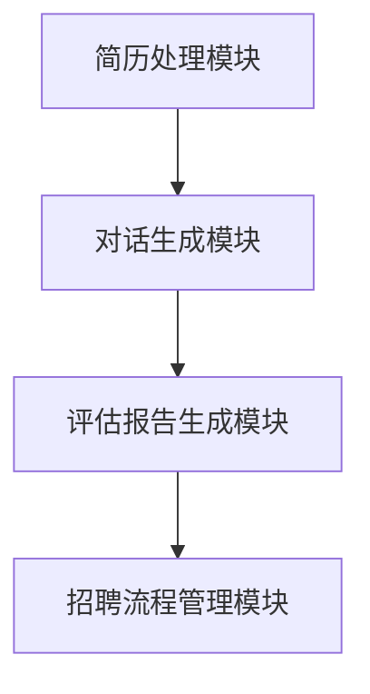
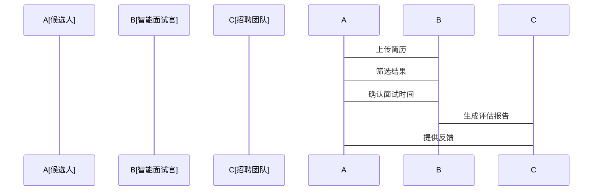

                 


# 智能面试官 AI Agent：LLM 辅助招聘流程

**关键词：** 智能面试官, LLM, 招聘流程, AI 辅助, 人工智能

**摘要：**  
随着人工智能技术的飞速发展，智能面试官 AI Agent 正在改变传统的招聘流程。本文详细探讨了 LLM（大语言模型）在招聘中的应用，从背景介绍到系统架构，再到项目实战，全面解析了智能面试官的实现原理与实际应用。通过分析 LLM 在简历筛选、面试安排、薪资谈判等环节的优势，本文为招聘行业提供了新的思路和解决方案。

---

# 第一部分: 智能面试官 AI Agent 背景与概述

## 第1章: 智能面试官 AI Agent 的概念与背景

### 1.1 智能面试官的定义与核心功能

#### 1.1.1 智能面试官的定义
智能面试官 AI Agent 是一种基于大语言模型（LLM）的人工智能工具，能够模拟人类面试官的角色，通过自然语言处理技术与候选人进行交互，评估其能力和匹配度。

#### 1.1.2 智能面试官的核心功能
- **简历筛选**：快速分析候选人简历，识别关键技能和经验。
- **面试安排**：自动化安排面试时间和地点，发送提醒。
- **候选人评估**：通过对话形式评估候选人的综合素质。
- **反馈生成**：提供候选人评估报告，帮助招聘团队决策。

#### 1.1.3 智能面试官与传统招聘工具的对比
| 特性               | 智能面试官 AI Agent | 传统招聘工具 |
|--------------------|----------------------|---------------|
| 招聘效率           | 高                   | 较低           |
| 费用               | 低                   | 较高           |
| 智能化程度         | 高                   | 较低           |
| 互动性             | 强                   | 较弱           |

### 1.2 智能面试官的应用场景

#### 1.2.1 招聘流程中的问题与挑战
- **时间成本**：传统招聘流程耗时长，效率低。
- **主观性**：面试官的经验和情绪可能影响评估结果。
- **一致性**：不同面试官的评估标准不一。

#### 1.2.2 智能面试官在简历筛选中的应用
- **关键词提取**：快速识别简历中的关键技能。
- **内容理解**：通过自然语言处理理解简历内容。
- **初步筛选**：基于模型生成的评估结果，筛选合适的候选人。

#### 1.2.3 智能面试官在面试安排与提醒中的作用
- **自动化安排**：根据候选人和面试官的时间表，自动安排最佳时间。
- **提醒功能**：通过邮件或短信发送面试提醒，确保候选人和面试官准时参与。

### 1.3 LLM 在招聘中的潜力与优势

#### 1.3.1 LLM 的核心能力与特点
- **强大的语言理解能力**：能够理解复杂的语义和上下文。
- **生成能力**：可以生成自然流畅的文本，模拟真实对话。
- **学习能力**：通过不断训练，模型性能不断提升。

#### 1.3.2 LLM 在招聘流程中的具体应用
- **简历分析**：自动提取简历中的关键信息，评估候选人的匹配度。
- **面试模拟**：模拟真实面试场景，评估候选人的应变能力和专业素养。
- **薪资谈判**：帮助候选人和公司进行薪资协商，提供合理的建议。

#### 1.3.3 LLM 的优势与局限性
| 优势             | 局限性           |
|------------------|------------------|
| 高效性           | 可能存在误判     |
| 一致性           | 需要大量数据训练 |
| 成本低           | 需要定期更新     |

### 1.4 智能面试官的现状与未来趋势

#### 1.4.1 当前智能面试官的应用现状
- **广泛应用于科技公司**：许多科技公司已经开始使用智能面试官进行初步筛选。
- **逐步普及到传统行业**：传统行业也在尝试引入智能面试官，提升招聘效率。

#### 1.4.2 智能面试官的未来发展趋势
- **更加智能化**：随着技术进步，智能面试官将更加智能化，能够进行更复杂的对话和评估。
- **个性化推荐**：根据候选人特点，提供个性化的岗位推荐。
- **数据隐私保护**：加强数据隐私保护，确保候选人信息的安全。

---

# 第二部分: LLM 辅助招聘的核心概念与原理

## 第2章: LLM 的核心原理与技术实现

### 2.1 LLM 的基本原理

#### 2.1.1 大语言模型的定义与特点
大语言模型（LLM）是指经过大规模数据训练的深度学习模型，具有强大的语言理解和生成能力。

#### 2.1.2 LLM 的训练与优化过程
- **预训练**：在大规模通用数据上进行无监督学习。
- **微调**：在特定任务数据上进行有监督微调。

#### 2.1.3 LLM 的推理机制与生成能力
- **推理机制**：通过上下文理解对话内容，生成合适的回复。
- **生成能力**：基于概率分布生成自然语言文本。

### 2.2 LLM 在招聘中的应用原理

#### 2.2.1 招聘流程中的信息处理
- **简历解析**：将简历内容转换为结构化数据。
- **对话生成**：根据候选人回答生成后续问题。

#### 2.2.2 LLM 的文本理解和生成能力
- **文本理解**：理解简历和对话内容。
- **文本生成**：生成评估报告和对话回复。

#### 2.2.3 LLM 的上下文理解和对话能力
- **上下文理解**：理解对话的历史内容。
- **对话能力**：根据上下文生成合理的回复。

### 2.3 LLM 的模型架构与优化

#### 2.3.1 模型架构的选择与优化
- **选择模型架构**：根据任务需求选择合适的模型架构。
- **优化模型性能**：通过调整超参数和优化算法提升模型性能。

#### 2.3.2 LLM 的训练数据与微调
- **训练数据**：使用大规模通用数据和特定领域数据进行训练。
- **微调过程**：在特定任务数据上进行微调，提升模型在招聘场景中的表现。

#### 2.3.3 LLM 的评估与优化指标
- **评估指标**：准确率、召回率、F1值等。
- **优化指标**：模型训练时间、资源消耗等。

---

# 第三部分: 智能面试官的系统架构与实现

## 第3章: 智能面试官的系统架构设计

### 3.1 系统整体架构

#### 3.1.1 系统模块划分
- **简历处理模块**：负责简历的解析和初步筛选。
- **对话生成模块**：生成面试问题和对话内容。
- **评估报告生成模块**：根据对话内容生成评估报告。

#### 3.1.2 模块之间的交互关系
- **简历处理模块**：接收简历数据，生成初步筛选结果。
- **对话生成模块**：根据筛选结果生成对话内容。
- **评估报告生成模块**：根据对话结果生成评估报告。

#### 3.1.3 系统的可扩展性设计
- **模块化设计**：各模块相对独立，便于扩展和维护。
- **接口设计**：提供标准化接口，方便与其他系统集成。

### 3.2 系统功能设计

#### 3.2.1 招聘流程管理模块
- **流程管理**：管理整个招聘流程，包括简历筛选、面试安排等。
- **进度跟踪**：跟踪招聘流程的执行进度，提供可视化界面。

#### 3.2.2 对话管理模块
- **对话记录**：记录候选人与智能面试官的对话内容。
- **对话分析**：分析对话内容，生成评估结果。

#### 3.2.3 评估报告生成模块
- **报告生成**：根据对话内容和简历信息生成评估报告。
- **报告输出**：输出评估报告，供招聘团队参考。

### 3.3 系统架构图



### 3.4 系统接口设计

#### 3.4.1 接口定义
- **简历上传接口**：接收候选人的简历数据。
- **面试安排接口**：根据时间表安排面试。
- **评估报告接口**：获取评估报告数据。

#### 3.4.2 接口交互流程
- **简历上传**：候选人上传简历，系统进行初步筛选。
- **面试安排**：系统根据筛选结果安排面试时间。
- **评估报告**：系统生成评估报告，供招聘团队参考。

### 3.5 系统交互流程图



---

## 第4章: 系统实现与项目实战

### 4.1 项目环境安装

#### 4.1.1 安装Python
```bash
python --version
pip install --upgrade pip
```

#### 4.1.2 安装依赖库
```bash
pip install numpy
pip install pandas
pip install transformers
```

### 4.2 系统核心实现源代码

#### 4.2.1 简历处理模块
```python
import pandas as pd

def process_resume(resume_path):
    # 读取简历内容
    data = pd.read_csv(resume_path)
    # 提取关键信息
    skills = data['skills'].tolist()
    experience = data['experience'].tolist()
    return skills, experience
```

#### 4.2.2 对话生成模块
```python
from transformers import pipeline

generator = pipeline('text-generation', model='gpt2')
def generate_question(context):
    return generator(context, max_length=50, num_return_sequences=1)
```

#### 4.2.3 评估报告生成模块
```python
import numpy as np

def generate_report(scores):
    average_score = np.mean(scores)
    return f"候选人评估报告：平均得分为 {average_score}"
```

### 4.3 代码应用解读与分析

#### 4.3.1 简历处理模块解读
- **功能**：读取简历数据，提取关键信息。
- **优势**：快速处理大量简历，提高效率。

#### 4.3.2 对话生成模块解读
- **功能**：生成面试问题，模拟真实对话。
- **优势**：提供个性化的面试体验，减少人工成本。

#### 4.3.3 评估报告生成模块解读
- **功能**：根据评估结果生成报告。
- **优势**：提供数据支持，辅助决策。

### 4.4 实际案例分析与详细讲解剖析

#### 4.4.1 案例分析
- **候选人信息**：候选人上传简历，包含技能和工作经验。
- **系统处理**：系统提取关键信息，生成面试问题。
- **评估结果**：根据对话内容生成评估报告。

#### 4.4.2 详细讲解
- **简历处理**：系统快速筛选简历，提取关键信息。
- **对话生成**：根据简历内容生成个性化问题。
- **评估报告**：系统生成报告，供招聘团队参考。

### 4.5 项目小结

#### 4.5.1 核心代码实现总结
- **简历处理模块**：快速提取简历信息。
- **对话生成模块**：生成个性化问题。
- **评估报告生成模块**：提供数据支持。

#### 4.5.2 项目实现中的挑战
- **数据隐私**：确保候选人信息的安全性。
- **模型优化**：提升模型的准确性和响应速度。

#### 4.5.3 项目成果
- **高效性**：提升招聘效率，降低人工成本。
- **准确性**：提高评估结果的准确性，减少误判。

---

## 第5章: 最佳实践与未来展望

### 5.1 最佳实践 tips

#### 5.1.1 数据隐私保护
- 确保候选人信息的安全性，避免数据泄露。

#### 5.1.2 模型优化
- 定期更新模型，提升准确性和响应速度。

#### 5.1.3 用户反馈
- 收集用户反馈，不断优化系统功能。

### 5.2 小结

#### 5.2.1 核心知识点总结
- 智能面试官的概念与功能。
- LLM 在招聘中的应用原理。
- 系统架构设计与实现。

#### 5.2.2 经验总结
- 系统设计需要模块化，便于扩展和维护。
- 模型优化是提升系统性能的关键。

### 5.3 注意事项

#### 5.3.1 数据隐私
- 确保候选人信息的安全性，避免数据泄露。

#### 5.3.2 模型更新
- 定期更新模型，保持技术领先性。

#### 5.3.3 用户体验
- 提供良好的用户体验，提升系统使用满意度。

### 5.4 拓展阅读

#### 5.4.1 推荐书籍
- 《深度学习入门：基于Python和Keras》
- 《自然语言处理入门：基于Python和spaCy》

#### 5.4.2 推荐博客
- [Towards Data Science](https://towardsdatascience.com/)
- [Medium - AI & Machine Learning](https://medium.com/ai-and-machine-learning)

---

## 附录: 工具安装与代码参考

### 附录 A: 工具安装指南

```bash
# Python 安装
python --version
pip install --upgrade pip

# 依赖库安装
pip install numpy
pip install pandas
pip install transformers
```

### 附录 B: 核心代码实现

#### 附录 B.1 简历处理模块
```python
import pandas as pd

def process_resume(resume_path):
    data = pd.read_csv(resume_path)
    skills = data['skills'].tolist()
    experience = data['experience'].tolist()
    return skills, experience
```

#### 附录 B.2 对话生成模块
```python
from transformers import pipeline

generator = pipeline('text-generation', model='gpt2')
def generate_question(context):
    return generator(context, max_length=50, num_return_sequences=1)
```

#### 附录 B.3 评估报告生成模块
```python
import numpy as np

def generate_report(scores):
    average_score = np.mean(scores)
    return f"候选人评估报告：平均得分为 {average_score}"
```

### 附录 C: 参考文献

1. 《深度学习入门：基于Python和Keras》， Aurélien Géron 著。
2. 《自然语言处理入门：基于Python和spaCy》，Nathanael Bechhofer 著。
3. Hugging Face Transformers官方文档。

---

**作者：AI天才研究院/AI Genius Institute & 禅与计算机程序设计艺术/Zen And The Art of Computer Programming**

