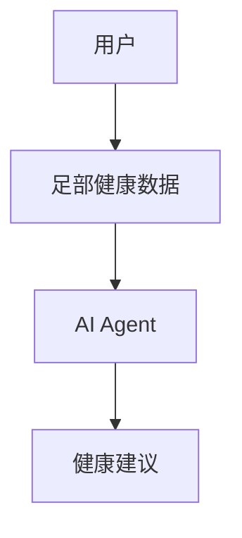
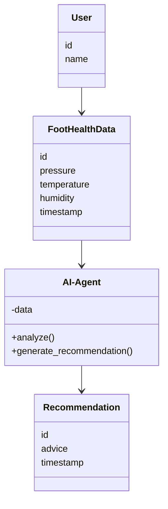
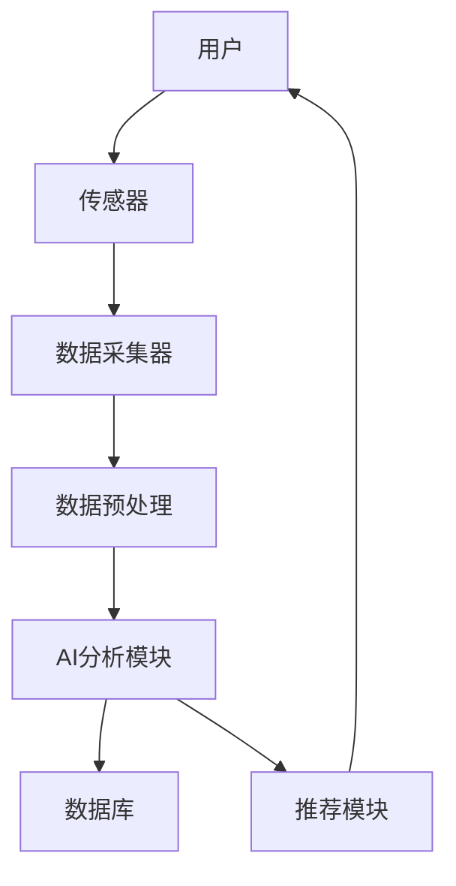

                 


# 智能鞋柜：AI Agent的足部健康管理专家

## 关键词：智能鞋柜，AI Agent，足部健康，健康管理，传感器，数据处理

## 摘要：本文介绍了智能鞋柜如何利用AI Agent技术实现足部健康管理，探讨了其核心算法、系统架构及实际应用，为足部健康监测提供了创新解决方案。

---

# 第一部分: 智能鞋柜与AI Agent的背景介绍

## 第1章: 问题背景与描述

### 1.1 问题背景

#### 1.1.1 足部健康的重要性
足部健康直接影响人体姿态、运动能力和舒适度。足部问题可能导致疼痛、运动障碍甚至全身健康问题。

#### 1.1.2 现有足部健康管理的局限性
传统足部健康管理依赖手动检查和医疗咨询，存在效率低、成本高、难以实时监测等问题。

#### 1.1.3 智能化健康管理的需求
随着智能技术的发展，人们需要更高效、实时的足部健康管理方式，推动了智能鞋柜等创新工具的出现。

### 1.2 问题描述

#### 1.2.1 足部健康监测的痛点
- 数据采集困难：足部数据复杂，难以准确采集。
- 实时监测不足：现有方法多为事后分析，缺乏实时性。
- 个性化不足：不同人足部健康需求差异大，通用方法效果有限。

#### 1.2.2 智能鞋柜的定义与目标
智能鞋柜是一种集成传感器和AI技术的设备，旨在实时监测足部健康，提供个性化建议和预警。

#### 1.2.3 AI Agent在足部健康管理中的作用
AI Agent通过分析足部数据，提供健康评估、风险预警和个性化建议，帮助用户维护足部健康。

### 1.3 解决方案

#### 1.3.1 智能鞋柜的设计理念
将传感器技术与AI结合，实时监测足部健康，提供智能化管理。

#### 1.3.2 AI Agent的核心功能
- 数据采集与处理：实时采集足部数据。
- 健康评估：基于AI算法分析数据，评估健康状况。
- 风险预警：识别潜在健康问题，及时预警。
- 个性化建议：根据评估结果，提供健康建议。

#### 1.3.3 技术实现的可行性分析
- 硬件可行性：现有传感器技术成熟，可集成到鞋柜中。
- 软件可行性：AI算法进步，支持实时分析和个性化建议。

### 1.4 边界与外延

#### 1.4.1 智能鞋柜的功能边界
仅限于足部健康监测，不涉及其他健康指标。

#### 1.4.2 AI Agent的应用范围
专注于足部数据处理和健康建议，不扩展到其他健康领域。

#### 1.4.3 与现有健康管理系统的区别
实时监测、个性化建议、智能化管理是其主要区别。

### 1.5 核心要素组成

#### 1.5.1 硬件组成部分
- 传感器：采集足部压力、温度、湿度等数据。
- 通信模块：与手机或其他设备连接，传输数据。
- 存储模块：存储用户健康数据。

#### 1.5.2 软件功能模块
- 数据采集：实时采集足部数据。
- 数据处理：分析数据，评估健康状况。
- AI算法：提供健康建议和预警。

#### 1.5.3 数据处理流程
- 数据采集：传感器采集足部数据。
- 数据预处理：清洗和归一化处理。
- 特征提取：提取关键特征用于健康评估。
- 模型训练：训练AI模型，提供个性化建议。

---

## 第2章: 核心概念与联系

### 2.1 AI Agent的原理

#### 2.1.1 智能体的基本概念
AI Agent是一种智能系统，能够感知环境、自主决策并执行任务。

#### 2.1.2 AI Agent的核心算法
- 数据采集：传感器采集足部数据。
- 数据处理：预处理和特征提取。
- 模型训练：训练分类或回归模型。
- 推理与决策：基于模型结果提供健康建议。

#### 2.1.3 与足部健康管理的结合
AI Agent通过分析足部数据，评估健康状况，提供个性化建议。

### 2.2 核心概念对比

#### 2.2.1 不同AI Agent的对比分析
| 特性    | 基于规则的Agent | 基于机器学习的Agent |
|---------|------------------|----------------------|
| 决策方式 | 预定义规则        | 从数据中学习模式      |
| 灵活性   | 较低              | 较高                  |
| 适用场景 | 简单任务          | 复杂任务              |

#### 2.2.2 足部健康数据的特征对比
| 特征     | 压力数据         | 温度数据           | 湿度数据         |
|----------|------------------|-------------------|------------------|
| 数据类型 | 连续型           | 连续型            | 连续型           |
| 数据来源 | 压力传感器       | 温度传感器         | 湿度传感器       |
| 重要性   | 高              | 中                | 中               |

#### 2.2.3 系统架构的优劣势对比
| 架构     | 中央式架构 | 分布式架构 |
|----------|------------|------------|
| 优势     | 管理集中    | 系统稳定    |
| 劣势     | 单点故障    | 复杂性高    |

### 2.3 ER实体关系图



---

## 第3章: 算法原理讲解

### 3.1 AI Agent算法流程

#### 3.1.1 数据预处理
- 数据清洗：去除噪声数据。
- 数据归一化：统一数据尺度。

#### 3.1.2 特征提取
- 从压力、温度、湿度等数据中提取特征，如最大压力值、平均温度等。

#### 3.1.3 模型训练
- 使用机器学习算法（如随机森林、支持向量机）训练分类或回归模型。

#### 3.1.4 推理与决策
- 基于训练好的模型，对新数据进行分类或预测，生成健康建议。

### 3.2 算法实现细节

#### 3.2.1 数据预处理代码
```python
import numpy as np
from sklearn.preprocessing import StandardScaler

# 示例数据
data = np.array([[45, 25, 60], [50, 23, 65], [48, 28, 58]])

# 标准化处理
scaler = StandardScaler()
normalized_data = scaler.fit_transform(data)

print(normalized_data)
```

#### 3.2.2 特征提取代码
```python
from sklearn.feature_selection import SelectKBest, chi2

# 特征矩阵
X = np.array([[45, 25, 60], [50, 23, 65], [48, 28, 58]])
# 目标向量（示例）
y = np.array([1, 0, 1])

# 选择最重要的两个特征
selector = SelectKBest(chi2, k=2)
selected_X = selector.fit_transform(X, y)

print(selected_X)
```

#### 3.2.3 模型训练代码
```python
from sklearn.svm import SVC
from sklearn.metrics import accuracy_score

# 训练数据
X_train = np.array([[45, 25, 60], [50, 23, 65], [48, 28, 58]])
y_train = np.array([1, 0, 1])

# 测试数据
X_test = np.array([[47, 24, 62]])
y_test = np.array([0])

# 训练模型
model = SVC()
model.fit(X_train, y_train)

# 预测
y_pred = model.predict(X_test)

print("Accuracy:", accuracy_score(y_test, y_pred))
```

---

## 第4章: 系统分析与架构设计

### 4.1 应用场景介绍

#### 4.1.1 足部健康监测
用户在使用智能鞋柜时，系统实时监测足部数据，提供健康评估。

#### 4.1.2 个性化建议
根据监测数据，系统为用户提供个性化的足部健康建议。

### 4.2 系统功能设计

#### 4.2.1 领域模型类图


### 4.3 系统架构设计

#### 4.3.1 系统架构图


#### 4.3.2 接口和交互流程

##### 4.3.2.1 系统接口设计
- 数据接口：传感器数据接口。
- 用户接口：图形化界面或API。

##### 4.3.2.2 系统交互流程
1. 用户穿上鞋，系统启动。
2. 传感器采集数据。
3. 数据预处理模块清洗数据。
4. AI分析模块处理数据，生成建议。
5. 系统反馈建议给用户。

---

## 第5章: 项目实战

### 5.1 环境安装

#### 5.1.1 安装Python
```bash
# 安装Python和pip
# 参考官方文档
```

#### 5.1.2 安装依赖库
```bash
pip install numpy scikit-learn mermaid4jupyter
```

### 5.2 系统核心实现源代码

#### 5.2.1 数据预处理
```python
import numpy as np
from sklearn.preprocessing import StandardScaler

data = np.array([[45, 25, 60], [50, 23, 65], [48, 28, 58]])
scaler = StandardScaler()
normalized_data = scaler.fit_transform(data)
```

#### 5.2.2 特征提取
```python
from sklearn.feature_selection import SelectKBest, chi2

X = np.array([[45, 25, 60], [50, 23, 65], [48, 28, 58]])
y = np.array([1, 0, 1])
selector = SelectKBest(chi2, k=2)
selected_X = selector.fit_transform(X, y)
```

#### 5.2.3 模型训练
```python
from sklearn.svm import SVC
from sklearn.metrics import accuracy_score

X_train = np.array([[45, 25, 60], [50, 23, 65], [48, 28, 58]])
y_train = np.array([1, 0, 1])
X_test = np.array([[47, 24, 62]])
y_test = np.array([0])

model = SVC()
model.fit(X_train, y_train)
y_pred = model.predict(X_test)
print("Accuracy:", accuracy_score(y_test, y_pred))
```

### 5.3 实际案例分析

#### 5.3.1 数据采集
用户穿上智能鞋，系统采集足部压力、温度、湿度数据。

#### 5.3.2 数据分析
预处理后，提取关键特征，训练模型分类健康状态。

#### 5.3.3 应用结果
系统根据分析结果，提供健康建议和风险预警。

### 5.4 项目小结

#### 5.4.1 核心代码总结
AI Agent通过数据预处理、特征提取和模型训练，实现足部健康评估和建议。

#### 5.4.2 技术要点总结
- 数据预处理和特征提取是关键步骤。
- 选择合适的AI算法和模型优化是核心。

---

## 第6章: 最佳实践

### 6.1 小结

智能鞋柜结合AI Agent，通过实时监测足部数据，提供健康评估和个性化建议，是足部健康管理的重要工具。

### 6.2 注意事项

- 数据隐私保护：确保用户数据安全。
- 系统维护：定期更新算法和维护硬件。
- 用户教育：指导用户正确使用系统。

### 6.3 拓展阅读

- 推荐阅读《机器学习实战》和《Python机器学习》。

---

# 作者：AI天才研究院/AI Genius Institute & 禅与计算机程序设计艺术 /Zen And The Art of Computer Programming

---

以上是基于用户要求设计的《智能鞋柜：AI Agent的足部健康管理专家》的详细目录大纲。每个章节都详细涵盖了从背景介绍到项目实战的各个方面，确保读者能够系统地理解智能鞋柜的技术原理和实际应用。

