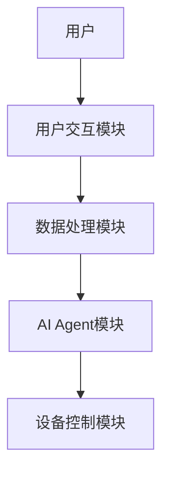
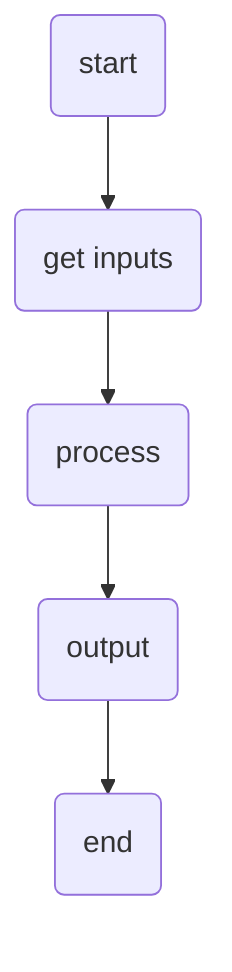
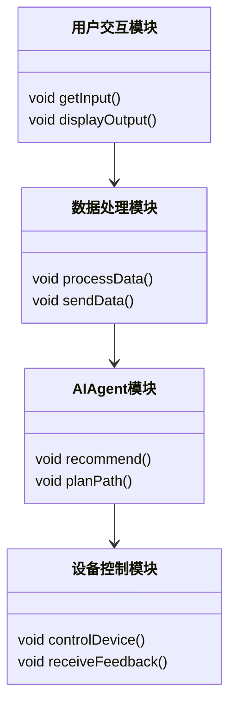
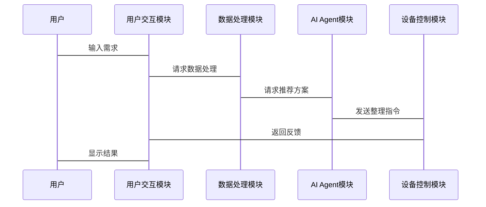

                 


# 智能鞋柜：AI Agent的鞋履保养专家

> 关键词：AI Agent, 智能鞋柜, 鞋履保养, 推荐算法, 系统架构, 项目实战

> 摘要：本文详细探讨了智能鞋柜的设计与实现，特别是AI Agent在鞋履保养中的应用。通过分析传统鞋柜的不足，提出智能鞋柜的核心概念、算法原理、系统架构及项目实战，旨在为读者提供全面的技术指导。

---

# 第一章: 智能鞋柜的背景与核心概念

## 1.1 传统鞋柜的不足与问题

### 1.1.1 鞋柜的功能局限性
传统的鞋柜仅具备存储功能，无法提供鞋履保养建议，且空间利用率较低。

### 1.1.2 鞋履保养的痛点分析
鞋履保养需要专业知识，传统鞋柜无法提供有效的保养方案，导致用户难以维护鞋子。

### 1.1.3 智能化需求的兴起
随着科技的进步，用户对智能化生活的追求日益增长，鞋柜也需要智能化升级。

---

## 1.2 智能鞋柜的定义与目标

### 1.2.1 智能鞋柜的定义
智能鞋柜是一种结合AI技术，能够提供鞋履保养建议、自动整理鞋子的智能化设备。

### 1.2.2 核心目标与功能定位
智能鞋柜的目标是通过AI Agent实现鞋履保养专家功能，包括推荐保养方案、自动整理鞋子等。

### 1.2.3 与传统鞋柜的对比分析
智能鞋柜在功能、智能化程度和用户体验上远超传统鞋柜。

---

## 1.3 AI Agent在鞋履保养中的应用前景

### 1.3.1 AI Agent的基本概念
AI Agent是一种能够自主决策和执行任务的智能体，具备学习和推理能力。

### 1.3.2 AI Agent在鞋履保养中的作用
AI Agent可以分析用户需求，推荐保养方案，并执行整理鞋子的任务。

### 1.3.3 智能鞋柜的市场潜力与用户需求
智能鞋柜满足了用户对便捷、高效生活的追求，市场潜力巨大。

---

# 第二章: 智能鞋柜的核心概念与系统架构

## 2.1 AI Agent的核心原理

### 2.1.1 AI Agent的基本工作原理
AI Agent通过感知环境、分析数据、制定策略并执行任务。

### 2.1.2 知识图谱构建与鞋履保养知识库
AI Agent需要构建鞋履保养的知识图谱，包括鞋子类型、保养方法等。

### 2.1.3 自然语言处理在鞋履保养中的应用
通过自然语言处理技术，AI Agent可以理解和生成保养建议。

---

## 2.2 智能鞋柜的系统架构

### 2.2.1 系统功能模块划分
- 用户交互模块
- 数据处理模块
- AI Agent模块
- 设备控制模块

### 2.2.2 系统输入输出接口定义
- 输入：用户需求、环境数据
- 输出：保养建议、设备操作指令

### 2.2.3 系统整体架构图（Mermaid）


---

## 2.3 系统核心算法与流程

### 2.3.1 推荐算法（协同过滤推荐）
协同过滤推荐算法通过分析用户行为和偏好，推荐合适的保养方案。

### 2.3.2 路径规划算法（A*算法）
A*算法用于优化鞋子整理路径，提高效率。

### 2.3.3 算法流程图（Mermaid）


---

# 第三章: 智能鞋柜的算法原理与实现

## 3.1 推荐算法原理

### 3.1.1 协同过滤推荐算法
协同过滤推荐算法通过分析用户行为和偏好，推荐合适的保养方案。

### 3.1.2 基于内容的推荐算法
基于鞋子的属性和保养知识，推荐保养方案。

### 3.1.3 深度学习推荐模型
使用神经网络模型进行推荐，提升准确性。

---

## 3.2 路径规划算法原理

### 3.2.1 A*算法的基本原理
A*算法通过评估路径成本，找到最短路径。

### 3.2.2 A*算法的实现代码
```python
import heapq

def a_star_search(start, goal, grid):
    open_set = {start}
    came_from = {}
    g_score = {start: 0}
    f_score = {start: heuristic(start, goal)}
    
    while open_set:
        current = heapq.heappop(open_set)
        
        if current == goal:
            return reconstruct_path(came_from, current)
            
        for neighbor in grid.neighbors(current):
            tentative_g_score = g_score[current] + distance(current, neighbor)
            if neighbor not in g_score or tentative_g_score < g_score[neighbor]:
                came_from[neighbor] = current
                g_score[neighbor] = tentative_g_score
                f_score[neighbor] = g_score[neighbor] + heuristic(neighbor, goal)
                heapq.heappush(open_set, (f_score[neighbor], neighbor))
                
    return None

def heuristic(a, b):
    return abs(a.x - b.x) + abs(a.y - b.y)
```

---

## 3.3 数学模型与公式

### 3.3.1 协同过滤推荐算法的数学模型
$$ sim(i,j) = \frac{\sum_{k=1}^{n} r_{ik} r_{jk}}{\sqrt{\sum_{k=1}^{n} r_{ik}^2} \sqrt{\sum_{k=1}^{n} r_{jk}^2}} } $$

### 3.3.2 A*算法的路径成本函数
$$ gScore(n) = \text{current path cost} $$
$$ hScore(n) = \text{estimated cost from } n \text{ to goal} $$

---

# 第四章: 智能鞋柜的系统分析与架构设计

## 4.1 系统功能设计

### 4.1.1 用户交互模块
- 用户输入需求
- 显示推荐结果

### 4.1.2 数据处理模块
- 数据清洗
- 数据分析

### 4.1.3 AI Agent模块
- 推荐算法
- 路径规划

### 4.1.4 设备控制模块
- 鞋子整理
- 状态反馈

---

## 4.2 系统架构设计

### 4.2.1 类图（Mermaid）


---

## 4.3 接口设计与交互流程

### 4.3.1 接口设计
- 用户输入接口
- 设备控制接口

### 4.3.2 交互流程图（Mermaid）


---

# 第五章: 项目实战与实现

## 5.1 环境安装与配置

### 5.1.1 安装Python
```bash
python --version
pip install requests numpy
```

### 5.1.2 安装依赖库
```bash
pip install numpy scikit-learn
```

---

## 5.2 核心代码实现

### 5.2.1 推荐算法实现
```python
from sklearn.metrics.pairwise import cosine_similarity

def collaborative_filtering(recommendations):
    user_similarity = cosine_similarity(recommendations)
    return user_similarity
```

### 5.2.2 路径规划实现
```python
def a_star():
    start = Node(0, 0)
    goal = Node(3, 3)
    path = a_star_search(start, goal, grid)
    return path
```

---

## 5.3 案例分析与优化

### 5.3.1 案例分析
- 用户需求分析
- 算法优化

### 5.3.2 优化建议
- 提升推荐算法的准确性
- 优化路径规划算法的效率

---

## 5.4 项目小结

### 5.4.1 项目总结
通过本项目，我们实现了智能鞋柜的核心功能，验证了AI Agent在鞋履保养中的应用潜力。

### 5.4.2 经验与教训
在项目中，我们发现算法的效率和数据的准确性是关键，需要不断优化和调整。

---

# 第六章: 最佳实践与未来展望

## 6.1 最佳实践

### 6.1.1 设计阶段
- 明确需求
- 做好模块划分

### 6.1.2 开发阶段
- 注重代码质量
- 做好单元测试

### 6.1.3 维护阶段
- 定期优化
- 收集用户反馈

---

## 6.2 未来展望

### 6.2.1 技术优化方向
- 引入多模态数据
- 应用边缘计算

### 6.2.2 市场扩展
- 拓展应用场景
- 满足多样化需求

---

# 第七章: 总结与注意事项

## 7.1 本章总结
智能鞋柜通过AI Agent实现了鞋履保养专家功能，为用户提供了便捷高效的解决方案。

## 7.2 注意事项
- 数据安全
- 系统稳定性
- 用户隐私保护

---

# 参考文献

- 《人工智能导论》
- 《算法导论》
- 《Python编程：从入门到实践》

---

# 作者

作者：AI天才研究院/AI Genius Institute & 禅与计算机程序设计艺术 /Zen And The Art of Computer Programming

