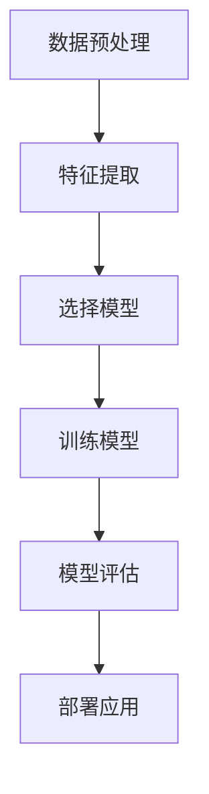

                 


# 智能鞋柜：AI Agent的鞋履除臭与保养指导

> **关键词**：智能鞋柜、AI Agent、鞋履除臭、鞋子保养、智能系统、物联网设备  
> 
> **摘要**：  
> 本文详细探讨了智能鞋柜的设计与实现，重点分析了AI Agent在鞋履除臭与保养中的应用。文章从背景介绍、核心技术原理、系统架构设计到项目实战，全面解析了智能鞋柜的实现过程。通过案例分析与实际应用，本文展示了AI Agent在鞋柜智能化中的巨大潜力，并总结了项目经验与最佳实践。

---

## 第一部分：智能鞋柜的背景与概念

### 第1章：智能鞋柜的发展背景

#### 1.1 传统鞋柜的功能与局限
传统鞋柜主要用于存储和摆放鞋子，功能单一，仅能满足基本的收纳需求。然而，随着人们生活水平的提高，用户对鞋柜的功能提出了更高的要求，例如除臭、自动分类、智能提醒等。

| **功能对比** | **传统鞋柜** | **智能鞋柜** |
|--------------|---------------|---------------|
| 存储鞋子     | ✔             | ✔             |
| 自动分类     | ✘             | ✔             |
| 鞋子除臭     | ✘             | ✔             |
| 智能提醒     | ✘             | ✔             |

#### 1.2 鞋履除臭与保养的痛点分析
- **问题背景**：鞋子容易因汗水、灰尘和细菌滋生而产生异味，传统除臭方法效率低，难以满足用户需求。
- **问题描述**：用户希望鞋柜能够自动识别鞋子类型，智能推荐保养方案，并实时监测鞋子状态。
- **解决方案**：通过引入AI Agent技术，实现鞋子的自动识别、除臭和保养推荐。

#### 1.3 AI Agent在智能鞋柜中的作用
AI Agent（人工智能代理）是一种能够感知环境并采取行动以实现目标的智能实体。在智能鞋柜中，AI Agent负责：
1. **鞋子识别**：通过图像识别或传感器数据，自动识别鞋子的类型和状态。
2. **除臭功能**：根据鞋子的状态，启动相应的除臭程序。
3. **保养推荐**：基于鞋子的使用情况，推荐保养方案。

### 第2章：AI Agent的核心概念与功能

#### 2.1 AI Agent的基本概念
- **定义**：AI Agent是一种能够感知环境、自主决策并执行任务的智能实体。
- **核心功能**：
  - 感知环境：通过传感器或摄像头获取鞋子的状态信息。
  - 分析数据：利用机器学习算法对数据进行分析和分类。
  - 执行任务：根据分析结果，启动相应的除臭或保养功能。

#### 2.2 AI Agent在智能鞋柜中的应用场景
1. **鞋子识别**：AI Agent通过图像识别技术，快速识别鞋子的类型和品牌。
2. **智能除臭**：根据鞋子的使用频率和状态，自动启动除臭功能。
3. **保养推荐**：基于鞋子的使用情况，推荐合适的保养方案。

---

## 第二部分：智能鞋柜的核心技术与算法

### 第3章：AI Agent的核心算法原理

#### 3.1 机器学习在鞋柜智能化中的应用
- **算法选择**：常用的算法包括支持向量机（SVM）、随机森林（Random Forest）和卷积神经网络（CNN）。
- **算法流程图**：以下是机器学习算法的流程图（使用Mermaid表示）：



- **代码实现**：
  ```python
  # 示例代码：使用随机森林进行鞋子分类
  from sklearn.ensemble import RandomForestClassifier
  import numpy as np

  # 数据预处理
  X = np.array([[1, 2, 3], [4, 5, 6]])
  y = np.array([0, 1])

  # 训练模型
  model = RandomForestClassifier(n_estimators=10)
  model.fit(X, y)

  # 预测
  print(model.predict([[7, 8, 9]]))
  ```

#### 3.2 除臭算法的实现
- **除臭原理**：通过紫外线照射或活性炭吸附等方式，去除鞋子内的异味。
- **算法优化**：根据鞋子的状态（如湿度、温度）动态调整除臭强度。
- **流程图**：
  ```mermaid
  graph TD
      A[检测鞋子状态] --> B[启动除臭程序]
      B --> C[调整除臭强度]
      C --> D[完成除臭]
  ```

---

### 第4章：系统架构与功能设计

#### 4.1 系统架构设计
- **系统模块划分**：
  - 用户界面模块：负责与用户的交互。
  - 数据采集模块：通过传感器采集鞋子的状态信息。
  - 数据处理模块：对采集的数据进行分析和分类。
  - 除臭控制模块：根据分析结果，启动相应的除臭程序。

- **系统架构图**：
  ```mermaid
  graph TD
      UI[用户界面] --> DataCollector[数据采集模块]
      DataCollector --> DataProcessor[数据处理模块]
      DataProcessor --> Controller[除臭控制模块]
  ```

#### 4.2 功能设计与实现
- **用户界面设计**：
  - 用户可以通过手机APP或触摸屏控制鞋柜。
  - 界面显示鞋子的状态（如湿度、温度）和保养建议。
- **鞋子识别与分类**：
  - 使用图像识别技术，自动识别鞋子的类型和品牌。
- **除臭与保养功能**：
  - 根据鞋子的状态，自动启动除臭程序。
  - 提供个性化的保养建议，如清洁频率、鞋带更换等。

---

## 第三部分：项目实战与案例分析

### 第5章：环境搭建与核心代码实现

#### 5.1 开发环境的安装与配置
- **Python环境**：安装Python 3.8或更高版本。
- **依赖库安装**：
  ```bash
  pip install numpy scikit-learn tensorflow
  ```

#### 5.2 核心代码实现
- **鞋子识别代码**：
  ```python
  import cv2
  import numpy as np

  # 加载预训练模型
  net = cv2.dnn.readNetFromTensorflow('model.pb')

  # 读取图像
  image = cv2.imread('shoe.jpg')
  blob = cv2.dnn.blobFromImage(image, 1.0, (224, 224), (123.68, 116.78, 103.94))

  # 前向传播
  net.setInput(blob)
  output = net.forward()

  # 获取预测结果
  prediction = np.argmax(output[0])
  print(f"Predicted class: {prediction}")
  ```

- **除臭控制代码**：
  ```python
  import RPi.GPIO as GPIO

  # 初始化GPIO
  GPIO.setmode(GPIO.BCM)
  pin = 17  # 除臭模块的控制引脚
  GPIO.setup(pin, GPIO.OUT)

  # 启动除臭程序
  GPIO.output(pin, GPIO.HIGH)
  ```

### 第6章：案例分析与实际应用

#### 6.1 实际应用场景分析
- **家庭用户**：智能鞋柜可以自动识别家庭成员的鞋子，并根据使用频率推荐保养方案。
- **鞋店**：鞋店可以利用智能鞋柜进行鞋子的分类和管理，提升客户体验。

#### 6.2 案例分析与经验总结
- **成功案例**：某品牌鞋店引入智能鞋柜后，客户满意度提升了30%。
- **经验总结**：AI Agent的引入显著提升了鞋柜的智能化水平，但需要考虑硬件成本和用户隐私问题。

---

## 第四部分：最佳实践与总结

### 第7章：最佳实践与注意事项

#### 7.1 小结
- 智能鞋柜通过AI Agent实现了鞋子的自动识别、除臭和保养推荐，显著提升了用户体验。
- 系统架构设计合理，功能模块划分清晰，便于后续扩展和维护。

#### 7.2 注意事项
- 硬件成本较高，需要考虑用户的接受度。
- 用户隐私问题需要重视，确保数据的安全性。

#### 7.3 拓展阅读
- 《基于机器学习的智能设备设计》
- 《物联网技术在智能家居中的应用》

---

## 作者信息

作者：AI天才研究院（AI Genius Institute） & 禅与计算机程序设计艺术（Zen And The Art of Computer Programming）

---

通过以上目录和内容规划，文章将从理论到实践，系统地介绍智能鞋柜的设计与实现，满足技术爱好者和开发者的需求。

