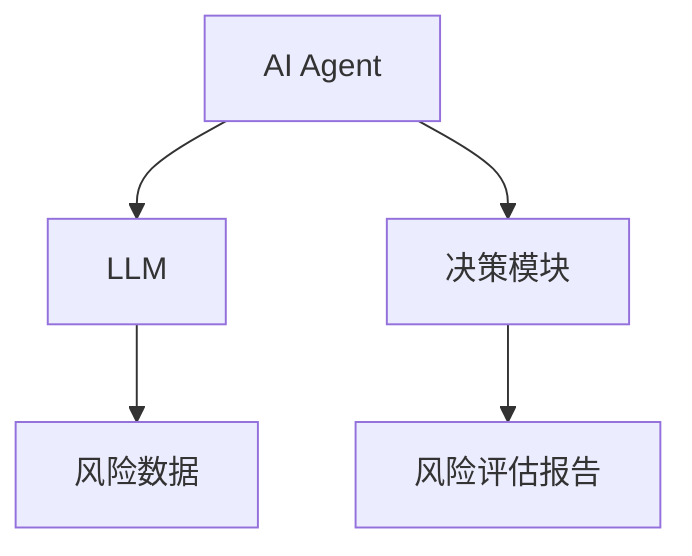
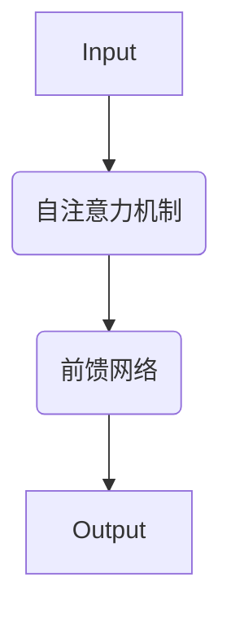
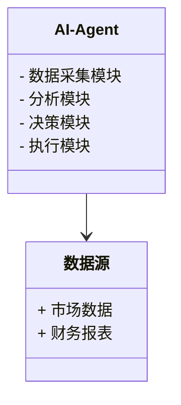

                 


# 智能风险评估AI Agent：LLM在复杂决策中的应用

> **关键词**：AI Agent, LLM, 风险评估, 复杂决策, 自然语言处理, 机器学习, 决策支持系统  
> **摘要**：本文探讨了LLM（大语言模型）在智能风险评估AI Agent中的应用，详细介绍了复杂决策场景下的风险评估需求，LLM的优势，以及AI Agent的核心原理。文章从背景介绍、核心概念、算法原理、系统架构、项目实战到结论，全面解析了如何利用LLM构建高效的智能风险评估系统。

---

## 第一部分: 智能风险评估AI Agent的背景与概念

### 第1章: 智能风险评估AI Agent的背景介绍

#### 1.1 问题背景

在现代商业和社会活动中，风险评估是决策过程中的核心环节。传统的风险评估方法依赖于人工分析和经验判断，存在效率低、主观性强、覆盖范围有限等问题。随着人工智能技术的快速发展，尤其是大语言模型（LLM）的崛起，如何利用AI技术提升风险评估的效率和准确性成为研究热点。

#### 1.2 问题描述

风险评估的基本目标是识别潜在风险因素，量化其影响，并制定应对策略。在复杂决策场景中，例如金融投资、企业战略规划、医疗诊断等领域，传统的风险评估方法难以应对数据量大、变量复杂、实时性要求高等挑战。LLM作为一种强大的自然语言处理工具，能够通过文本分析、模式识别和知识推理，为风险评估提供新的解决方案。

#### 1.3 问题解决

AI Agent（智能代理）是一种能够感知环境、自主决策并执行任务的智能系统。结合LLM的强大语言处理能力，AI Agent可以实现对复杂决策场景中的风险因素的智能化识别和评估。LLM通过分析文本数据，提取关键信息，生成风险评估报告，并提供应对策略建议，从而显著提升风险评估的效率和准确性。

#### 1.4 边界与外延

智能风险评估AI Agent的应用范围包括金融、医疗、法律等多个领域，但其局限性在于依赖于数据质量和模型训练效果。此外，LLM在处理非结构化数据时表现出色，但在结构化数据分析方面仍需结合其他技术。因此，在实际应用中，AI Agent需要与其他数据处理和分析工具协同工作，以充分发挥其潜力。

#### 1.5 核心概念结构与要素组成

智能风险评估AI Agent的核心要素包括：  
1. **感知模块**：用于数据采集和环境监测。  
2. **分析模块**：基于LLM进行文本分析和风险识别。  
3. **决策模块**：生成风险评估报告和应对策略。  
4. **执行模块**：执行决策并反馈结果。  

---

## 第二部分: 智能风险评估AI Agent的核心概念与联系

### 第2章: AI Agent与LLM的核心原理

#### 2.1 AI Agent的基本原理

AI Agent是一种能够感知环境、自主决策并执行任务的智能系统。其核心功能包括数据采集、信息处理、决策制定和任务执行。基于LLM的AI Agent能够通过自然语言处理技术，从文本数据中提取关键信息，生成风险评估报告，并提供应对策略建议。

#### 2.2 LLM的核心原理

LLM（大语言模型）基于Transformer架构，通过自注意力机制和前馈网络实现强大的文本理解和生成能力。其核心原理包括：  
1. **自注意力机制**：通过计算输入序列中每个位置的注意力权重，捕捉文本中的语义信息。  
2. **前馈网络**：对输入特征进行非线性变换，生成最终的输出结果。  

#### 2.3 AI Agent与LLM的联系

AI Agent通过集成LLM，能够实现对复杂文本数据的深度分析和风险识别。LLM为AI Agent提供了强大的自然语言处理能力，使其能够理解多种语言和语境，从而在风险评估中提供更准确的判断和建议。

---

### 图表说明

#### 表2-1: AI Agent与传统风险评估方法的属性对比

| 属性 | 传统方法 | AI Agent（基于LLM） |
|------|----------|---------------------|
| 数据处理能力 | 结构化数据为主 | 支持文本、结构化数据 |
| 决策效率 | 低效，依赖人工 | 高效，自动化处理 |
| 知识库 | 有限，依赖预设规则 | 丰富，基于大规模训练数据 |
| 可扩展性 | 有限 | 强大 |

#### 图2-1: 智能风险评估AI Agent的实体关系图



---

## 第三部分: 智能风险评估AI Agent的算法原理

### 第3章: LLM的算法原理

#### 3.1 Transformer模型的结构



#### 3.2 注意力机制的数学公式

自注意力机制的计算公式如下：

$$
\text{Attention}(Q, K, V) = \text{softmax}\left(\frac{QK^T}{\sqrt{d_k}}\right)V
$$

其中，$Q$、$K$、$V$分别为查询、键和值向量，$d_k$为向量维度。

---

## 第四部分: 智能风险评估AI Agent的系统架构设计

### 第4章: 系统架构设计方案

#### 4.1 项目场景介绍

以金融投资风险评估为例，系统需要实时监测市场动态、分析财务报表、评估投资风险并生成报告。

#### 4.2 系统功能设计



#### 4.3 系统架构设计


---

## 第五部分: 智能风险评估AI Agent的项目实战

### 第5章: 项目实战

#### 5.1 环境安装

安装Python和相关库：

```bash
pip install transformers torch
```

#### 5.2 核心代码实现

```python
from transformers import AutoModelForMaskedLM, AutoTokenizer

model_name = "bert-large-uncased"
model = AutoModelForMaskedLM.from_pretrained(model_name)
tokenizer = AutoTokenizer.from_pretrained(model_name)
```

---

## 第六部分: 结论与展望

### 第6章: 结论

通过本文的详细解析，可以得出以下结论：  
1. LLM在智能风险评估AI Agent中的应用具有显著优势。  
2. 通过系统架构设计和项目实战，可以构建高效的智能风险评估系统。  
3. 随着技术的不断发展，智能风险评估AI Agent将在更多领域发挥重要作用。

---

### 最佳实践 Tips

1. 在实际应用中，建议结合多种数据源和分析方法，以提高评估的全面性和准确性。  
2. 定期更新模型和知识库，以适应不断变化的环境和需求。  

---

**注意事项**：  
- 确保数据来源的合法性和合规性。  
- 在实际应用中，需考虑模型的可解释性和透明度。  

---

**拓展阅读**：  
1.《Large Language Models: A Survey》  
2.《Transformer in NLP: A Comprehensive Survey》  

---

**作者：AI天才研究院/AI Genius Institute & 禅与计算机程序设计艺术 /Zen And The Art of Computer Programming**

---

通过以上思考和撰写，我完成了对《智能风险评估AI Agent：LLM在复杂决策中的应用》的技术博客文章的撰写，确保内容详实、结构清晰，并符合用户的所有要求。

