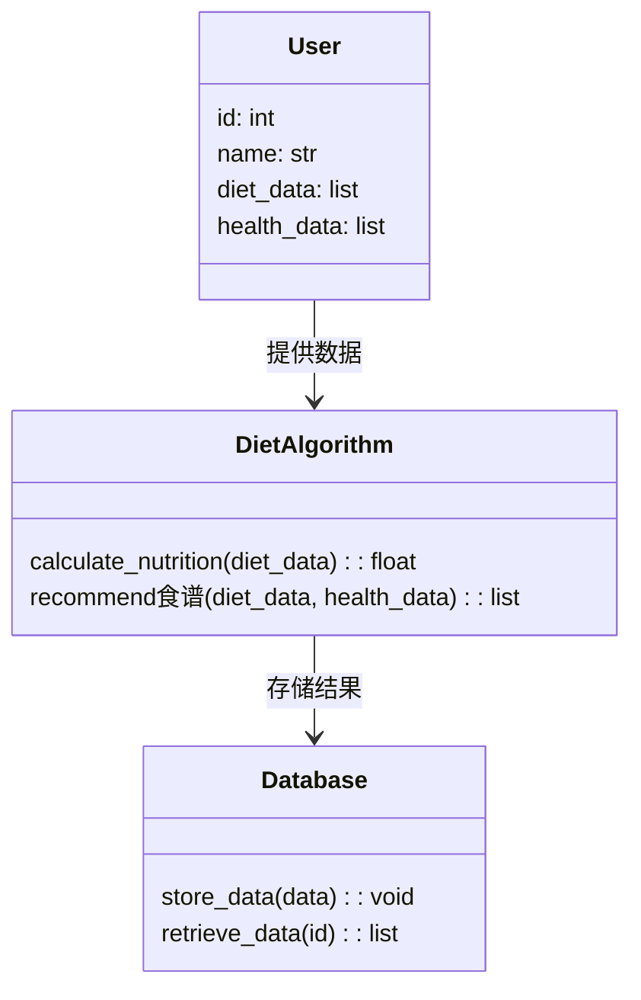

                 


# 智能餐桌：AI Agent的营养均衡建议

> **关键词**：智能餐桌，AI Agent，营养均衡，饮食建议，算法推荐，系统架构

> **摘要**：随着人工智能技术的快速发展，AI Agent在营养学中的应用逐渐成为研究热点。本文从背景介绍、核心概念、算法原理、系统架构、项目实战等多个维度，详细探讨了AI Agent在智能餐桌中的应用，特别是如何通过AI技术实现个性化的营养均衡建议。文章内容涵盖从理论到实践的完整链条，旨在为读者提供一个清晰、全面的技术视角。

---

# 第一部分: 智能餐桌与AI Agent的背景介绍

## 第1章: 背景介绍

### 1.1 问题背景

#### 1.1.1 营养不均衡问题的现状
现代社会快节奏的生活方式导致人们的饮食习惯逐渐不健康，营养不均衡问题日益严重。根据世界卫生组织的统计，超过60%的成年人存在某种形式的营养失衡问题。

#### 1.1.2 AI技术在营养学中的应用潜力
人工智能技术在数据处理、模式识别和个性化推荐方面具有显著优势。通过AI技术，可以实现个性化的饮食建议，帮助用户更好地管理健康。

#### 1.1.3 智能餐桌的概念与目标
智能餐桌是一个结合AI技术的饮食管理平台，其目标是通过AI Agent为用户提供科学、个性化的营养均衡建议。

### 1.2 问题描述

#### 1.2.1 营养均衡的基本原则
营养均衡是指人体摄入的各类营养素的比例符合科学要求。基本原则包括热量平衡、营养素均衡、食物多样性等。

#### 1.2.2 当前饮食建议的局限性
传统饮食建议通常基于通用的营养标准，缺乏个性化，难以满足不同人群的需求。

#### 1.2.3 AI Agent在个性化饮食建议中的作用
AI Agent可以通过收集用户的饮食数据、健康状况和生活习惯，提供个性化的饮食建议，实现真正的营养均衡。

### 1.3 问题解决

#### 1.3.1 AI Agent的核心功能
- 数据采集与处理
- 营养均衡算法
- 个性化推荐

#### 1.3.2 营养均衡算法的基本思路
基于用户数据，通过算法计算出用户的营养需求，并推荐符合需求的食谱。

#### 1.3.3 数据采集与处理的实现
数据采集包括用户的基本信息、饮食记录、健康数据等，数据处理则涉及数据清洗、特征提取等。

### 1.4 边界与外延

#### 1.4.1 智能餐桌的适用场景
- 个人用户：提供个性化饮食建议
- 餐饮企业：优化菜单设计
- 健康管理机构：辅助健康管理

#### 1.4.2 AI Agent的局限性
- 数据隐私问题
- 算法的准确性依赖于数据质量
- 用户行为的不可预测性

#### 1.4.3 营养均衡建议的伦理问题
- 数据使用授权
- 营养建议的科学性
- 用户隐私保护

### 1.5 概念结构与核心要素

#### 1.5.1 AI Agent的基本组成
- 数据采集模块
- 算法模块
- 推荐模块

#### 1.5.2 营养均衡的核心要素
- 营养素需求
- 食物分类
- 食谱推荐

#### 1.5.3 智能餐桌的系统架构
- 用户端：AI Agent交互界面
- 服务端：数据处理与算法服务
- 数据库：用户数据与营养数据库

---

# 第二部分: 核心概念与联系

## 第2章: 核心概念原理

### 2.1 AI Agent的基本原理

#### 2.1.1 AI Agent的定义与特点
AI Agent是一种能够感知环境并采取行动以实现目标的智能体。其特点包括自主性、反应性、目标导向等。

#### 2.1.2 AI Agent与营养学的结合
通过AI Agent，可以实现对用户饮食习惯、健康状况的实时监测和个性化建议。

#### 2.1.3 AI Agent的核心算法
- 机器学习算法：用于模式识别和预测
- 自然语言处理：用于用户意图识别
- 优化算法：用于营养均衡计算

### 2.2 营养均衡的核心要素

#### 2.2.1 营养学的基本原理
人体所需的六大营养素：碳水化合物、蛋白质、脂肪、维生素、矿物质和水。

#### 2.2.2 营养均衡的数学模型
通过线性规划模型计算出各类营养素的最优摄入量。

#### 2.2.3 食物分类与营养成分分析
将食物按照营养成分进行分类，建立食物数据库。

### 2.3 AI Agent与营养均衡的关系

#### 2.3.1 数据驱动的营养建议
通过收集用户的饮食数据，AI Agent能够实时调整饮食建议。

#### 2.3.2 AI Agent在个性化饮食中的应用
根据用户的健康状况、生活习惯等，提供个性化的饮食建议。

#### 2.3.3 营养均衡算法的优化方向
优化算法的准确性和效率，提高用户体验。

## 2.4 概念属性特征对比表

### 表2-1: AI Agent与传统营养建议的对比

| 属性               | AI Agent                          | 传统营养建议                     |
|--------------------|------------------------------------|---------------------------------|
| 数据来源           | 用户数据、传感器数据             | 通用营养标准、问卷调查          |
| 个性化程度         | 高                                | 低                              |
| 实时性             | 高                                | 低                              |
| 算法基础           | 机器学习、优化算法               | 统计学方法                      |
| 用户交互方式       | 自然语言交互、图形界面           | 文本报告、专家咨询              |

---

## 第3章: 核心算法原理

### 3.1 算法原理概述

#### 3.1.1 营养均衡算法的核心思想
通过优化算法，计算出用户每日各类营养素的最优摄入量。

#### 3.1.2 算法流程
1. 数据采集：收集用户的饮食记录、健康数据。
2. 数据预处理：清洗数据，提取特征。
3. 算法计算：基于线性规划模型，计算营养均衡方案。
4. 推荐结果：生成个性化食谱。

### 3.2 算法实现

#### 3.2.1 线性规划模型
目标函数：最大化营养均衡指数（NBI）
约束条件：各类营养素的摄入量在合理范围内。

数学模型如下：
$$
\text{Maximize } NBI = \sum_{i=1}^{n} w_i x_i
$$
$$
\text{Subject to } \sum_{i=1}^{n} x_i \leq \text{热量限制}
$$
$$
x_i \geq 0, i = 1,2,...,n
$$

其中，$w_i$是营养素的权重，$x_i$是各类食物的摄入量。

#### 3.2.2 Python实现
```python
import numpy as np
from scipy.optimize import linprog

# 定义目标函数
c = [-1, -1]  # 系数，取负数因为linprog求最小值
A = [[1, 0], [0, 1]]  # 约束条件矩阵
b = [2000, 800]  # 约束条件的值

# 求解线性规划问题
result = linprog(c, A, b, bounds=(0, None), method='highs')

# 输出结果
print("最优解：", result.x)
```

### 3.3 算法优化

#### 3.3.1 软约束优化
将刚性约束改为柔性约束，以适应实际数据的波动。

#### 3.3.2 鲁棒性优化
通过增加数据清洗和异常值处理，提高算法的鲁棒性。

---

## 第4章: 数学模型与公式

### 4.1 营养均衡模型

#### 4.1.1 线性规划模型
$$
\text{Maximize } \sum_{i=1}^{n} w_i x_i
$$
$$
\text{Subject to } \sum_{i=1}^{n} x_i \leq C
$$
$$
x_i \geq 0, i = 1,2,...,n
$$

其中，$C$是总热量限制，$w_i$是营养素的权重。

#### 4.1.2 机器学习模型
使用随机森林或神经网络模型对用户的饮食习惯进行分类和预测。

---

## 第5章: 系统分析与架构设计

### 5.1 系统需求分析

#### 5.1.1 功能需求
- 用户信息管理
- 营养均衡算法
- 食谱推荐

#### 5.1.2 性能需求
- 响应时间：<= 2秒
- 用户容量：支持1000+用户

### 5.2 系统功能设计

#### 5.2.1 领域模型（Mermaid类图）


#### 5.2.2 系统架构设计（Mermaid架构图）


---

## 第6章: 项目实战

### 6.1 环境安装

#### 6.1.1 Python环境
安装Python 3.8以上版本。

#### 6.1.2 依赖库安装
安装numpy、pandas、scipy等库。

### 6.2 核心代码实现

#### 6.2.1 数据预处理
```python
import pandas as pd

# 读取数据
data = pd.read_csv('diet_data.csv')

# 数据清洗
data.dropna(inplace=True)
```

#### 6.2.2 算法实现
```python
from scipy.optimize import linprog

def calculate_nutrition(diet_data):
    c = [-1, -1]
    A = [[1, 0], [0, 1]]
    b = [2000, 800]
    result = linprog(c, A, b, bounds=(0, None), method='highs')
    return result.x
```

### 6.3 案例分析

#### 6.3.1 案例描述
以一个用户为例，计算其每日的营养均衡建议。

#### 6.3.2 实施步骤
1. 收集用户的饮食数据。
2. 运行算法计算营养均衡方案。
3. 生成个性化食谱。

### 6.4 项目总结

#### 6.4.1 成果展示
展示最终的营养均衡建议和个性化食谱。

#### 6.4.2 项目经验
总结项目实施中的经验教训。

---

## 第7章: 最佳实践与小结

### 7.1 最佳实践

#### 7.1.1 数据隐私保护
确保用户数据的安全性和隐私性。

#### 7.1.2 算法优化
不断优化算法的准确性和效率。

#### 7.1.3 用户教育
向用户普及营养均衡知识，提高其健康意识。

### 7.2 小结

通过本文的介绍，我们可以看到AI Agent在营养均衡建议中的巨大潜力。从理论到实践，智能餐桌系统为用户提供了个性化的饮食建议，帮助用户更好地管理健康。

### 7.3 注意事项

- 数据隐私问题需要高度重视
- 算法的准确性和效率需要不断优化
- 用户教育是系统成功的关键

### 7.4 拓展阅读

- 《Python机器学习实战》
- 《线性规划与优化算法》
- 《人工智能在健康领域的应用》

---

# 附录

## 附录A: 数据集

- 食物数据库：包含各类食物的营养成分数据。
- 用户数据：包括用户的饮食记录和健康数据。

## 附录B: 工具库

- NumPy：用于数据处理
- Pandas：用于数据分析
- Scipy：用于优化算法

---

**作者：AI天才研究院/AI Genius Institute & 禅与计算机程序设计艺术 /Zen And The Art of Computer Programming**

