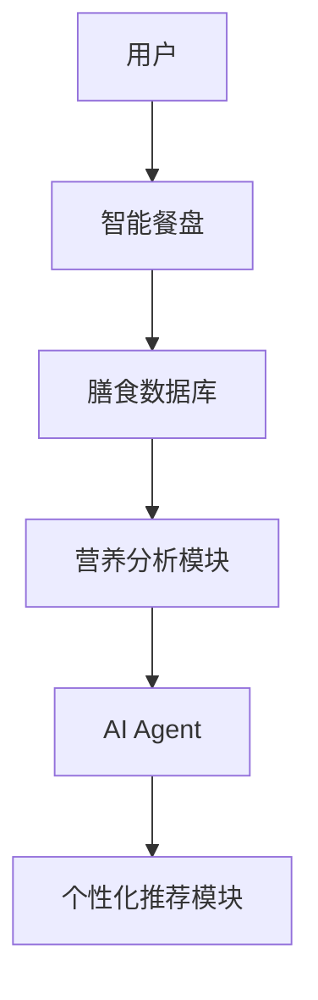
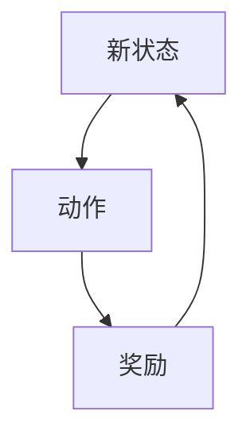
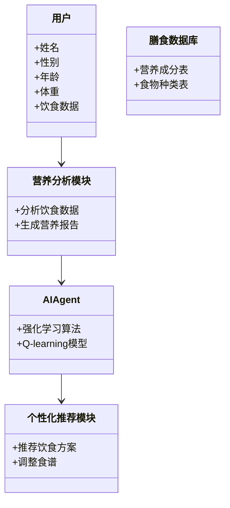
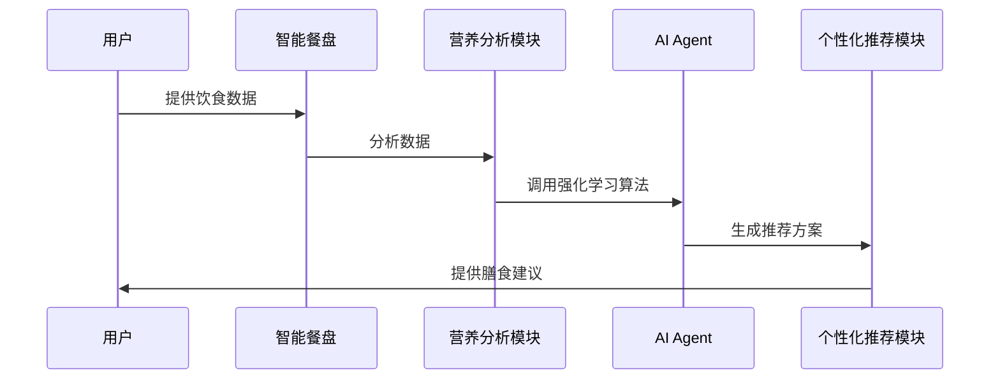

                 


# 智能餐盘：AI Agent的膳食均衡指导系统

---

## 关键词：AI Agent, 膳食均衡, 智能餐盘, 强化学习, 营养推荐系统

---

## 摘要：  
《智能餐盘：AI Agent的膳食均衡指导系统》通过结合人工智能技术与膳食均衡指导，提出了一种基于AI Agent的智能餐盘系统，旨在解决现代人饮食不均衡的问题。本文从背景介绍、核心概念、算法原理、系统架构到项目实战，详细阐述了智能餐盘的设计思路和实现方案，并通过实际案例分析展示了系统的应用场景和优势。文章最后总结了系统的最佳实践经验和未来发展方向。

---

## 第一部分: 智能餐盘与AI Agent的背景介绍

## 第1章: 问题背景与需求分析

### 1.1 问题背景

#### 1.1.1 当前膳食均衡问题的现状  
现代人的饮食习惯受到快节奏生活和不健康饮食方式的影响，许多人存在膳食不均衡的问题。根据世界卫生组织的数据，全球范围内因饮食不均衡导致的健康问题日益严重。  

#### 1.1.2 饮食习惯与健康问题的关联  
膳食不均衡与肥胖、糖尿病、心血管疾病等慢性病密切相关。这些问题不仅影响个人健康，还给社会医疗体系带来了巨大压力。  

#### 1.1.3 智能化饮食指导的必要性  
传统的饮食指导方式依赖于人工计算和主观判断，效率低且难以实现个性化。通过智能化技术，可以更精准地分析用户的饮食习惯，并提供个性化的指导方案。  

---

### 1.2 问题描述

#### 1.2.1 膳食均衡的基本概念  
膳食均衡是指在一定时间内摄入的营养成分比例合理，满足人体所需的基本营养需求。  

#### 1.2.2 当前饮食指导系统的局限性  
- 传统饮食指导依赖人工计算，效率低。  
- 个性化推荐不足，难以满足不同用户的需求。  
- 数据采集和分析能力有限，难以实时反馈。  

#### 1.2.3 AI Agent在膳食指导中的应用潜力  
AI Agent可以通过实时数据分析、强化学习和个性化推荐，为用户提供智能化的膳食均衡指导。  

---

### 1.3 问题解决思路

#### 1.3.1 AI Agent的核心作用  
AI Agent能够实时分析用户的饮食数据，结合强化学习算法，动态调整推荐方案。  

#### 1.3.2 数据驱动的膳食均衡算法  
通过收集和分析用户的饮食数据，利用数学模型优化膳食结构，确保营养均衡。  

#### 1.3.3 用户行为分析与个性化推荐  
基于用户的饮食习惯和健康状况，提供个性化的饮食建议和推荐。  

---

### 1.4 系统边界与外延

#### 1.4.1 智能餐盘的功能边界  
智能餐盘的核心功能包括数据采集、营养分析、个性化推荐和反馈优化。  

#### 1.4.2 系统的输入与输出范围  
- 输入：用户的饮食数据、健康指标（如体重、血压等）。  
- 输出：个性化膳食建议、营养均衡报告、健康改善计划。  

#### 1.4.3 与其他系统的接口定义  
- 数据采集模块：与智能秤、智能手环等设备接口。  
- 营养分析模块：与第三方营养数据库接口。  

---

### 1.5 核心概念结构

#### 1.5.1 膳食均衡的核心要素  
- 营养成分比例：碳水化合物、蛋白质、脂肪、维生素等。  
- 食物种类多样性：确保摄入的营养全面。  
- 食量适中：根据个人需求调整摄入量。  

#### 1.5.2 AI Agent的系统架构  
- 输入：用户饮食数据、健康指标。  
- 处理：强化学习算法、营养分析模型。  
- 输出：个性化膳食建议、健康改善计划。  

#### 1.5.3 系统的核心功能模块  
- 数据采集模块：收集用户的饮食数据。  
- 营养分析模块：分析饮食数据，评估营养均衡情况。  
- AI Agent模块：基于强化学习算法，动态调整推荐方案。  

---

## 第二部分: AI Agent与膳食均衡的核心概念

## 第2章: AI Agent的原理与实现

### 2.1 AI Agent的基本原理

#### 2.1.1 什么是AI Agent  
AI Agent是一种能够感知环境、自主决策并执行任务的智能体。它能够通过数据输入、状态感知和行为选择，实现目标优化。  

#### 2.1.2 AI Agent的核心属性  
- 感知性：能够感知环境状态。  
- 行为性：能够执行具体操作。  
- 学习性：能够通过经验优化决策。  

#### 2.1.3 AI Agent与传统算法的区别  
AI Agent具有自主性和适应性，能够动态调整策略，而传统算法通常基于固定的规则。  

---

### 2.2 膳食均衡指导系统的实体关系图



---

## 第三部分: 算法原理与数学模型

## 第3章: AI Agent的算法实现

### 3.1 基于强化学习的膳食推荐算法



---

### 3.2 膳食均衡的数学模型

$$ 

1. 状态表示：S = (s_1, s_2, ..., s_n)，其中s_i表示当前的营养摄入状态。  
2. 动作表示：A = (a_1, a_2, ..., a_m)，其中a_i表示推荐的饮食动作。  
3. 奖励函数：R(s, a) = r，其中r表示推荐动作的奖励值。  
4. Q-learning公式：Q(s, a) = Q(s, a) + α(r + γ * max_{a'} Q(s', a'))，其中α是学习率，γ是折扣因子。  

$$  

---

### 3.3 算法实现细节

#### 3.3.1 强化学习的训练过程  
1. 初始化Q表：Q(s, a) = 0。  
2. 环境反馈：根据当前状态s和动作a，返回奖励r。  
3. 更新Q值：Q(s, a) = Q(s, a) + α(r + γ * max Q(s', a'))。  

#### 3.3.2 动作选择策略  
1. 探索策略：随机选择动作，避免陷入局部最优。  
2. 利用策略：基于当前Q表选择最优动作。  

---

### 3.4 算法优化与改进

#### 3.4.1 增量式Q-learning  
通过增量式更新Q表，减少计算量。  

#### 3.4.2 上界估计方法  
通过上界估计，加快收敛速度。  

---

## 第四部分: 系统分析与架构设计

## 第4章: 系统架构设计

### 4.1 问题场景介绍

#### 4.1.1 膳食均衡指导的典型场景  
- 用户通过智能餐盘记录每日饮食。  
- 系统分析用户的饮食数据，提供个性化建议。  

#### 4.1.2 系统的核心功能  
- 数据采集：记录用户的饮食数据。  
- 营养分析：评估用户的饮食是否均衡。  
- 个性化推荐：基于AI Agent算法推荐健康饮食方案。  

---

### 4.2 系统功能设计

#### 4.2.1 领域模型（mermaid类图）



---

### 4.3 系统架构设计

#### 4.3.1 系统架构（mermaid架构图）

```mermaid
container 智能餐盘系统 {
    软件架构：分层架构
    接口：RESTful API
    技术：Python/Django
}
```

---

### 4.4 系统接口设计

#### 4.4.1 数据接口  
- 数据采集接口：/api/record/  
- 数据查询接口：/api/retrieve/  

#### 4.4.2 推荐接口  
- 膳食推荐接口：/api/recommend/  

---

### 4.5 系统交互流程

#### 4.5.1 交互流程（mermaid序列图）



---

## 第五部分: 项目实战

## 第5章: 项目实战与实现

### 5.1 环境安装与配置

#### 5.1.1 环境要求  
- Python 3.8+  
- Django 3.2+  
- Redis 6.2+  

#### 5.1.2 依赖安装  
```bash
pip install django djangorestframework redis
```

---

### 5.2 核心代码实现

#### 5.2.1 数据采集模块

```python
# models.py
from django.db import models

class DietaryRecord(models.Model):
    user = models.CharField(max_length=20)
    food = models.CharField(max_length=100)
    quantity = models.FloatField()
    timestamp = models.DateTimeField(auto_now_add=True)
```

#### 5.2.2 营养分析模块

```python
# serializers.py
from rest_framework import serializers

class DietaryRecordSerializer(serializers.ModelSerializer):
    class Meta:
        model = DietaryRecord
        fields = '__all__'
```

---

### 5.3 实际案例分析

#### 5.3.1 案例背景  
假设用户A的饮食数据如下：  
- 米饭：200g  
- 西兰花：150g  
- 牛肉：100g  

#### 5.3.2 系统分析  
系统通过强化学习算法分析数据，发现用户蛋白质摄入不足，维生素C摄入过多。  

#### 5.3.3 推荐方案  
- 增加鸡蛋或豆制品的摄入。  
- 减少西兰花的摄入量，增加其他维生素来源。  

---

## 第六部分: 最佳实践与总结

## 第6章: 最佳实践与系统优化

### 6.1 最佳实践

#### 6.1.1 数据隐私保护  
确保用户数据的安全性，避免数据泄露。  

#### 6.1.2 系统优化建议  
- 提高算法的计算效率。  
- 增强系统的实时反馈能力。  

---

### 6.2 系统总结

#### 6.2.1 核心优势  
- AI Agent的动态调整能力。  
- 强化学习算法的高效性。  

#### 6.2.2 未来发展方向  
- 支持更多语言和地区的饮食习惯。  
- 与更多智能设备集成。  

---

## 第七部分: 总结与展望

## 第7章: 总结与未来展望

### 7.1 系统总结

#### 7.1.1 系统的核心价值  
AI Agent的膳食均衡指导系统能够帮助用户实现科学饮食，改善健康状况。  

#### 7.1.2 系统的创新点  
- 基于强化学习的动态调整机制。  
- 实时数据采集与分析能力。  

---

### 7.2 未来展望

#### 7.2.1 技术发展  
- 更先进的强化学习算法。  
- 多模态数据的融合分析。  

#### 7.2.2 应用场景扩展  
- 医疗健康领域。  
- 教育培训领域。  

---

## 第八部分: 附录

## 第8章: 附录

### 8.1 附录A: 项目源代码

#### 8.1.1 数据采集模块  
```python
# views.py
from rest_framework.decorators import api_view
from rest_framework.response import Response

@api_view(['POST'])
def record_dietary(request):
    serializer = DietaryRecordSerializer(data=request.data)
    if serializer.is_valid():
        serializer.save()
        return Response(serializer.data)
    return Response(serializer.errors, status=400)
```

---

### 8.2 附录B: 算法优化代码

#### 8.2.1 强化学习优化  
```python
# agent.py
import random

class AI-Agent:
    def __init__(self):
        self.q_table = {}

    def choose_action(self, state):
        if random.random() < 0.1:
            return random.choice(actions)
        else:
            max_action = max(self.q_table.get(state, {}), key=self.q_table.get(state, {}).get)
            return max_action

    def update_q_table(self, state, action, reward, next_state):
        current_q = self.q_table.get((state, action), 0)
        next_max_q = max(self.q_table.get((next_state, a), 0) for a in actions)
        self.q_table[(state, action)] = current_q + 0.1 * (reward + 0.9 * next_max_q)
```

---

## 第九部分: 参考文献与拓展阅读

## 第9章: 参考文献与拓展阅读

### 9.1 参考文献

#### 9.1.1 强化学习经典论文  
- Mnih, V., et al. "Playing atari with deep reinforcement learning." *Proceedings of the 30th International Conference on Machine Learning*, 2013.  

#### 9.1.2 膳食均衡相关书籍  
- "The Obesity Epidemic" by John R. Oystrom.  

---

### 9.2 拓展阅读

#### 9.2.1 智能健康设备的研究进展  
- 研究如何将AI技术应用于更多健康领域。  

#### 9.2.2 强化学习在医疗健康中的应用  
- 探讨强化学习在疾病诊断和治疗中的潜力。  

---

## 作者信息

作者：AI天才研究院/AI Genius Institute & 禅与计算机程序设计艺术/Zen And The Art of Computer Programming

