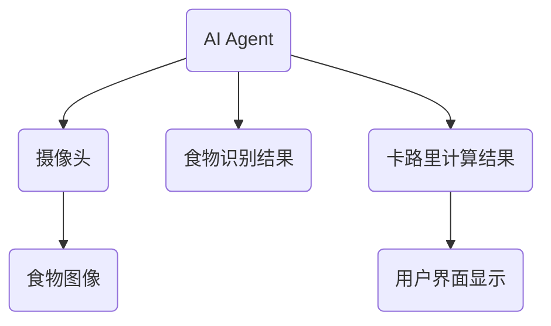
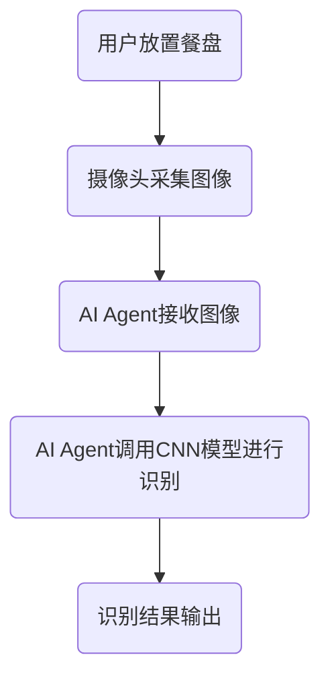
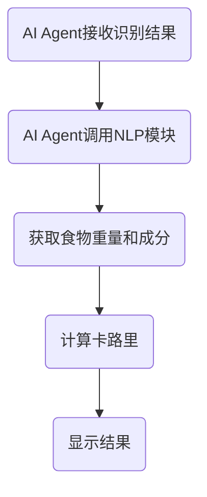
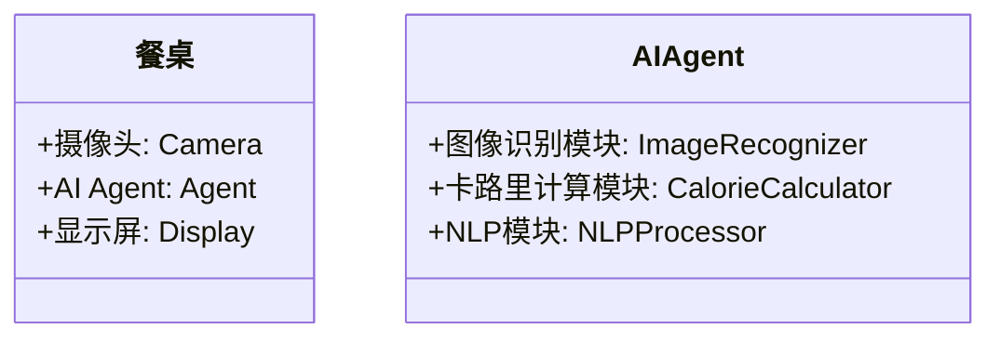
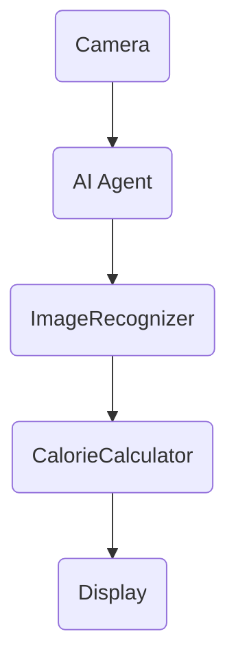

                 


# 智能餐盘：AI Agent的食物识别与卡路里计算

> **关键词：** AI Agent、食物识别、卡路里计算、图像识别、深度学习、系统架构  
> **摘要：** 本文详细探讨了智能餐盘系统的设计与实现，结合AI Agent技术，通过图像识别和深度学习算法，实现对食物的精准识别与卡路里计算。文章从背景介绍、算法原理、系统架构到项目实战，全面分析了智能餐盘的技术细节，并提供了实际案例和最佳实践。

---

# 第一部分：背景介绍

## 第1章：问题背景与需求分析

### 1.1 问题背景
#### 1.1.1 食物识别与健康管理的重要性
现代社会中，健康管理越来越受到重视。人们希望通过饮食控制热量摄入，预防肥胖、糖尿病等慢性疾病。传统的手动记录和计算卡路里方法效率低且容易出错，因此，智能化的解决方案成为刚需。

#### 1.1.2 当前食物识别技术的局限性
目前，市场上虽然有一些手机应用可以通过拍照识别食物，但准确性较低，尤其在面对复杂背景或相似食物时，识别效果不佳。此外，这些应用通常仅能识别单一食物，难以处理多食物混搭的场景。

#### 1.1.3 卡路里计算的难点与痛点
卡路里计算不仅依赖于食物种类，还需要考虑重量、烹饪方式等因素。传统方法依赖于用户手动输入，容易导致误差。因此，如何通过技术手段自动获取这些数据成为关键。

### 1.2 问题描述
#### 1.2.1 智能餐盘的核心目标
智能餐盘的核心目标是通过AI技术，实现对餐盘中食物的自动识别，并基于识别结果计算总卡路里，为用户提供健康饮食建议。

#### 1.2.2 用户需求分析
- **普通用户：** 需要简单易用的工具，快速获取卡路里数据。
- **健身人士：** 需要精确的卡路里计算和饮食建议。
- **餐饮企业：** 需要高效的餐品识别和营养分析工具。

#### 1.2.3 场景应用的边界与外延
智能餐盘主要应用于家庭和个人场景，未来可以扩展到餐厅、学校等场景。边界在于仅支持特定类型的餐盘和食物组合。

### 1.3 问题解决思路
#### 1.3.1 AI Agent在食物识别中的作用
AI Agent作为系统的核心，负责协调摄像头、图像识别算法和卡路里计算模块，实现端到端的自动化处理。

#### 1.3.2 卡路里计算的实现方法
通过AI Agent整合图像识别和自然语言处理技术，结合预训练的营养成分数据库，实现精准的卡路里计算。

#### 1.3.3 系统整体解决方案
结合硬件（摄像头）和软件（AI算法），构建一个闭环系统，从数据采集到处理，再到结果展示，形成完整的解决方案。

---

## 第2章：核心概念与联系

### 2.1 核心概念原理
#### 2.1.1 AI Agent的定义与功能
AI Agent是一种智能体，能够感知环境、执行任务并做出决策。在智能餐盘中，AI Agent负责协调摄像头采集图像、调用图像识别算法，并将结果传递给卡路里计算模块。

#### 2.1.2 食物识别的实现原理
基于深度学习的图像识别技术，通过训练好的卷积神经网络（CNN）模型，对食物图像进行分类和识别。

#### 2.1.3 卡路里计算的数学模型
卡路里计算基于食物的营养成分数据库，结合食物的重量和热量密度，通过公式计算总卡路里。

### 2.2 核心概念对比表
```markdown
| 概念       | 描述                                                                 |
|------------|----------------------------------------------------------------------|
| AI Agent   | 具备自主决策能力的智能体，用于处理复杂任务                                   |
| 食物识别    | 通过图像识别技术对食物进行分类和识别                                       |
| 卡路里计算  | 基于食物成分数据库和AI算法计算食物的热量值                                   |
```

### 2.3 实体关系图


---

# 第二部分：算法原理讲解

## 第3章：图像识别算法

### 3.1 图像识别算法原理
#### 3.1.1 基于CNN的食物图像分类
使用卷积神经网络（CNN）对食物图像进行分类。模型通过卷积层提取特征，池化层降低维度，全连接层进行分类。

#### 3.1.2 模型训练与优化
使用预处理的食物图像数据集（如ImageNet或自建数据集）训练CNN模型，并通过迁移学习优化性能。

#### 3.1.3 图像预处理与数据增强
对图像进行归一化、裁剪等预处理，并通过数据增强技术（如旋转、翻转）增加训练数据量。

### 3.2 图像识别流程图


### 3.3 核心代码实现
```python
import tensorflow as tf
from tensorflow.keras import layers

# 模型定义
model = tf.keras.Sequential([
    layers.Conv2D(32, (3,3), activation='relu', input_shape=(224, 224, 3)),
    layers.MaxPooling2D((2,2)),
    layers.Conv2D(64, (3,3), activation='relu'),
    layers.MaxPooling2D((2,2)),
    layers.Flatten(),
    layers.Dense(128, activation='relu'),
    layers.Dense(10, activation='softmax')
])

# 模型编译
model.compile(optimizer='adam', loss='sparse_categorical_crossentropy', metrics=['accuracy'])
```

---

## 第4章：卡路里计算算法

### 4.1 卡路里计算算法原理
#### 4.1.1 基于食物成分数据库的计算
通过识别出的食物种类和预估的重量，结合营养成分数据库计算卡路里。

#### 4.1.2 自然语言处理辅助
当图像识别不明确时，用户可以通过语音或文本输入食物信息，系统通过NLP技术进一步解析。

### 4.2 卡路里计算流程图


### 4.3 核心代码实现
```python
import numpy as np

# 假设识别出的食物为“鸡胸肉”，重量为100克
food = "鸡胸肉"
weight = 100  # 克

# 营养成分数据库
calorie_per_100g = {
    "鸡胸肉": 165  # 卡路里/100克
}

# 计算总卡路里
total_calories = (calorie_per_100g[food] * weight) / 100
print(f"总卡路里：{total_calories} 卡路里")
```

---

## 第5章：系统分析与架构设计

### 5.1 问题场景介绍
智能餐盘系统主要应用于家庭和个人场景，用户通过放置餐盘在摄像头下，系统自动识别食物并计算卡路里。

### 5.2 系统功能设计


### 5.3 系统架构设计


### 5.4 系统接口设计
- **摄像头接口：** 提供图像采集功能。
- **AI Agent接口：** 提供图像识别和卡路里计算API。
- **用户界面：** 显示识别结果和卡路里数据。

### 5.5 系统交互设计
```mermaid
sequenceDiagram
    用户放置餐盘
    用户 -> Camera: 采集图像
    Camera -> AI Agent: 传递图像
    AI Agent -> ImageRecognizer: 调用识别方法
    ImageRecognizer -> AI Agent: 返回识别结果
    AI Agent -> CalorieCalculator: 调用计算方法
    CalorieCalculator -> AI Agent: 返回卡路里数据
    AI Agent -> Display: 显示结果
```

---

## 第6章：项目实战

### 6.1 环境安装
安装Python、TensorFlow、OpenCV和相关依赖库。

### 6.2 核心代码实现
```python
import cv2
import tensorflow as tf

# 摄像头采集图像
cap = cv2.VideoCapture(0)
ret, frame = cap.read()
cv2.imwrite("food.jpg", frame)

# 调用AI Agent进行识别
# 假设AI Agent提供一个API接口
calories = agent.calculate_calories("food.jpg")
print(f"识别到食物，总卡路里为：{calories}")
```

### 6.3 案例分析
**案例：** 用户放置一份沙拉和一片面包在餐盘中，系统识别并计算总卡路里。

### 6.4 项目小结
通过实际案例，验证系统的准确性和实用性，总结经验教训。

---

## 第7章：最佳实践

### 7.1 小结
智能餐盘系统通过AI Agent、图像识别和深度学习算法，实现了对食物的精准识别和卡路里计算，为用户提供了便捷的健康管理工具。

### 7.2 注意事项
- 数据隐私保护：用户数据需加密存储。
- 系统兼容性：支持多种摄像头和设备。
- 模型优化：持续优化AI模型，提高识别准确率。

### 7.3 拓展阅读
建议读者深入学习深度学习和计算机视觉技术，探索更多AI在健康领域的应用。

---

**作者：AI天才研究院/AI Genius Institute & 禅与计算机程序设计艺术 /Zen And The Art of Computer Programming**

