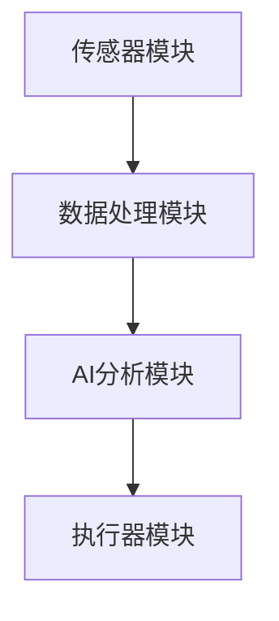

                 


# 智能鱼缸：AI Agent的水质平衡维护

> 关键词：智能鱼缸，AI Agent，水质平衡，机器学习，物联网，环境监测

> 摘要：本文探讨了AI Agent在智能鱼缸中的应用，特别是水质平衡的维护。通过分析水质监测技术、AI算法原理、系统架构设计和项目实战，展示了如何利用AI技术实现智能鱼缸的自动控制。文章从背景介绍到系统实现，层层递进，为读者提供了全面的技术解析。

---

# 第一部分: 智能鱼缸与AI Agent的背景介绍

# 第1章: 智能鱼缸与AI Agent概述

## 1.1 智能鱼缸的基本概念

### 1.1.1 智能鱼缸的定义
智能鱼缸是一种结合物联网技术的智能设备，能够实时监测水质参数（如温度、pH值、溶解氧、氨氮等），并通过AI算法自动调节水质，为鱼类提供一个稳定的生存环境。

### 1.1.2 智能鱼缸的核心功能
- **实时监测**：通过多种传感器采集水质数据。
- **智能分析**：利用AI算法分析水质数据，预测水质变化趋势。
- **自动调节**：根据分析结果，自动调整水泵、加氧设备、加热器等设备，以维持水质平衡。

### 1.1.3 AI Agent在智能鱼缸中的作用
AI Agent（智能代理）是智能鱼缸的核心，负责感知水质状态、做出决策并执行调节动作。它能够学习和适应鱼类的生存需求，优化水质控制策略。

## 1.2 水质平衡的重要性

### 1.2.1 水质参数对鱼类生存的影响
水质参数（如pH值、温度、溶解氧、氨氮等）直接关系到鱼类的健康和生存。水质失衡可能导致鱼类死亡，甚至影响整个生态系统的平衡。

### 1.2.2 水质失衡的常见原因
- **环境变化**：温度波动、光照变化等。
- **鱼类代谢**：鱼类的呼吸、排泄等代谢活动会改变水质。
- **设备故障**：水泵、过滤器等设备的故障可能导致水质恶化。

### 1.2.3 AI Agent在水质平衡中的应用价值
AI Agent能够实时监测水质变化，预测潜在风险，并采取预防措施，从而避免水质失衡带来的负面影响。它能够显著提高鱼缸的维护效率，降低人工成本。

## 1.3 本章小结
本章介绍了智能鱼缸的基本概念和AI Agent在其中的核心作用，强调了水质平衡的重要性，并指出了AI技术在水质控制中的巨大潜力。

---

# 第二部分: AI Agent的核心原理

# 第2章: AI Agent的基本原理

## 2.1 AI Agent的感知机制

### 2.1.1 感知器的作用
AI Agent通过多种传感器感知水质参数，如pH传感器、温度传感器、溶解氧传感器等。这些传感器能够实时采集水质数据，并将数据传输给AI Agent进行分析。

### 2.1.2 水质传感器的选择与配置
选择合适的水质传感器是AI Agent感知环境的关键。常见的水质传感器包括：
- pH传感器：用于测量水的酸碱度。
- 温度传感器：用于测量水温。
- 溶解氧传感器：用于测量水中的溶解氧含量。
- 氨氮传感器：用于测量水中的氨氮含量。

### 2.1.3 数据采集与处理流程
1. **数据采集**：传感器采集水质数据。
2. **数据预处理**：去除噪声，确保数据的准确性。
3. **特征提取**：提取关键水质参数，为后续分析做准备。

## 2.2 AI Agent的决策机制

### 2.2.1 决策模型的构建
AI Agent的决策模型基于水质数据，通过机器学习算法（如强化学习、监督学习）进行训练，以预测水质变化趋势并制定调节策略。

### 2.2.2 基于规则的决策系统
基于规则的决策系统通过预设的规则（如“当pH值低于6.5时，增加酸性物质”）进行决策。这种方法简单易懂，但灵活性较差。

### 2.2.3 基于机器学习的决策系统
基于机器学习的决策系统通过训练模型，能够自动学习水质变化的规律，并制定最优调节策略。这种方法具有更强的适应性和灵活性。

## 2.3 AI Agent的执行机制

### 2.3.1 执行器的功能与类型
执行器是AI Agent的执行机构，用于根据决策结果调节水质。常见的执行器包括：
- 水泵：调节水流速度，促进水循环。
- 加热器：调节水温。
- 加氧设备：增加水中的溶解氧含量。

### 2.3.2 执行策略的制定
AI Agent根据决策结果制定执行策略，例如：
- 当pH值过高时，启动酸性物质添加装置。
- 当溶解氧不足时，增加气泵的工作时间。

## 2.4 本章小结
本章详细介绍了AI Agent的核心原理，包括感知、决策和执行机制。通过传感器、机器学习算法和执行器的协同工作，AI Agent能够实现智能鱼缸的水质平衡维护。

---

# 第三部分: 水质监测技术

# 第3章: 水质监测技术详解

## 3.1 水质监测的核心技术

### 3.1.1 水质传感器的选择
选择合适的水质传感器是水质监测的关键。不同的传感器适用于不同的水质参数，例如：
- pH传感器：用于测量水的酸碱度。
- 温度传感器：用于测量水温。
- 溶解氧传感器：用于测量水中的溶解氧含量。

### 3.1.2 数据采集与处理
水质传感器采集的数据需要经过预处理，去除噪声和异常值，确保数据的准确性。

### 3.1.3 AI分析与水质预测
通过机器学习算法对水质数据进行分析，预测水质的变化趋势，并制定调节策略。

## 3.2 水质监测系统的实现

### 3.2.1 系统架构
水质监测系统通常包括传感器、数据采集模块、AI分析模块和执行器。传感器负责采集数据，数据采集模块负责处理数据，AI分析模块负责分析数据并制定调节策略，执行器负责执行调节动作。

### 3.2.2 系统实现步骤
1. 传感器安装与配置。
2. 数据采集与预处理。
3. AI模型训练与部署。
4. 执行器的配置与控制。

## 3.3 本章小结
本章详细介绍了水质监测技术的核心内容，包括传感器选择、数据采集与处理、AI分析与预测等。

---

# 第四部分: AI Agent的算法原理

# 第4章: AI Agent的算法原理

## 4.1 强化学习算法

### 4.1.1 强化学习的基本概念
强化学习是一种机器学习算法，通过智能体与环境的交互，学习最优策略。智能体会根据当前状态和动作的奖励，调整自己的行为，以最大化累计奖励。

### 4.1.2 强化学习在水质控制中的应用
在智能鱼缸中，AI Agent可以使用强化学习算法，根据当前水质状态和调节动作的奖励，优化自身的调节策略。

### 4.1.3 强化学习的数学模型
强化学习的数学模型包括状态、动作、奖励函数和策略。状态表示当前的水质参数，动作表示调节动作，奖励函数表示调节效果的好坏，策略表示动作的选择概率。

### 4.1.4 强化学习的实现步骤
1. 状态空间的定义。
2. 动作空间的定义。
3. 奖励函数的设计。
4. 策略的训练与优化。

## 4.2 监督学习算法

### 4.2.1 监督学习的基本概念
监督学习是一种机器学习算法，通过训练数据，学习输入与输出之间的映射关系。

### 4.2.2 监督学习在水质控制中的应用
在智能鱼缸中，AI Agent可以使用监督学习算法，根据历史水质数据，学习水质变化的规律，并预测未来水质的变化趋势。

### 4.2.3 监督学习的数学模型
监督学习的数学模型包括输入、输出和目标函数。输入是水质参数，输出是水质状态，目标函数是预测结果与实际结果的误差。

### 4.2.4 监督学习的实现步骤
1. 数据集的准备。
2. 模型的训练。
3. 模型的评估。
4. 模型的优化。

## 4.3 本章小结
本章详细介绍了AI Agent的算法原理，包括强化学习和监督学习的数学模型和实现步骤。

---

# 第五部分: 系统架构设计

# 第5章: 系统架构设计

## 5.1 系统功能设计

### 5.1.1 功能模块划分
智能鱼缸系统通常包括以下几个功能模块：
- 传感器模块：负责采集水质数据。
- 数据处理模块：负责处理水质数据。
- AI分析模块：负责分析水质数据并制定调节策略。
- 执行器模块：负责执行调节动作。

### 5.1.2 功能模块的交互流程
1. 传感器模块采集水质数据。
2. 数据处理模块处理水质数据。
3. AI分析模块分析水质数据并制定调节策略。
4. 执行器模块执行调节动作。

## 5.2 系统架构设计

### 5.2.1 系统架构图
以下是智能鱼缸系统的架构图：



### 5.2.2 接口设计
系统各模块之间的接口设计需要遵循标准协议，例如：
- 传感器模块与数据处理模块之间采用HTTP协议。
- 数据处理模块与AI分析模块之间采用JSON格式。
- AI分析模块与执行器模块之间采用命令控制。

## 5.3 本章小结
本章详细介绍了智能鱼缸系统的架构设计，包括功能模块划分、系统架构图和接口设计。

---

# 第六部分: 项目实战

# 第6章: 项目实战

## 6.1 环境搭建

### 6.1.1 硬件设备
- 水质传感器（如pH传感器、温度传感器）。
- 数据采集卡。
- 执行器（如水泵、加热器）。
- 单片机或嵌入式开发板（如Arduino、Raspberry Pi）。

### 6.1.2 软件工具
- Python编程语言。
- 机器学习库（如Scikit-learn、TensorFlow）。
- 数据可视化工具（如Matplotlib）。

## 6.2 系统核心实现

### 6.2.1 数据采集与处理
以下是水质数据采集的Python代码示例：

```python
import serial

# 初始化串口
ser = serial.Serial('COM3', 9600)

while True:
    # 读取数据
    data = ser.readline().decode()
    # 数据处理
    ph = float(data.split(',')[0])
    temperature = float(data.split(',')[1])
    print(f'pH: {ph}, 温度: {temperature}')
```

### 6.2.2 AI模型训练与部署
以下是强化学习算法的Python代码示例：

```python
import numpy as np
import gym

# 定义环境
class FishTankEnv(gym.Env):
    def __init__(self):
        # 状态空间：pH值、温度
        self.observation_space = gym.spaces.Box(low=np.array([6.0, 20.0]), high=np.array([8.0, 30.0]))
        # 动作空间：调节动作
        self.action_space = gym.spaces.Discrete(3)
        # 初始状态
        self.state = np.array([7.0, 25.0])

    # 状态空间
    def reset(self):
        self.state = np.array([7.0, 25.0])
        return self.state

    # 动作空间
    def step(self, action):
        # 根据动作调整状态
        if action == 0:
            self.state[0] += 0.1
        elif action == 1:
            self.state[0] -= 0.1
        elif action == 2:
            self.state[1] += 1
        # 返回新的状态、奖励、是否终止
        return self.state, 1.0, False, {}

# 初始化环境
env = FishTankEnv()

# 定义策略
class Policy:
    def __init__(self):
        self.theta = np.random.randn(2,1)

    def action_prob(self, state):
        # 计算动作概率
        z = np.dot(state, self.theta)
        return np.exp(z) / (1 + np.exp(z))

# 训练策略
policy = Policy()
env = FishTankEnv()

for episode in range(1000):
    state = env.reset()
    total_reward = 0
    while True:
        action_prob = policy.action_prob(state)
        action = np.random.choice([0,1,2], p=action_prob)
        next_state, reward, done, _ = env.step(action)
        total_reward += reward
        if done:
            break
    print(f' Episode {episode}, Total Reward: {total_reward}')
```

### 6.2.3 案例分析
通过实际案例分析，展示了AI Agent在智能鱼缸中的应用效果。例如，当pH值过低时，AI Agent会启动酸性物质添加装置，从而迅速恢复水质平衡。

## 6.3 本章小结
本章通过实际项目实战，详细介绍了智能鱼缸系统的实现过程，包括环境搭建、系统核心实现和案例分析。

---

# 第七部分: 总结与展望

# 第7章: 总结与展望

## 7.1 本章总结
本文详细介绍了AI Agent在智能鱼缸中的应用，特别是水质平衡的维护。通过分析水质监测技术、AI算法原理、系统架构设计和项目实战，展示了如何利用AI技术实现智能鱼缸的自动控制。

## 7.2 最佳实践

### 7.2.1 系统设计注意事项
- 确保传感器的精度和稳定性。
- 设计合理的数据处理流程。
- 选择合适的机器学习算法。

### 7.2.2 系统优化建议
- 引入多鱼种的水质需求，优化调节策略。
- 增强系统的可扩展性，支持更多的水质参数。

## 7.3 未来展望
随着AI技术的不断发展，智能鱼缸的水质平衡维护将更加智能化和自动化。未来的研究方向包括：
- 更加复杂的水质模型。
- 更高效的机器学习算法。
- 更智能的系统架构设计。

## 7.4 本章小结
本章总结了全文的主要内容，并提出了未来的研究方向。

---

# 作者：AI天才研究院/AI Genius Institute & 禅与计算机程序设计艺术 /Zen And The Art of Computer Programming

---

以上是《智能鱼缸：AI Agent的水质平衡维护》的技术博客文章的完整目录大纲及内容。

