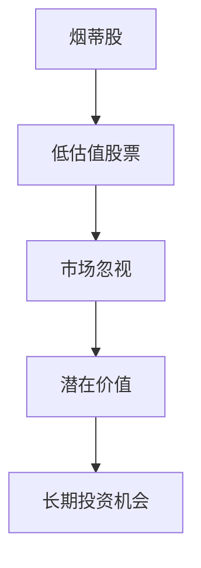
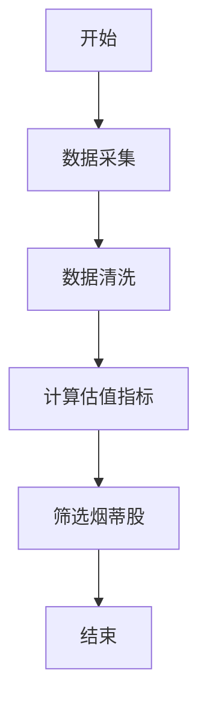
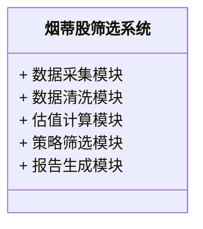
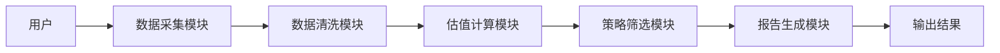

                 


# 《本杰明·格雷厄姆的'烟蒂股'策略现代解读》

---

## 关键词：
烟蒂股，价值投资，低估值股票，投资策略，股票筛选，投资算法

---

## 摘要：
本文从本杰明·格雷厄姆的经典投资理念出发，深入分析“烟蒂股”策略的核心思想，并结合现代技术手段对其进行创新性解读。通过技术分析、算法实现和系统设计，探讨如何在当今复杂多变的金融市场中运用烟蒂股策略进行投资决策。文章内容涵盖策略背景、核心概念、算法原理、系统架构以及实战案例，为投资者提供理论与实践相结合的指导。

---

## 第1章: 烟蒂股策略的背景介绍

### 1.1 烟蒂股的基本概念
- 1.1.1 什么是烟蒂股  
烟蒂股（烟蒂股票，即“cigar butts”）是本杰明·格雷厄姆提出的一种投资策略，指那些市场价格远低于其内在价值的股票。这种股票通常被市场忽视或低估，类似于被丢弃的烟蒂，但其内在价值仍然存在。

- 1.1.2 烟蒂股的起源与发展  
烟蒂股策略起源于20世纪30年代，格雷厄姆在其经典著作《证券分析》中首次系统地提出这一概念。在当时的市场环境下，许多公司由于市场恐慌或信息不对称，其股票价格被严重低估，为投资者提供了套利机会。

- 1.1.3 烟蒂股与价值投资的关系  
烟蒂股策略是价值投资的重要组成部分，其核心在于寻找市场价格低于内在价值的股票。与成长投资不同，烟蒂股策略更注重安全边际和低估值。

---

### 1.2 烟蒂股的核心要素
- 1.2.1 低估值股票的定义  
烟蒂股的典型特征是市场价格远低于其内在价值。通常，投资者可以通过市盈率（P/E）、市净率（P/B）等估值指标来判断一只股票是否为烟蒂股。

- 1.2.2 烟蒂股的市场特征  
烟蒂股通常存在于市场低迷时期，或被市场忽视的行业中。这些股票往往具有较高的股息率和较低的交易量。

- 1.2.3 烟蒂股的长期投资价值  
烟蒂股的长期价值来源于其被低估的特性。随着市场对这些股票的重新评估，其价格往往会出现反弹，为投资者带来超额收益。

---

### 1.3 烟蒂股的现代解读
- 1.3.1 现代市场环境下的烟蒂股  
随着金融市场的成熟和信息的透明化，烟蒂股的定义和筛选标准也在不断演变。现代投资者需要结合宏观经济、行业趋势和公司基本面进行综合判断。

- 1.3.2 技术进步对烟蒂股策略的影响  
大数据和人工智能技术的应用为烟蒂股的筛选提供了新的工具和方法。投资者可以通过量化分析和机器学习模型，更高效地识别潜在的烟蒂股。

- 1.3.3 烟蒂股策略的边界与外延  
烟蒂股策略并非万能的投资策略，其适用范围受到市场环境和数据质量的限制。投资者需要结合其他策略（如成长股投资）进行多元化配置。

---

## 第2章: 烟蒂股策略的核心概念与联系

### 2.1 烟蒂股的定义与属性
- 2.1.1 烟蒂股的定义  
烟蒂股是指那些市场价格远低于其内在价值，且具有较高安全边际的股票。

- 2.1.2 烟蒂股的核心属性对比  
下表对比了烟蒂股与其他类型股票的核心属性：

| 股票类型 | 市场价格与内在价值的关系 | 市盈率（P/E） | 市净率（P/B） |
|----------|---------------------------|----------------|----------------|
| 烟蒂股    | 远低于内在价值             | 低于行业平均  | 低于行业平均  |
| 成长股    | 高于内在价值               | 高于行业平均  | 高于行业平均  |
| 防御股    | 接近内在价值                | 稍低于行业平均 | 稍低于行业平均 |

- 2.1.3 烟蒂股与其他投资策略的联系  
烟蒂股策略与价值投资、成长投资等策略既有区别又有联系。例如，烟蒂股策略更注重安全边际，而成长投资更注重未来增长潜力。

---

### 2.2 烟蒂股的ER实体关系图
下图展示了烟蒂股策略的核心要素及其关系：


---

## 第3章: 烟蒂股策略的算法原理

### 3.1 烟蒂股筛选算法
- 3.1.1 烟蒂股筛选的步骤  
烟蒂股筛选通常包括以下步骤：
1. 数据采集：收集目标股票的基本面数据（如收入、利润、市盈率等）。
2. 数据清洗：剔除无效数据或异常值。
3. 估值指标计算：计算市盈率、市净率等指标。
4. 筛选标准：根据预设的筛选标准，筛选出符合条件的股票。

- 3.1.2 烟蒂股筛选的数学模型  
以下是烟蒂股筛选的数学模型：
$$
\text{烟蒂股筛选标准} = \begin{cases}
\text{P/E} < \text{行业平均P/E} \times 0.5 \\
\text{P/B} < \text{行业平均P/B} \times 0.5 \\
\text{股息率} > \text{行业平均股息率} \times 1.5
\end{cases}
$$

- 3.1.3 烟蒂股筛选的流程图  
下图展示了烟蒂股筛选的流程：


---

### 3.2 烟蒂股筛选的Python实现
以下是一个简单的烟蒂股筛选算法的Python代码示例：
```python
import pandas as pd

def smoke_butt_stock_screening():
    # 数据采集
    df = pd.read_csv('stock_data.csv')
    # 数据清洗
    df.dropna(inplace=True)
    # 计算估值指标
    df['PE_ratio'] = df['Price'] / df['Earnings']
    df['PB_ratio'] = df['Price'] / df['Book Value']
    # 筛选烟蒂股
    df = df[(df['PE_ratio'] < 15) & (df['PB_ratio'] < 2)]
    return df

# 示例运行
selected_stocks = smoke_butt_stock_screening()
print(selected_stocks)
```

---

## 第4章: 烟蒂股策略的系统分析与架构设计

### 4.1 系统功能设计
- 4.1.1 问题场景介绍  
在现代金融市场中，投资者需要通过系统化的工具来筛选烟蒂股。系统需要具备数据采集、估值计算、策略筛选和报告生成等功能。

- 4.1.2 系统功能设计  
下图展示了系统的功能模块：


- 4.1.3 系统架构设计  
下图展示了系统的整体架构：


---

## 第5章: 烟蒂股策略的项目实战

### 5.1 项目环境安装
- 需要安装的Python库：
  ```
  pip install pandas numpy matplotlib
  ```

---

### 5.2 烟蒂股筛选系统的实现
- 核心代码实现：
```python
import pandas as pd
import numpy as np
import matplotlib.pyplot as plt

def visualize_smoke_butt_stocks(selected_stocks):
    plt.figure(figsize=(10,6))
    plt.scatter(selected_stocks['Market Cap'], selected_stocks['PE_ratio'], c='blue', marker='o')
    plt.xlabel('Market Cap')
    plt.ylabel('PE Ratio')
    plt.title('烟蒂股分布图')
    plt.show()

# 示例运行
selected_stocks = smoke_butt_stock_screening()
visualize_smoke_butt_stocks(selected_stocks)
```

---

## 第6章: 烟蒂股策略的最佳实践

### 6.1 投资策略小结
- 烟蒂股策略的核心在于寻找低估值股票。
- 现代投资者可以通过技术手段提高筛选效率。

### 6.2 投资注意事项
- 烟蒂股策略适合长期投资。
- 需要结合宏观经济和行业趋势进行判断。

### 6.3 拓展阅读
- 《证券分析》——本杰明·格雷厄姆
- 《投资学原理》——威廉·夏普

---

## 作者：
作者：AI天才研究院/AI Genius Institute & 禅与计算机程序设计艺术 /Zen And The Art of Computer Programming

---

以上为《本杰明·格雷厄姆的'烟蒂股'策略现代解读》的完整目录大纲和内容概要，具体内容可以根据实际需求进行补充和完善。

