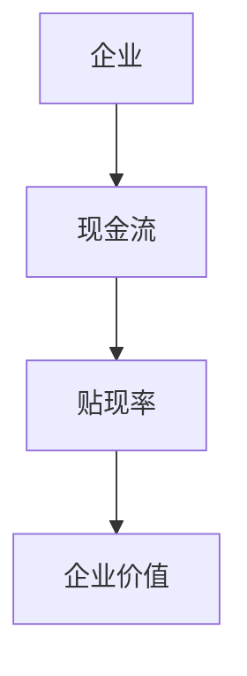
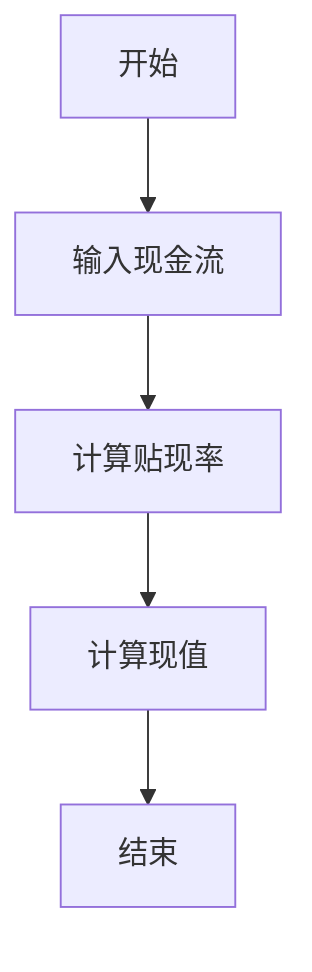
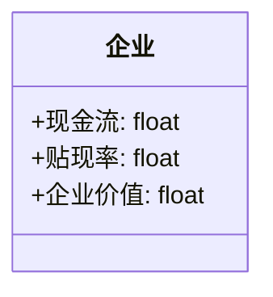
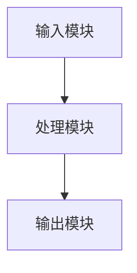

                 


# 本杰明·格雷厄姆的企业价值计算方法现代化

> 关键词：企业价值计算，本杰明·格雷厄姆，现代化，DCF模型，贴现率，现金流，投资评估

> 摘要：本文将探讨如何将本杰明·格雷厄姆的经典企业价值计算方法进行现代化改造，以适应现代金融环境的需求。通过分析传统方法的局限性，结合现代金融理论和技术手段，提出一种改进的企业价值计算框架，包括数学模型、算法实现和系统设计等多方面的内容。

---

# 第1章: 企业价值计算方法的背景与核心概念

## 1.1 问题背景与挑战

### 1.1.1 传统企业价值计算方法的局限性
传统的企业价值计算方法（如DCF模型）基于简单的现金流贴现原理，但在实际应用中，其假设条件过于理想化，难以适应复杂多变的现代金融市场。例如，传统方法通常假设贴现率不变，而忽略了通货膨胀、市场波动等实际因素。

### 1.1.2 现代金融环境下的新挑战
现代金融市场中，企业面临的不确定性和复杂性显著增加。例如，全球化、技术变革和政策变化等因素都会影响企业的现金流和贴现率。因此，传统的计算方法需要进行调整，以更准确地反映这些变化。

### 1.1.3 为什么要进行现代化改造
现代化改造的核心目标是提升企业价值计算的准确性和实用性，使其能够更好地服务于现代投资决策和企业战略规划。通过引入新的数学模型和计算工具，可以更精确地评估企业的内在价值。

## 1.2 核心概念与问题描述

### 1.2.1 企业价值计算的基本定义
企业价值（Enterprise Value, EV）是指企业在完全竞争市场中公平的市场价值，通常包括企业所有资产的公允价值，减去负债的公允价值。其计算公式为：
$$ EV = \text{股东权益} + \text{净债务} $$

### 1.2.2 核心要素与概念结构
企业价值计算的核心要素包括：
- **现金流（Cash Flow）**：企业未来产生的所有现金流。
- **贴现率（Discount Rate）**：用于将未来现金流折现到当前的利率。
- **时间跨度（Time Horizon）**：现金流的时间分布。

### 1.2.3 现代化改造的目标与边界
现代化改造的目标是优化计算方法，使其能够更准确地反映企业的实际价值。其边界包括：
- 不改变企业价值计算的基本原理。
- 不涉及企业战略调整，仅专注于计算方法的改进。

## 1.3 核心概念的外延与联系

### 1.3.1 核心要素对比分析表
| 要素       | 传统方法                  | 现代化方法                  |
|------------|---------------------------|-----------------------------|
| 现金流     | 单一假设                  | 动态调整                    |
| 贴现率     | 固定值                    | 动态变化                    |
| 时间跨度   | 短期或固定               | 长期或可变                  |

### 1.3.2 ER实体关系图


## 1.4 本章小结

### 1.4.1 核心概念回顾
本章介绍了企业价值计算的基本定义、核心要素及其外延关系。

### 1.4.2 现代化改造的必要性
通过对比传统方法和现代化方法的差异，强调了进行现代化改造的必要性。

### 1.4.3 下一章的预览
下一章将深入探讨企业价值计算的核心概念与联系，包括数学模型和流程图的详细讲解。

---

# 第2章: 企业价值计算方法的核心概念与联系

## 2.1 核心概念原理

### 2.1.1 核心要素的数学模型
企业价值的计算公式为：
$$ V = \frac{CF}{r} $$
其中，\( CF \) 是未来现金流，\( r \) 是贴现率。

### 2.1.2 现代化改造的数学表达
在现代化改造中，贴现率 \( r \) 需要动态调整，公式变为：
$$ V_{modern} = \frac{CF}{r_{adjusted}} $$

## 2.2 核心概念对比分析

### 2.2.1 核心要素对比表格
| 要素       | 传统方法                  | 现代化方法                  |
|------------|---------------------------|-----------------------------|
| 现金流     | 固定假设                  | 动态调整                    |
| 贴现率     | 固定值                    | 动态变化                    |
| 时间跨度   | 短期或固定               | 长期或可变                  |

## 2.3 实体关系图

### 2.3.1 实体关系图


## 2.4 本章小结

### 2.4.1 核心概念的数学模型
本章通过数学公式和表格对比，详细讲解了企业价值计算的核心要素及其关系。

### 2.4.2 现代化改造的必要性
通过数学模型的对比，进一步强调了现代化改造的必要性。

### 2.4.3 下一章的预览
下一章将详细讲解现代化企业价值计算的算法原理，包括数学模型和代码实现。

---

# 第3章: 现代化企业价值计算的算法原理

## 3.1 算法原理概述

### 3.1.1 核心算法流程


### 3.1.2 算法实现代码
```python
def modern_value(CF, r, delta):
    adjusted_r = r - delta
    return CF / adjusted_r
```

## 3.2 算法实现细节

### 3.2.1 数学公式
企业价值的现代化计算公式为：
$$ V_{modern} = \frac{CF}{r_{adjusted}} $$
其中，\( r_{adjusted} = r - \delta \)，\( \delta \) 是通货膨胀率或其他调整因素。

### 3.2.2 代码实现
```python
def calculate_ev(cash_flows, discount_rate, adjustment_factor):
    adjusted_rate = discount_rate - adjustment_factor
    enterprise_value = sum(cf / (1 + adjusted_rate)**i for i, cf in enumerate(cash_flows))
    return enterprise_value
```

## 3.3 本章小结

### 3.3.1 算法原理回顾
本章通过数学公式和代码实现，详细讲解了现代化企业价值计算的算法原理。

### 3.3.2 下一章的预览
下一章将介绍系统分析与架构设计方案，包括系统功能设计和架构图等内容。

---

# 第4章: 系统分析与架构设计方案

## 4.1 系统分析

### 4.1.1 问题场景介绍
在现代金融市场中，企业价值计算需要考虑多个因素，包括现金流的动态变化和贴现率的调整。

### 4.1.2 系统功能设计
系统需要实现以下功能：
- 输入现金流数据。
- 计算贴现率。
- 计算企业价值。

### 4.1.3 领域模型


## 4.2 系统架构设计

### 4.2.1 系统架构图


## 4.3 系统接口设计

### 4.3.1 接口描述
- 输入接口：接受现金流数据和贴现率。
- 输出接口：输出企业价值。

## 4.4 本章小结

### 4.4.1 系统分析与设计
本章通过系统分析和架构设计，详细讲解了现代化企业价值计算系统的实现方案。

### 4.4.2 下一章的预

