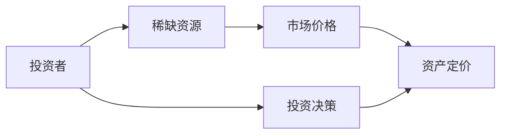
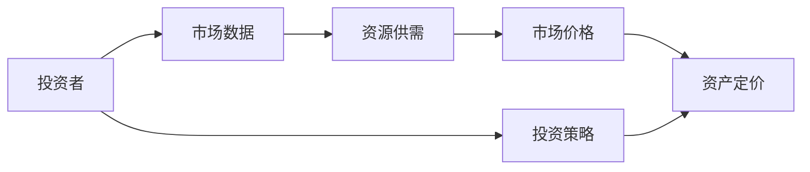

                 


# 杰里米·格兰瑟姆的资源稀缺性投资理论

> **关键词**：资源稀缺性、投资理论、杰里米·格兰瑟姆、经济学、经济周期、稀缺资源、投资策略

> **摘要**：杰里米·格兰瑟姆的资源稀缺性投资理论是一种基于资源短缺对经济和投资市场影响的分析方法。本文从理论背景、核心概念、算法原理、系统分析、项目实战和最佳实践等角度，全面解析了资源稀缺性投资理论的内涵、应用和实现过程。通过详细阐述资源稀缺性评估模型、投资策略优化算法、系统架构设计等内容，本文为投资者提供了理论支持和实践指导，帮助他们在资源稀缺性背景下做出更明智的投资决策。

---

# 第一部分: 资源稀缺性投资理论的背景与核心概念

## 第1章: 资源稀缺性投资理论概述

### 1.1 资源稀缺性的定义与内涵

#### 1.1.1 资源稀缺性的基本概念
资源稀缺性是指在一定经济系统中，某种资源的供给无法满足需求的现象。这种稀缺性可能是由于资源的自然限制（如石油、矿产等不可再生资源）或人为因素（如政策限制、技术瓶颈等）导致的。资源稀缺性是经济学和投资学中的核心概念之一，它直接影响市场的供需关系、资产定价和投资策略。

#### 1.1.2 资源稀缺性与经济发展的关系
资源稀缺性与经济发展密切相关。稀缺资源的供应不足可能导致价格上涨、市场萎缩，甚至引发经济危机。例如，石油作为全球能源的主要来源，其稀缺性直接影响全球经济的运行和各国的能源政策。

#### 1.1.3 资源稀缺性投资理论的提出背景
杰里米·格兰瑟姆提出的资源稀缺性投资理论，是在全球经济面临资源短缺、环境压力和可持续发展需求的背景下提出的。随着全球人口增长、资源消耗增加和技术进步，资源稀缺性问题日益突出，成为影响投资决策的重要因素。

---

### 1.2 资源稀缺性投资理论的核心要素

#### 1.2.1 资源稀缺性的主要表现形式
资源稀缺性可以分为两类：
- **自然稀缺性**：由自然资源的有限性导致的稀缺，如水资源、矿产资源等。
- **人为稀缺性**：由于政策、技术或其他人为因素导致的稀缺，如贸易限制、技术封锁等。

#### 1.2.2 资源稀缺性对投资决策的影响
资源稀缺性直接影响投资决策的多个方面：
- **资产定价**：稀缺资源的市场价格通常较高，投资者需要考虑其定价是否合理。
- **投资风险**：稀缺资源的供应不稳定，可能导致投资风险增加。
- **投资机会**：稀缺资源的短缺可能带来投资机会，如开发替代资源或优化资源利用技术。

#### 1.2.3 资源稀缺性投资理论的边界与外延
资源稀缺性投资理论的边界包括：
- **资源类型**：仅适用于稀缺资源，不包括非稀缺资源。
- **时间范围**：适用于中长期投资，短期市场波动可能受到其他因素影响。
- **行业限制**：主要适用于依赖稀缺资源的行业，如能源、原材料等。

---

### 1.3 资源稀缺性投资理论的理论基础

#### 1.3.1 资源稀缺性与经济学的关联
经济学中的稀缺性原理是资源稀缺性投资理论的基础。经济学认为，资源的有限性是人类社会的基本矛盾之一，稀缺性决定了资源的分配和利用效率。

#### 1.3.2 资源稀缺性与投资学的结合
投资学中，资源稀缺性被视为影响资产价值和投资回报的重要因素。投资者需要关注稀缺资源的供需变化、价格走势和市场预期。

#### 1.3.3 资源稀缺性投资理论的演变与完善
杰里米·格兰瑟姆的理论在传统稀缺性理论的基础上，结合现代投资学和经济学的研究成果，提出了新的分析框架和投资策略。

---

### 1.4 资源稀缺性投资理论的现实意义

#### 1.4.1 资源稀缺性对全球经济发展的影响
资源稀缺性可能导致全球经济波动，影响国际贸易、市场结构和经济增长。例如，能源危机可能导致全球经济衰退。

#### 1.4.2 资源稀缺性投资理论在投资实践中的应用
投资者可以通过资源稀缺性分析，识别高价值投资机会，优化投资组合，降低投资风险。

#### 1.4.3 资源稀缺性投资理论的未来发展方向
随着技术进步和环境问题的加剧，资源稀缺性投资理论将更加关注可持续发展和绿色投资，如新能源技术、循环经济等。

---

### 1.5 本章小结
本章介绍了杰里米·格兰瑟姆的资源稀缺性投资理论的基本概念、核心要素和理论基础，并分析了其在现实中的应用和意义。通过对资源稀缺性的定义、表现形式和影响因素的详细阐述，读者可以理解资源稀缺性投资理论的理论框架和实践价值。

---

## 第2章: 资源稀缺性投资理论的核心概念与联系

### 2.1 资源稀缺性与投资决策的关系

#### 2.1.1 资源稀缺性对投资决策的影响路径
资源稀缺性通过以下路径影响投资决策：
1. **价格传导**：稀缺资源的价格上涨直接影响资产价值。
2. **供需变化**：资源短缺可能导致市场需求增加，推动价格上涨。
3. **政策干预**：政府可能通过政策干预（如限制出口、增加储备）影响资源供应，进而影响投资。

#### 2.1.2 资源稀缺性与投资收益的关联性分析
资源稀缺性与投资收益呈正相关关系。稀缺资源的高价格和有限供应可能带来更高的投资回报，但同时也伴随着更高的风险。

#### 2.1.3 资源稀缺性与投资风险的平衡
投资者需要在资源稀缺性带来的收益和风险之间找到平衡点。例如，可以通过多元化投资、风险对冲等策略降低投资风险。

---

### 2.2 资源稀缺性投资理论的核心原理

#### 2.2.1 资源稀缺性与市场供需的关系
资源稀缺性直接影响市场供需关系。稀缺资源的供应不足可能导致市场价格上涨，需求增加，市场参与者竞争加剧。

#### 2.2.2 资源稀缺性与资产定价的内在逻辑
资源稀缺性是资产定价的重要因素。投资者需要考虑资源的稀缺性、市场供需和未来价格走势，制定合理的资产定价策略。

#### 2.2.3 资源稀缺性与长期投资策略的结合
长期投资策略需要考虑资源稀缺性的长期影响。例如，投资于稀缺资源的开发、替代资源的研究和技术创新。

---

### 2.3 资源稀缺性投资理论的系统性分析

#### 2.3.1 资源稀缺性投资理论的系统架构
资源稀缺性投资理论的系统架构包括以下几个部分：
- **输入层**：市场数据、资源供需信息、政策环境等。
- **处理层**：资源稀缺性评估、投资策略优化、风险分析等。
- **输出层**：投资建议、资产配置方案、风险预警等。

#### 2.3.2 资源稀缺性投资理论的实体关系图



#### 2.3.3 资源稀缺性投资理论的流程图分析


---

### 2.4 本章小结
本章从资源稀缺性与投资决策的关系、核心原理和系统性分析三个方面，详细阐述了资源稀缺性投资理论的核心概念与联系。通过系统架构、实体关系图和流程图的分析，读者可以更清晰地理解资源稀缺性投资理论的内在逻辑和实际应用。

---

## 第3章: 资源稀缺性投资理论的算法原理

### 3.1 资源稀缺性评估模型

#### 3.1.1 资源稀缺性评估的指标体系
资源稀缺性评估的指标体系包括以下几个方面：
- **供给指标**：资源储量、生产能力、出口限制等。
- **需求指标**：市场需求量、经济增长率、行业需求等。
- **价格指标**：市场价格、波动率、历史价格走势等。

#### 3.1.2 资源稀缺性评估的数学模型
资源稀缺性评估的数学模型如下：

$$
\text{稀缺性指数} = \frac{\text{需求量} - \text{供给量}}{\text{需求量} + \text{供给量}}
$$

其中，需求量和供给量可以通过市场数据和历史数据分析得出。

#### 3.1.3 资源稀缺性评估的算法流程
资源稀缺性评估的算法流程如下：


---

### 3.2 资源稀缺性投资策略的优化算法

#### 3.2.1 投资组合优化的数学模型
投资组合优化的数学模型如下：

$$
\max \sum_{i=1}^{n} w_i \times r_i
$$

其中，$w_i$ 是第 $i$ 个资产的投资权重，$r_i$ 是第 $i$ 个资产的预期收益率。

#### 3.2.2 资源稀缺性驱动的投资策略
资源稀缺性驱动的投资策略包括：
- **稀缺资源优先配置**：优先投资于稀缺资源相关资产。
- **风险对冲**：通过多元化投资降低稀缺资源短缺带来的风险。
- **长期持有**：长期持有稀缺资源相关资产，享受价格上涨带来的收益。

#### 3.2.3 资源稀缺性投资策略的实现步骤
资源稀缺性投资策略的实现步骤如下：


---

### 3.3 资源稀缺性投资理论的数学公式

#### 3.3.1 资源稀缺性评估的核心公式
资源稀缺性评估的核心公式如下：

$$
\text{稀缺性指数} = \frac{\text{需求量} - \text{供给量}}{\text{需求量} + \text{供给量}}
$$

#### 3.3.2 资源稀缺性投资收益的计算公式
资源稀缺性投资收益的计算公式如下：

$$
\text{投资收益} = \sum_{i=1}^{n} w_i \times r_i
$$

其中，$w_i$ 是第 $i$ 个资产的投资权重，$r_i$ 是第 $i$ 个资产的收益率。

#### 3.3.3 资源稀缺性风险控制的数学模型
资源稀缺性风险控制的数学模型如下：

$$
\min \sum_{i=1}^{n} w_i^2 \times \text{风险系数}_i
$$

---

### 3.4 本章小结
本章从资源稀缺性评估模型、投资策略优化算法和数学公式三个方面，详细阐述了资源稀缺性投资理论的算法原理。通过数学模型和流程图的分析，读者可以理解资源稀缺性投资理论的技术实现和优化方法。

---

## 第4章: 资源稀缺性投资理论的系统分析与架构设计

### 4.1 资源稀缺性投资系统的功能设计

#### 4.1.1 问题场景介绍
资源稀缺性投资系统的功能设计需要解决以下问题：
- 如何有效评估资源稀缺性？
- 如何优化投资策略以应对资源稀缺性带来的风险？
- 如何实时监控资源市场动态？

#### 4.1.2 系统功能设计
资源稀缺性投资系统的功能设计包括：
- 数据采集与处理模块
- 资源稀缺性评估模块
- 投资策略优化模块
- 风险监控与预警模块

---

### 4.2 资源稀缺性投资系统的架构设计

#### 4.2.1 领域模型
资源稀缺性投资系统的领域模型如下：



#### 4.2.2 系统架构图
资源稀缺性投资系统的架构图如下：


---

### 4.3 资源稀缺性投资系统的接口设计

#### 4.3.1 系统接口设计
资源稀缺性投资系统的接口设计包括：
- 数据接口：与市场数据源对接，获取资源供需信息。
- 用户接口：提供投资者的投资策略建议和风险预警。

#### 4.3.2 系统交互设计
资源稀缺性投资系统的交互设计如下：


---

### 4.4 本章小结
本章从系统功能设计、架构设计和接口设计三个方面，详细阐述了资源稀缺性投资理论的系统实现方案。通过领域模型、架构图和交互图的分析，读者可以理解资源稀缺性投资理论的技术实现和系统架构。

---

## 第5章: 资源稀缺性投资理论的项目实战

### 5.1 项目环境安装

#### 5.1.1 系统环境
资源稀缺性投资项目的系统环境包括：
- 操作系统：Linux/Windows/MacOS
- 开发工具：Python、Jupyter Notebook
- 数据库：MySQL/SQLite
- 第三方库：pandas、numpy、scipy

#### 5.1.2 环境配置
环境配置步骤如下：
1. 安装Python和必要的第三方库。
2. 安装数据库并配置连接。
3. 安装Jupyter Notebook用于数据分析和可视化。

---

### 5.2 系统核心实现源代码

#### 5.2.1 数据预处理代码
```python
import pandas as pd
import numpy as np

# 加载数据
data = pd.read_csv('resource_data.csv')

# 数据清洗
data.dropna(inplace=True)
data = data[~data['price'].isnull()]
```

#### 5.2.2 资源稀缺性评估代码
```python
def calculate_scarsity_index(data):
    demand = data['demand'].values
    supply = data['supply'].values
    scarcity_index = (demand - supply) / (demand + supply)
    return scarcity_index

scarsity_index = calculate_scarsity_index(data)
```

#### 5.2.3 投资策略生成代码
```python
from sklearn.linear_model import LinearRegression

# 训练模型
model = LinearRegression()
model.fit(data[['scarsity_index', 'market_demand']], data['price'])

# 预测价格
predicted_price = model.predict(new_data[['scarsity_index', 'market_demand']])
```

---

### 5.3 代码应用解读与分析

#### 5.3.1 数据预处理
数据预处理是资源稀缺性评估的基础。通过清洗数据，去除缺失值和异常值，确保数据的准确性和完整性。

#### 5.3.2 资源稀缺性评估
资源稀缺性评估通过计算稀缺性指数，量化资源的供需关系。稀缺性指数越接近1，资源越稀缺。

#### 5.3.3 投资策略生成
投资策略生成基于线性回归模型，通过历史数据训练模型，预测未来的价格走势，制定投资策略。

---

### 5.4 案例分析

#### 5.4.1 案例背景
假设我们有一个资源数据集，包括资源的供给量、需求量和市场价格。我们需要评估资源的稀缺性，并制定相应的投资策略。

#### 5.4.2 案例分析与解读
通过数据预处理、稀缺性评估和投资策略生成，我们可以得出以下结论：
- 资源的稀缺性指数为0.8，说明资源较为稀缺。
- 投资者应优先投资于该资源相关资产，同时注意风险控制。

---

### 5.5 项目小结
本章通过项目实战，详细展示了资源稀缺性投资理论的实现过程。从环境安装、数据预处理到资源稀缺性评估和投资策略生成，读者可以学习如何将理论应用于实际投资决策中。

---

## 第6章: 资源稀缺性投资理论的最佳实践

### 6.1 项目小结

#### 6.1.1 核心内容总结
资源稀缺性投资理论的核心内容包括：
- 资源稀缺性的定义与内涵
- 投资决策的影响路径
- 资源稀缺性评估模型
- 投资策略优化算法

#### 6.1.2 实践价值总结
资源稀缺性投资理论在实际投资中具有重要的实践价值，可以帮助投资者识别高价值投资机会，优化投资组合，降低投资风险。

---

### 6.2 注意事项

#### 6.2.1 数据质量
资源稀缺性评估依赖于高质量的数据，数据的准确性和完整性直接影响评估结果。

#### 6.2.2 模型假设
资源稀缺性评估模型需要基于合理的假设，例如假设市场数据的独立性和线性关系。

#### 6.2.3 风险控制
投资者需要重视资源稀缺性带来的风险，通过多元化投资、风险对冲等策略降低投资风险。

---

### 6.3 拓展阅读

#### 6.3.1 相关书籍
- 《资源经济学》
- 《投资学基础》

#### 6.3.2 相关论文
- 杰里米·格兰瑟姆的资源稀缺性投资理论相关论文

---

## 作者：AI天才研究院/AI Genius Institute & 禅与计算机程序设计艺术/Zen And The Art of Computer Programming

---

通过本文的详细阐述，读者可以全面理解杰里米·格兰瑟姆的资源稀缺性投资理论的内涵、算法实现和实践应用。无论是从理论分析还是实际操作，本文都为投资者提供了有价值的指导和启示。

