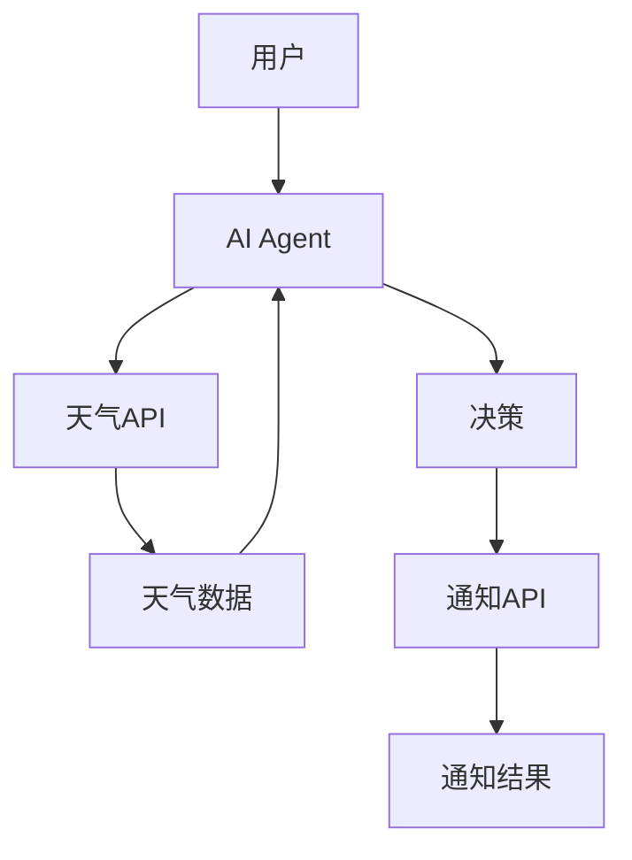
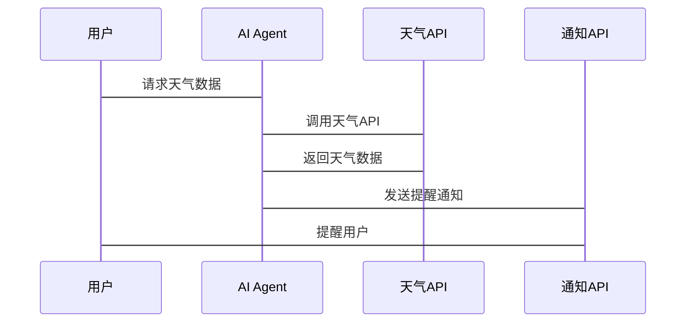

                 


# 构建AI Agent的API集成能力：连接外部服务

## 关键词：AI Agent，API集成，外部服务，系统架构，API设计，API管理，API安全

## 摘要：  
本文详细探讨了构建AI Agent的API集成能力，重点分析了如何通过API连接外部服务以实现智能化应用。文章从AI Agent的基本概念出发，逐步深入讲解API集成的核心概念、技术实现、系统架构设计以及实际项目中的应用。通过丰富的实例和代码示例，帮助读者理解并掌握AI Agent与外部服务的API集成方法，包括API的设计、安全性、监控与优化等方面。

---

# 第1章 AI Agent与API集成概述

## 1.1 AI Agent的基本概念

### 1.1.1 AI Agent的定义与特点  
AI Agent（人工智能代理）是一种能够感知环境、自主决策并执行任务的智能实体。它通过与外部系统、数据库或人类交互，完成特定的目标。AI Agent的核心特点包括：  
- **自主性**：能够自主决策和行动。  
- **反应性**：能够实时感知环境变化并做出反应。  
- **社交能力**：能够与外部系统或人类进行交互。  

### 1.1.2 API在AI Agent中的作用  
API（应用程序编程接口）是AI Agent与外部服务交互的桥梁。通过API，AI Agent可以调用外部服务的功能，例如天气数据查询、图像识别、自然语言处理等。API使得AI Agent能够扩展自身的功能，实现更复杂的应用场景。

### 1.1.3 AI Agent与外部服务的连接方式  
AI Agent可以通过以下方式连接外部服务：  
1. **直接调用API**：通过HTTP请求或其他协议直接调用外部服务的API。  
2. **消息队列**：通过消息队列（如Kafka、RabbitMQ）异步通信。  
3. **事件驱动**：通过事件监听机制与外部服务交互。  

---

## 1.2 API集成的背景与重要性

### 1.2.1 为什么需要API集成  
随着云计算、大数据和人工智能技术的快速发展，企业越来越依赖于通过API连接外部服务来构建智能化系统。API集成能够帮助企业快速接入第三方服务，例如支付网关、社交媒体API、天气数据API等，从而提升系统的功能和用户体验。

### 1.2.2 API集成在AI Agent中的应用场景  
API集成在AI Agent中的应用场景包括：  
- **数据获取**：从外部数据库或API获取数据。  
- **服务调用**：调用第三方服务（如支付服务、地图服务）完成特定任务。  
- **消息传递**：通过API进行实时消息传递和通知。  

### 1.2.3 API集成的挑战与解决方案  
API集成的主要挑战包括：  
- **安全性**：API的安全性问题，如数据泄露和未经授权的访问。  
- **兼容性**：不同系统之间的API接口可能存在兼容性问题。  
- **性能**：API调用可能对系统性能产生影响。  

解决方案包括：  
- **API网关**：通过API网关统一管理API的调用、认证和监控。  
- **身份验证**：通过JWT（JSON Web Token）等技术实现API的安全认证。  
- **限流与熔断**：通过限流和熔断机制保障API的性能和稳定性。  

---

## 1.3 本章小结

### 1.3.1 核心概念回顾  
- AI Agent的基本概念和特点。  
- API在AI Agent中的作用和连接方式。  

### 1.3.2 未来发展趋势  
随着云计算和边缘计算的普及，API集成将更加广泛地应用于AI Agent，特别是在物联网和边缘计算场景中。

---

# 第2章 API集成的核心概念

## 2.1 API的基本概念

### 2.1.1 API的定义与分类  
API（应用程序编程接口）是程序之间通信的接口。常见的API分类包括：  
- **REST API**：基于HTTP协议的API设计风格。  
- **GraphQL API**：一种基于查询语言的API设计风格。  
- **RPC API**：远程过程调用API。  

### 2.1.2 RESTful API与GraphQL的对比  
| 属性       | RESTful API                     | GraphQL                 |  
|------------|----------------------------------|--------------------------|  
| 请求方式    | GET、POST、PUT、DELETE等       | 单个请求完成复杂查询     |  
| 请求结构    | 简单，基于HTTP方法             | 支持复杂查询结构         |  
| 性能        | 对小型请求更高效               | 对复杂查询更高效         |  
| 学习曲线    | 简单                           | 较高                     |  

### 2.1.3 API的生命周期管理  
API的生命周期包括：设计、开发、测试、部署、监控和优化。

---

## 2.2 API集成的关键技术

### 2.2.1 API的请求与响应机制  
API的请求与响应机制基于HTTP协议。常见的HTTP状态码包括：  
- **200 OK**：请求成功。  
- **400 Bad Request**：请求格式错误。  
- **401 Unauthorized**：未授权访问。  
- **500 Internal Server Error**：服务器内部错误。  

### 2.2.2 API的安全性与身份验证  
API的安全性是API集成的重要部分。常见的身份验证方法包括：  
- **JWT**：基于令牌的认证机制。  
- **OAuth**：授权框架，常用于第三方登录。  
- **API Key**：简单的身份验证方法。  

### 2.2.3 API的速率限制与流量控制  
为了防止滥用和保障API服务的稳定性，通常需要对API调用进行速率限制。常见的限流算法包括：  
- **漏桶算法**：通过速率限制桶来控制请求速率。  
- **令牌桶算法**：通过令牌桶来控制请求速率。  

---

## 2.3 本章小结

### 2.3.1 核心概念总结  
- API的基本概念和分类。  
- API的安全性与身份验证技术。  

### 2.3.2 技术选型建议  
在选择API设计风格时，RESTful API适合简单的场景，而GraphQL适合需要复杂查询的场景。

---

# 第3章 API集成的系统架构设计

## 3.1 系统功能设计

### 3.1.1 需求分析与用户故事  
以一个AI Agent为例，需求是通过API获取天气数据并触发相应的动作（如发送提醒）。用户故事可以是：“作为用户，我希望AI Agent能够根据天气情况提醒我是否需要携带雨伞。”

### 3.1.2 系统功能模块划分  
系统功能模块包括：  
1. **天气数据获取模块**：通过API获取天气数据。  
2. **决策模块**：根据天气数据做出是否需要提醒的决策。  
3. **通知模块**：通过API发送提醒通知。  

### 3.1.3 系统功能流程图  


---

## 3.2 系统架构设计

### 3.2.1 分层架构设计  
系统架构通常采用分层设计，包括：  
- **表现层**：用户交互界面。  
- **业务逻辑层**：处理业务逻辑。  
- **数据访问层**：与外部服务交互。  

### 3.2.2 微服务架构设计  
在微服务架构中，AI Agent可以分解为多个服务：  
- **天气服务**：负责获取天气数据。  
- **通知服务**：负责发送提醒通知。  

### 3.2.3 架构设计图  


---

## 3.3 接口设计与交互

### 3.3.1 API接口定义  
以天气API为例，接口定义如下：  
- **GET /weather?city={city}**：获取指定城市的天气数据。  
- **POST /notification**：发送提醒通知。  

### 3.3.2 接口交互流程图  


---

## 3.4 本章小结

### 3.4.1 架构设计总结  
- 分层架构和微服务架构是常见的系统架构设计方式。  
- 接口设计需要明确接口的功能、参数和返回值。  

### 3.4.2 注意事项与最佳实践  
- 在设计架构时，应考虑系统的扩展性和可维护性。  
- 接口设计应遵循RESTful原则，确保接口的简洁性和易用性。

---

# 第4章 API集成的算法与数学模型

## 4.1 API请求的负载均衡算法

### 4.1.1 负载均衡算法的分类  
常见的负载均衡算法包括：  
- **轮询算法**：按顺序分配请求。  
- **随机算法**：随机选择服务器。  
- **加权轮询算法**：根据服务器的权重分配请求。  

### 4.1.2 算法实现的数学模型  
以轮询算法为例，数学模型可以表示为：  
$$
\text{当前服务器} = (\text{当前请求数} \mod \text{服务器数量})
$$  

### 4.1.3 算法实现  
Python实现轮询算法的代码示例如下：  
```python
class RoundRobinLoadBalancer:
    def __init__(self, servers):
        self.servers = servers
        self.current_index = 0

    def select_server(self):
        server = self.servers[self.current_index]
        self.current_index = (self.current_index + 1) % len(self.servers)
        return server
```

---

## 4.2 本章小结

### 4.2.1 核心算法总结  
- 轮询算法、随机算法和加权轮询算法是常见的负载均衡算法。  
- 每种算法都有其适用的场景和优缺点。

### 4.2.2 注意事项与最佳实践  
- 在选择负载均衡算法时，应根据系统的实际需求和服务器的性能进行选择。  
- 算法实现应考虑系统的扩展性和可维护性。

---

# 第5章 API集成的系统实现

## 5.1 项目实战

### 5.1.1 环境搭建  
项目实战需要以下环境：  
- Python 3.8+  
- Flask框架  
- requests库  

### 5.1.2 代码实现  
以下是实现AI Agent通过API集成天气数据的代码示例：  
```python
import requests

class WeatherAPI:
    def __init__(self, api_key):
        self.api_key = api_key
        self.base_url = "http://api.weather.com"

    def get_weather(self, city):
        url = f"{self.base_url}/weather?city={city}&key={self.api_key}"
        response = requests.get(url)
        if response.status_code == 200:
            return response.json()
        else:
            return None

# 初始化API实例
weather_api = WeatherAPI("your_api_key")

# 获取天气数据
weather_data = weather_api.get_weather("北京")
print(weather_data)
```

### 5.1.3 代码解读  
- **WeatherAPI类**：封装了与天气API交互的功能。  
- **get_weather方法**：通过API获取指定城市的天气数据。  

### 5.1.4 测试与部署  
测试步骤：  
1. 安装必要的库：`pip install requests`。  
2. 初始化WeatherAPI实例并调用get_weather方法。  
3. 打印天气数据。

部署步骤：  
1. 将代码部署到服务器。  
2. 配置环境变量，包括API密钥。  
3. 启动服务并测试。

---

## 5.2 本章小结

### 5.2.1 核心实现总结  
- 通过API集成天气数据的具体实现步骤。  
- 代码实现的关键点和注意事项。  

### 5.2.2 项目总结  
- 项目实战帮助读者理解API集成的具体实现过程。  
- 掌握API调用的基本方法和注意事项。

---

# 第6章 API集成的优化与监控

## 6.1 API的监控与日志记录

### 6.1.1 API监控工具  
常用的API监控工具包括：  
- **Prometheus**：监控系统性能。  
- **New Relic**：监控API性能和日志。  

### 6.1.2 日志记录与分析  
通过日志记录API调用的详细信息，包括请求时间、响应时间、错误信息等。  

---

## 6.2 API的性能优化

### 6.2.1 优化方法  
- **缓存**：通过缓存减少重复请求。  
- **压缩**：通过Gzip压缩数据减少传输时间。  
- **优化请求**：减少不必要的数据请求。  

---

## 6.3 本章小结

### 6.3.1 核心优化方法总结  
- API监控与日志记录是保障API性能和稳定性的关键。  
- 优化方法包括缓存、压缩和请求优化。

### 6.3.2 注意事项与最佳实践  
- 定期监控和优化API性能。  
- 通过日志分析发现潜在问题。

---

# 第7章 总结与展望

## 7.1 本章总结

### 7.1.1 核心知识点回顾  
- AI Agent的基本概念与API集成的重要性。  
- API集成的核心概念、技术实现和系统架构设计。  
- API集成的优化与监控方法。

### 7.1.2 学习成果总结  
通过本章的学习，读者能够掌握AI Agent的API集成能力，能够设计和实现一个完整的API集成系统。

---

## 7.2 未来展望

### 7.2.1 AI Agent与API集成的未来趋势  
随着人工智能和云计算技术的不断发展，AI Agent的API集成能力将更加智能化和自动化。未来的API集成将更加注重安全性、性能和用户体验。

### 7.2.2 给读者的建议  
- 持续关注API集成的最新技术和工具。  
- 实践是掌握API集成能力的关键，建议读者多动手实践。

---

# 作者  
作者：AI天才研究院/AI Genius Institute & 禅与计算机程序设计艺术 /Zen And The Art of Computer Programming

