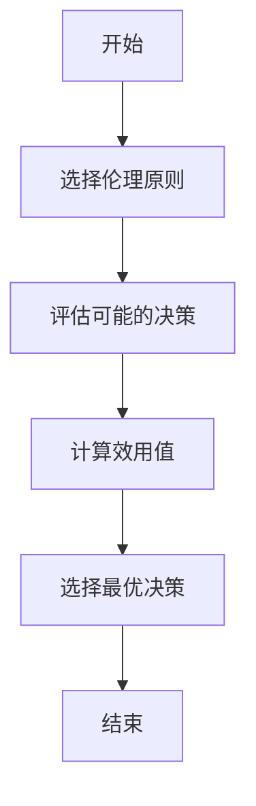
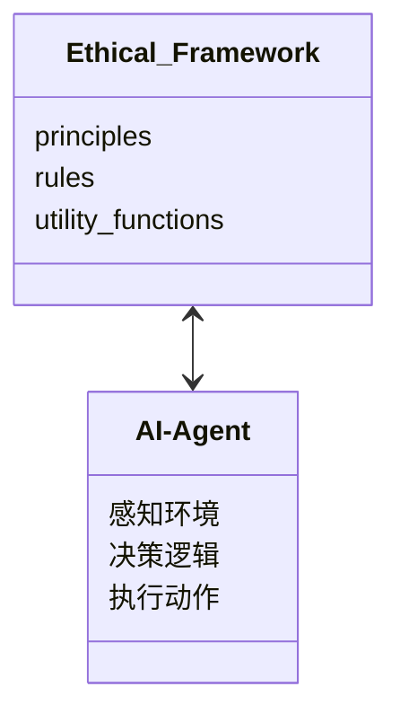
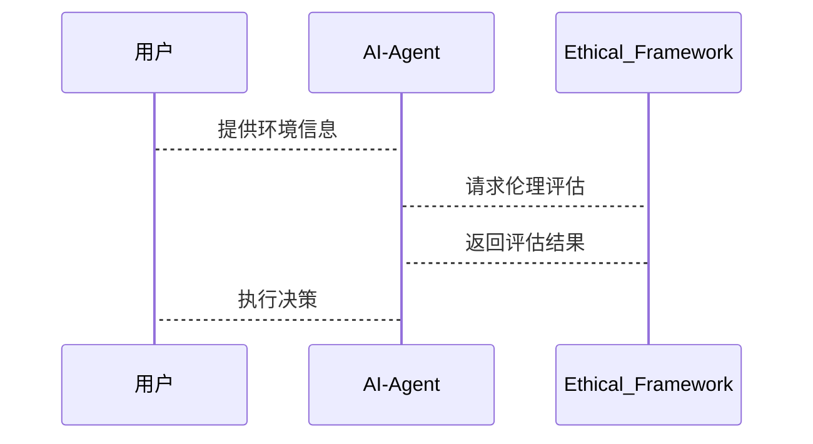

                 


# 构建AI Agent的伦理决策框架

## 关键词：AI Agent，伦理决策框架，伦理原则，决策算法，系统架构，可解释性

## 摘要：本文旨在探讨构建AI Agent的伦理决策框架，涵盖其背景、核心概念、算法原理、系统架构及实战案例，帮助读者系统理解并掌握如何在AI Agent中实现伦理决策。

---

# 第一部分：构建AI Agent的伦理决策框架基础

## 第1章：伦理决策框架的背景与问题背景

### 1.1 AI Agent的基本概念

#### 1.1.1 AI Agent的定义
AI Agent（智能体）是指能够感知环境并采取行动以实现目标的实体。它可以是一个软件程序或物理设备，具备自主决策的能力。

#### 1.1.2 AI Agent的发展历程
AI Agent的概念起源于20世纪60年代，经历了从简单专家系统到现代深度学习模型的演变，广泛应用于自动驾驶、智能助手等领域。

#### 1.1.3 AI Agent的分类与应用场景
AI Agent可分为简单反射型、基于模型的反应型、目标驱动型和效用驱动型。应用场景包括自动驾驶、医疗诊断、金融交易等。

### 1.2 伦理决策框架的必要性

#### 1.2.1 AI Agent决策中的伦理问题
AI Agent的决策可能引发隐私泄露、责任归属等伦理问题，需构建框架确保决策符合伦理标准。

#### 1.2.2 伦理决策框架的核心目标
确保AI Agent的决策过程符合伦理原则，如隐私保护和责任归属，提升决策的透明性和可解释性。

#### 1.2.3 伦理决策框架的边界与外延
明确伦理决策的适用范围，避免过度干预或遗漏关键伦理因素。

### 1.3 伦理决策框架的核心要素

#### 1.3.1 伦理原则与价值观
涵盖隐私保护、数据安全、责任归属等原则，确保决策符合社会伦理规范。

#### 1.3.2 决策过程中的权责分配
明确AI Agent、开发者和用户的权责，确保在出现问题时能明确责任主体。

#### 1.3.3 伦理框架的可解释性与透明性
通过可解释性技术，使AI Agent的决策过程清晰透明，便于用户理解和监督。

## 第2章：伦理决策框架的核心概念与联系

### 2.1 伦理决策框架的原理

#### 2.1.1 伦理决策的基本原理
AI Agent通过感知环境和内部伦理框架，生成符合伦理原则的决策。

#### 2.1.2 伦理框架与AI Agent的结合
将伦理原则嵌入AI Agent的决策算法，确保决策符合伦理标准。

#### 2.1.3 伦理决策的动态调整机制
根据环境变化和用户反馈，动态调整伦理框架，确保决策适应不同情境。

### 2.2 核心概念对比表格

| 比较维度 | 伦理原则 | 决策规则 |
|----------|----------|----------|
| 定义     | 指导决策的基本准则 | 明确的规则或条件 |
| 作用     | 基础指导原则 | 具体决策指导 |
| 示例     | 遵守隐私保护 | 当数据涉及敏感信息时，需加密处理 |

### 2.3 ER实体关系图

```mermaid
er
actor: 用户
agent: AI Agent
decision_rule: 决策规则
ethics_framework: 伦理框架
```

### 2.4 本章小结
本章介绍了伦理决策框架的基本原理，并通过对比和图表展示了核心概念，为后续章节的深入分析奠定基础。

---

# 第二部分：伦理决策框架的算法与系统架构

## 第3章：伦理决策框架的算法原理

### 3.1 伦理决策算法概述

#### 3.1.1 基于规则的伦理决策算法
通过预定义的伦理规则生成决策，适用于规则明确的场景。

#### 3.1.2 基于案例推理的伦理决策算法
借鉴类似案例进行决策，适用于规则模糊的场景。

#### 3.1.3 基于效用函数的伦理决策算法
通过最大化效用函数值选择最优决策，考虑多目标优化。

### 3.2 算法流程图



### 3.3 算法实现代码

```python
def ethical_decision-making(ethics_framework, context):
    principles = ethics_framework['principles']
    rules = ethics_framework['rules']
    for rule in rules:
        if rule.applies_to(context):
            return rule.apply(context)
    max_utility = -infinity
    for principle in principles:
        utility = calculate_utility(principle, context)
        if utility > max_utility:
            max_utility = utility
    return select_action(max_utility, context)
```

## 第4章：系统架构设计

### 4.1 问题场景介绍

#### 4.1.1 场景描述
构建一个自动驾驶AI Agent，确保其在紧急情况下的决策符合伦理标准。

### 4.2 系统功能设计

#### 4.2.1 领域模型类图



#### 4.2.2 系统架构图

```mermaid
container Ethical Decision Framework {
    Ethical_Framework
    AI-Agent
}
container 决策环境 {
    感知输入
    决策输出
}
Ethical Decision Framework -->> 决策环境
```

#### 4.2.3 系统交互序列图



---

# 第三部分：项目实战与总结

## 第5章：项目实战

### 5.1 环境安装

#### 5.1.1 安装依赖
安装Python、TensorFlow、Mermaid等工具。

### 5.2 系统核心实现源代码

```python
class EthicalRule:
    def applies_to(self, context):
        # 判断规则是否适用
        pass

    def apply(self, context):
        # 应用规则，返回决策
        pass

def calculate_utility(principle, context):
    # 计算效用函数值
    pass

def ethical_decision(ethics_framework, context):
    for rule in ethics_framework['rules']:
        if rule.applies_to(context):
            return rule.apply(context)
    max_utility = -float('inf')
    for principle in ethics_framework['principles']:
        utility = calculate_utility(principle, context)
        if utility > max_utility:
            max_utility = utility
    return select_action(max_utility, context)
```

### 5.3 案例分析

#### 5.3.1 案例描述
自动驾驶遇到紧急情况，需在乘客和行人之间做出决策。

#### 5.3.2 代码实现

```python
ethics_framework = {
    'principles': ['maximizeutility', 'respectprivacy'],
    'rules': [rule1, rule2]
}
context = {'scenario': 'emergency'}
decision = ethical_decision(ethics_framework, context)
print(decision)
```

### 5.4 小结
通过具体案例展示了伦理决策框架的实现过程，验证了其有效性和可扩展性。

## 第6章：最佳实践与总结

### 6.1 小结
总结本文的主要内容，强调伦理决策框架的重要性及其在实际应用中的价值。

### 6.2 注意事项
在实际应用中，需动态调整伦理框架，确保决策的透明性和可解释性。

### 6.3 拓展阅读
推荐相关书籍和论文，供读者深入学习。

---

# 结语

构建AI Agent的伦理决策框架是一项复杂而重要的任务，需要技术与伦理的结合。通过本文的系统分析和实战案例，读者可以掌握构建伦理决策框架的方法，推动AI技术的健康发展。

---

# 作者

作者：AI天才研究院/AI Genius Institute & 禅与计算机程序设计艺术 /Zen And The Art of Computer Programming

