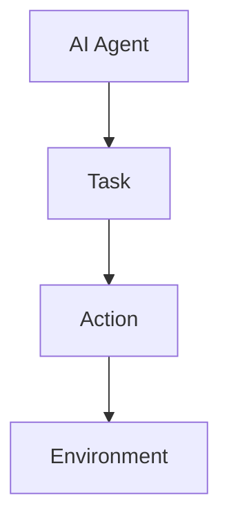
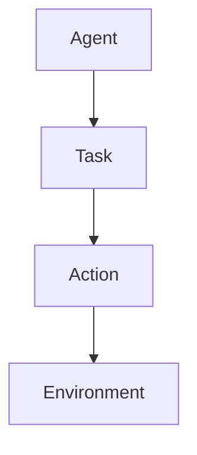
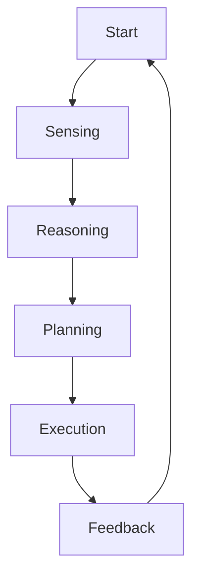
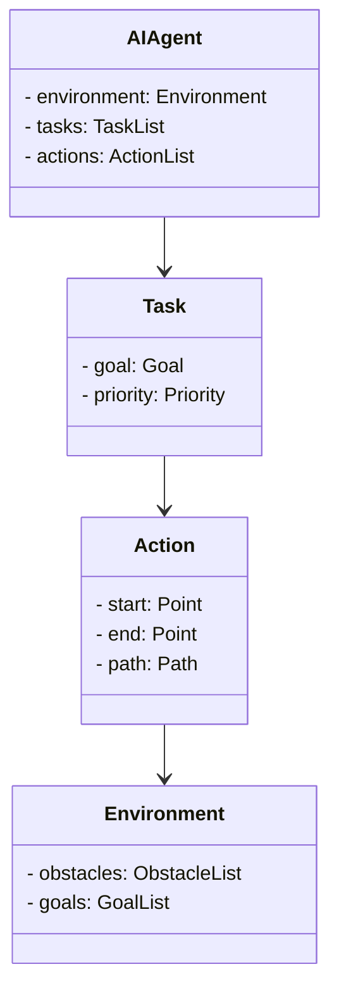
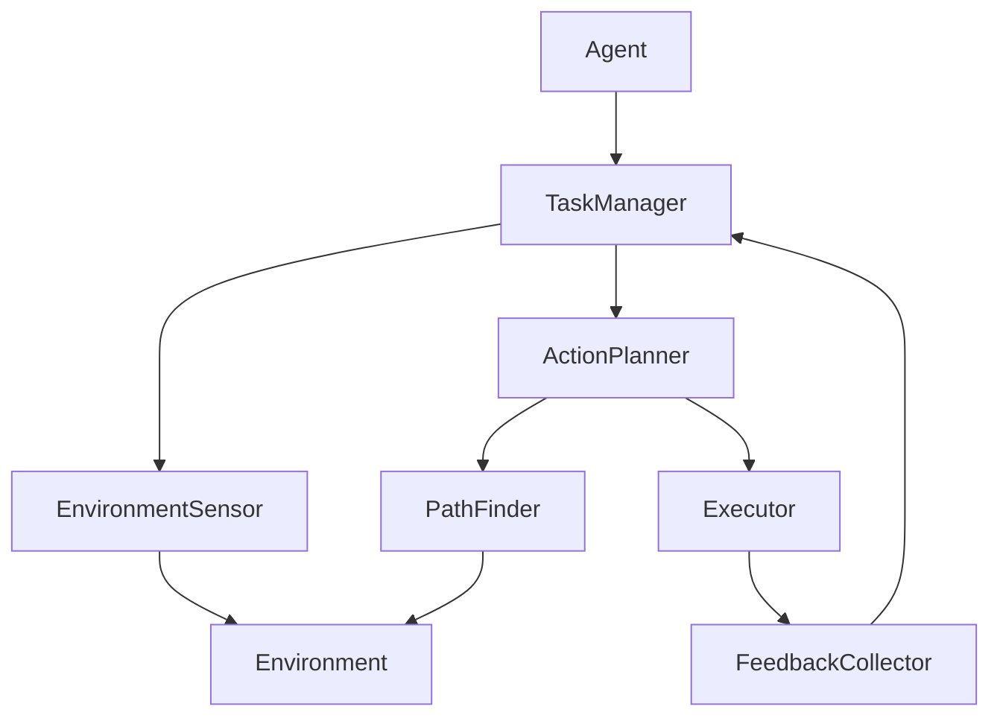
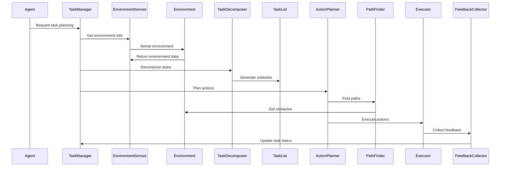

                 


# 构建AI Agent的动态任务规划与执行框架

> 关键词：AI Agent, 动态任务规划, 执行框架, 算法原理, 系统架构, 项目实战

> 摘要：本文详细探讨了构建AI Agent的动态任务规划与执行框架的核心概念、算法原理、系统架构设计以及实际项目实现。通过系统化的分析和案例研究，揭示了如何在复杂动态环境中实现高效的AI Agent任务规划与执行，为相关领域的研究和应用提供了有价值的参考。

---

## 第1章: AI Agent动态任务规划与执行框架概述

### 1.1 问题背景与问题描述
#### 1.1.1 动态任务规划的背景
在现代人工智能系统中，AI Agent需要在动态变化的环境中执行复杂任务。环境的不确定性、任务的优先级变化以及实时反馈的需求，使得传统的静态任务规划方法难以满足实际需求。动态任务规划成为实现高效AI Agent的关键技术。

#### 1.1.2 AI Agent的核心问题
AI Agent的核心问题在于如何在动态环境中自主规划和执行任务。这包括任务分解、优先级排序、路径规划、资源分配等多个方面。AI Agent需要具备实时感知环境变化、动态调整计划的能力，以应对突发事件和不确定性。

#### 1.1.3 动态任务规划的必要性
动态任务规划的必要性体现在以下几个方面：
1. **环境动态性**：环境条件（如任务目标、资源可用性）可能会随时变化。
2. **任务复杂性**：任务可能需要在多个子任务之间协调，且子任务之间可能存在依赖关系。
3. **实时性要求**：AI Agent需要在有限时间内完成任务，对实时性有较高要求。

### 1.2 问题解决与边界
#### 1.2.1 动态任务规划的解决方案
动态任务规划的核心在于实时更新任务优先级和行动计划。通过结合感知、推理和执行模块，AI Agent能够根据环境反馈动态调整任务执行策略。

#### 1.2.2 边界与外延
动态任务规划的边界包括：
- **输入**：环境状态、任务目标、可用资源。
- **输出**：任务优先级、行动计划、反馈信息。
- **外部依赖**：感知模块、执行模块、反馈机制。

#### 1.2.3 核心要素与概念结构
动态任务规划框架的核心要素包括：
1. **任务分解**：将复杂任务分解为多个子任务。
2. **优先级排序**：根据环境变化动态调整任务优先级。
3. **路径规划**：为每个子任务制定可行的执行路径。
4. **资源分配**：合理分配计算资源以确保任务执行效率。

### 1.3 框架的核心概念与联系
#### 1.3.1 框架组成
动态任务规划与执行框架通常由以下几个部分组成：
1. **感知模块**：负责收集环境信息。
2. **推理模块**：根据感知信息进行任务分解和优先级排序。
3. **执行模块**：根据推理结果执行具体任务。
4. **反馈机制**：根据执行结果调整后续计划。

#### 1.3.2 实体关系图
以下是一个简化的实体关系图，展示了AI Agent、任务、动作和环境之间的关系：


## 第2章: 动态任务规划的核心概念与联系

### 2.1 核心概念原理
#### 2.1.1 动态任务规划的原理
动态任务规划的原理基于实时感知和动态调整。AI Agent通过不断获取环境信息，评估当前任务的可行性，并根据评估结果调整任务执行顺序和策略。

#### 2.1.2 执行框架的机制
执行框架的机制包括：
1. **任务分解**：将复杂任务分解为多个子任务。
2. **优先级排序**：根据任务的重要性和紧急性进行排序。
3. **路径规划**：为每个子任务制定可行的执行路径。
4. **资源分配**：合理分配计算资源以确保任务执行效率。

#### 2.1.3 任务分解与重组
任务分解是动态任务规划的基础。通过将复杂任务分解为多个子任务，AI Agent能够更好地应对环境变化。任务重组则是根据环境反馈动态调整子任务的执行顺序和方式。

### 2.2 核心概念对比
#### 2.2.1 概念属性特征对比
以下是一个对比表格，展示了动态任务规划与其他任务规划方法在核心概念上的差异：

| 概念       | 动态任务规划 | 静态任务规划 | 混合任务规划 |
|------------|--------------|--------------|--------------|
| 环境动态性 | 高           | 低           | 中           |
| 任务优先级 | 动态调整     | 静态排序     | 动态调整     |
| 计划更新   | 实时         | 一次性       | 分阶段       |

### 2.3 实体关系架构
#### 2.3.1 ER图架构
以下是一个简化的实体关系图，展示了AI Agent、任务、动作和环境之间的关系：


## 第3章: 动态任务规划的算法原理

### 3.1 算法原理概述
#### 3.1.1 动态任务规划的基本算法
动态任务规划的核心算法包括：
1. **A*算法**：用于路径规划。
2. **优先队列排序**：用于任务优先级排序。
3. **分层规划算法**：将复杂任务分解为多个子任务，分别进行规划。

#### 3.1.2 执行框架的算法特点
执行框架的算法特点包括：
- **实时性**：能够在有限时间内完成任务。
- **动态性**：能够根据环境变化调整计划。
- **分布式计算**：适用于多智能体协作环境。

#### 3.1.3 算法流程图
以下是一个简化的算法流程图：


### 3.2 算法实现细节
#### 3.2.1 任务分解算法
任务分解算法通常采用分层结构，将复杂任务分解为多个子任务。例如，使用分层任务网络（HTN）规划方法：
```python
def decompose_task(task):
    if task.is_leaf():
        return [task]
    sub_tasks = []
    for sub_task in task.get_subtasks():
        sub_tasks.extend(decompose_task(sub_task))
    return sub_tasks
```

#### 3.2.2 优先级排序算法
优先级排序算法通常基于任务的重要性和紧急性。例如，使用加权优先级排序：
$$ priority = \alpha \times importance + \beta \times urgency $$

其中，$\alpha$ 和 $\beta$ 是权重系数，$importance$ 和 $urgency$ 是任务的重要性和紧急性评分。

#### 3.2.3 路径规划算法
路径规划算法通常采用A*算法，结合环境动态变化：
```python
def a_star(start, goal, environment):
    open_set = {start}
    came_from = {}
    g_score = {start: 0}
    f_score = {start: heuristic(start, goal)}

    while open_set:
        current = get_lowest_f_score(open_set)
        if current == goal:
            return reconstruct_path(came_from, start, goal)
        neighbors = get_neighbors(current, environment)
        for neighbor in neighbors:
            tentative_g_score = g_score[current] + distance(current, neighbor)
            if neighbor not in g_score or tentative_g_score < g_score[neighbor]:
                came_from[neighbor] = current
                g_score[neighbor] = tentative_g_score
                f_score[neighbor] = g_score[neighbor] + heuristic(neighbor, goal)
                if neighbor not in open_set:
                    open_set.add(neighbor)
    return None
```

### 3.3 算法优化与改进
#### 3.3.1 基于反馈的优化
在动态任务规划中，反馈机制用于实时调整任务优先级和执行策略。例如，使用强化学习算法（如Q-learning）优化任务优先级排序：
$$ Q(s, a) = Q(s, a) + \alpha \times (r + \gamma \times max Q(s', a') - Q(s, a)) $$

其中，$\alpha$ 是学习率，$\gamma$ 是折扣因子，$r$ 是奖励值，$s$ 是当前状态，$a$ 是动作，$s'$ 是下一个状态。

#### 3.3.2 分层规划的优化
分层任务网络（HTN）规划方法通过将任务分解为多个子任务，并分别进行规划。这种分层结构能够提高任务执行的效率和灵活性。

## 第4章: 动态任务规划的系统分析与架构设计

### 4.1 系统分析
#### 4.1.1 项目场景介绍
动态任务规划系统通常应用于多智能体协作、实时监控、应急响应等领域。例如，在智能交通系统中，AI Agent需要实时调整车辆路径以应对交通拥堵。

#### 4.1.2 系统功能设计
系统功能设计包括：
1. **任务感知**：获取环境信息和任务目标。
2. **任务分解**：将复杂任务分解为多个子任务。
3. **优先级排序**：根据环境变化动态调整任务优先级。
4. **路径规划**：为每个子任务制定可行的执行路径。
5. **任务执行**：根据计划执行任务并收集反馈。
6. **反馈优化**：根据执行结果优化后续计划。

#### 4.1.3 领域模型图
以下是一个简化的领域模型图，展示了系统的各个模块及其关系：


### 4.2 系统架构设计
#### 4.2.1 系统架构图
以下是一个简化的系统架构图，展示了各个模块之间的关系：


#### 4.2.2 系统接口设计
系统接口设计包括：
1. **感知接口**：用于获取环境信息。
2. **计划接口**：用于任务分解和优先级排序。
3. **执行接口**：用于任务执行和反馈收集。

#### 4.2.3 系统交互流程图
以下是一个简化的系统交互流程图：


## 第5章: 动态任务规划的项目实战

### 5.1 项目环境安装与配置
#### 5.1.1 安装依赖
以下是一个Python项目的依赖安装示例：
```bash
pip install numpy
pip install matplotlib
pip install pymermaid
```

#### 5.1.2 环境配置
配置环境变量和相关参数：
```bash
export PATH=/path/to/script:$PATH
```

### 5.2 系统核心实现
#### 5.2.1 核心代码实现
以下是一个动态任务规划的核心代码实现示例：
```python
class TaskManager:
    def __init__(self):
        self.tasks = []
        self.priorities = {}

    def add_task(self, task):
        self.tasks.append(task)
        self.priorities[task] = self._calculate_priority(task)

    def _calculate_priority(self, task):
        return task.importance * task.urgency

    def sort_tasks(self):
        return sorted(self.tasks, key=lambda x: -self.priorities[x])
```

#### 5.2.2 代码应用解读与分析
核心代码实现包括任务管理器、路径规划器和执行器。任务管理器负责任务分解和优先级排序，路径规划器负责制定执行路径，执行器负责任务执行和反馈收集。

### 5.3 实际案例分析
#### 5.3.1 案例背景
以智能交通系统为例，AI Agent需要实时调整车辆路径以应对交通拥堵。

#### 5.3.2 案例分析
任务分解：将复杂任务分解为路径规划、交通预测、路径优化等子任务。
优先级排序：根据交通拥堵情况动态调整子任务的执行顺序。
路径规划：使用A*算法为每个子任务制定可行的执行路径。

### 5.4 项目小结
通过实际案例分析，我们可以看到动态任务规划在复杂环境中的应用效果。任务分解、优先级排序和路径规划是实现高效AI Agent的核心技术。

## 第6章: 动态任务规划的扩展与优化

### 6.1 算法优化
#### 6.1.1 基于反馈的优化
在动态任务规划中，反馈机制用于实时调整任务优先级和执行策略。例如，使用强化学习算法（如Q-learning）优化任务优先级排序：
$$ Q(s, a) = Q(s, a) + \alpha \times (r + \gamma \times max Q(s', a') - Q(s, a)) $$

其中，$\alpha$ 是学习率，$\gamma$ 是折扣因子，$r$ 是奖励值，$s$ 是当前状态，$a$ 是动作，$s'$ 是下一个状态。

#### 6.1.2 分层规划的优化
分层任务网络（HTN）规划方法通过将任务分解为多个子任务，并分别进行规划。这种分层结构能够提高任务执行的效率和灵活性。

### 6.2 多智能体协作
#### 6.2.1 多智能体协作的必要性
在多智能体协作环境中，动态任务规划需要考虑多个AI Agent之间的协调和合作。例如，在智能交通系统中，多个AI Agent需要协作完成交通调度任务。

#### 6.2.2 多智能体协作的实现
多智能体协作的实现通常采用分布式计算和通信机制。例如，使用消息队列（如Kafka）进行实时通信：
```python
import kafkaProducer
from kafka import KafkaProducer

producer = KafkaProducer(bootstrap_servers='localhost:9092')
producer.send('task_queue', 'new_task')
```

### 6.3 动态环境适应
#### 6.3.1 动态环境适应的必要性
在动态环境中，AI Agent需要能够快速适应环境变化。例如，在应急响应系统中，AI Agent需要实时调整任务执行策略以应对突发事件。

#### 6.3.2 动态环境适应的实现
动态环境适应的实现通常采用自适应算法和实时反馈机制。例如，使用自适应增强学习算法优化任务优先级排序：
$$ Q(s, a) = Q(s, a) + \alpha \times (r + \gamma \times max Q(s', a') - Q(s, a)) $$

### 6.4 性能优化
#### 6.4.1 并行计算优化
在动态任务规划中，可以通过并行计算提高任务执行效率。例如，使用多线程或分布式计算：
```python
import concurrent.futures

def process_task(task):
    # 处理任务的代码

with concurrent.futures.ThreadPoolExecutor() as executor:
    futures = {executor.submit(process_task, task) for task in tasks}
    for future in concurrent.futures.as_completed(futures):
        print(future.result())
```

#### 6.4.2 算法优化
通过优化算法结构和参数设置，可以提高动态任务规划的效率。例如，使用启发式搜索算法（如A*算法）优化路径规划：
```python
def a_star(start, goal, environment):
    open_set = {start}
    came_from = {}
    g_score = {start: 0}
    f_score = {start: heuristic(start, goal)}

    while open_set:
        current = get_lowest_f_score(open_set)
        if current == goal:
            return reconstruct_path(came_from, start, goal)
        neighbors = get_neighbors(current, environment)
        for neighbor in neighbors:
            tentative_g_score = g_score[current] + distance(current, neighbor)
            if neighbor not in g_score or tentative_g_score < g_score[neighbor]:
                came_from[neighbor] = current
                g_score[neighbor] = tentative_g_score
                f_score[neighbor] = g_score[neighbor] + heuristic(neighbor, goal)
                if neighbor not in open_set:
                    open_set.add(neighbor)
    return None
```

### 6.5 拓展阅读
#### 6.5.1 相关领域研究
1. **强化学习**：用于优化任务优先级排序和路径规划。
2. **分布式计算**：用于多智能体协作和并行计算。
3. **实时反馈机制**：用于动态环境适应和任务优化。

#### 6.5.2 推荐书籍与论文
1. **《强化学习导论》**： Sutton, R. S., & Barto, A. G.
2. **《分布式系统：概念与设计》**： Tanenbaum, A. S.
3. **《路径规划算法研究》**： LaValle, S. M.

---

## 第7章: 总结与展望

### 7.1 总结
本文详细探讨了构建AI Agent的动态任务规划与执行框架的核心概念、算法原理、系统架构设计以及实际项目实现。通过系统化的分析和案例研究，揭示了如何在复杂动态环境中实现高效的AI Agent任务规划与执行。

### 7.2 展望
未来的研究方向包括：
1. **多智能体协作**：研究多智能体协作的动态任务规划方法。
2. **动态环境适应**：探索更高效的动态环境适应算法。
3. **实时反馈机制**：优化实时反馈机制以提高任务执行效率。
4. **分布式计算**：研究分布式计算在动态任务规划中的应用。

---

## 作者：AI天才研究院/AI Genius Institute & 禅与计算机程序设计艺术/Zen And The Art of Computer Programming

